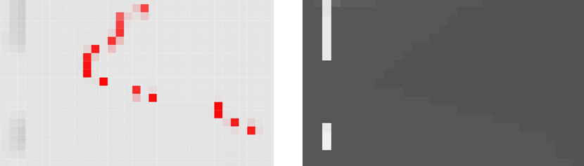
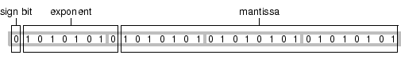

Question List in July, 2020
===========================

Q1、将高程信息写入GeoTIFF影像中
-------------------------------

目前处理思路是使用目前主流的地理数据开源库：\ ``GDAL``\ 或\ ``libgeotiff``\ 。
\ ``libgeotiff``\ 的底层性更强，而作为地理格式操作库的Geospatial Data Abastraction Library则融入了\ ``libgeotiff``\ 库对OGC所制定的GeoTIFF标准的支持。

GeoTIFF
~~~~~~~

GeoTIFF有三个空间\ **Raster
Space**\ （\ :math:`\mathbb{R}^3_{R}`\ ），\ **Device
Space**\ 和\ **Model
Space**\ （\ :math:`\mathbb{R}^3_{M}`\ ）。\ :math:`\mathbb{R}^3_{R}`\ 与\ :math:`\mathbb{R}^3_{M}`\ 之间的转换关系十分类似于三维计算机视觉中由相机坐标系所生成的视口坐标系与模型坐标系之间的关系在平行于\ :math:`XY`\ 平面的正交投影模式下简化，其公式如下：

.. math::
	\begin{bmatrix}X\\Y\\Z\\1\end{bmatrix}=
	\begin{bmatrix}
		\textrm{a}&\textrm{b}&0&\textrm{e}\\
		\textrm{c}&\textrm{d}&0&\textrm{f}\\
		0&0&0&0\\0&0&0&1
	\end{bmatrix}
	\cdot\begin{bmatrix}i\\j\\k\\1\end{bmatrix}

式中，\ :math:`Z`\ 为点\ :math:`(X,Y)`\ 的高程值，\ :math:`k`\ 为点\ :math:`(i,j)`\ 的像素值。该公式具有6个参数，这6个参数放到一起形成了.twf文件中的参数，也就是\ ``ModelTransformationTag``\ 标签。该式实际上与\ ``GDAL``\ 中的地理仿射变换公式具有等价的形式：

.. math::
   X_{G}=\textrm{a}\cdot x+\textrm{b}\cdot y+\textrm{e}\\
   Y_{G}=\textrm{c}\cdot x+\textrm{d}\cdot y+\textrm{f}\\

式中，

-  参数\ :math:`\mathrm{a,d}`\ 为\ :math:`x,y`\ 方向上的像素分辨率；
-  参数\ :math:`\mathrm{b,c}`\ 为旋转系统的控制参数；
-  参数\ :math:`\mathrm{e,f}`\ 为栅格地图左上角的地理坐标。

更进一步地，如果\ :math:`\mathbb{R}^3_{R}`\ 与之间\ :math:`\mathbb{R}^3_{M}`\ 仅存在平移和缩放关系时，只要知道\ :math:`\mathbb{R}^3_{R}`\ 中的某一坐标点\ :math:`(i_0,j_0,k_0)`\ 与\ :math:`\mathbb{R}^3_{M}`\ 中的对应点\ :math:`(X_0,Y_0,Z_0)`\ 所构成的坐标点对以及该点在模型空间中的缩放比例\ :math:`\mathrm{S}_x,\mathrm{S}_y,\mathrm{S}_z`\ 时，即可描述公式（1）所建立的数学关系。由此则将上面的公式简化为如下形式：

.. math::

   \begin{bmatrix}X\\Y\\Z\\1\end{bmatrix}=
   \begin{bmatrix}\mathrm{S}_x&0&0&\mathrm{T}_x\\0&-\mathrm{S}_y&0&\mathrm{T}_y\\0&0&\mathrm{S}_z&\mathrm{T}_z\\0&0&0&1\end{bmatrix}
   \cdot\begin{bmatrix}i\\j\\k\\1\end{bmatrix}\ \mathrm{here},
   \begin{cases}
   \mathrm{T}_x=X_0-\mathrm{S}_x\cdot i_0\\
   \mathrm{T}_y=Y_0+\mathrm{S}_y\cdot j_0\\
   \mathrm{T}_Z=Z_0-\mathrm{S}_Z\cdot k_0
   \end{cases}

此时，GeoTIFF中记录的将是6个坐标点对以及3个比例系数共9个参数信息。也就是\ ``ModelTiepointTag``\ 标签和\ ``ModelPixelScaleTag``\ 标签。在进行设置时主要用到的函数即：

.. code-block:: c

	void SetUpTIFFDirectory(TIFF *tif) 
	{ 
		double tiepoints[6] = {0, 0, 0, 130.0, 32.0, 0.0 }; 
		double pixscale[3] = { 1, 1, 1 };

		//设置图像的宽度和高度
		TIFFSetField(tif, TIFFTAG_IMAGEWIDTH, WIDTH);
		TIFFSetField(tif, TIFFTAG_IMAGELENGTH, HEIGHT);
		//设置数据压缩方式、像素合成方法、存储组织方式等
		TIFFSetField(tif, TIFFTAG_COMPRESSION, COMPRESSION_NONE);
		TIFFSetField(tif, TIFFTAG_PHOTOMETRIC, PHOTOMETRIC_MINISBLACK);
		TIFFSetField(tif, TIFFTAG_PLANARCONFIG, PLANARCONFIG_CONTIG);
		//设置浮点类型的像素值及每通道位数
		TIFFSetField(tif, TIFFTAG_SAMPLEFORMAT, SAMPLEFORMAT_IEEEFP);
		TIFFSetField(tif, TIFFTAG_BITSPERSAMPLE, 32);
		//设置图像的通道数和每个条带占多少行
		TIFFSetField(tif, TIFFTAG_SAMPLESPERPIXEL, 1);
		TIFFSetField(tif, TIFFTAG_ROWSPERSTRIP, 20L);
		//设置图像的GeoTIFF标签
		TIFFSetField(tif, TIFFTAG_GEOTIEPOINTS, 6, tiepoints);
		TIFFSetField(tif, TIFFTAG_GEOPIXELSCALE, 3, pixscale);
	}

这里，\ ``GDAL``\ 中有一个创建GeoTIFF的函数\ ``GDALDriver::create()``\ ，以及用于处理DEM数据的\ ``GDALDEMProcessing()``\ 可以尝试。

TIFF
~~~~

TIFF文件的3个关键词：\ **IFH**\ （Image File Header）、\ **IFD**\ (Image
File Directory)、\ **DE**\ (Direction
Entry)。中文翻译为图像文件头、图像文件目录以及目录项，IFD数据结构并不一定紧跟在IFH后面，相反，它常常位于第三部分图像数据的后面，即TIF图像文件的一般组织形式是：IFH——图像数据——IFD。其文件结构图如下：

   
TIFF的全称为Tagged Image File
Format，也就是标签图像文件格式。该格式最初由Aldus公司与微软合作开发，其主要目的在为扫描仪提供一种共通的扫描影像储存格式。目前TIFF
由Adobe公司所拥有和负责制定相关的规范，最新的版本是1992年6月公布的第6版，几乎所有影像处理软件都支持TIFF的档案格式。

**Fig 3.1 IFH结构描述**

+-----------------------+----------+------------+-----------------------------+
| 名称                  | 字节数   | 数据类型   | 说明                        |
+=======================+==========+============+=============================+
| Byteorder             | 2        | Integer    | TIF标记，其值为4D4D或4949   |
+-----------------------+----------+------------+-----------------------------+
| Version               | 2        | Integer    | 版本号，其值恒为2A00        |
+-----------------------+----------+------------+-----------------------------+
| Offset to first IFD   | 4        | Long       | 第一个IFD的偏移量           |
+-----------------------+----------+------------+-----------------------------+

**Fig 3.2 IFD结构描述**

+-------------------------+----------+------------+----------------------------+
| 名称                    | 字节数   | 数据类型   | 说明                       |
+=========================+==========+============+============================+
| Directory Entry Count   | 2        | Integer    | 本IFD中DE的数量            |
+-------------------------+----------+------------+----------------------------+
| Directory Entry(1)      | 12       |            | 简称DE，中文译义“目录项”   |
+-------------------------+----------+------------+----------------------------+
| ......                  | ......   | ......     | ......                     |
+-------------------------+----------+------------+----------------------------+
| Directory Entry(B)      | 12       |            | 简称DE，中文译义“目录项”   |
+-------------------------+----------+------------+----------------------------+
| Offset to next IFD      | 4        | Long       | 下一个IFD的偏移量          |
+-------------------------+----------+------------+----------------------------+

**Fig 3.3 DE结构描述**

+----------------+----------+------------+----------------------+
| 名称           | 字节数   | 数据类型   | 说明                 |
+================+==========+============+======================+
| Tag            | 2        | Integer    | 本属性的标签编号     |
+----------------+----------+------------+----------------------+
| Type           | 2        | Integer    | 本属性值的数据类型   |
+----------------+----------+------------+----------------------+
| Length         | 4        | Long       | 该类型数据的数量     |
+----------------+----------+------------+----------------------+
| Value Offset   | 4        | Long       | 属性值的存放偏移量   |
+----------------+----------+------------+----------------------+

TIFF有如下的特色：

（一）使用标签（tag）：TIFF使用标签来标示图形档案中许多相关的图形参数，例如解析度和色彩深度等，让影像处理软体知道如何来处理档案中的数据；

（二）弹性好：因为TIFF使用标签来标示图形档案的相关资讯，透过对标签内容的调整，即可容纳新的功能，例如TIFF档可以将许多张扫瞄的影像集结在单一档案中；也可以将其他的图形档案格式（如JPEG档案）包含在内。这些弹性和功能都是透过标签来达成的；

（三）适合数位典藏：TIFF不像JPEG在储存资料时会损失一些图形的资讯，因为一般JPEG是采用失真压缩（lossy
compression）的操作模式，因此TIFF更适合重要影像或图片的数位典藏用途，也广为数位典藏机构采用为储存图片的档案格式。

TIFF档的主要缺点是档案较大，这是因为TIFF档在储存时是采取无压缩或非失真压缩（lossless
compression）方式的缘故。另外一个缺点是TIFF档的大小不能超过4G，不过因为在一般的应用中，图形档案大小很少会超过4G，因此这个缺点目前对TIFF的应用并不构成阻碍。

参考文献
~~~~~~~~

1. 贲进, 张永生, 童晓冲等. GeoTIFF格式分析及其扩充应用技术探讨[J].
   测绘技术装备, 2005, 7(2): 10-14.
2. 月光软件站. `GeoTIFF 探索成果总结 <https://www.moon-soft.com/doc/14820.html>`__ [EB/OL].
3. CSDN. `libtiff读写三维TIFF图像 <https://blog.csdn.net/u013921430/article/details/79758906>`__ [EB/OL].
4. `標籤圖檔格式 <http://terms.naer.edu.tw/detail/1679035/>`__ [EB/OL].
5. `关于Tiff,tfw文件关系 <https://blog.csdn.net/u014183218/article/details/88838088>`__ [EB/OL].
6. `TIFF图像文件格式详解 <https://www.cnblogs.com/gywei/p/3393816.html>`__ [EB/OL].
7. `使用GDAL对DEM渲染处理流程 <https://blog.csdn.net/liminlu0314/article/details/8522725>`__ [EB/OL].
8. `对比：DEM和DSM有什么不同 <https://www.sohu.com/a/382108681_120405555>`__ [EB/OL].

Q2、中国科学院院士姚期智对AI的理解
----------------------------------

1. 神经网络虽然成功，但缺少对“黑匣子”内部的剖析，用于处理高维数据集的\ **拓扑学**\ 可以为神经网络的分析提供新的视角。
2. 针对AI隐私问题设计于1982年提出的安全多方计算（Secure Multiplayer
   Computation，简称
   MPC），用安全可靠的第三方确保其他计算方的数据隐私安全。
3. 其引用了伯克利大学的\ *Stuart
   Russell*\ 教授2019年出版的一书《\ *Human* *Compatible:* *AI* *and*
   *the* *Problem* *of*
   *Control*\ 》中的一句话：”人工智能虽然不知道什么时候到来，但我们必须做好准备。”

还有一本可供参考的机器学习入门书《深度学习图解：一个可视化、交互式的人工智能指南》（Deep
Learning Illustrated: A Visual, Interactive Guide to Artificial
Intelligence）

参考文献
~~~~~~~~

1. PingWest品玩. `中国中国唯一一位图灵奖获得者，是怎么看AI的？ <http://dwz.date/b3an>`__ [EB/OL].

Q3、使用VS2013运行osgDB遇到一些莫名其妙的问题
---------------------------------------------

将VS2013工程换成VS2015即可，之前做实验时所用的OSG340库是基于VS2015（
v140）所编译的。所以在VS2013（v120）上运行时容易遇到一些莫名的问题，比如Debug模式下运行不出来Viewer的模型，使用fstream进行文件读写时在\ ``geline()``\ 函数处报错等等。

0708 Resx文件无效
~~~~~~~~~~~~~~~~~

未能在行 124、位置 4 的数据中找到类型
DevExpress.Utils.ImageCollectionStreamer, DevExpress.Utils.v18.2.

解决方案之一为删掉或注释对应区域的标签。

0708 缺少引用
~~~~~~~~~~~~~

缺少某些引用库，下载DevExpress并破解激活即可。

0708 地理仿射变换公式
~~~~~~~~~~~~~~~~~~~~~

根据深度图获取三维地理坐标，将三维地理坐标中的高程数据转换为某一灰度值。用到了地理仿射变换的公式：

.. math::

   X_{G}=A\cdot x+B\cdot y+C\\
   Y_{G}=D\cdot x+E\cdot y+F

0708 LC.exe已退出，代码为-1
~~~~~~~~~~~~~~~~~~~~~~~~~~~~~

全部配置完成之后运行提示错误：“LC.exe”已退出，代码为
-1。参考链接 `解决“错误为Lc.exe已退出，代码为-1” <https://www.cnblogs.com/spring_wang/p/7799634.html>`__ 。

   证书的原因，把项目中“properties”目录下的“license.licx”文件删除，再编译就成功了。

0714 生成DEM时出现图像变形问题
~~~~~~~~~~~~~~~~~~~~~~~~~~~~~~

**图1 变形的DEM图像**

在使用libgeotiff从\ ``osgImage``\ 中生成DEM时，发现其存在三方面问题：A.图像取值由左下开始，B。最终生成的DEM上下颠倒，C.图像的长宽比例缩放不大对。

**图2 本来样貌的DEM深度图**

.. figure:: pic/image-20200715090901591.png
   :align: center

经过该图处理，可以得到每个像素点所对应的高程信息，但要确保像素值正确，且几个矩阵的变换的确能够满足要求。

该问题在调整\ ``for``\ 循环中\ ``i,j``\ 的顺序，使其与图像\ :math:`I_{i,j}`\ 点及其生成的\ :math:`\mathbf{v}=(i\ j\ \mathrm{depth}\ 1)^T`\ 向量保持一致后即可得到解决。

0722 尝试分析城市三维模型文件结构
~~~~~~~~~~~~~~~~~~~~~~~~~~~~~~~~~

对倾斜摄影测量所生成的城市三维模型文件进行分析，读取南站模型的切片文件夹结构，将如Tile\_-309\_-274所示的文件夹中所含有的两个数字分别提取出来构成1606对索引点对\ :math:`(i,j)`\ ，在Matlab中用\ ``plot(i,j,'r.')``\ 进行绘制，可以形成如下文件结构图：

可以看出，其索引与模型最终的显示形式是保持一致的。也就是说，每一个Tile中均保存着一个规整的正方形三维模型网格，正方形的边长是平行于三维模型局部坐标系所使用的两个坐标轴\ :math:`x,y`\ 的。当对应的Tile文件夹中的模型缺省时，就会出现如下图所示的空白区域。

再进一步分析，本例中的LOD金字塔划分了16-22共7层。其中\ **16层为最顶层**\ 的粗模，含有1个格网；\ **22层为最底层**\ 的相对的精确模型，含有16个格网；中间的17、18、19、20、21分别含有1、1、1、4、16个格网。也就是说，不同层的金字塔可以含有相同数目的子格网，如下图所示。

以L16为例，当其在OSG中读取时需要读取1606个Tile，而进一步地加载更精确的详细的模型L22时则需要1606 :math:`\times` 16=25696个格网，读取每个Tile的时间都将影响程序运行过程中所需要的时间。

在之前的程序代码中，采用一次性读取全部\ ``.osgb``\ 文件到程序中的方法来读取模型文件。在这一方法中，使用的代码如下：

.. code-block:: c

    /*1. 定义Group节点收纳Data目录下所有的.osgb文件. */
    osg::Group\* group = new osg::Group();

    /*2. 根据传入的最外层引导文件获取指向改文件的路径. */ std::string
    path\_0 = osgDB::getFilePath(fileName);

    /*3.
    获取绝对路径下Data目录中的所有文件夹名称,该名称也是该瓦片节点文件的名称.
    */ std::string path = path\_0 + "\\Data\\"; osgDB::DirectoryContents
    dir\_contents = osgDB::getDirectoryContents(path);

    /*4. 遍历Data目录下的所有文件,统一收纳到Group节点中. */ for(auto dir :
    dir\_contents) { if(dir.find(".") != std::string::npos) continue;
    std::string file = path + dir + "\\" + dir + ".osgb";
    group->addChild(osgDB::readNodeFile(file)); }

    /*5. 添加到场景中进行显示. */
    main\_viewer->getSceneData()->asGroup()->addChild(group);

而在现在的系统中，模型的加载在MainFrm\_MainClass.cs文件的\ ``inputModelFilesAfterOsgRunning()``\ 函数，该函数判断所添加的文件是否是通用的倾斜摄影测量拍摄的三维模型，如果是这种模型则将文件路径指向Data目录这一级，并将该路径传入到\ ``Real3DGlobalPagedLODFrm``\ 窗体类中。

``Real3DGlobalPagedLODFrm``\ 窗体类主要执行了索引偏移，暂时可以不去分析它；\ ``LayerSelectionForm``\ 窗体类控制了图层名的重命名，暂时也可以不用考虑。随后，系统调用\ ``addLayerAndFileToXmlDocument()``\ 函数添加图层节点到根节点中，写入系统运行时所加载的配置文件中。

经过这些操作之后，最后来到模型添加函数，即\ ``AddModel(fileName, layer,zoom, viewIdx)``\ 函数。该函数位于dotNetOsg.cpp文件下的\ ``AddModel()``\ 函数中，系统将创建一个\ ``InputModelGuiEventAdapter``\ 适配器，并将其添加到了\ ``osgViewer``\ 的事件队列\ ``getEventQuene()``\ 中等待渲染完成执行相关事件。该适配器继承于\ ``osgGA``\ 命名空间下的\ ``GUIEventAdapter``\ 适配器；最后，系统通过OsgExtentionLibrary文件夹下的GuiEventAdapterEx.cpp文件中\ ``InputModelGuiEventAdapterHandler``\ 操作器中的\ ``handle()``\ 函数来处理对模型文件的添加。

0724 使用\ ``std::vector<int*>``\ 定义二维数组问题
~~~~~~~~~~~~~~~~~~~~~~~~~~~~~~~~~~~~~~~~~~~~~~~~~~

这个问题发生在使用\ ``memcpy()``\ 函数对TIFF图像进行读取写入时，将这个问题的主要内容抽析出来，即是如下的代码：

.. code-block:: c
    std::vector<int*> number(3, new int[6]); 
    int buffer1[3] = { 1,2,3 }; 
    int buffer2[3] = { 4,5,6 }; 
    memcpy(number[0], buffer1, sizeof(int) * 3);
     memcpy(number[0] + 3, buffer2, sizeof(int) * 3);

显而易见，上面代码的最终目的是将\ ``buffer1``\ 和\ ``buffer2``\ 数组中的数据拷贝到动态\ ``vector``\ 数组\ ``number``\ 中所存储的第一个\ ``int``\ 数组中去；但这段代码其实并不能得到我们所想要的效果，其运行结果如下所示：

.. code:: dos

    Elements of number[0] = 1,2,3,4,5,6
    Elements of number[1] = 1,2,3,4,5,6
    Elements of number[2] = 1,2,3,4,5,6

可见，动态数组中的所有元素都随着第一次赋值而发生了改变。也就是说，\ ``number``\ 存储的所有指针数组都具有相同的首地址指针，即：

.. code:: dos

    Value of number[0] is       "0000020DF245E2A0"
    Pointer of number[0][0] is  "0000020DF245E2A0"
    Value of number[1] is       "0000020DF245E2A0"
    Value of number[2] is       "0000020DF245E2A0"

也就是说，在没有在动态数组\ ``number``\ 中\ **为其存储的每一个元素开辟内存空间**\ 时，这些元素都存储了相同的一块在代码\ ``std::vector<int*> number(3, new int[6])``\ 中所开辟出来的空间。解决这一问题也很简单，只要为每一个元素开辟新的内存空间就好了：

.. code:: c

    number[0] = new int[6];
    number[1] = new int[6];
    number[2] = new int[6];

由此得到了不同的内存地址：

.. code:: doc

    Value of number[0] is "00000197340AB670"
    Value of number[1] is "00000197340AB870"
    Value of number[2] is "00000197340AB750"

0727 图像的多通道
~~~~~~~~~~~~~~~~~

常见的图像模式有：位图模式、灰度模式、RGB模式、CMYK模式、Lab模式、索引颜色模式、多通道模式、8位/16位通道模式等几种。位图模式是单通道1位深度的图像，只有黑白两种颜色，可由扫描或置入黑色的矢量线条图像生成，也能由灰度模式或双色调模式转换而成，其他图像模式不能直接转换为位图模式；灰度模式是单通道8位深度的图像模式，在纯黑和纯白之间有254个灰度级；RGB模式是多通道24位颜色深度的图像模式，共有Red、Green、Blue共3个通道，每个通道都有8位深度。

RGB、CYMK与HSV颜色空间
^^^^^^^^^^^^^^^^^^^^^^^^

其中，RGB（\ **R**\ ed、\ **G**\ reen、\ **B**\ lue）颜色模型可以用立方体模型来表示，立方体中的三个轴分别表达了Red、Green、Blue三个通道的分量变化，使用红绿蓝作为三原色由人的生理特性所决定的，在其他生物看来也许世界的颜色并非如此。

颜料的颜色空间可以分为青色、品红色、黄色三种，这三种颜色加上黑色油墨即构成了印刷的四色模式，即\ **C**\ yan、\ **M**\ agenta、\ **Y**\ ellow、Blac\ **K**\ ，颜料的最后一种颜色使用K缩写是为了避免与RGB的B混淆，而在颜料三原色中加入黑色则是因为如果仅靠堆叠CMY三色，吸收的光线不够多，人眼会判断为灰色，要叠加到变成纯黑过于浪费颜料，所以人为添加了一种全波段吸收率极强的颜料作为黑色。

在自然环境下获取的图像容易受自然光照、遮挡和阴影等情况的影响，对亮度比较敏感；而
RGB
颜色空间的三个分量都与亮度密切相关，即只要亮度改变，三个分量都会随之相应地改变，而没有一种更直观的方式来表达。在单色中，人眼对红色最不敏感，蓝色最敏感，所以
RGB 颜色空间是一种均匀性较差的颜色空间。

如果颜色的相似性直接用欧氏距离来度量，其结果与人眼视觉会有较大的偏差。对于某一种颜色，我们很难推测出较为精确的三个分量数值来表示；所以，RGB
颜色空间适合于显示系统，却并不适合于图像处理。故而人们提出了色彩、深度、明暗的色彩空间模型，即\ **H**\ ue、\ **S**\ aturation、\ **V**\ alue六角锥颜色模型，该模型由\ *A. R. Smith*\ 于1978年创建，以色调角度（从红逆时针转，红为0°，绿为120°，蓝为240°；其三个补色黄为60°，青为180°，品红为300°）、饱和度百分比（颜色接近光谱色的程度）、明度百分比（颜色的明亮程度，取值为0%黑到100%白）。HSV六角锥模型与RGB立方体模型之间的直观转换关系如下图所示。

RGBA颜色空间
^^^^^^^^^^^^^^

RGBA模型在RGB模型的基础上拓展了一个通道来存储额外的信息，这一通道称为\ **A**\ lpha通道。\ *Catmull*\ 和\ *Smith*\ 在1971至1972年间提出了alpha这个不可或缺的数值，使得在三维计算机视觉中的alpha渲染和alpha合成得以成功推进，提出者以Alpha来命名则是因为于经典的线性插值方程\ :math:`\alpha A+(1-\alpha)B`\ 所用的插值因子。

Alpha通道一般用作不透明度参数。如果一个像素的alpha通道数值为0%，那它就是完全透明的，而数值为100%则意味着一个完全不透明的像素（传统的数字图像）。在0%和100%之间的值则使得像素可以像透过玻璃一样透过背景显示出来，这种效果是简单的二元透明性所做不到的。

在<2020-07-27>关于文件的设计中，从\ ``osg::Image``\ 中通过\ ``getPixelSizeInBits()``\ 函数获取其颜色深度为32bit，即表明该图像包含4通道RGBA颜色分量，每通道8bit。随后通过一些相关的数组大小的分析，可以确定其\ ``data()``\ 函数所获取的\ ``unsigned char*``\ 数组的大小为图像宽度×图像高度×图像的波段数，即对于RGBA图像来说，其数组构成如下：

.. math::
   \mathbf{I}=[B_1,G_1,R_1,A_1,B_2,G_2,R_2,A_2,\cdots,B_n,G_n,R_n,A_n]，n\in[1,w\times h]

式中，\ :math:`\mathbf{I}`\ 为图像数组；\ :math:`B,G,R`\ 为RGB图像的三个颜色分量；\ :math:`w`\ 为图像宽度，\ :math:`h`\ 为图像高度。

C++在Windows平台中\ **获取动态创建的数组的长度**\ 可以用\ ``_msize()``\ 函数。与其类似的还有\ ``_alloca()``\ 函数，其与\ ``alloca()``\ 函数对应；\ ``alloca()``\ 函数也是用来分配存储空间的，其与\ ``malloc()``\ 的区别是\ ``alloca()``\ 是在当前函数的栈上分配存储空间，而不是在堆中；在该函数返回时，\ ``alloca()``\ 自动释放它所使用的栈[1]。

.. code-block:: c
    # include using namespace std;
    int main() { 
        int *arr = new int[15]; 
        cout << "*msize(arr):" << * msize(arr) / sizeof(*\ arr) << endl; // 输出15 delete arr;
        return 0;
    }

``_msize()``\ 函数的作用是取得\ ``malloc()``\ 分配的空间大小，其并非标准函数，但的确可以用来获取用new创建的动态指针数组的长度。

0728 生成数字表面模型时的波纹梯凳现象
~~~~~~~~~~~~~~~~~~~~~~~~~~~~~~~~~~~~~

数字图像处理领域针对这一现象的处理有一个专有名词叫\ *Antialiasing*\ ，也就是图像抗锯齿，这种波纹状的图像锯齿在数字信号处理中即对应着混叠效应（aliasing）。而这里所描述的波纹梯凳现象是在生成的DSM模型以及DOM影像相互叠加时发现的问题，其主要内容为数字表面模型所体现的高程值呈现阶梯状，在图像上的表现形式如下图所示：

这种高程的波纹特性与其计算过程中所使用的深度图息息相关，利用OSG及OpenGL生成深度图时，由于无法从\ ``osg::Texture2D``\ 中直接提取需要的数据，故而采用将纹理绑定到HUD相机上进行显示并使用OSG的\ ``osg::Camera::DrawCallback``\ 系统进行截图，得到如下左图的效果：

与之相对应的，根据上面的深度图生成的高程DSM图像如上右图所示，上图中的红色边界与最终高程图像数据的波纹边界含有一个对应关系，波纹边界的两个相邻像素相差1个灰度值，也就是在构成深度向量时存在一个0.39%的精度误差。

<2020-07-29 14:22>

猜测问题出在\ ``osg::Image``\ 截图时0-255的截断误差，令其内部存储格式为\ ``float``\ 类型，输出时还存在一个由\ ``unsigned char*``\ 数组到\ ``float``\ 类型的转换；在上述时刻进行测试，发现生成的DSM于ArcMap中打开后并无太大差别，在利用VPBmaster进行实际意义上的数字表面模型生成时还是有一定的效果的。

OSG中使用纹理时，在网络上可以寻到几种从纹理中获取数据的方式，大多与OpenGL的底层知识有关，亦或者与纹理图像的绑定有关[2-3]，这几种方法在参考文献的链接中可以对应找到。

存储图像数据的\ ``unsigned char*``\ 数组
^^^^^^^^^^^^^^^^^^^^^^^^^^^^^^^^^^^^^^^^

最近研究生成图像的代码时，深入研究了一下\ ``osg::Image``\ 中的数据存储，一般从该数据结构中获取某一像素的像素值时会用到\ ``data(i,j)``\ 这个函数，其返回值的类型就是一个\ ``unsigned char*``\ 数组，而更加神奇的是其返回图像数据的同名函数\ ``data()``\ 返回的值也是一个\ ``unsigned char*``\ 数组，也就是说\ ``unsigned char*``\ 数组里面存储的数据类型还是一个\ ``unsigned char*``\ 数组（Q\_Q），这就很有意思了。于是从这里出发，我们研究一下C语言中这个\ ``unsigned char*``\ 数组的正确使用姿势[4-5]。

** memcpy()函数 **

首先，从问题出发，我们先来探讨一下\ ``float``\ 与\ ``unsigned char*``\ 数组之间的相互转换。目前来看，可以称之为经典的操作方式有两种，其一是使用C++中的\ ``union``\ 联合类，其二是使用C语言中的\ ``memcpy()``\ 函数。先来介绍一下\ ``memcpy()``\ 函数，该函数的原型为：

.. code:: C

    #include <string.h>
    void* memcpy(void* _Dst, const void* _Src, size_t _Size);

    /***
    *memcpy - Copy source buffer to destination buffer
    *
    *Purpose:
    *       memcpy() copies a source memory buffer to a destination memory buffer.
    *       This routine does NOT recognize overlapping buffers, and thus can lead
    *       to propogation.
    *
    *       For cases where propogation must be avoided, memmove() must be used.
    *
    *Entry:
    *       void *dst = pointer to destination buffer
    *       const void *src = pointer to source buffer
    *       size_t count = number of bytes to copy
    *
    *Exit:
    *       Returns a pointer to the destination buffer
    *
    *Exceptions:
    *******************************************************************************/

    void * memcpy (void * dst, const void * src, size_t count)
    {
            void * ret = dst;

            /* copy from lower addresses to higher addresses */
            while (count--) {
                    *(char *)dst = *(char *)src;
                    dst = (char *)dst + 1;
                    src = (char *)src + 1;
            }

            return(ret);
    }

其实现的功能是从源\ ``_Src``\ 所指的内存地址的起始位置开始拷贝\ ``_Size``\ 个字节到目标\ ``_Dst``\ 所指的内存地址的起始位置中。这一函数的实现目标业已知晓，则在明确其几个实现要点：

1. 不要直接使用形参，要转换成\ ``char*``\ ；
2. 目标地址要实现保存；
3. 要考虑源和目标内存重叠的情况。

的前提下可手动实现其主体代码[9]，下面的代码在原有代码的基础上考虑了内存重叠的问题，使得内存重叠时也不至发生数据覆盖的问题，其实也即等同于实现了\ ``memmove()``\ 函数的功能：

.. code-block:: c

    void* my_memcpy(void *dst, const void* src, size_t size)
    { 
    if (dst == NULL || src == NULL) return NULL;
        char       *p_dst  = static_cast <char*>      (dst);
        const char *p_src  = static_cast <const char*>(src);
        int         n      = size;

        if (p_dst > p_src && p_dst < p_src + n){
            /* 从高位向低位执行内存拷贝 */
            for (size_t i = n - 1; i != -1; --i) { p_dst[i] = p_src[i]; }
        }
        else{ 
            /* 正常执行从低位向高位的内存拷贝 */
            for (size_t i= 0; i < n; i++) { p_dst[i] = p_src[i]; } 
        }

        return p_dst;
    }

一个完备的\ ``memmove()``\ 函数的关键代码如下所示：

.. code:: c

    if (dst <= src || (char *)dst >= ((char *)src + count)) {
        /*
        * Non-Overlapping Buffers
        * copy from lower addresses to higher addresses
        */
        while (count--) {
            *(char *)dst = *(char *)src;
            dst = (char *)dst + 1;
            src = (char *)src + 1;
        }
    }
    else {
        /*
        * Overlapping Buffers
        * copy from higher addresses to lower addresses
        */
        dst = (char *)dst + count - 1;
        src = (char *)src + count - 1;

        while (count--) {
            *(char *)dst = *(char *)src;
            dst = (char *)dst - 1;
            src = (char *)src - 1;
        }
    }

如上图所示，\ ``memcpy()``\ 函数的内存重叠包括两种情形：当\ ``_Dst<_Src``\ 时；当\ ``_Dst``\ :math:`\in`\ ``[_Src,_Src+_Size]``\ 时。由于\ ``memcpy()``\ 函数在执行内存拷贝时遵循从低位向高位的准则，所以执行完图中\ ``_Dst_1``\ 所代表的拷贝过程之后将使得\ ``arr``\ 数组变为：\ ``0,3,4,5,6,5,6,7,8,9``\ ；而执行完图中\ ``_Dst_2``\ 所代表的拷贝过程之后将使得\ ``arr``\ 数组变为：\ ``0,1,2,3,4,5,3,4,5,3``\ 。\ ``_Dst_1``\ 执行过后与预期的结果没有差别，\ ``_Dst_2``\ 的元素\ ``a[6]``\ 则先执行了\ ``a[3]``\ 元素的拷贝变为3后再次执行将\ ``a[6]``\ 拷贝给\ ``a[9]``\ 的操作，所以最终\ ``a[9]``\ 输出了3而不是预期的6。

对应的\ ``memmove()``\ 函数以及基于\ ``memmove()``\ 函数思想所设计的\ ``my_memcpy()``\ 函数在考虑到\ ``_Dst_2``\ 所代表的内存覆盖问题时统一采用了\ **从高位向低位拷贝**\ 的逆序拷贝过程，使得重叠区域的元素先被拷贝到目的地，以此来避免非预期情形下的内存重叠拷贝问题。

**共用体union类型**

共用体\ ``union``\ 可以将不同类型的变量存放在\ **同一个地址开始的内存单元**\ 中，虽然不同类型的变量所占的内存字节数是不一样的，但是在共用体中都是从同一个地址存放的，也就是使用覆盖技术令共用体中存储的变量互相覆盖，达到使几个不同的变量共占同一段内存的目的。若要在一定程度上理解公用体的结构，可以分析如下代码：

.. code:: c

    #include <stdio.h>

    void main()
    {
        /* 
        * 共用体的定义方式如下：
        * 
        * union 共用体名 共用体列表 共用体变量
        *
        * 使用时可以用union U u的方式声明变量u，同样地
        * 也可以用typedef union U的方式进行定义，这样
        * 即可用U u的方式来定义共用体了。
        */
        
        union U {
            short int     x;
            long          y;
            unsigned char ch;
        } w;
        w.y = 0x12345678;
        
        printf("0x%x\n", w.y);
        printf("0x%x\n", w.x);
        printf("0x%x\n", w.ch);    
    }

共用体中的所有变量都共享同一块内存，因此其体内的所有变量都将从同一个内存地址出发进行读写，共用体的内存布局如下图所示[11]，参考文献中的书籍也即中文译本的《深入理解计算机系统》：

.. figure:: pic/memory\ layout\ of\ union.jpg
    :scale: 50
    :align: center

关于C++中\ ``union``\ 的使用还需要注意一下硬件层面上的\ **大小端**\ 问题。所谓“大小端”是指数据在内存中的字节顺序，例如\ ``int``\ 型变量
``a=0x12345678``\ 占用 4
个字节，在大端字节序的机器上，\ ``int``\ 数据的高位位于低地址。在小端字节序的机器上，\ ``int``\ 数据的高位位于高地址。

两位十六进制数可以表示1个字节，
在一个1字节的十六进制数\ ``0xBC``\ 中，其高字节就是指16进制数的前4位，如上例中的\ ``B``\ ；低字节就是指16进制数的后4位，如上例中的\ ``C``\ 。所以大小端问题可以理解为十六进制数的高字节是存储在内存的底地址还是高地址中的问题，如下：

（1）\ **大端模式：**\ 是指数据的\ **高字节**\ 保存在内存的\ **低地址**\ 中，而数据的低字节保存在内存的高地址中；
（2）\ **小端模式：**\ 是指数据的\ **高字节**\ 保存在内存的\ **高地址**\ 中，而数据的低字节保存在内存的低地址中。

大小端中的端“\ **endian**\ ”一词来源于十八世纪爱尔兰作家\ *Jonathan
Swift*\ 的小说《\ *Gulliver's
Travels*\ 》，小说中，小人国为水煮蛋该从大的一端（Big-End）剥开还是小的一端（Little-End）剥开而争论，争论的双方分别被称为“大端派”和“小端派”。以下为关于这段争论的描述[10]：

    我下面要告诉你的是，Lilliput和Blefuscu这两大强国在过去36个月里一直在苦战。战争开始是由于以下的原因：我们大家都认为，吃鸡蛋前，原始的方法是打破鸡蛋较大的一端，可是当今皇帝的祖父小时候吃鸡蛋，一次按古法打鸡蛋时碰巧将一个手指弄破了。因此他的父亲，当时的皇帝，就下了一道敕令，命令全体臣民吃鸡蛋时打破鸡蛋较小的一端，违令者重罚。老百姓们对这项命令极其反感。历史告诉我们，由此曾经发生过6次叛乱，其中一个皇帝送了命，另一个丢了王位。这些叛乱大多都是由Blefuscu的国王大臣们煽动起来的。叛乱平息后，流亡的人总是逃到那个帝国去寻求避难。据估计，先后几次有11000人情愿受死也不肯去打破鸡蛋较小的一端。关于这一争端，曾出版过几百本大部著作，不过大端派的书一直是受禁的，法律也规定该派任何人不得做官。

.. raw:: html
   
—— 《格列夫游记》 第一卷第4章 蒋剑锋（译）

上面的文字其实意在讽刺当时英国和法国之间持续的冲突。网络协议的开创者之一\ *Danny
Cohen*\ 率先使用这两个术语指代字节顺序，后来就被大家广泛接受，通过抽象的方式可以绘制出这样一幅图来加深对大小端问题的理解：

考虑到大小端问题的影响，在小端机器上运行上面的代码，则其输出结果应该是：

.. code:: doc

    0x12345678
    0x5678
    0x78

下面是实现\ ``float``\ 与\ ``unsigned char*``\ 数组之间相互转换的两种方式：

**Plan A** 使用\ ``union``\ 联合类

.. code:: c

    union FloatAndByte
    {
        /* 
        * 使用union共用体实现
        * 
        * ubyte为4字节unsigned char数组；
        * ufloat为4字节float浮点数. 
        */
        unsigned char ubyte[4];
        float ufloat;
    } FAB;

    void float2byte(unsigned char* data, float value)
    {
        FAB.ufloat = value;
        for (int i = 0; i < 4; i++){
            /* 按字节由低位到高位拷贝数值. */
            data[i] = FAB.ubyte[i];
        }
    }

    float byte2float(unsigned char* data)
    {
        /* 令ubyte的指针指向data即可. */
        FAB.ubyte = data;
        return FAB.ufloat;
    }

**Plan B** 使用 ``memcpy()`` 函数

.. code:: c

    void float2byte(unsigned char* data, float value)
    {
        /* 
        * memcpy拷贝float字节到unsigned char数组
        *
        * 从value中一个字节一个字节的拷贝十六进制比特串
        * 到data中，拷贝float所占的全部4个字节
        */
        memcpy(data, &value, 4);
    }

    float byte2float(unsigned char* data)
    {
        /* 
        * memcpy拷贝unsigned char字节到float
        *
        * 从data数组中一个字节一个字节的拷贝十六进制比特串
        * 到value中，由低到高填充float的4个字节
        */
        float value;
        memcpy(&value, data, 4);
    }

当然还有通过位操作符\ ``FAB.ubyte = data[0] | (data[1]<<8) | (data[2]<<16) | (data[3]<<24)``\ 的方式来进行相应的转换。输出\ ``unsigned char*``\ 数组可以用下面的代码：

.. code:: c

    printf("char: 0x%x 0x%x 0x%x 0x%x/n", data[0], data[1], data[2], data[3]);

这里需要知道的是\ ``char``\ 类型1个字节8比特，可表示\ :math:`x\in[-128,127),x\in \mathbb{N}`\ 范围内的数；而\ ``unsigned char``\ 则表示范围\ :math:`x\in[0,255],x\in \mathbb{N}`\ 内的数。C语言语系中的\ ``float``\ 基本都是沿用\ :math:`\mathrm{IEEE}\ 754`\ 标准所设计的float-point数据存储方式所设计的，其在32位机内存中占4个字节，32位存储空间，由符号位（sign
bit）、指数位（exponent）和有效数字亦即尾数（mantissa）所构成[6]，如下图所示：

令\ :math:`S`\ 为符号位，\ :math:`M`\ 为尾数，\ :math:`E`\ 为指数，则可将浮点数\ :math:`V`\ 表示为如下形式[7]：

.. math::

   V=(-1)^S\times M\times 2^E

如此即可将浮点数表示为32位二进制字符串，同时也可用4字节表示为十六进制串，一个\ ``unsigned char``\ 占用1个字节内存，所以用\ ``unsigned char*``\ 数组进行对应表示时应使得数组大小为4，由此即建立了数值与byte之间的联系，从根本上来说计算机中的所有东西都可以用比特串来进行表示。

OSG中的\ ``osg::Image``\ 、深度相机以及深度纹理
^^^^^^^^^^^^^^^^^^^^^^^^^^^^^^^^^^^^^^^^^^^^^^^

深度图是三维渲染中执行绘制阴影、深度贴图等操作时所需要的居家常备之必备良药，其用途与其注意事项一样宽广辽阔，所以今天谈谈OSG中的深度图。在OSG中创建深度图要比OpenGL简单的多，在网络中可以非常便捷的找到很多与之相关的代码，总结起来无非包括几步：

1. 创建深度纹理\ ``osg::Texture2D``\ 并配置相关参数使之适应深度缓存；
2. 创建深度相机\ ``osg::Camera``\ 并设置遮罩、帧缓存等参数并绑定深度纹理；
3. 为深度相机赋予投影矩阵、相机矩阵使其观察感兴趣的区域；
4. 固定视角，从该视角中获得感兴趣区域的深度图信息到深度纹理中。

具体的操作代码如下所示：

.. code:: c

    osg::ref_ptr<osg::Texture2D> createDepthTexture()
    {
        osg::ref_ptr<osg::Texture2D> texture = new osg::Texture2D();
        texture->setWrap(osg::Texture::WRAP_S, osg::Texture::CLAMP_TO_EDGE);
        texture->setWrap(osg::Texture::WRAP_T, osg::Texture::CLAMP_TO_EDGE);
        texture->setFilter(osg::Texture::MAG_FILTER, osg::Texture::LINEAR);
        texture->setFilter(osg::Texture::MIN_FILTER, osg::Texture::LINEAR);
        texture->setInternalFormat(GL_DEPTH_COMPONENT);
        texture->setSourceFormat(GL_DEPTH_COMPONENT);
        texture->setSourceType(GL_FLOAT);
        texture->setShadowTextureMode(osg::Texture::LUMINANCE);//光亮度模式
        return texture.release();
    }

    osg::ref_ptr<osg::Camera> createDepthCamera(osg::ref_ptr<osg::Texture2D> texture)
    {
        osg::ref_ptr<osg::Camera> camera = new osg::Camera();
        camera->setReferenceFrame(osg::Transform::ABSOLUTE_RF);
        camera->setClearMask(GL_DEPTH_BUFFER_BIT|GL_COLOR_BUFFER_BIT);
        camera->setClearColor(osg::Vec4(1.0, 1.0, 1.0, 1.0));
        camera->setComputeNearFarMode(osg::Camera::DO_NOT_COMPUTE_NEAR_FAR);
        camera->setRenderOrder(osg::Camera::PRE_RENDER);
        camera->setRenderTargetImplementation(osg::Camera::FRAME_BUFFER_OBJECT);
        camera->attach(osg::Camera::DEPTH_BUFFER, texture);
        camera->setAllowEventFocus(false);
        return camera.release();
    }

而需要注意的是，这样绑定的纹理有时候很难拿出来其中的数据，用截图+HUD相机的方法显然略有些LOW，且不提它没办法获取深度图中存储的浮点数据，从原理上来说也不是解决问题之道，所以这个时候就需要使用别的方式了。在龙哥的指点下，使用了\ ``osg::Camera``\ 中绑定纹理的另一种方式，即使用\ ``osg::Image``\ 来绑定纹理，就可以得到比较好的效果了（T^T），龙哥万岁！

参考文献
~~~~~~~~

1.  简书. `C/C++中如何获取数组和指针的长度 <https://www.jianshu.com/p/abc8824c4f9d>`__ [EB/OL].
2.  stackoverflow. `OpenSceneGraph float
    Image <https://stackoverflow.com/questions/11735418/openscenegraph-float-image>`__ [EB/OL].
3.  NARKIVE. `I want to read one pixel from a texture in video memory,
    back to system memory <https://osg-users.openscenegraph.narkive.com/8JH0rRbV/i-want-to-read-one-pixel-from-a-texture-in-video-memory-back-to-system-memory>`__ [EB/OL].
4.  CSDN博客. `float unsigned char互转 <https://blog.csdn.net/owldestiny/article/details/6153572>`__ [EB/OL].
5.  CSDN博客. `如何用位操作符将float转换为unsigned char数组 <https://blog.csdn.net/HF\_sadanfa/article/details/54135727>`__ [EB/OL].
6.  statmath.7.4.3.2 `Real numbers <http://statmath.wu.ac.at/courses/data-analysis/itdtHTML/node55.html>`__ [EB/OL].
7.  CSDN博客. `浮点数的二进制表示 <https://blog.csdn.net/weixin\_41042404/article/details/81275428>`__ [EB/OL].
8.  swarthmore. `Representation of Numbers <http://www.swarthmore.edu/NatSci/echeeve1/Ref/BinaryMath/NumSys.html>`__ [EB/OL].
9.  CNBLOGS. `memcpy函数的实现 <https://www.cnblogs.com/wanghuaijun/p/11559852.html>`__ [EB/OL].
10. 维基百科. `字节顺序 <https://zh.wikipedia.org/wiki/%E5%AD%97%E8%8A%82%E5%BA%8F#%E7%AB%AF%EF%BC%88endian%EF%BC%89%E7%9A%84%E8%B5%B7%E6%BA%90>`__ [EB/OL].
11. Brayant and O'Hallaron.Computer Systems: A Programmer's Perspective,
    Third Edition[B].2016.

