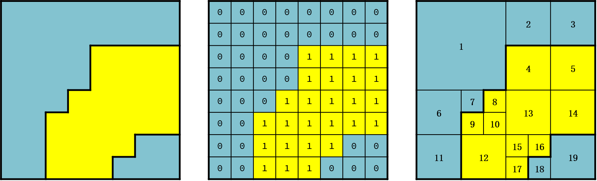
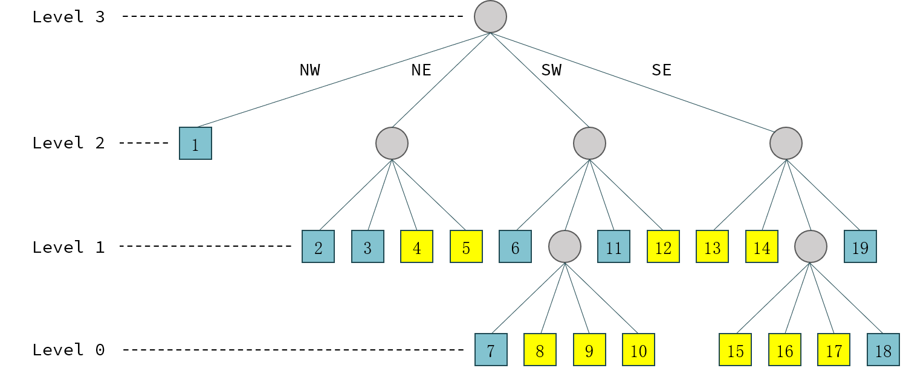
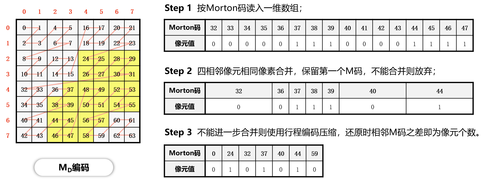
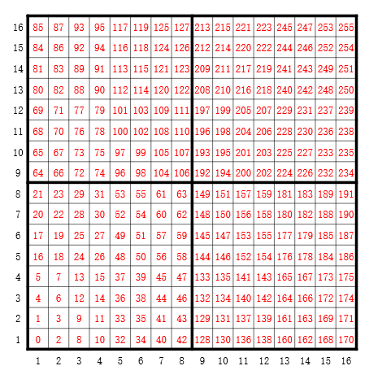
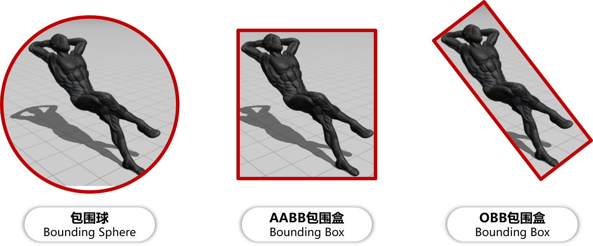
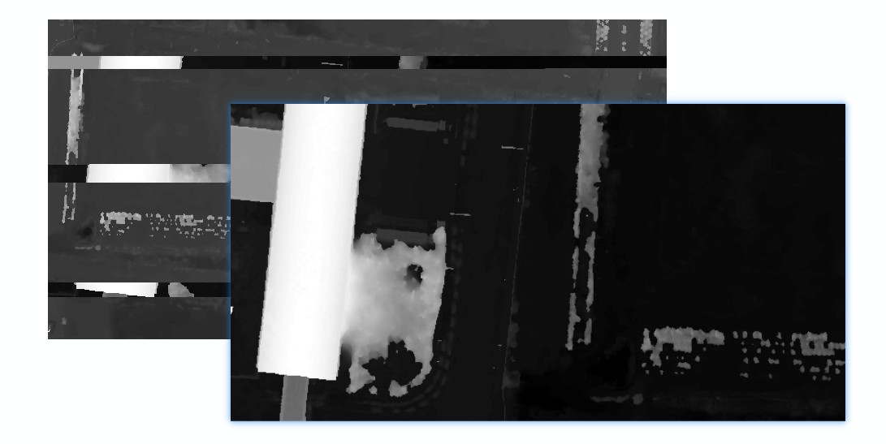
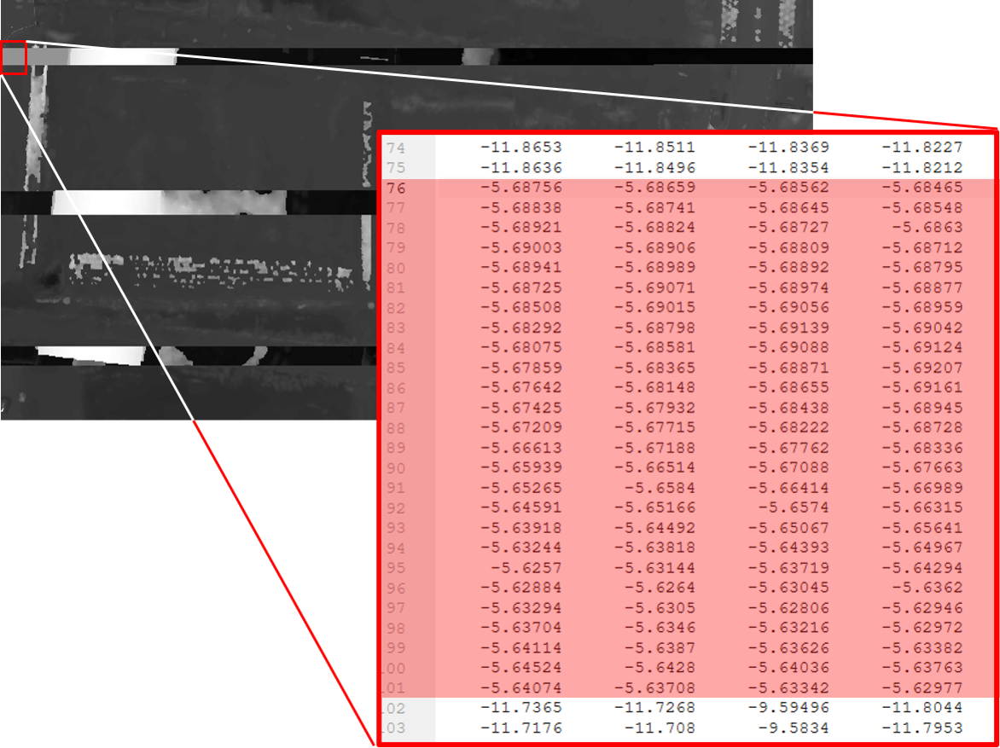
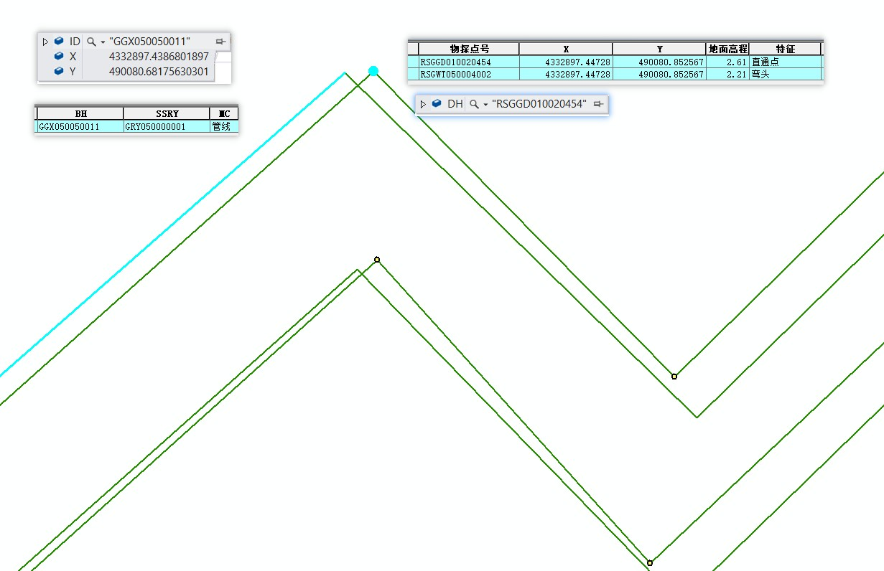
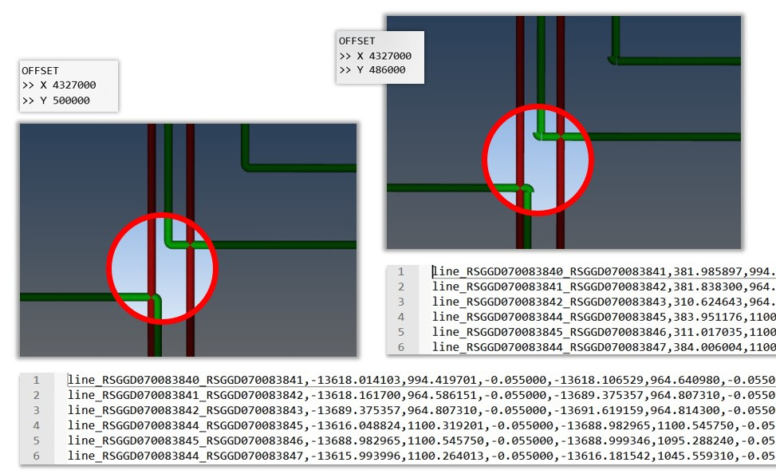

.. _header-n0:

Question List in August, 2020
=============================

🌩 The lightning make us know there are so much amazing and brevity time
in our life.

天之道，其犹张弓与！高者抑之，下者举之；有余者损之，不足者补之。天之道，损有余而补不足。人之道则不然，损不足以奉有余。孰能有余以奉天下？唯有道者。是以圣人为而不恃，功成而不处，其不欲见（xiàn）贤。

.. _header-n4:

Q1 四叉树
---------

在空间信息的应用中，四叉树是一种非常重要的工具，因而为了更好的铺设地理空间信息之路，这一节主要来讲一讲四叉树的相关内容。首先，假设我们均已知晓树结构是一种常见的数据结构，通常意义上来讲可以由根节点和叶节点构成，且其最常见的树结构是只含有两个叶节点的结构，也即二叉树；那么，简单的理解，四叉树就是同一个根节点下面挂接着四个叶节点的一种数据结构了。

.. _header-n6:

1.1 四叉树编码
~~~~~~~~~~~~~~

对于一幅如下图所示的栅格图像而言，其图像压缩编码方式有直接编码、链式编码、行程编码、块式编码以及四叉树编码等几种；在这几种编码方式中，如下图中的中间图所示的直接编码方式最为简单，占据空间也最大，所以在地理信息系统应用中通常不会使用这种方式，而是使用能够尽可能保留空间信息的四叉树编码方式来进行编码。

上图中的栅格图像可以用四叉树算法划分为最右图所示的四叉树区域，这些区域通过四叉树的构建可以形成如下图所示的树结构，这也即是常规四叉树编码：

线性四叉树编码则实现了对栅格图像数据的进一步压缩，该算法在常规四叉树编码的基础上只存储生成的四叉树的叶节点的\ **位置、深度和灰度信息**\ ，用\ **像素代表**\ 的思想以Morton地址码表示叶节点的位置和深度信息。Morton地址码（简称M码）有四进制\ :math:`M_Q`\ 码和十进制\ :math:`M_D`\ 码两种编码方式；若令图像中第\ :math:`i`\ 行第\ :math:`j`\ 列某一像素点\ :math:`\mathbf{x}`\ 的像素坐标为\ :math:`(i,j)`\ ，并将其二进制表示为\ :math:`(I_b,J_b)`\ ，则有四进制的\ :math:`M_Q`\ 码为：

.. math:: M_Q=2\cdot I_b+J_b

十进制\ :math:`M_D`\ 码的计算执行二进制行列号按位交错，如像素点坐标\ :math:`\mathbf{x}=(7,5)`\ ，则其二进制表示为\ :math:`(111,101)`\ ，行列号按位交错后的结果为\ :math:`111011`\ ，将其转换为十进制数为\ :math:`59`\ ，该数即为像素点\ :math:`\mathbf{x}=(7,5)`\ 的\ :math:`M_D`\ 编码。进行按位交叉计算的参考函数代码如下：

.. code:: c

   int makeBitCross(unsigned int a, unsigned int b) 
   {
       /* 定义确定按位交插所需要的数据. */
       unsigned int last_bit_mask = 1;
       unsigned int result = 0;
       /* 统计数字所占比特数. */
       int count_a = 1, count_b = 1;
       for (unsigned int a0 = a; (a0 = a0 >> 1) != 0; count_a++) {}
       for (unsigned int b0 = b; (b0 = b0 >> 1) != 0; count_b++) {}
       int count = count_a > count_b ? count_a : count_b;
       if (count > 32) return 0;
       /* 执行按位交叉. */
       for (int i = 0; i < count ; i++) {
           //获取最后一位比特值
           unsigned int last_bit_a = (a & last_bit_mask) << 1;
           unsigned int last_bit_b = b & last_bit_mask;
           //合并两个比特
           unsigned int temp = last_bit_a | last_bit_b;
           //左移插入其应在的位置
           temp = temp << 2 * i;
           result = result | temp;
           //移位获取下一位比特值
           a = a >> 1;
           b = b >> 1;
       }
       /* 返回结果. */
       return result;
   }

据此，以上图中的图像为例可以知道一幅图像按四叉树编码方式进行存储的流程如下：

使用\ :math:`M_D`\ 码并不能确定每个像素在四叉树中的对应的节点位置，这种线性四叉树编码在降低空间冗余的同时也失去了对于树结构等细节的保留。因此，如果需要在应用中同时保留对四叉树的空间结构信息的存储，就需要在存储Morton地址码的同时，存储其对应的在四叉树中的层级。

.. _header-n18:

1.2 空间四叉树索引
~~~~~~~~~~~~~~~~~~

.. _header-n19:

为什么C++重载某些操作符时需要返回对象的引用
^^^^^^^^^^^^^^^^^^^^^^^^^^^^^^^^^^^^^^^^^^^

重载C++的某些操作符，比如\ ``=``\ ，\ ``+=``\ ，\ ``-=``\ ，\ ``*=``\ 等时会建议开发者使用返回引用的方式来减小对构造函数和析构函数的频繁调用。一般来说，在C++中重载操作符返回对象的引用时通常有两种情况，即：

| **a**. 允许进行连续赋值；
| **b**. 防止返回对象的时候调用拷贝构造函数和析构函数导致不必要的开销。

对于连续赋值的情况\ *a*\ 而言，又存在两种情况：首先，对于\ ``a=b=c``\ 这种形式的连续赋值时返回值和返回引用都可以得到正确的结果，但返回值类型时将调用两次拷贝构造函数和析构函数；其次，对于\ ``(a=b)=c``\ 这种形式的连续赋值来说，返回值类型将导致\ ``=c``\ 左侧的变量无法被赋值，使其原始语义不清。对于情况\ *b*\ 而言，使用值传递的方式虽然可以得到正确的结果，但由于\ ``return``\ 语句要把\ ``*this``\ 拷贝到保存返回值的外部存储单元之中所造成开销会降低赋值运算符的效率。

所以重载运算符时返回对象的引用并不是试用于所有情况的，当重载\ ``+``\ ，\ ``-``\ 等计算运算符时还是老老实实地返回值类型比较好，因为这种情况下并不存在对原有对象的引用，当返回对在函数内部创建的变量的引用时，函数外部调用这个随着函数生命周期的终结而被销毁的变量的引用时，就很容易造成内存泄漏了。

.. _header-n24:

关于C++的拷贝构造函数和赋值函数
^^^^^^^^^^^^^^^^^^^^^^^^^^^^^^^

拷贝构造函数的常见使用方式为\ ``Character b(a)``\ 和\ ``Character b = a``\ ，二者都是用\ ``Character``\ 类的实例\ ``a``\ 来初始化实例\ ``b``\ 的过程，当没有重载拷贝构造函数时，\ ``Character``\ 类将通过默认构造函数来创建对象\ ``b``\ 。

赋值函数的常用方式为\ ``b = a``\ ，也就是说当一个类的对象向该类的另一个对象赋值时才会用到该类的赋值函数，其发生的前提是两个对象均已被实例化；当没有重载赋值运算符时，通过默认赋值函数来进行赋值操作。

默认构造函数以及赋值函数的常见形式为：

.. code:: c++

   /* 重载拷贝构造函数. */
   Character(const Character& c);
   /* 重载赋值运算符. */
   Character& operator=(const Character& c);

.. _header-n29:

欧式地理空间坐标系中的四叉树索引
^^^^^^^^^^^^^^^^^^^^^^^^^^^^^^^^

在欧式空间中，四叉树编码的规则与平面图像索引略有不同，其以图像左下角为原点，向右为\ :math:`i`\ 轴，向上为\ :math:`j`\ 轴，故而其线性四叉树编码规则会形成一个从左下角开始的\ **N字型**\ 线性链接，而不是栅格图像从左上角开始的\ **Z字型**\ 链接方式；其16×16的线性编码示意图如下图所示：

.. _header-n33:

建立高斯影像金字塔
^^^^^^^^^^^^^^^^^^

尝试用GDAL库构建DSM影像的高斯金字塔构建，目前所使用的GDAL为VS2013编译的64位GDAL-1.7版本库，其中构建影像金字塔的函数为\ ``GDALDataset::BuildOverViews()``\ ，一般来说还可以用\ ``GDALRasterBand``\ 类下的同名函数来构建，但对于单波段TIFF格式的DSM数据来说，只能接受\ ``GDALDataset``\ 下的这个函数了。

该函数的使用方法如下：

.. code:: c++

   /************************************************************************/
   /*                           BuildOverviews()                           */
   /************************************************************************/

   /**
    * \brief Build raster overview(s)
    *
    * If the operation is unsupported for the indicated dataset, then
    * CE_Failure is returned, and CPLGetLastErrorNo() will return
    * CPLE_NotSupported.
    *
    * Depending on the actual file format, all overviews level can be also
    * deleted by specifying nOverviews == 0. This works at least for external
    * overviews (.ovr), TIFF internal overviews, etc.
    *
    * Starting with GDAL 3.2, the GDAL_NUM_THREADS configuration option can be set
    * to "ALL_CPUS" or a integer value to specify the number of threads to use for
    * overview computation.
    *
    * This method is the same as the C function GDALBuildOverviews().
    *
    * @param pszResampling one of "AVERAGE", "AVERAGE_MAGPHASE", "BILINEAR",
    * "CUBIC", "CUBICSPLINE", "GAUSS", "LANCZOS", "MODE", "NEAREST", or "NONE"
    * controlling the downsampling method applied.
    * @param nOverviews number of overviews to build, or 0 to clean overviews.
    * @param panOverviewList the list of overview decimation factors to build, or
    *                        NULL if nOverviews == 0.
    * @param nListBands number of bands to build overviews for in panBandList.
    * Build for all bands if this is 0.
    * @param panBandList list of band numbers.
    * @param pfnProgress a function to call to report progress, or NULL.
    * @param pProgressData application data to pass to the progress function.
    *
    * @return CE_None on success or CE_Failure if the operation doesn't work.
    *
    * For example, to build overview level 2, 4 and 8 on all bands the following
    * call could be made:
    * \code{.cpp}
    *   int       anOverviewList[3] = { 2, 4, 8 };
    *
    *   poDataset->BuildOverviews( "NEAREST", 3, anOverviewList, 0, nullptr,
    *                              GDALDummyProgress, nullptr );
    * \endcode
    *
    * @see GDALRegenerateOverviews()
    */
   CPLErr GDALDataset::BuildOverviews( const char *pszResampling,
                                       int nOverviews, int *panOverviewList,
                                       int nListBands, int *panBandList,
                                       GDALProgressFunc pfnProgress,
                                       void * pProgressData );

使用上面代码注释中提供的例子，即可在应用中根据需要创建对应的高斯影像金字塔了。这里\ ``panOverviewList``\ 中的数据是指高斯采样间距数组，上例中的0层、1层、2层金字塔影像的采样间距分别为2、4、8。由此即可简单地通过调用第三方库来实现基本的影像金字塔建立了。

.. _header-n38:

三维模型的包围体
^^^^^^^^^^^^^^^^

包围体是一个内部容纳着复杂形状物体的简单的几何空间，包围体存在的目的在于进行快速的碰撞检测或者在执行精确的碰撞检测之前进行过滤，如当包围体碰撞时才进行精确碰撞检测和处理；目前，在三维领域经使用的包围体的类型主要包括包围球体（Bounding
Sphere）、坐标轴平行包围盒（Axially-aligned Bounding Box,
AABB）、定向包围盒（Oriented Bounding Box, OBB），如下图所示。

基于OBB即定向包容盒子的技术，其广泛用于光线追踪和碰撞检测，该方法是根据物体本身的几何形状来决定盒子的大小和方向的，盒子无须和坐标轴垂直，由此即可找到最紧凑的包围盒。

在OSG中获取AABB包围盒可以用下面几行代码来进行：

.. code:: c++

   osg:ref_ptr<osg::Node> node = osgDB::readNodeFile(_file_path);
   osg::ComputeBoundsVisitor boundVisitor;
   osg::BoundingBox AABB;
   node->accept(boundVisitor);
   AABB = boundVisitor.getBoundingBox();

通过这一方法获取包围盒时发现，模型的瓦片并不是均匀的，所以各个瓦片间的包围盒会有重叠；而另一方面，这种直接通过节点来获取包围盒的方式获取到的坐标是局部坐标，并不是最终需要的坐标信息。

.. _header-n45:

参考文献
~~~~~~~~

1. 百度文库.GIS原理课件4.8四叉树编码[EB/OL].https://wenku.baidu.com/view/d272346028f90242a8956bec0975f46527d3a79b.html?fr=search.

2. 百度文库.第二章空间数据结构(6学时)(四叉树编码)解析[EB/OL].https://wenku.baidu.com/view/6cc644083a3567ec102de2bd960590c69ec3d8b0.html?fr=search-1.

3. 九里明.c++中有些重载运算符为什么要返回引用[EB/OL].https://www.cnblogs.com/qq209049127/p/10542475.html.

4. CSDN博客.C++中构造函数，拷贝构造函数和赋值函数的区别和实现[EB/OL].https://blog.csdn.net/qq_33166886/article/details/88048746.

5. CSDN博客.OSG创建并显示模型的OBB包围盒和AABB包围盒[EB/OL].https://blog.csdn.net/qq_31709249/article/details/99232983.

.. _header-n57:

Q2 ArcGIS Runtime for .NET
--------------------------

记一次学习ArcGIS Runtime for
.NET的学习经历，第一次学习使用该SDK时先从历史图像时间轴开始学起，所以入手功能就是一个图层的显示和隐藏。在复制该功能时发现，加载到\ ``ESRI.ArcGIS.Client.Map``\ 中的图层主要分为如下几种：动态加载服务器端地图缓存切片数据的\ ``ArcGISTiledMapServiceLayer``\ 图层、加载本地切片文件数的\ ``LocalTileCacheLayer``\ 图层、动态加载远程地图的\ ``ArcGISDynamicMapServiceLayer``\ 图层以及直接加载影像的\ ``ArcGISImageServiceLayer``\ 图层。

.. _header-n59:

2.1 图层数据切换
~~~~~~~~~~~~~~~~

字面上理解，\ ``ArcGISTiledMapServiceLayer``\ 图层和\ ``LocalTileCacheLayer``\ 图层是有很大差别的，所以在切换图层数据时，\ ``ArcGISTiledMapServiceLayer``\ 图层直接修改其图层的\ ``Url``\ 属性即可；而\ ``LocalTileCacheLayer``\ 图层的文件链接属性为\ ``TileCacheFilePath``\ ，直接修改它并不会实时地在地图中进行显示和刷新，所以需要在修改其文件链接之后使用\ ``Initialize()``\ 函数来对其图层内容进行一次手动的更新，即：

.. code:: c#

   LocalTileCacheLayer tlay = mMap1.Layers["A"] as LocalTileCacheLayer;
   tlay.TileCacheFilePath = (mMap.Layers["b"] as LocalTileCacheLayer).TileCacheFilePath;
   tlay.Initialize(); //初始化数据
   tlay.Refresh();    //刷新图层

地图的\ ``Extent``\ 由其\ ``Envolope``\ 属性表达，实际上标明了地图落在当前视口范围内的地理矩形框，也可以理解为将地图上某一范围内的地理要素打包好放入信封Envolope中传递给显示屏进行显示，所以在进行图层联动时这一属性的设置十分必要。

.. _header-n63:

2.2 地图透视镜
~~~~~~~~~~~~~~

地图透视镜在.xaml文件中的主体代码如下，在实际使用时遇到了放大镜无法绑定的问题。在我们的系统中使用的地图类\ ``ESRI.ArcGIS.Client.Map``\ 是在.cs文件中建立的，所以无法在.xaml文件中进行绑定，而在.cs文件中进行Map的绑定和为\ ``MagnifyingGlass.Layer``\ 图层赋予相关信息时都有一定的问题：

| （1）只添加\ ``MagnifyingGlass.Layer``\ 而不进行\ ``Map``\ 绑定则：放大镜位置改变其中内容不变；
| （2）添加\ ``MagnifyingGlass.Layer``\ 的同时进行\ ``Map``\ 绑定并设置\ ``Extent``\ 则：放大镜内容始终是灰色的。

.. code:: xaml

   <esriWidgets:MagnifyingGlass 
         x:Name="MyMagnifyingGlass" 
         Canvas.ZIndex="10" 
         Map="{Binding ElementName = Map}" 
         Background="#CCCCCC">
      <esriWidgets:MagnifyingGlass.Layer/>
   </esriWidgets:MagnifyingGlass>

必须使用\ ``ArcGISTiledMapServiceLayer``\ 图层来进行透视镜图层的绑定。

.. _header-n68:

参考文献
~~~~~~~~

1. 博客园.《ArcGIS Runtime SDK for Android开发笔记》11、ArcGIS Runtime
   SDK常见空间数据加载[EB/OL].
   https://www.cnblogs.com/gis-luq/p/5062715.html.

2. 百度文库. ArcGIS Runtime SDK for .Net 高级开发[EB/OL].
   http://weibo.ws/WcVNvd.

.. _header-n74:

Q3 BUG修复
----------

.. _header-n75:

3.1 生成DSM功能时，改变分辨率后生成的DSM图像出现条纹现象
~~~~~~~~~~~~~~~~~~~~~~~~~~~~~~~~~~~~~~~~~~~~~~~~~~~~~~~~

   迷失的人迷失了，相逢的人会再相逢。

.. raw:: html

   <html xmlns="http://www.w3.org/1999/xhtml"><head></head><body>

       村上春树《挪威的森林》
   
</body></html>

如题描述，在进行同步生成DSM功能的开发时，龙哥发现了这样一个问题，即将图像分辨率由20cm改为40cm后，生成的DSM图像会产生间断的条纹。分析这个条纹可以发现，黑色条纹中是没有数据的，当原本生成的图像被更改分辨率后生成的图像覆盖时，条纹中的数据并未被重写，而是仍然保留前一次生成时所写入的数据；如下图所示，右下角为上次20cm图像分辨率时生成的DSM，左上角为40cm分辨率的重写结果。

图像在像素坐标系下的\ **76–101行**\ 产生了这样一种写入间断，而从代码中生成的\ ``elevation_matrix``\ 矩阵中所存储的数据中，也在相同位置产生了这样一种写入间断。故而可以判断，这种间断可能源自于在场景中执行深度图渲染时更改图像分辨率之后所引发的错误。

在执行删除DSM功能函数时，为生成的\ ``osg::Image``\ 格式的深度图添加如下代码即可解决问题：

.. code:: c++

   _depth_image->dirty();
   _depth_image = new osg::Image;

通过这个BUG，龙哥教会了我这样一件事，程序中没有不透风的BUG，只要这个BUG产生了，不管它是在不同的机器上产生的，还是在不同的条件下产生的，都直接或间接的证明这个BUG的客观存在性，狡辩和置之不理是没有任何用处的，唯一可行的方案就是通过各种方式复现这个BUG；当毫无头绪时，最常见的复现方式就是分析别人使用它时产生的错误结果或者说错误数据，在项目中排查能够产生这种错误的代码。

.. _header-n86:

3.2 生成DSM时尚未指定NoData的值
~~~~~~~~~~~~~~~~~~~~~~~~~~~~~~~

生成DSM时，若场景中存在空洞则应对空洞中的数据进行统一处理，将空洞中的数据处理成NoData数据并存储到GeoTIFF影像之中。NoData值的指定应在GeoTIFF中的标签中进行，其标签名称为\ ``tag_GDAL_NODATA``\ ，指定的内容应为ASCII类型的标签值。该标签值并非标准标签，所以在ArcGIS中不会生效。

.. code:: c++

   TIFFSetField(tif, 42113, NODATA_VALUE);//设置非标准GDAL标签tag_GDAL_NODATA 

设定NoData值的关键代码如下：

.. code:: c++

   /* 1.设定NoData值. */
   const int NODATA_VALUE = -9999;	
   /* 2.设定double检测阈值并找到深度图中值为1的点位的索引. */
   std::vector<int> nodataID;
   double dis = 1e-8;
   if (abs(depth - 1.0) < dis) nodataID.push_back(index);
   /* 3.将深度超限的点设为NoData值.  */
   for (auto i : nodataID){ X(2, i) = NODATA_VALUE; X(3, i) = 1.0; }

这里需要注意的是，判断\ ``double``\ 类型数据的相等时通常不会直接使用\ ``==``\ 类型来加以判断；这是由于计算机在表示小数时都有误差，所以一般认为偏差在一个较小的范围内则两个数据是相等的。

.. _header-n92:

参考文献
~~~~~~~~

1. stackoverflow. What are the corresponding fields to set in libtiff or
   libgeotiff, given a minimal ESRI ASCII file?[EB/OL].
   https://stackoverflow.com/questions/53588712/what-are-the-corresponding-fields-to-set-in-libtiff-or-libgeotiff-given-a-minim.

2. GDAL文档. RFC 58:删除数据集Nodata值[EB/OL].
   https://www.osgeo.cn/gdal/development/rfc/rfc58\ *removing*\ dataset\ *nodata*\ value.html.

3. CSDN博客. double类型是否相等的判断方法[EB/OL].
   https://blog.csdn.net/dingpiao190/article/details/73512811.

.. _header-n100:

Q4 地下管线
-----------

.. _header-n101:

0824 使用ArcGIS的Python脚本处理中文字符串
~~~~~~~~~~~~~~~~~~~~~~~~~~~~~~~~~~~~~~~~~

在Python中使用中文的时候一定要进行转码，否则一些字符串的匹配不会生效。本次处理时，目的在于将“二次系统”统一变换为材料“钢”，将“一次系统”以及其他系统统一变换为材料“铸铁”，设计代码如下：

.. code:: python

   def Material(type):
     if (type == "二次系统"):
       return "钢"
     else:
       return "铸铁"

上面的代码实际上并不会生效，需要使用\ ``decode('utf-8')``\ 函数来对中文字符串进行转码后方可生效；其具体使用方式如下：

.. code:: python

   def Material(type):
     if (type == "二次系统".decode('utf-8')):
       return "钢"
     else:
       return "铸铁"

.. _header-n106:

0825 向SHP文件中追加字段导致其文件损坏
~~~~~~~~~~~~~~~~~~~~~~~~~~~~~~~~~~~~~~

下面有个网友提出的问题十分符合在执行管线的折线类型数据字段追加时所遇到的情况，在当前测试中，原有的SHP文件中共有401,078条形状数据，而添加字段后存储在PDB文件中的数据仅剩290,122条，故而在打开该文件时会遇到\ **“形状数与表记录不一致”**\ 的打开数据集失败错误。

   I have a point shapefile with over 2 millions of records. I used
   field calculator to edit one field and deleted another field. After
   that, if I try to open this shape file again, it showed me an error:
   Number of shapes does not match the number of table records. It works
   fun for small shapefiles. This problem has been bugging me for days.
   Anyone know why and how to solve this?

**再次感谢龙哥！！！**\ 将SHP文件转出为GeoDatabase，即GDB格式之后，一切问题都迎刃而解了。

.. _header-n111:

0827 大数据量时通过坐标寻找坐标点号
~~~~~~~~~~~~~~~~~~~~~~~~~~~~~~~~~~~

C++链接Access数据库的.mdb文件需要借助\ **Microsoft Access database
engine
2007安装包**\ 、\ **系统ADO目录下的msado15.dll**\ 文件。目前设计的思路时，首先通过字符截断结合XY整形数为字符串索引，将其放到cache文件夹目录下；接下下，从线段中匹配端点时直接根据这个索引来寻找文件，从文件中找到距离直线端点最近的点。

下面的图片展示了这样一个问题，即有些点号具有相同的地理坐标。但实际上这应该有两个坐标点的，有些直线的端点无法找到对应的点号，这也就是最终的结果中包含很多无法找到对应端点点号的直线的原因。

ArcGIS的shp文件在执行合并或其他操作时，如果数据量大的话就会出现很多莫名其妙的问题；就比如在执行线段端点点号查找计算的过程中，就发现了在直线编号为GGX010002549处具有145060条重复字段值；而实际上，这一编号只对应FID为256018的一条直线段数据。管线编号GGX020019266对应有110957条重复数据。使用GDB文件地理数据库可以解决大多数的类似问题。

.. _header-n116:

0830 数据库Access运行时错误[3625]
~~~~~~~~~~~~~~~~~~~~~~~~~~~~~~~~~

在搞好坐标点匹配之后执行VisualTube3D计算管线建模信息时发现其报了个“这个集合中找不到此项目”的错误，经龙哥的指点，该问题为数据库中的“起始管顶高”与标准的“起始管顶高程”两个字段不匹配所引起的，这个问题的一般性描述为：

   运行时错误 '3265'：这个集合中找不到此项目。

一般这个错误提示
就是因为代码与表中字段名不一致造成的，仔细检查字段名与代码名称即可发现错误。如果表中的字段名没法修改，即修改了保存关闭后再打开还是以前的名字；其原因为数据库中表是链接表，解决方案为退出Access操作程序，到后台表中改，即建表的数据库里面改字段名。

.. _header-n121:

0831 3DMax管线建模坐标过大时的建模精度问题
~~~~~~~~~~~~~~~~~~~~~~~~~~~~~~~~~~~~~~~~~~

此次项目所涉及的地下管线SHP文件中共包含546582条数据，其X坐标范围为\ :math:`X\in[4285240,4342620]`\ ，取值范围Y坐标范围为\ :math:`Y\in[465447,544486]`\ ；二者对应了一个X方向距离57380，Y方向距离79039的平面坐标区域。

而据实验观察，3DMax中执行管线建模时，坐标值超过1000以上就会产生一些精度问题，从而使得管线端点发生偏移并使得弯头无法与实际的管线相贴合。除此之外，在进行3DMax管线建模时遇到的几个困惑的地方也需要总结一下，将上面的问题收纳在一起汇总如下：

| **[1]**. **冗余模型。**\ 即点击[Make
  Tube]按钮后在场景中冒出很多硕大的标准模型问题。
| **[2]**. **模型尺寸。**\ 即点击[Make
  Model]按钮后在对应点位上创建的模型尺寸无法与管线贴合的问题。
| **[3]**.
  **坐标精度。**\ 即使用VisualTube3D计算管线建模信息时由于坐标过大所导致的精度损失的现象。
| **[4]**.
  **海量建模。**\ 即用3DMax中的Tube3D工具读取50.6MB的30余万条数据建模时间非常非常长的问题。

   **注意**\ ：一个段落间距格式问题；在Typora中，[Shift] +
   [Enter]=单回车；而单独点击[Enter]=双回车。

.. _header-n128:

参考文献
~~~~~~~~

1. msay. 在arcgis使用python脚本进行字段计算时对中文的处理方案[EB/OL].
   https://www.cnblogs.com/mingjiatang/p/4888045.html.

2. pengjw. ArcMap中给点shp添加字段后shp文件破坏无法打开[EB/OL].
   https://www.cnblogs.com/pengjw/p/3577105.html.

3. 百度知道. c++怎么连接access数据库[EB/OL].
   https://zhidao.baidu.com/question/1759096015463825708.html.

4. accessoft.
   Access\ **“运行时错误3265,这个集合中找不到此项目“**\ 的解决方法[EB/OL].
   http://www.accessoft.com/article-show.asp?id=7456.

5. CSDN博客.关于Typora的markdown编辑器行间距过大、不一致的问题[EB/OL].
   https://blog.csdn.net/tastyrekeke/article/details/102664860.
