.. _header-n0:

Question List in September, 2020
================================

🍂 Wind in autumn is always full of the life smell.

.. raw:: html

   <html xmlns="http://www.w3.org/1999/xhtml"><head></head><body>阿那克西曼德：（阿派朗是）万物由之产生的东西，万物又消灭而复归于它，这是命运规定了的。因为万物在时间的秩序中不公正，所以受到惩罚，并且彼此互相补足。</body></html> 

.. _header-n4:

Q1 执行SHP文件分块
------------------

解决202008号文件中的\ **[0831]**\ 号问题，即\ **3DMax管线建模坐标过大时的建模精度问题**\ 。经过这个月1号下午5点龙哥的指教，明白了3DMax中遇到这一问题的原因是3DMax采用的\ **float**\ 类型精度为6位，超过6位即覆盖范围超过±10公里就会引发精度问题。

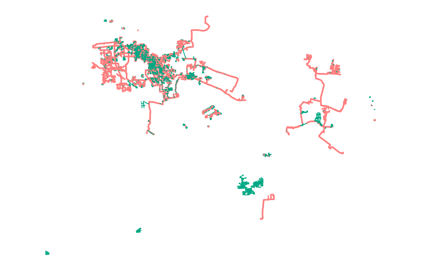

两个主要的步骤如下：

1. | **将由代码生成的数据表<**\ 链接\ **>到存储在GDB数据库中的“热力管线”文件的属性表中**\ 。
   | 需要注意的是，这里<链接>需要一个基础字段，代码中选择保留 [OBJECTID]
     唯一标识符字段以供执行链接操作，故而最终生成的匹配结果是一个字符分割的
     [SN,OBJECTID,点号] 明码文件格式。在尝试链接时，ArcMap
     10.7的界面卡死真的令人十分烦躁，故而使用ArcGIS
     Pro试用版来进行大数据量的处理，发现效果很不错。唯一的问题就是它太贵了，不能长时间使用；在Doge.杨的提示下建议着手使用ArcPy自己来写工具提高它的运行效率。

2. | **编写ArcPy脚本，执行文件分块。**
   | 本文最开始打算使用C++来执行分块操作，但显然这样需要考虑的内容十分复杂，故而转用ArcPy脚本操作来进行。利用ArcPy执行文件分块的技术要点有如下几个：
   | A、确定分块间隔大小，即应该把SHP文件划分为多大一块的网格才能满足管线建模要求；
   | B、定义要素切割方法，即如何切割要素并使得被切断的线段端点能够在点数据表中对应找到；
   | C、组织链接拷贝属性，即如何将切割出来的多余点的属性表合理建立或链接起来。

Python中进行浮点型与字符串之间的转换时可用\ ``str()``\ 函数保留12位的精度，而更高程度上的精度保留可以使用函数\ ``repr()``\ 。关于这一函数的使用方法可参考\ *叶田的学习笔记*\ 中所提到的：

   str()和repr()都可以将python中的对象转换为字符串，但两者之间的目标不同：str()主要面向用户，其目的是可读性，返回形式为用户友好性和可读性都较强的字符串类型；
   repr()面向的是python解释器，或者说开发人员，其目的是准确性，其返回值表示python解释器内部的含义，常作为编程人员debug用途。repr()的返回值一般可以用eval()函数来还原对象，通常来说有如下等式：

   .. code:: python

      obj = eval(repr(obj))

.. _header-n17:

生成矩形框执行SHP裁剪
~~~~~~~~~~~~~~~~~~~~~

利用ArcPy在ArcGIS中执行裁剪的函数如下，在使用前应使用\ ``import arcpy``\ 来导入ArcPy地理处理包。且使用该函数时对数据库文件及其字段有些特殊的要求，也即：

| [1].
  在Line对应的Shape文件中必须手动计算其线段的起始点、终止点坐标，并需以QSD\ *X,QSD*\ Y,ZZD\ *X,ZZD*\ Y的形式进行存储；
| [2].
  管点文件中必须包含'物探点号'、'X'、'Y'、'特征'、'附属物'、'地面高程'、'井底高程'、'井底埋深'等属性字段。

主要使用到的ArcPy类和工具函数有Geometry类下的：Point、PointGeometry、Polygon、Polyline、Extent类，管理工具下的工具函数CreateFileGDB\ *management、分析工具下的Clip*\ analysis函数，以及三个游标InsertCursor、SearchCursor、UpdateCursor等。

.. _header-n21:

根据包络矩形计算地理分块
~~~~~~~~~~~~~~~~~~~~~~~~

直接根据包络矩形执行格网划分还是比较方便的，利用这种方式执行裁剪只需要获取包络矩形的左下角和右上角坐标即可通过设定格网间距参数来将完整的SHP文件分割为若干均匀分布的网格。但这种方法存在的主要问题和难点为：

| [**a**].
  **网格是均匀的，矢量要素不是**\ ；所以存在部分网格中并不存在待裁剪要素的情况，且这一情况并不少见。
| [**b**].
  **如何判断裁剪网格是否为空**\ ；针对上面说的不均匀矢量要素问题所需要执行的具体操作之一。

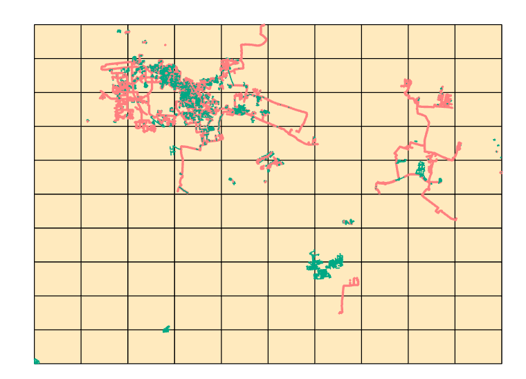

目前根据这种均匀格网划分方式所执行的管线分割脚本工具代码如下。这里需要设定四个工具参数，管线要素类\ ``line_shp``\ ，管点要素类\ ``point_shp``\ ，输出格网文件路径\ ``ouput_folder``\ 以及类型为长整型的XY方向格网数目\ ``step``\ 。

这里主要存在的问题就是空格网的判断，上面的代码对于每一块格网都会执行创建个人地理数据库的操作，相对于整体运行时间而言，这一操作的耗时还是比较严重的；不判断空网格虽然不影响最终结果的生成，但会造成程序效率的低下。目前的脚本工具运行时间为：

   | 执行: 管网要素格网剖分
   | C:\Users\Administrator\Desktop\NYJT\能源集团地下管线.gdb\热力管线
   | C:\Users\Administrator\Desktop\NYJT\能源集团地下管线.gdb\热力管点
   | C:\Users\Administrator\Desktop\experiment\test6
   | 10

   | 开始时间: Mon Sep 07 13:44:30 2020
   | 正在运行脚本 管网要素格网剖分
   | 成功 在 Mon Sep 07 14:33:45 2020 (经历的时间: 20 分 7 秒)

.. _header-n30:

参考文献
~~~~~~~~

1.  百度文库.\ `ARCGIS批量导入属性表内容方法 <https://wenku.baidu.com/view/95d4552225c52cc58bd6bef0.html>`__\ [EB/OL].

2.  ArcGIS
    Pro.\ `InsertCursor <https://pro.arcgis.com/zh-cn/pro-app/arcpy/data-access/insertcursor-class.htm>`__\ [EB/OL].

3.  ArcGIS
    Desktop.\ `ListTools <https://desktop.arcgis.com/zh-cn/arcmap/latest/analyze/arcpy-functions/listtools.htm>`__\ [EB/OL].

4.  ArcGIS Desktop.\ `使用 Python
    创建工具的快速浏览 <https://desktop.arcgis.com/zh-cn/arcmap/10.5/analyze/creating-tools/a-quick-tour-of-creating-tools-in-python.htm>`__\ [EB/OL].

5.  简书.\ `两个简单的arcpy例子 <https://www.jianshu.com/p/92829b82ce76>`__\ [EB/OL].

6.  知乎.\ `arcgis 笔记
    1：利用Intersect_analysis进行分区统计 <https://zhuanlan.zhihu.com/p/61445743>`__\ [EB/OL].

7.  CSDN博客.\ `【Arcpy】shp的读取与创建 <https://blog.csdn.net/OldMonkeyYu_s/article/details/94615047>`__\ [EB/OL].

8.  6宇航.\ `Arcpy.Intersect_analysis在convertArcObjectToPythonObject处出现异常的原因 <https://www.cnblogs.com/6yuhang/p/12502756.html>`__\ [EB/OL].

9.  IT屋.\ `Converting a Python Float to a String without losing
    precision <https://www.it1352.com/736324.html>`__\ [EB/OL].

10. 我也是个傻瓜.\ `解决ArcPy脚本工具中文乱码问题 <https://www.cnblogs.com/liweis/p/13069311.html>`__\ [EB/OL].

.. _header-n53:

Q2 地下管线建模
---------------

地下管线建模的入坑之路真的是无比漫长。在经历了计算字段时Python2.7脚本不支持中文、数据量大时计算管线端点出错、合并属性表之后数据丢失、VisualTube3D计算建模数据时报字段缺失错误、数据量大时管线建模精度丢失等若干令人头秃的问题之后，终于借助GDB数据库文件格式和SHP分割技术走到了目前的正式建模阶段。

.. _header-n55:

地下管线建模技术流程总结
~~~~~~~~~~~~~~~~~~~~~~~~

经过将近一个月的时间，总结整理了以能源集团地下管线数据为样板的大范围地下管线数据建模的总体技术流程，能源集团地下管线数据的特点有如下几点：

| a. 管点、管线数据量大且覆盖范围广；
| b. 原始数据表不符合DB/T29-152-2010标准；
| c. 管线数据缺失起始点和终止点点号；
| d. 管点数据与管线数据并非严格对应，且管线可能为多段线。

归纳一下暂行的解决方案，使用的流程如下图所示。

其中的\ **S100步骤**\ 依据《天津市地下管线信息管理技术规程》（DB/T29-152-2010）标准中所制定的管点、管线表设计标准基于ArcMap或ArcGIS
Pro中的[地理处理]\ :math:`\rightarrow`\ [融合(Merge)]进行数据的融合，随后使用[地理处理]\ :math:`\rightarrow`\ [合并]进行各类数据的融合，其操作步骤如下：

-  **S101**
   建立标准管点、管线数据表，其中标准管点数据表的主要字段内容应包括\ *物探点号*\ 、\ *X*\ 、\ *Y*\ 、\ *地面高程*\ 、\ *特征*\ 、\ *附属物*\ 、\ *井底高程*\ 、\ *井底埋深*\ 等，标准管线数据表的字段应包括\ *起始点号*\ 、\ *终止点号*\ 、\ *起始埋深*\ 、\ *终止埋深*\ 、\ *起始管顶高程*\ 、\ *终止管顶高程*\ 、\ *起始管底高程*\ 、\ *终止管底高程*\ 、\ *管线材料*\ 、\ *埋设方式*\ 、\ *管径*\ 等；

-  **S102**
   利用[地理处理]\ :math:`\rightarrow`\ [融合]工具将标准数据字段合并到原始管点、管线数据表中，并利用字段计算器以及计算几何将原始数据表中的数据赋值给标准数据字段，需要特别注意要在管线数据表中新建四个字段\ *QSD_X*\ 、\ *QSD_Y*\ 、\ *ZZD_X*\ 、\ *ZZD_Y*\ 分别计算每条管线的起始点\ :math:`(Y,X)`\ 坐标和终止点\ :math:`(Y,X)`\ 坐标；

-  **S103**
   用[地理处理]\ :math:`\rightarrow`\ [合并]工具将各类数据表合并到一个管点SHP文件中，注意需要将两个SHP文件统一放到MDB地理文件数据库中，以便进行后续的处理；

**S200步骤**\ 需要借助自己写的deREPEAT.py脚本工具进行处理，通过设定好的剔除规则删除一些在地理位置上十分邻近可视为重复数据的管点，删除时应优先保留附属物为非探测点的管点数据，其步骤如下：

-  **S201**
   利用ArcGIS工具箱中的[分析工具]\ :math:`\rightarrow`\ [邻域分析]\ :math:`\rightarrow`\ [生成近邻表]来生成邻接关系表，且表中应包含IN\ *FID字段在管点数据表中所对应的附属物放到IN*\ FSW字段、NEAR\ *FID对应的附属物放到NEAR*\ FSW字段；

-  **S202**
   将数据导入自定义工具箱[删除重复管点]工具中进行处理，如下图所示：

   .. figure:: pic/deRepeat.bmp
      :align: center
      :scale: 48

**S300步骤**\ 是比较耗时的一个步骤，为了使计算时间满足条件，只能牺牲一些磁盘空间来进行管点匹配计算，该步骤的主要操作为：

-  **S301**
   打开LineMatch.exe，在其中输入待处理的合并后的*.mdb文件的路径回车等待即可；

-  **S302**
   使用insertPOINT.py对应的自定义工具箱[插入管点]来根据上一步计算出的结果AddPoint.txt来将必要的管点数据插入到*.mdb文件所对应的管点数据表中；

   .. figure:: pic/insertPOINT.bmp
      :align: center
      :scale: 48

**S400步骤**\ 也是借助自定义工具箱[管网格网剖分]来进行的，该工具与[删除重复管点]工具放到了同一张图中，需要注意的是，要记录好每一块SHP中心点的地理偏移，以便后面依据该数据进行建模。

**S500步骤**\ 的操作与龙哥之前的VisualTube3D和3dsMax插件息息相关，遵照工具使用说明进行建模数据准备，建模配置文件修改，以及批量建立分幅图型的*.max文件即可，后续操作为合并Max文件，这里不予赘述。

.. _header-n84:

关于管线建模的两个2010年前后的工程代码
~~~~~~~~~~~~~~~~~~~~~~~~~~~~~~~~~~~~~~

这两个工程项目被分别命名为\ **VisualTube3D**\ 和\ **Tube3dMaxplugin**\ ，基本都是用Visual
Studio 2010进行开发的。Tube3dMaxplugin是基于Autodesk 3ds Max
9进行的\ **\*.dlu**\ 格式的工具拓展，VisualTube3D是基于MFC所开发的对个人地理数据库文件（即Microsoft
Office
Access的2000-2003版本\ **\*.mdb**\ 文件格式）进行标准管线数据提取、处理并生成建模数据的程序。

   2008年2月12日，Autodesk公司宣布推出Autodesk 3ds
   Max建模、动画和渲染软件的两个新版本。该软件是用于开发游戏的领先的创造工具。该公司推出了面向娱乐专业人士的Autodesk
   3ds Max 2009 软件，同时也首次推出3ds Max Design 2009
   软件，这是一款专门为建筑师、设计师以及可视化专业人士而量身定制的
   3D应用软件。Autodesk 3ds Max
   的两个版本均提供了新的渲染功能、增强了与包括 Revit
   软件在内的行业标准产品之间的互通性，以及更多的节省大量时间的动画和制图工作流工具。3ds
   Max Design 2009 还提供了灯光模拟和分析技术。

Microsoft Database（\ **\*.mdb**\ ）格式是Microsoft Office
Access软件于2003年之前所使用的一种数据库文件存储格式，而2007年发布的新版本数据库软件则使用\ **\*.accdb**\ 格式的拓展名取代了\ **\*.mdb**\ 格式，但包括2007版本在内的2010、2013、2016等版本均保留了向下兼容的功能以对\ **\*.mdb**\ 格式提供支持。随着2017年Esri公司将ArcGIS
Desktop分为两大产品：即基于COM开发（ArcEngine以及ArcObject）的涵盖ArcCatalog、ArcScene和ArcGlobe等传统产品的ArcMap以及基于微软.NET
Framework框架重构了底层的ArcGIS Pro，其新产品由于微软的.NET
Framework框架并不提供64位Access数据库的接口而不再支持\ **\*.mdb**\ 这一地理数据库文件格式。

.. _header-n89:

VisualTube3D
^^^^^^^^^^^^

VisualTube3D主要执行的是数据库操作，其需要依赖一些方法的调用来从数据库中读取我们所需要的各种信息。在选择完\ **\*.mdb**\ 文件后点击“单次推算”将依据下面的过程为推算准备必要的管点数据和管线数据。

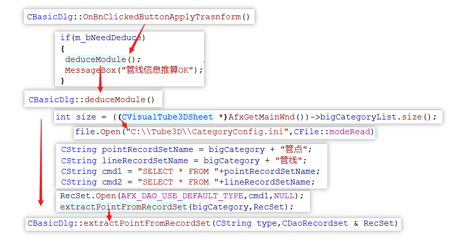

与\ ``extractPointFromRecordSet()``\ 函数类似的还有\ ``extractLineFromRecordSet()``\ 函数，其附加了几个函数：

| a. ``analyseDiameter(pTubeLine);``\ 解析管径函数。
| b. ``getSurveyPositionConfigInfo();``\ 解析“内底”还是“外顶”。
| c.
  ``computeTubeVertexCenterHeight();``\ 根据外顶高或内底高,以及管径,推算管线端点几何中心的高程。

这里面有两个结构体用来存储建模时所需要的管点和管线信息，分别为\ ``tubePoint``\ 结构体和\ ``tubeLine``\ 结构体。其中\ ``tubePoint``\ 结构体的声明如下面的代码所示，代码中注释中的\ **[]**\ 为数据库中所需要的字段名，最后一行为输出的用于计算管线的推算结果数据：

.. code:: c++

   struct tubePoint
   {
   	CString name;		// [物探点号]
   	double x;			// [X]-X_Offset
   	double y;			// [Y]-Y_Offset
   	double topH;		// [地面高程] 也即井顶高程
   	double bottomH;		// [井底高程]
   	double rotZangle;	// 绕Z轴旋转角

   	CString bigCategory;	//管点大类
   	CString smallCategory;  //管点小类

   	/* >> 附属物特征	   
   	   (0) 检修井    
   	   (1) 探测点    
   	   (2) 阀门     
   	   (3) 固定实体,它无法缩放,可以旋转
   	   (4) 阀门井
   	   (5) 人孔
   	   (6) 手孔 
   	   (7) 偏心井位,管线断开
   	   (8) 方形雨水篦
   	   (9) 圆形雨水篦 
   	通过分析affiliateAttribute后得出*/
   	int appurtenanceCharacter;

   	CString affiliateAttribute; //[附属物];探测点,探测井,阀门,消防栓,阀门井,人孔,手孔等
   	CString eccentricWellName;  //[偏心井位];如果没有则为""
   };
   //str1="[管点名,数学x,y,井底高程,井半径,井深,绕Z轴旋转角,特征代码,附属物,大类,亚类]\n";

上面的信息中，管点大类和管点小类是根据\ **[物探点号]**\ （即结构体中成员变量\ ``name``\ ）的前2字母在\ **“C:\\Tube3D\\CategoryConfig.ini”**\ 文件中查找对应类别所得到的。\ ``tubeLine``\ 结构体如下：

.. code:: c++

   struct tubeLine
   {
   	CString startPoint;		//[起始点号]
   	CString endPoint;		//[终止点号]

   	double startX,startY;
   	double endX,endY;
   	double startH;			//起始管中高程 [起始管顶高程][起始管底高程]
   	double endH;			//终止管中高程 [终止管顶高程][终止管底高程]

   	CString	buryType;		//[埋设方式]
   	CString material;		//[管线材料]
   	CString bigCategory;	//管线大类
   	CString smallCategory;	//管线小类

   	CString diameter;  //[管径]
       //单位是毫米,如果为300,表明为圆形管。如果为300X400,表明为方形管道。需要从文字中解析出来管径
   	
       //外径或外高,单位是米,因为管沟测的是内高,所以外高=内高+2*墙壁厚
       double externalDiameterOrHeight; 
       
       //内径或外宽,单位是米,因为管沟测的是内宽,所以外宽=内宽+2*墙壁厚
   	double internalDiameterOrWidth;	 
   };
   //str1 = "[管线名,起点数学x,y,起点管中高程,终点数学x,y,终点管中高程,大类,亚类,材质,埋设方式,外径(高),内径(宽)]\n";

读取完数据之后，在\ ``CBasicDlg::distributeTubeLineToMatchedPoint()``\ 函数中匹配管线的起点和终点。执行完这些步骤之后，程序开始执行较为重要的建模坐标调整函数\ ``runTransform()``\ 。该函数主要执行了如下操作：

.. code:: c++

   /* 数据处理系列函数. */
   checkAppurtenanceCharacter();   //分析管点特征
   checkChamberCharacter();		//判断管点有没有井室,有井室的话要添加到井室列表
   computeStartEndCoords(pRow);    //对于需要截断的排水管线,通过默认井半径,计算两端点坐标
   rectifyTubeCoord();				//修剪管线,计算弯头
   rectifyBoxCoord();				//减小管块管线缝隙
   computeModel();					//计算阀门旋转角,缩放因子
   computeTubePointRotZangle();	//计算特殊管点绕Z轴旋转角
   updateChamberAndWellByRealShp();//根据真实井室信息更新推算信息
   //真实存在的井室,将会从推算的记录中删除。推算记录中的剩余井室(按逻辑虚拟的)仍会存在

   /* 处理结果输出系列函数. */
   outputPointToFile();            //输出管点数据 Well.txt 热力探测点的井位信息
   outputLineToFile();             //输出管线数据 Tube
   outputElbowToFile();            //输出弯头数据 Elbow
   outputModelToFile();            //输出阀门数据 Model
   outputChamberToFile();          //输出井室数据 Chamber

输出文件的格式如下：

.. code:: makefile

   # well.txt
   管点名,数学x,y,井底高程,井半径,井深,绕Z轴旋转角,特征代码,附属物,大类,亚类;
   # tube.txt
   管线名,起点数学x,y,起点管中高程,终点数学x,y,终点管中高程,大类,亚类,材质,埋设方式,外径(高),内径(宽);
   # elbow.txt
   头名称,弯头中心的三维坐标,弯头半径,绕X轴旋转角,绕Z轴旋转角,切片从,切片到,大类,亚类,材质;
   # model.txt
   阀门名,阀门数学x,y,管中高程,绕Z轴旋转角,缩放比例,大类,亚类,三维代码;
   # chamber.txt
   管点名+JS,井中x,y,井半径,井室圆心x,y,井室半径,井室底高,井室高(管顶高-井底高),大类,亚类。

从代码中分析，最终用3ds
Max由附属物生成模型时，需要的只有附属物这一个字段；根据该字段从分类配置文件<**CategoryConfig.ini**>中提取大类、亚类，并从<**ModelsLibConfig.ini**>中据此匹配大类、亚类、附属物、抽象类别以及调用对应3D模型时所需要的三维模型标识码。

.. _header-n103:

Tube3dMaxplugin
^^^^^^^^^^^^^^^

暂时还未研究。

在ModelsLibConfig.ini文件中执行以下修改，以此链接ModelsLib中的管线构筑物实体三维模型，并在处理时根据要求插入该模型。

   Modify Configure File of <ModelsLibConfig.ini>

   | 热力,热水,热力阀门,阀门,RSFM
   | 热力,热水,热力球阀,阀门,RSQF
   | 热力,热水,热力蝶阀,阀门,RSDF
   | 热力,热水,热力闸阀,阀门,RSZF
   | 热力,热水,热力截止阀,阀门,RSJZF
   | 热力,热水,热力阀门井,阀门井,RSFMJ
   | 热力,热水,热力补偿器,固定实体,RSBCQ
   | 热力,热水,热力除污器,固定实体,RSCWQ
   | 热力,热水,热力固定墩,固定实体,RSGDD
   | 热力,热水,热力计量点,固定实体,RSJLD
   | 热力,热水,热力疏水阀,固定实体,RSSSF

.. _header-n110:

删除重复点并调整寻找点号的代码
~~~~~~~~~~~~~~~~~~~~~~~~~~~~~~

在做弯头和阀门模型的时候，必须保证两条直线使用的是同一个点号；在点位去重时，必须优先保留具有地理实体的点号记录，以此确保生成模型的旋转角角度正确。另外，执行点号匹配操作时，如果在已有的管点数据库中没有找到对应的点号，需要在代码中自动创建并添加需要的点号。

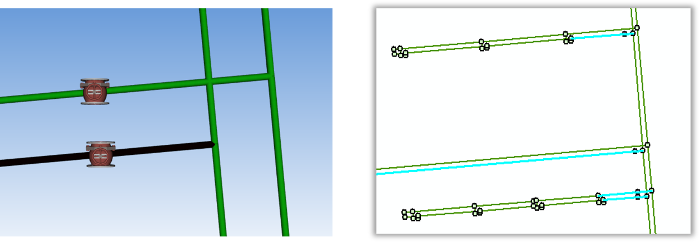

Python中使用三重引号，就不用考虑里面的转译符，直接可以按照自己的设计得出自己想要的结果。上面图片描述的问题在于，管线没有在应该断开的地方（如热力阀门）断开，从而导致该处的模型绘制不正确；龙哥指点确认这种问题为原始数据的错误，我们无需处理。

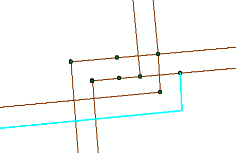

原始数据中还有如图所示的折线中的折点数据未能在管点数据中进行体现的问题，由于ArcPy中没有提供折线折点查找的方法，所以这种问题处理起来比较麻烦，由于发现的类似问题不多，暂时考虑人工进行处理。

.. _header-n116:

四个删除步骤
^^^^^^^^^^^^

**首先**\ ，对管点数据创建邻接关系表，设置参数为：

.. code:: python

    arcpy.GenerateNearTable_analysis(
        input_features,
        input_features,
        out_table,
        search_radius=0.01,  # Make some error tolerance
        closest='ALL', closest_count= 50)

| **第二**\ ，在邻接表中创建字段\ ``[IN_FSW]``\ 和\ ``[NEAR_FSW]``\ ，并对邻接关系表建立连接，用\ ``[IN_FID]``\ 和\ ``[NEAR_FID]``\ 字段分别连接到管点数据的\ ``[OBJECTID]``\ 字段；
| **第三**\ ，利用计算字段工具分别将\ ``[附属物]``\ 字段赋值给创建字段的\ ``[IN_FSW]``\ 和\ ``[NEAR_FSW]``\ ；
| **第四**\ ，调用ArcPy编写的脚本工具，删除重复的管点数据。

| 删除重复数据的原则为：
| （1）若\ ``#1``\ 和\ ``#2``\ 元素均为“探测点”，则删除\ ``#2``\ 元素；
| （2）若\ ``#1``\ 为“探测点”，\ ``#2``\ 为其他附属物，则删除\ ``#1``\ 元素；
| （3）若\ ``#1``\ 和\ ``#2``\ 均为其他附属物，则删除\ ``#2``\ 元素；
| （4）若\ ``#1``\ 为其他附属物，\ ``#2``\ 为“探测点”，则删除\ ``#2``\ 元素；
| （5）若\ ``#1``\ 元素在当前记录中删除且其仍有其他为其他附属的点存在，则应删除这些点。

目前在能源集团管线处理项目中，未删除重复点时的管点数据有546582条，删除重复点后的管线数据有395055条，需要处理的直线线段共有401078条。

   脚本运行结果：

   .. code:: makefile

      正在运行脚本 删除重复管点要素...
      Step 1: Creating feature layer...
           Feature layer created.
      Step 2: For each the near table.
           For each near table done.
      Step 3: Select the point that need to be delete.
           Selected done.
      Step 4: Delete the features.
           Delete done.
      Done!
      Completed script 删除重复管点要素...
      成功 在 Fri Sep 11 12:28:13 2020 (经历的时间: 49 分 0 秒)

.. _header-n125:

地下管线手动建模进度
^^^^^^^^^^^^^^^^^^^^

地下管线建模经历漫长的前期数据处理终于走到手动建模阶段了，目前的手动建模处理过程是基于SHP分块后的结果进行的，因而需要在处理中手动记录处理进程，以下为管线分块结果：

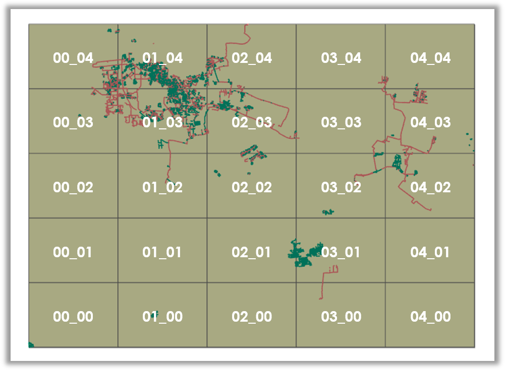

接下来对手动处理过程进行一个记录，注意此时尚未对建模后的结果进行合并处理。

   -  GDB\ *00*\ 00.mdb: 473350,4290977

   -  GDB\ *00*\ 03.mdb: 473350,4325406

   -  GDB\ *00*\ 04.mdb: 473350,4336882

   -  GDB\ *01*\ 00.mdb: 489158,4290977 不分级

   -  GDB\ *01*\ 02.mdb: 489158,4313929 不分级

   -  GDB\ *01*\ 03.mdb: 489158,4325406

   -  GDB\ *01*\ 04.mdb: 489158,4336882

   -  GDB\ *02*\ 01.mdb: 504966,4302453

   -  GDB\ *02*\ 02.mdb: 504966,4313929

   -  GDB\ *02*\ 03.mdb: 504966,4325406

   -  GDB\ *02*\ 04.mdb: 504966,4336882

   -  GDB\ *03*\ 00.mdb: 520774,4290977 不分级

   -  GDB\ *03*\ 01.mdb: 520774,4302453

   -  GDB\ *03*\ 02.mdb: 520774,4313929

   -  GDB\ *03*\ 03.mdb: 520774,4325406 不分级

   -  GDB\ *03*\ 04.mdb: 520774,4336882 不分级

   -  GDB\ *04*\ 02.mdb: 536582,4313929

   -  GDB\ *04*\ 03.mdb: 536582,4325406

   -  GDB\ *04*\ 04.mdb: 536582,4336882 不分级

以上，全部管线建模数据处理完成。其中\ :math:`col\in[0,2],row\in[3,4]`\ 区间范围内的6个文件，即GDB\ *00*\ 03.mdb、GDB\ *00*\ 04.mdb、GDB\ *01*\ 03.mdb、GDB\ *01*\ 04.mdb、GDB\ *02*\ 03.mdb、GDB\ *02*\ 04.mdb所涵盖的数据量最大，数据内容最多。

.. _header-n170:

建立管线3DTiles切片索引
~~~~~~~~~~~~~~~~~~~~~~~

Cesium与开源社区合作开发的\ **3DTiles**\ 文件格式是一个开放的用于\ **传输海量、异构三维地理空间数据集**\ 的规范。它是在正致力于成为统一三维格式标准的\ **glTF**\ 的基础上加入了分层LOD的结构后得到的产品，文件组织与二维地图中的瓦片十分相似。目前看来，由于Cesium集成了WebGL、三维球开源框架以及大数据渲染，能够满足Web端对三维地球的基本需要，二者间密不可分的联系促使3DTiles正在成为WebGL三维地球的文件标准。

   .. figure:: pic/glTF_100px_June16_150_75.png
      :align: left
      :scale: 48

   三维图形语言传输格式\ **glTF**\ 的全称为GL Transmission
   Format，由OpenGL和Vulkan背后的3D图形标准组织Khronos所定义，其目标是以适合在运行时应用程序中使用的形式定义用于表示3D内容的标准，这种跨平台格式已成为Web上的3D对象标准。然而glTF并不是”另一种文件格式“，它是3D场景\ **传输格式**\ 的定义：

   | [+] 场景结构用紧凑的JSON描述，可以很容易地解析。
   | [+]
     对象的3D数据以可以由公共图形API直接使用的形式存储，因此没有用于解码或预处理3D数据的开销。

.. _header-n176:

Architecture of 3DTiles
^^^^^^^^^^^^^^^^^^^^^^^

JSON的全称为JavaScript Object
Notation，也即JS对象简谱，是一种轻量级的、易于人阅读和编写、同时也易于机器解析和生成的数据交换格式。在3DTiles文件标准下，Cesium将以一个JSON格式的主TileSet瓦片集文件作为程序入口点去组织某一区域的其他Tiles瓦片文件。这里以一份官网提供的主TileSet样本JSON文件为例，其JSON文件及其相应的结构树如下图所示：

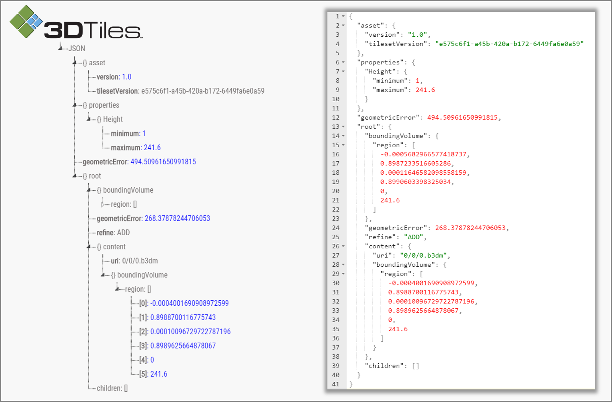

如上图所示，TileSet文件的根节点下挂了四个顶层属性节点：\ **asset**\ 节点、\ **properties**\ 节点、\ **geometricError**\ 节点以及\ **root**\ 节点，通常可以理解为TileSet的资源节点、配置节点、几何误差节点瓦片集根节点。上图所示的根节点下的root属性节点就是一个3DTiles文件标准下的Tiles瓦片。

-  **TileSet的节点及其属性**

   -  | **asset**
      | 资源节点对象主要负责配置整个瓦片集的\ **元数据**\ ，一般主要包含指定3DTiles版本的\ *version*\ 属性和其他有助于具体应用的和具体程序相关的程序版本等一系列属性。

   -  | **properties** [可选节点]
      | 配置节点对象主要负责存储一些和瓦片集\ **整体相关的数据**\ ，一般存储某一个瓦片属性的最大值和最小值，比如存储该瓦片集对应区域内的建筑物高度的最大值和最小值。

   -  | **geometricError**
      | 几何误差节点对象和接下来的root节点对象是整个TileSet文件的核心内容，几何误差节点是3DTiles文件中控制\ **多细节层次调度**\ 的关键，在TileSet和Tile中都存有这一属性，简而言之其目的为于某一恰当的视觉误差阈值范围内加载渲染所需要的模型数据。

   -  | **root**
      | 瓦片集根节点本质上就是一个\ **瓦片**\ ，这个瓦片中存储了对整个区域范围内的瓦片数据的调用，这一点和传统的Open
        Scene Graph中通过Group节点建立的场景根节点的操作类似。

一个TileSet的根节点下面可能挂载着若干个Tile文件，这些具有更加具体的配置的Tile文件就是上面所说的瓦片。了解文件入口处TileSet的相关内容之后，接下来可以通过一张图来了解3DTiles中Tile文件的数据结构。

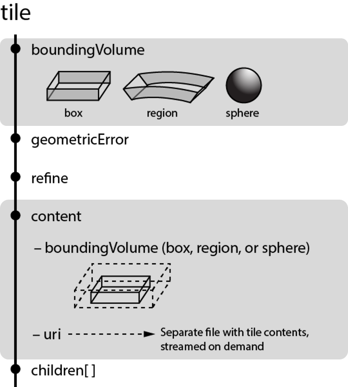

一个瓦片下共有五个通用的属性节点：\ **boundingVolume**\ 节点、\ **geometricError**\ 节点、\ **refine**\ 节点、\ **content**\ 节点以及\ **children**\ 节点，可理解为包围体节点、几何误差节点、细化方式节点、内容节点以及瓦片子节点；如果需要对模型进行变换的话还有一个\ **transform**\ 节点，也即空间变换节点可用。

-  **Tile的节点及属性**

   -  **boundingVolume**
      包围体；包括OBB包围盒\ **box**\ ，AABB包围盒\ **region**\ 和包围球\ **sphere**\ 三种。

   -  **geometricError**
      几何误差；同TileSet中的几何误差一样，用视觉误差阈值来确定瓦片切换的层级。

   -  **refine** 细化方式；Refinement
      Strategy，包含直接添加\ **ADD**\ 和间接替换\ **REPLACE**\ 两种方式。

   -  **content**
      内容节点；用来指向Tile实际渲染的数据内容；其\ *content.uri*\ 属性可以指向二进制模型文件或另一个TileSet；\ *content.boundingVolume*\ 属性用来所指向描述渲染内容的包围体，不同于Tile的包围体，在这里定义的包围体始终紧密包围渲染模型，当包围体不在视锥体内时，通过视锥体裁剪使该模型不被渲染；该属性未定义时系统将动计算。

   -  **children**
      瓦片子节点；该节点的存在使得所有的瓦片节点能够以一种树型结构来进行存储。

   -  **transform**
      空间变换节点；该属性节点未定义时默认为一个\ :math:`4\times4`\ 的单位矩阵，该矩阵控制\ *tile.content*\ 、\ *tile.boudingVolume*\ 以及\ *tile.viewerRequestVolume*\ 的空间变换，其空间变换是从上自下的多个变换的一个级联变换的过程。

.. _header-n211:

Concepts of 3DTiles
^^^^^^^^^^^^^^^^^^^

在3DTiles的TileSet文件结构和Tile文件结构中有几个十分重要的属性节点，其包括：\ **geometricError**\ 几何误差节点、\ **boundingVolumn**\ 包围体节点、\ **children**\ 瓦片子节点等；这些属性节点的定义、使用和相互影响将是这一节所介绍内容的核心。

-  **Geometric Error 几何误差**

3DTiles所设定的分层瓦片结构自然而然地使LOD变化为分层LOD，也即HLOD，Hierarchical
Level of
Detail。其特点在于顶层瓦片以粗粒度细节对可渲染内容进行显示，而底层瓦片则包含了更多的细粒度模型细节，由此在渲染进行时根据性能和渲染质量动态地选择程序所需要的细节层次。

Geometric
Error作为一个量化瓦片及瓦片集的\ **表现几何和理想几何之间的差异**\ 的属性量，是在3DTiles结构中实现这种动态调度的唯一可用依据。TileSet中的\ **geometriError**\ 决定了root节点是否被渲染，而在Tile中这一同名属性决定了瓦片中的children节点是否应该被渲染。

实际上，最终在渲染层面上决定到底该渲染哪一级瓦片的是最大屏幕空间误差，也即Maximum
Screen Space
Error（SSE）。Cesium中的SSE由几何误差、相机状态有关的各项参数计算而来，

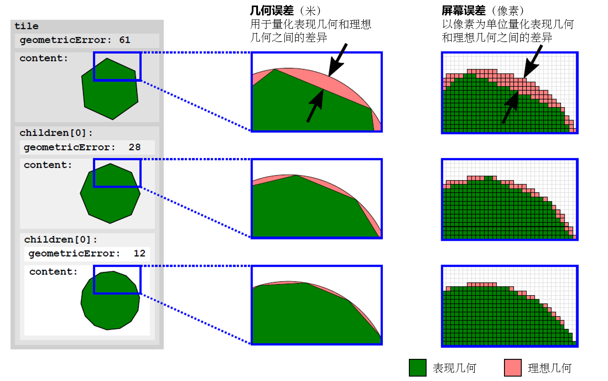

为了更好的研究3DTiles文件，似乎还是得先从Cesium开始着手研究。Cesium是一个用于显示三维地球和地图的开源Java
Script库，它可以用来显示海量三维模型数据、影像数据、地形高程数据、矢量数据等等。三维模型格式支持glTF、三维瓦片模型格式支持3DTiles；矢量数据支持geojson、topojson格式；影像数据支持wmts等；高程支持STK格式。

.. _header-n222:

参考文献
~~~~~~~~

1.  ArcGIS
    Desktop.\ `近邻分析 <https://desktop.arcgis.com/zh-cn/arcmap/10.5/tools/analysis-toolbox/near.htm>`__\ [EB/OL].

2.  ArcGIS
    Desktop.\ `生成近邻表 <https://desktop.arcgis.com/zh-cn/arcmap/10.5/tools/analysis-toolbox/generate-near-table.htm>`__\ [EB/OL].

3.  ArcGIS
    Pro.\ `Table <https://pro.arcgis.com/zh-cn/pro-app/arcpy/mapping/table-class.htm>`__\ [EB/OL].

4.  CSDN博客.\ `gltf教程系列-基于WebGL的glTF简介（一） <https://blog.csdn.net/xiaowanzi29/article/details/84579617>`__\ [EB/OL].

5.  MeteorChenBo.\ `glTF格式介绍——目录 <https://blog.csdn.net/qq_31709249/article/details/86477520>`__\ [EB/OL].

6.  MeteorChenBo.\ `3DTiles格式介绍——目录 <https://blog.csdn.net/qq_31709249/article/details/102643371>`__\ [EB/OL].

7.  简书.\ `Cesium入门10 - 3D
    Tiles <https://www.jianshu.com/p/36f698a5338b>`__\ [EB/OL].

8.  知乎.\ `Cesium资料大全 <https://zhuanlan.zhihu.com/p/34217817>`__\ [EB/OL].

9.  秋意正寒.\ `3dTiles
    几何误差详解 <https://www.cnblogs.com/onsummer/p/13357226.html>`__\ [EB/OL].

10. 查获工具网站.\ `转换json格式为C#类 <http://json2csharp.chahuo.com/>`__\ [EB/OL].

11. shehzan10. `3D Tiles
    Overview <https://github.com/CesiumGS/3d-tiles/blob/master/3d-tiles-overview.pdf>`__\ [EB/OL].

12. Uber Engineering.\ `Taking City Visualization into the Third
    Dimension with Point Clouds, 3D Tiles, and
    deck.gl <https://eng.uber.com/3d-tiles-loadersgl/>`__\ [EB/OL].

.. _header-n249:

Q3 基于数字表面模型重构的实景模型顶点简化
-----------------------------------------

经历了将近四个星期的管线建模旅程，地下管线建模之旅终于可以宣布告一段落了。接下来继续上个月未完成的顶点简化分步走战略之第一步，即基于数字表面模型重构的实景模型顶点简化。回顾一下之前所做的工作，目前已完成了对瓦片文件夹中的平面欧式坐标的线性四叉树编码以及模型坐标系下的模型包围框的计算。

| **S01**
  根据线性四叉树编码确定金字塔层级中的某一级中的某一个编码空间所覆盖的瓦片文件夹；
| **S02** 通过瓦片文件夹读取该瓦片文件夹目录下的瓦片数据并计算其包围盒；

.. _header-n252:

[0918]布尔运算
~~~~~~~~~~~~~~

建立四叉树索引并计算包围盒的目的是从生成的DSM模型中根据坐标找到与之相应的地理范围及边界，但是根据OSG的BoundingBox所计算出来的包围盒并不是最佳外围轮廓，如下图所示；我们可以理解它这么做的道理，可这种边界显然不能满足下一步界定地理范围并执行DSM模型生成的需要。

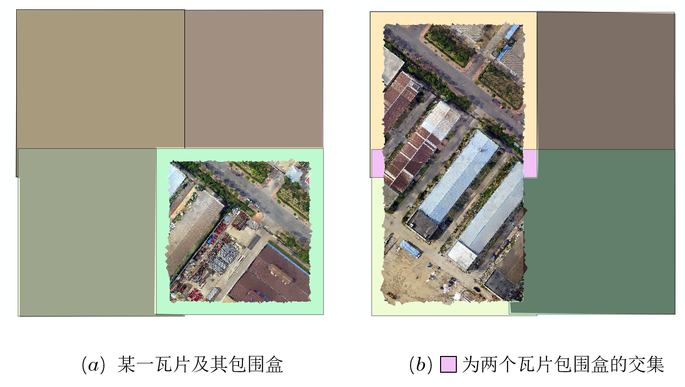

为了解决这一问题，有两个步骤：

| **a、**\ 通过排序选出XY方向的最大最小值，确立最大外围包络矩形，以此作为寻找地理边界的依据；
| **b\ 、**\ 从四叉树包围盒层级中找到下一相邻的包围盒组合计算包络矩形，用布尔运算剪除重叠区域。

显然，图中所示的瓦片包围盒之间的差异并不大，在\ :math:`L_2\to L_1`\ 这种4个包围盒合成一个包围盒的向上采样的过程中并不需要执行十分严密的多边形生成，坐标的微小差异并不影响视觉观感。但相邻的\ :math:`L_1`\ 层级的包围盒就必须进行下一步处理了，同一层级的地理范围若有重叠将会引起建模时的模型重叠现象从而干扰正常的显示效果。

.. _header-n258:

Bentley-Ottmann Algorithm
^^^^^^^^^^^^^^^^^^^^^^^^^

利用扫描线算法求多条线段集合之间的交点。

1. 算法输入线段集合\ :math:`{\bf\Omega}=\{{\bf L}_i\}`\ ，并要求输出各线段间的交点集合\ :math:`{\bf\Lambda}=\{{I}_i\}`\ 。

2. 定义扫描线Sweep
   Line及其附属数据结构\ :math:`\bf SL`\ 来存储扫描信息。

   -  扫描到线段左端点时将该线段加入数据结构\ :math:`\bf SL`\ 中，遇到线段右端点时将该线段弹出；

   -  维护线段列表使其数据有序，应从两个方面着力：一令插入有序，二遇相交置换。

3. 定义端点事件队列Event
   Queue及其数据结构\ :math:`\bf EQ`\ 来实现对线段列表的维护。

   -  事件队列初始化为有序的线段端点列表；

   -  线段相交点要加入\ :math:`\bf EQ`\ 列表中，处理完一个事件后将事件从队列中删除。

其伪代码如下：

.. code:: pseudocode

   /*SweepLine Algorithm*/
   Lambda* Bentley-Ottmann(Segments* Omega)
   {
       Initialize event queue EQ = all segment endpoints;
       Sort EQ by increasing x and y;
       Initialize sweep line SL to be empty;
       Initialize output intersection list IL to be empty;

       While (EQ is nonempty) {
           Let E = the next event from EQ;
           If (E is a left endpoint) {
               Let segE = E's segment;
               Add segE to SL;
               Let segA = the segment Above segE in SL;
               Let segB = the segment Below segE in SL;
               If (I = Intersect( segE with segA) exists)
                   Insert I into EQ;
               If (I = Intersect( segE with segB) exists)
                   Insert I into EQ;
           }
           Else If (E is a right endpoint) {
               Let segE = E's segment;
               Let segA = the segment Above segE in SL;
               Let segB = the segment Below segE in SL;
               Delete segE from SL;
               If (I = Intersect( segA with segB) exists)
                   If (I is not in EQ already)
                       Insert I into EQ;
           }
           Else {  // E is an intersection event
               Add E’s intersect point to the output list IL;
               Let segE1 above segE2 be E's intersecting segments in SL;
               Swap their positions so that segE2 is now above segE1;
               Let segA = the segment above segE2 in SL;
               Let segB = the segment below segE1 in SL;
               If (I = Intersect(segE2 with segA) exists)
                   If (I is not in EQ already)
                       Insert I into EQ;
               If (I = Intersect(segE1 with segB) exists)
                   If (I is not in EQ already)
                       Insert I into EQ;
           }
           remove E from EQ;
       }
       return IL;
   }

.. _header-n279:

[0922]简易轴平行矩形合并算法
~~~~~~~~~~~~~~~~~~~~~~~~~~~~

为了解决现在的问题，接续几个参考文献中关于布尔运算和Picture问题的求解思路，沿用两个重要工具：扫描线法、线段树结构。从福建师大附中陈宏在论文中提出的\ **“超元线段”**\ 这一概念出发，可以设计一个简易版的平行矩形合并算法，但这种合并很难解决以下两个问题：

| **Q1**
  矩形合并成多边形\ :math:`A`\ 之后，该多边形与接下来生成的多边形\ :math:`B`\ 之间的合并问题；
| **Q2**
  下一步骤中生成的多边形\ :math:`B`\ 如何剪除其与多边形\ :math:`A`\ 的相交区域\ :math:`\{P=A\cap B\}`\ 的问题。

所以目前的犹豫点在于，是接着拓展这种简易的思想？还是深入研究多边形布尔运算的论文，通过问题更加高维的方法来解决目前的困境？一或者二，这是个问题，先来尝试第一种方法好了。

[ **算例** ]
如下图所示的三个矩形\ :math:`\Box ABCD`\ ，\ :math:`\Box EFGH`\ 以及\ :math:`\Box IJKL`\ ，取左下角点和右上角点作为矩形的描述参量，并取左下角点符号作为矩形标识符则有\ :math:`{\color{ForestGreen}\Box A}=\{P_A(0,0),P_C(8,10)\}`\ ，\ :math:`{\color{Brown}\Box E}=\{P_E(-4,-4),P_G(3,8)\}`\ ，\ :math:`{\color{Magenta}\Box I}=\{P_I(-6,-2),P_K(10,2)\}`\ ；将\ :math:`{\color{ForestGreen}\Box A}`\ 与\ :math:`{\color{Brown}\Box E}`\ 的交点设为\ :math:`M,N`\ ，将\ :math:`{\color{ForestGreen}\Box A}`\ 与\ :math:`{\color{Magenta}\Box I}`\ 的交点设为\ :math:`O,P`\ 。

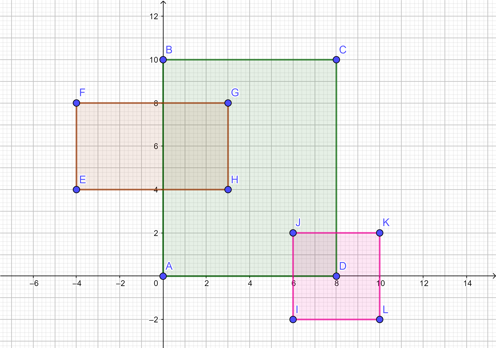

发现自己写好难哦呜呜呜，发现了两个计算几何的库CGAL（Computational
Geometry Algorithms Library, 计算几何算法库）和GEOS（Geometry Engine –
Open Source,
几何引擎—开源），目前来看，CGAL库的受众更广一些，所以相关的参考资料也多一点，而GEOS入门较费劲，但GDAL库中对其进行了引用。GDAL库中有一个几何类库名OGRGeometry中有求交、求并的函数，利用该库可以得到如下合并结果。

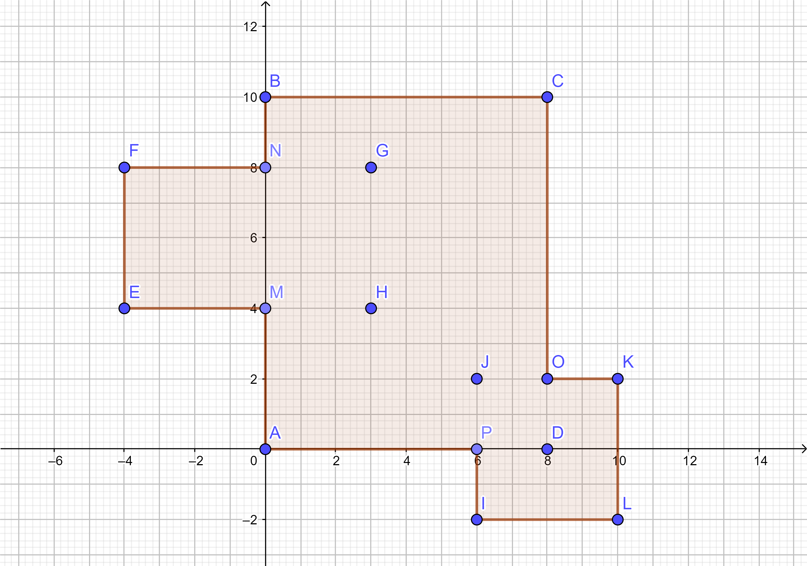

用到的一些GDAL的类和方法主要有注册函数\ ``GDALAllRegister();``\ ，\ ``OGRRegisterAll();``\ ，OpengGIS拓展类\ ``OGRGeometry``\ 、\ ``OGRPolygon``\ 、\ ``OGRLinearRing``\ 以及\ ``OGRPoint``\ 。这些拓展类及其包括相交、联合和剪除在内的布尔运算操作均需要依赖GEOS库。

.. _header-n288:

[0925]GDAL库支持的矢量文件格式
~~~~~~~~~~~~~~~~~~~~~~~~~~~~~~

由于在\ ``(GDALDriver*)GDALGetDriverByName(pszFormat)``\ 函数中完全不知道\ ``pszFormat``\ 变量到底怎么设置，所以
求助百度并在博客\ `GDAL中文件的驱动及对应的文件格式 <https://www.cnblogs.com/abella/p/9596211.html>`__\ 一文中找到了如下内容：

.. code:: c++

   char *pszFileSName[]={ 
       "VRT",//: Virtual Raster 
   	"GTiff",//: GeoTIFF 
   	"NITF",//: National Imagery Transmission Format 
   	"HFA",//: Erdas Imagine Images (.img) 
   	"ELAS",//: ELAS 
   	"AAIGrid",//: Arc/Info ASCII Grid 
   	"DTED",//: DTED Elevation Raster 
   	"PNG",//: Portable Network Graphics 
   	"JPEG",//: JPEG JFIF 
   	"MEM",//: In Memory Raster 
   	"GIF",//: Graphics Interchange Format (.gif) 
   	"BSB",//: Maptech BSB Nautical Charts 
   	"XPM",//: X11 PixMap Format 
   	"BMP",//: MS Windows Device Independent Bitmap 
   	"PCIDSK",//: PCIDSK Database File 
   	"HDF4Image",//: HDF4 Dataset 
   	"PNM",//: Portable Pixmap Format (netpbm) 
   	"ENVI",//: ENVI .hdr Labelled 
   	"EHdr",//: ESRI .hdr Labelled 
   	"PAux",//: PCI .aux Labelled 
   	"MFF",//: Atlantis MFF Raster 
   	"MFF2",//: Atlantis MFF2 (HKV) Raster 
   	"BT",//: VTP .bt (Binary Terrain) 1.3 Format 
   	"FIT",//: FIT Image 
   	"OTHER"
   }; //获得文件类型并创建GDAL驱动

.. _header-n291:

[0927]OSG创建大坐标模型产生的抖动问题
~~~~~~~~~~~~~~~~~~~~~~~~~~~~~~~~~~~~~

该问题最早是在邹煚师兄的指点下了解到的，当时在用osgEarth中的\ ``getMapSRS()->transformToWorld()``\ 函数将地理坐标转换为世界坐标并在OSG中进行绘制时首先要对所有的顶点进行一个偏移，减去大坐标值使得顶点坐标值落在一个较小的区间内，从而避免抖动问题。相关的代码如下：

.. code:: c++

   /* 顶点坐标偏移量. */
   osg::Vec3d noshaking(2267680.0, -5009402.0, -3220986.0);
   /* 创建顶点坐标数组并执行顶点坐标偏移. */
   osg::ref_ptr<osg::Vec3Array> vertexCoords = new osg::Vec3Array;
   vertexCoords->push_back(worldLT + noshaking);
   /* 绘制几何. */
   osg::ref_ptr<osg::Geometry> geom = new osg::Geometry;
   geom->setVertexArray(vertexCoords);
   /* 创建叶节点. */
   osg::ref_ptr<osg::Geode> terrain = new osg::Geode;
   terrain->addChild(geom);
   /* 将节点还原到正确的位置. */
   osg::ref_ptr<osg::MatrixTransform> pTerrainTransNode = new osg::MatrixTransform;
   pTerrainTransNode->setMatrix(osg::Matrix::translate(-noshaking));
   pTerrainTransNode->addChild(terrain);

目前推测，这种坐标偏移问题实际上与double或者float小数点尾数精度有关，当存储较大的坐标值时，浮点数的小数点后的尾数精度会受到限制，从而在3D
Max中产生模型绘不准问题，而在OSG中则体现为切换视角时模型产生的鬼畜抖动问题，如下图所示。

对于OSG中的osg::HeightField而言，可以较为方便地控制其顶点坐标绘制的函数为\ ``setOrigin()``\ 设置起始点地理坐标函数。通过设置\ ``Point<double> noshaking = rect.P1()-_geograph_offset;``\ 可以达到与上面代码相同的效果，这里的\ ``_geograph_offset``\ 为实景三维模型瓦片的地理偏移。

.. _header-n297:

[0928]线性四叉树编码索引
~~~~~~~~~~~~~~~~~~~~~~~~

如下图所示，建立四叉树索引时需要考虑其在地理空间中的瓦片层级以及该层级在平面空间中所包含的瓦片网格数目的多少；以下图为例，左图为L3层级金字塔所对应的网格划分，该层级共包含\ :math:`8^2=64`\ 个瓦片网格，每个瓦片网格中最多含有\ :math:`8^2=64`\ 个0级初始瓦片。

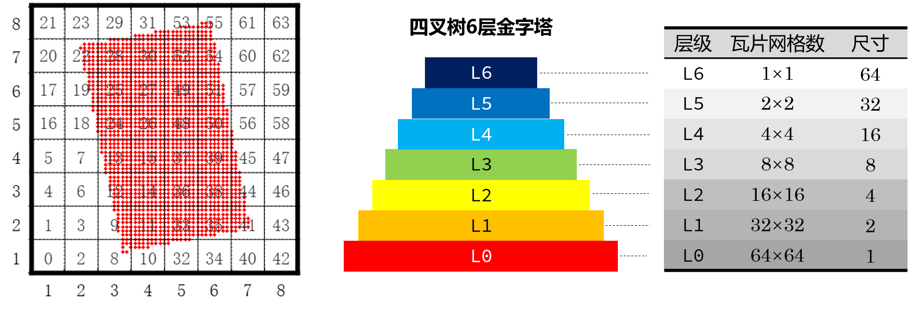

根据L3层生成的位于L3文件夹下以对应区域的Morton码命名的文件，可以向上查找其上层文件所对应的Morton码并通过该码来搜寻L4层该码对应区域的L3的文件，并以此来构建我们所需要的四叉树。其步骤如下：

| **a**.
  遍历L2文件夹下的所有文件名，计算其上层Morton码并以此为Key值放入哈希表中；
| **b**.
  通过遍历哈希表某一键值下存储的链表找到该键值对应区域的相关文件。

.. _header-n302:

[0930]OSGB文件过大致使顶层加载缓慢
~~~~~~~~~~~~~~~~~~~~~~~~~~~~~~~~~~

在PagedLOD的RangeList中，设置每一层的精细模型部分时都应该从0开始，不然会出BUG，就是模型缩放明显缩放到这个区域应该显示模型了却没有显示，如下图所示。

经龙哥提醒，*.osgb文件格式过大的原因有几种，其中之一即为原始图像过大，可以对其纹理进行压缩，这种压缩可以从两方面考量，一是在从DOM中裁剪出纹理图像时即对图像进行一些相关的压缩，二是在进行文件保存时通过设置osgDB::ReaderWriter::Option中的Compressor=zlib来进行压缩，需要时WriteImageHint=IncludeData
可对其进行辅助。设置样例如下：

   博客园\ *酷熊*\ 的博客中提到一种纹理压缩方式：

   .. code:: c++

      osg::ref_ptr<osgDB::ReaderWriter::Options> options;
      options = new osgDB::ReaderWriter::Options;
      options->setOptionString("Compressor=zlib"); // 设置压缩
      osgDB::writeNodeFile(*(node.get()), osgb_path, options);

当然，也可以在生成裁剪影像时对裁剪影像的像素做一个处理，降低图像的像素个数；当当然，还可以在生成高度场的时候减少其顶点个数。

.. _header-n310:

参考文献
~~~~~~~~

1.  博客园.\ `判断两个矩形相交以及求出相交的区域 <https://www.cnblogs.com/zhoug2020/p/7451340.html>`__\ [EB/OL].

2.  geomalgorithms.\ `Intersections for a Set of
    Segments <http://geomalgorithms.com/a09-_intersect-3.html>`__\ [EB/OL].

3.  Openinx
    Blog.\ `平面扫描思想在ACM竞赛中的应用 <http://openinx.github.io/2013/01/01/plane-sweep-thinking/>`__\ [EB/OL].

4.  CSDN博客.\ `扫描线算法 <https://blog.csdn.net/a_forever_dream/article/details/89310818>`__\ [EB/OL].

5.  陈宏.\ `数据结构的选择与算法效率(从IOI98试题PICTURE谈起) <http://www.doc88.com/p-71174499914.html>`__\ [EB/OL].

6.  网格模型处理软件.\ `MeshLab <https://www.meshlab.net/>`__\ [EB/OL].

7.  StarryThrone.\ `数据结构和算法(上) <https://www.jianshu.com/p/712b83987cf1>`__\ [EB/OL].

8.  专职跑龙套.\ `Segment Tree 线段树
    原理及实现 <https://www.jianshu.com/p/91f2c503e62f>`__\ [EB/OL].

9.  灰信网.\ `CGAL和GEOS计算几何算法库 <https://www.freesion.com/article/47271023281/>`__\ [EB/OL].

10. CGAL.\ `Triangulated Surface Mesh
    Simplification <https://doc.cgal.org/latest/Surface_mesh_simplification/index.html>`__\ [EB/OL].//Mesh格网简化.

11. GitHub.\ `AVCD <https://github.com/valette/ACVD>`__\ [EB/OL].//Mesh格网简化.

12. GitHub.\ `Seam-aware
    Decimater <https://github.com/songrun/SeamAwareDecimater>`__\ [EB/OL].//Mesh格网简化.

13. GitHub.\ `mesh-simplify <https://github.com/ataber/mesh-simplify>`__\ [EB/OL].
    //Mesh格网简化.

14. 博客园.\ `osgb文件过大，可以通过Compressor=zlib对纹理进行压缩 <https://www.cnblogs.com/coolbear/p/11102430.html>`__\ [EB/OL].

参考文献[10-13]为2020-09-29上午在Google搜索中搜索Mesh
Simplify找到的一些较知名的格网简化开源库。
