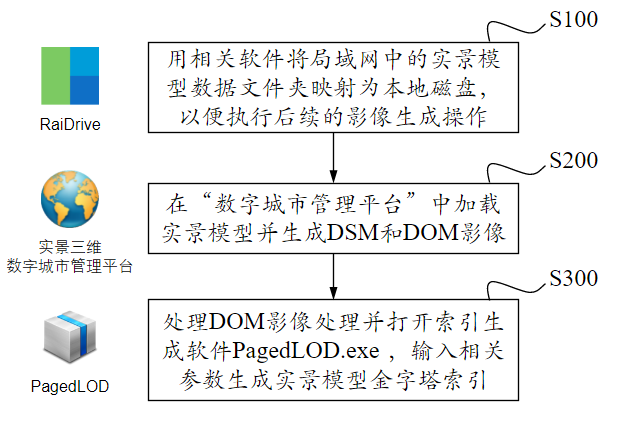

.. _header-n0:

Question List in October, 2020
==============================

🌊 I love ocean because the immutable wave and the Zima blue.

如来所说法，皆不可取、不可说、非法、非非法。所以者何？一切贤圣，皆以无为法而有差别。

本月的任务主要是利用四叉树索引重建实景模型的顶层索引，上月还没有解决的问题有：顶层重建模型的纹理图片较大、重建顶层后某些层级的瓦片切换会出现空缺现象。

.. _header-n5:

Q1、重建顶层的存储显示优化
--------------------------

.. _header-n6:

利用RasterIO降采样
~~~~~~~~~~~~~~~~~~

利用GDAL的图像大小调整函数，即可对纹理图片进行相应层级的压缩，以此来实现类似于构建图像金字塔的操作，这样一来即可减少纹理在最终生成的*.osgb文件中的内存占比了。

GDAL中\ ``GDALRasterBand``\ 类下的\ ``RasterIO()``\ 函数可实现的功能很多，其包含11个参数：

-  | ``eRWFlag``
   | 栅格图像读写指示符，由GF\ *Read指定读取或由GF*\ Write指定写入图像数据；

-  | ``nXOff,nYOff,nXSize,nYSize``
   | 在栅格图像内存中依据左上角坐标、图像宽和图像高所指定的矩形窗口读写图像数据；

-  | ``pData``
   | 指向图像数据内存区域的指针，该内存中存储的数据究竟为什么类型可以由\ ``eBufType``\ 来指定，其可能为GDT\ *Float32或GDT*\ Byte等，当其与原始类型不同时将自动进行相应的转换；

-  | ``nBufXSize,nBufYSize``
   | 这两个参数描述了图像读/写缓冲区的大小，当载入完整分辨率的影像时该参数与上面的矩形窗口的大小应当一致，而执行下采样（\ *subsampled*\ ）操作时该参数大小应小于上面的矩形窗口；

-  | ``nPixelSpace,nLineSpace``
   | 该参数通常为0，用于执行对图像内存的访问控制，设定非0时可用于向图像内存中交叉读取/写入其他像素值来满足某些特定的图像读写需求。

与之类似的还有\ ``GDALDataset::RaseterIO()``\ 函数，该函数较之\ ``GDALRasterBand::RasterIO()``\ 函数多了3个波段控制参数，即\ ``nBandCoun,panBandMap,nBandSpace``\ 参数。其函数原型如下：

.. code:: c++

   CPLErr GDALDataset::RasterIO(
       GDALRWFlag   eRWflag,    // GF_Read 或 GF_Write 读或写，这里只说 读数据
       int          nDSXOff,    // 读取区域的起始列号
       int          nDSYOff,    // 读取区域的起始行号
       int          nDSXSize,   // 读取区域的宽
       int          nDSYSize,   // 读取区域的高
       void*        pBuffer,    // 目标缓存指针
       int          nBXSize,    // 目标缓存的宽
       int          nBYSize,    // 目标缓存的高
       GDALDataType eBDataType, // 目标缓存的数据类型
       int          nBandCount, // 需要读取的波段数
       int*         panBandMap, // 波段序列，可以定义波段读取顺序
       GSpacing     nPixelSpace,// 一个波段中的数据在pBuffer中的列间隔
       GSpacing     nLineSpace, // 一个波段中的数据在pBuffer中的行间隔
       GSpacing     nBandSpace  // 波段之间的在pBuffer中的间隔
   )

对于N个波段的GDT\ *Byte数据集(N>=nBandCount)，GDT*\ Byte对应于C++中的\ ``unsigned char``\ 类型。假设原始图像波段数为4，定义一个目标缓存来存储源数据集中的一块数据：

.. code:: c++

   unsigned char* pBuffer = new unsigned char[nBXSize*nBYSize*nBandCount];

令\ ``nBandCount=3``\ ，读其中的2,3,4波段的数据到\ ``pBuffer``\ 中，并使得读取顺序为4,3,2；由于GDAL中波段编号从1开始，故可以定义：

.. code:: c++

   int panBandMap[] = {4,3,2};

假设第4个波段为R, 第3个波段为G,
第2个波段为B，则可通过设置\ ``nPixelSpace``\ 、\ ``nLineSpace``\ 以及波段间隔参数\ ``nBandSpace``\ 来实现默认读取或波段交叉读取，详细内容可参照参考文献[1]中的内容。

.. _header-n28:

仿射地理坐标变换
~~~~~~~~~~~~~~~~

仿射变换六个参数可以用\ ``GDALDataset::GetGeoTransform()``\ 获取到一个\ ``double[6]``\ 的数组中，令序号为该数组的下标则有：

|  **0** 图像左上角的X坐标；
|  **1** 图像横向（东西方向）的分辨率；
|  **2** 旋转角度，如果图像北方朝上，该值为0；
|  **3** 图像左上角的Y坐标；
|  **4** 旋转角度，如果图像北方朝上，该值为0；
|  **5** 图像纵向（南北方向）的分辨率。

令\ :math:`(x,y)`\ 为图像像素坐标，\ :math:`(X,Y)`\ 为对应的地理坐标，\ :math:`G`\ 为放射变换数组参数，由此则有：

.. math::

   \begin{pmatrix}X\\Y\end{pmatrix}=\begin{pmatrix}G_0\\G_3\end{pmatrix}
   +\begin{pmatrix}G_1&G_2\\G_4&G_5\end{pmatrix}\cdot\begin{pmatrix}x\\y\end{pmatrix}

对于图像北方朝上的情况，有上述公式简化为：

.. math::

   \begin{pmatrix}X\\Y\end{pmatrix}=\begin{pmatrix}G_0\\G_3\end{pmatrix}
   +\begin{pmatrix}G_1&0\\0&G_5\end{pmatrix}\cdot\begin{pmatrix}x\\y\end{pmatrix}

已知地理坐标\ :math:`(X,Y)`\ 反求图像坐标\ :math:`(x,y)`\ ，则有公式：

.. math::

   \begin{pmatrix}x\\y\end{pmatrix}=
   \begin{pmatrix}(X-G_0)/G_1\\(Y-G_3)/G_5\end{pmatrix}

通过以上对图像尺寸的调整，整个重建顶层的文件加起来共52MB，而图像未调整时的重建顶层文件加起来的大小共980MB，压缩率达到94.69MB，三维模型加载效率显著提升。

.. _header-n38:

视角切换时的瓦片空缺
~~~~~~~~~~~~~~~~~~~~

这种切换视角时由于距离设置不当导致顶层瓦片消失了而某些底层瓦片仍未显示的现象可以归纳为瓦片空缺现象，该问题的直观表现如下图所示：

视角切换时的侧视图如下，但该图实际上看不出啥太大问题。问题应该出现在俯视图上，中午回来再看看俯视图分析能不能找到对应的问题。

回来啦。从下面的俯视图角度来看，似乎问题可以通过修改RangeList的半径来进行解决，但是事实上修正了这个半径之后还是会存在瓦片缺失的问题，是一个治标不治本的解决策略。

那么问题究竟出现在哪里呢？目前看来，这个问题始终存在，只不过随着半径的增大，加载到内存中的数据逐渐增多，从而使得瓦片缺失现象越来越不明显；但这种策略会降低模型的加载速度，并不是一种长效模型加载机制。暂时能够提出的一种解决方案是：通过设定参数，使得最上层的粗糙模型无论从哪里开始都始终加载；实践证明该方案不正确，会存在模型覆盖现象。

龙哥真的流批！！！果然是因为设置PagedLOD的RangeList时，每一个节点的覆盖范围都应该落在区间\ :math:`[0,+\infty]`\ 范围内，当前节点只需要计算一个精模切换阈值\ :math:`r`\ 即可，如下所示：

.. math::

   L_3=\left\{\begin{array}{ll}R_0 &[r_3,+\infty]\\R_1 &[0,r_3]\end{array}\right.\quad\quad
   L_5=\left\{\begin{array}{ll}R_0 &[r_5,+\infty]\\R_1 &[0,r_5]\end{array}\right.\quad\quad
   L_6=\left\{\begin{array}{ll}R_0 &[r_6,+\infty]\\R_1 &[0,r_6]\end{array}\right.

以上三个公式分别表示\ :math:`L_i`\ 层PagedLOD节点的RangeList取值范围；\ :math:`R_j`\ 表示RangeList中的第\ :math:`j`\ 个列表，一般取\ :math:`j\in[0,1]`\ ；\ :math:`r_i`\ 表达\ :math:`L_i`\ 层的精模切换阈值，大于该值时显示模型，小于该值时切换文件加载。

.. _header-n49:

OSG中的三维重建
~~~~~~~~~~~~~~~

在OSG中，根据地形图进行三维重建主要有两种方式：\ **生成地形高程格网**\ 以及\ **生成狄洛尼三角网**\ ，分别对应OSG中的\ ``osg::HeightField``\ 类和\ ``osgUtil::DelaunayTriangulator``\ 类。

.. _header-n51:

osg::HeightField
^^^^^^^^^^^^^^^^

生成地形格网的操作比较便捷，只需用\ ``allocate``\ 申请HeightField空间，并设置起始点\ ``Origin``\ 、XY方向地理间距\ ``Interval``\ 、裙边高度\ ``SkirtHeight``\ 等几个参数并传入高程数据即可。示例代码如下：

.. code:: c++

   //1st 创建高程格网类.
   osg::ref_ptr<osg::HeightField> heightField = new osg::HeightField();
   heightField->allocate(width, height);			//申请空间
   heightField->setOrigin(originPoint);			//起始位置	
   heightField->setXInterval(xInterval);			//间距X
   heightField->setYInterval(yInterval);			//间距Y
   heightField->setSkirtHeight(skirtHeight);       //裙边高度

   //2nd 填充高程.
   heightField->setHeight(c, r, elevation);

   //3rd 创建叶节点.
   osg::ref_ptr<osg::ShapeDrawable> heightShape = new osg::ShapeDrawable(heightField);
   terrain->addDrawable(heightShape);

   //4th 为高程文件设置纹理.
   osg::ref_ptr<osg::StateSet> stateset = new osg::StateSet();
   osg::ref_ptr<osg::Image> texImage = osgDB::readImageFile(texFile);
   osg::ref_ptr<osg::Texture2D> tex = new osg::Texture2D;
   tex->setImage(texImage);
   tex->setDataVariance(osg::Object::DYNAMIC);
   stateset->setTextureAttributeAndModes(0, tex.get(), osg::StateAttribute::ON);
   terrain->setStateSet(stateset.get());

.. _header-n54:

osgUtil::DelaunayTriangulator
^^^^^^^^^^^^^^^^^^^^^^^^^^^^^

狄洛尼三角网的示例代码如下：

.. code:: c++

   // 声明三角网顶点坐标、法线向量、纹理坐标以及狄洛尼三角网
   osg::ref_ptr<osg::Vec3Array> norms = new osg::Vec3Array();
   osg::ref_ptr<osg::Vec3Array> coords = new osg::Vec3Array();
   osg::ref_ptr<osgUtil::DelaunayTriangulator> trig = new osgUtil::DelaunayTriangulator();

   // 计算三角网顶点坐标及纹理坐标
   coords->push_back(osg::Vec3d(x, y, height));
   osg::ref_ptr<osg::Vec2Array> texs = ComputeTextureCoords(*coords);

   // 为狄洛尼三角网添加顶点坐标
   trig->setInputPointArray(coords);
   trig->setOutputNormalArray(norms);
   trig->triangulate();//it will change the ordinary and maybe change the size of point

   // 创建几何体并赋予顶点坐标、纹理坐标、法线向量
   osg::ref_ptr<osg::Geometry> geometry = new osg::Geometry;
   geometry->setVertexArray(coords);
   geometry->setTexCoordArray(0, texs.get());
   geometry->addPrimitiveSet(trig->getTriangles());
   geometry->setNormalArray(trig->getOutputNormalArray());
   geometry->setNormalBinding(osg::Geometry::BIND_PER_PRIMITIVE_SET);

   // 若有颜色则赋予颜色
   if (color != nullptr) {
   	geometry->setColorArray(color);//set color
   	geometry->setColorBinding(osg::Geometry::BIND_OVERALL);
   }

   // 几何节点赋值
   terrain->addDrawable(geometry.get());

   // 为地形赋予纹理
   osg::ref_ptr<osg::StateSet> stateset = new osg::StateSet();
   osg::ref_ptr<osg::Image> texImage = osgDB::readImageFile(tex);
   osg::ref_ptr<osg::Texture2D> texture = new osg::Texture2D;
   texture->setImage(texImage);
   texture->setDataVariance(osg::Object::DYNAMIC);
   stateset->setTextureAttributeAndModes(0, texture.get(), osg::StateAttribute::ON);
   terrain->setStateSet(stateset.get());

   // use smoothing visitor to set the average normals
   osgUtil::SmoothingVisitor sv;
   sv.apply(*terrain);

目前用Delaunay三角网生成的三维模型有两个主要问题：

|  **1**
  生成顶点坐标时同步生成纹理坐标的做法是错误的，生成后二者不再是一一对应关系；
|  **2** 放入狄洛尼三角网中的顶点数据最终生成的模型会在Y方向上缺失面片。

以上两个问题亟待解决，但今天关于用狄洛尼三角网生成地形的研究就暂且放到这里，因为还有更加重要的研究任务需要处理：调整重构顶层时的存储空间调度、执行大片区模型文件的顶层重构。这个白色的边不用狄洛尼三角网生成，而是自己调整模型顶点和纹理坐标的对应，条带式纹理或自己建立三角形构建顺序即可。

.. _header-n60:

osg::Geometry
^^^^^^^^^^^^^

核心要点只有两个：🅰️自建顶点索引、🅱️根据顶点索引生成纹理坐标。解决方案按照之前接触过的邹煚师兄的代码和网上一些博主的代码，可以用条带式纹理策略，即每个条带的临接边界重复两遍，用条带来拼成模型。或者是否可以自己用代码将网格式的顶点重建索引链接。\ ``osg::Geometry``\ 的使用方式如下：

.. code:: c++

   osg::ref_ptr<osg::Geometry> geom = new osg::Geometry();
   geom->addPrimitiveSet(new osg::DrawArrays(osg::PrimitiveSet::QUADS,0,4));

``osg::Geometry``\ 的\ ``PrimitiveSet``\ 类中的\ ``Mode``\ 枚举变量有如下几个可设定的类型：

-  | **POINTS 绘制点**
   | 绘制用户指定的所有顶点。

-  | **LINES 绘制直线**
   | 直线的起点、终点由数组中先后相邻的两个点决定；用户提供的点不止两个时，将尝试继续绘制新的直线。

-  | **LINE_STRIP 绘制多段直线**
   | 多段直线的第一段由数组中的前两个点决定；其余段的起点位置为上一段的终点坐标，而终点位置由数组中随后的点决定。

-  | **LINE_LOOP 绘制封闭直线**
   | 绘图方式与多段直线相同，但是最后将自动封闭该直线。

-  | **TRIANGLES 绘制三角形**
   | 三角形的三个顶点由数组中相邻的三个点决定，并按照逆时针的顺序进行绘制；用户提供的点不止三个时，将尝试继续绘制新的三角形。

-  | **TRIANGLE_STRIP 绘制多段三角形**
   | 第一段三角形的由数组中的前三个点决定；其余段三角形的绘制，起始边由上一段三角形的后两个点决定，第三点由数组中随后的一点决定。

-  | **TRIANGLE_FAN 绘制三角扇面**
   | 第一段三角形的由数组中的前三个点决定；其余段三角形的绘制，起始边由整个数组的第一点和上一段三角形的最后一个点决定，第三点由数组中随后的一点决定。

-  | **QUADS 绘制四边形**
   | 四边形的四个顶点由数组中相邻的四个点决定，并按照逆时针的顺序进行绘制；用户提供的点不止四个时，将尝试继续绘制新的四边形。

-  | **QUAD_STRIP 绘制多段四边形**
   | 第一段四边形的起始边由数组中的前两个点决定，边的矢量方向由这两点的延伸方向决定；起始边的对边由其后的两个点决定，如果起始边和对边的矢量方向不同，那么四边形将会扭曲；其余段四边形的绘制，起始边由上一段决定，其对边由随后的两点及其延伸方向决定。

-  | **POLYGON 绘制任意多边形**
   | 根据用户提供的顶点的数量，绘制多边形。

需要注意，使用TRIANGLE_STRIP时要严格控制顶点索引以及顶点索引数量，一点点偏差都会生成不可控模型。

.. _header-n86:

参考文献
~~~~~~~~

1. CSDN博客.\ `介绍 GDALDataset::RasterIO
   函数如何读取数据 <https://blog.csdn.net/sinat_29175427/article/details/102677842>`__\ [EB/OL].

2. CSDN博客.\ `osg三维重建的两种方法剖析 <https://blog.csdn.net/hjwang1/article/details/79774682>`__\ [EB/OL].

3. 灰信网.\ `osgUtil::DelaunayTriangulator类进行模型有限元三角网格划分 <https://www.freesion.com/article/936032939/>`__\ [EB/OL].

4. Rui
   Wang.\ `delaunay.cpp <https://github.com/xarray/osgRecipes/blob/master/cookbook/chapter10/ch10_01/delaunay.cpp>`__\ [EB/OL].

5. 博客园博客.\ `osg
   示例程序解析之osgdelaunay <https://www.cnblogs.com/flylong0204/p/4616195.html>`__\ [EB/OL].

6. CSDN博客.\ `OSG绘制几何体学习总结 <https://blog.csdn.net/hudfang/article/details/46724605?utm_source=blogxgwz8>`__\ [EB/OL].

7. Greate
   Eagle.\ `什么是洗牌算法 <https://mp.weixin.qq.com/s/uYPnZ0MsQIT2_t3lk8ju1g>`__\ [EB/OL].

8. 博客园.\ `【学习笔记】OSG
   基本几何图元 <https://www.cnblogs.com/lauzhishuai/p/5473333.html>`__\ [EB/OL].

.. _header-n105:

Q2、大片区实景模型顶层重构
--------------------------

.. _header-n106:

PagedLOD的相对路径
~~~~~~~~~~~~~~~~~~

为保证重建顶层索引后的模型可移植性，需要将PagedLOD中使用的DatabasePath绝对路径改成相对路径；这一操作的核心要点就是：\ **DatabasePath设空**\ +\ **FileNameList文件设置相对路径**\ 。即：

.. code:: c++

   osg::ref_ptr<osg::PagedLOD> pagedLOD = new osg::PagedLOD();
   std::string databasePath = "";
   std::string fileName = "..//Tile_-340_-280//Tile_-340_-280.osgb";
   pagedLOD->setDatabasePath(databasePath);
   pagedLOD->setFileName(1, fileName);

.. _header-n109:

地形粗模接边缝隙
~~~~~~~~~~~~~~~~

四叉树越向上走地形粗模越容易在边界出现缝隙，这个缝隙属于缺失而非偏移，且与DSM和DEM的分辨率似乎有联系；推测可能是由于\ **离散采样**\ 时没有考虑到边界像素所引起的，缝隙层级从包围盒计算开始就有些问题了。

目前一个可行的方案是适当扩大包围盒的范围，这样一来可以粗暴的解决这一问题，但存在隐患的噻。后续改进等白边问题处理解决之后，再看看能不能回来考虑这个问题。

白边问题解决啦
✌️，但还是存在这个裂缝问题，所以回头来看看怎么回事。最顶层的包围盒计算结果如下，矩形AC为M码0对应区域，矩形EF为M码1对应区域，矩形IK为M码2对应区域，矩形MO为M码3对应区域。

显而易见，每个包围盒之间是存在交叠区域的，问题并非出现在包围盒计算这一步。调查离散采样这一步的生成结果试试，进行地理偏移并转换为DSM影像中的栅格坐标的结果如下图所示，显然还是有重叠区域的。

进行下一步查找，问题铁定是出现在\ ``createHeightFeild()``\ 以及\ ``createStripGeometry()``\ 函数中了。传进来的矩形是没有问题的，那么肯定是在处理时忽略了某些不该忽略的像素。还真的就是这块儿的问题，由于在执行压缩时引入了compressed参数来对原有高程进行压缩，默认来说compressed参数将基于0.08逐层向下衰减，当其降低到一定程度时，若用\ ``width_comp = width * _compressed;``\ 的形式则会产生一些损失，从而导致图像在右下方边界取值时的缺失，解决这一问题也很简单，将向下取整函数改为向上取整\ ``std::ceil()``\ 即可。

.. code:: c++

   int width_comp = std::ceil(1.0 * width * _compressed);
   int height_comp = std::ceil(1.0 * height * _compressed);

由此，解决生成地形时产生的接边缝隙问题。

.. figure:: pic\weibo\d_19.png
   :align: center
   :scale: 48

10月22日后续，近日发现了一个更为棘手的接缝问题，当一个一个生成文件夹内的所有瓦片时，如果相邻文件夹内的瓦片是严格相接的，那么各自文件夹生成各自文件夹对应的文件时将会不可避免地产生接缝问题，这个问题与地理因素无关，而与重新生成的算法相关。所以目前的解决方案是通过加载临接瓦片从而实现对接缝区域采取重叠构建，而后采用批量生成索引的方式来解决这类缝隙问题。

.. _header-n121:

生成地形时NoData值处理
~~~~~~~~~~~~~~~~~~~~~~

对于地形中的NoData值，如若不加处理，则会造成一些不必要的白色模型边界；为了解决这一问题，主要的技术路线为：1️⃣更改建模方式为手动设置顶点以及纹理坐标；2️⃣记录每个条带的有效值范围；3️⃣根据每个条带的有效值范围分批建立模型几何。

.. _header-n123:

记录条带的有效值范围
^^^^^^^^^^^^^^^^^^^^

条带有效值范围有四种情况：首列元素为空的情况、首列元素非空的情况、末尾元素非空的情况以及末尾元素为空的情况。首列元素为空或非空都可以用下面的代码来处理：

当该行元素的处理到最后一列时：若该列元素之前均不为空，则将ColumnWidth-1赋值给end标签并与记录的start标签一起放入TagList容器中即可；若该列元素之前均为空，只有当前元素为非空，则依据上面的伪代码仍可将该元素记录在案，只是其start标签等于end标签且恒为ColumnWidth-1。

记录的条带有效范围信息需要借助C++字典类来与实际读取的顶点数组进行关联，否则对于非均匀的网格将会形成错位问题，如上图所示格网的第四行。C++中关于\ ``std::unordered_map``\ 的一些常用操作如下所示：

.. code:: c++

   //初始化及赋值
   unordered_map<int, string> map = {{ 5, "张三" },{ 6, "李五" }};//C++11
   map[2] = "李四";  //使用[ ]进行单个插入，若已存在键值2，则赋值修改，若无则插入。
   map.insert(pair<int, string>(3, "陈二"));//使用insert和pair插入
   //检测值是否存在
   if(map.count(4) == 0) {}//该键值不存在

.. _header-n130:

分批建立Geometry条带
^^^^^^^^^^^^^^^^^^^^

这一步骤的要点就是基于不均匀的条带重组顶点坐标，并对有效值范围列表中存储的有效值进行调整。比较明显的待处理的问题为该行元素与下一行元素因数据非对齐而产生的不对等、空值偏差等问题。处理时需要以第一行为基准，依据下一行的数据元素对顶点数组、有效值范围进行对应调整。

.. code:: pseudocode

   /* 传入顶点数据 */
   Set List<Map> VerticesMap
   Set List<List> TagsLists
   /* 定义重组后的容器 */
   List Vertices
   List<List> TagsListsAdjust
   /* 遍历重组操作 */
   For i←0 to VerticesMap.size - 1
       Map VeLineThis ← VerticesMap[i]
       Map VeLineNext ← VerticesMap[i+1]
       List TaLine;
       For t←0 to TagsLists[i].size
           Tag = TagsLists[i][t]
           For j←Tag.start to Tag.end
               /* 下一行为NoData的处理 */
           	If j not exist in VeLineNext Then
               	If j is equal to Tag.start Then
                   	/* 该行标签start对应的下行元素为空则start标签向前挪动一位 */
                   	Tag.start←Tag.start + 1
               	Else  
               	    /* R1 □□□□□□□□□ 一行满而下一行间断
               	       R2 □□□××□××□ 形如这种间断的处理 */
                   	If Tag.start is equal to Tag.end Then
                       	Exit For
                   	push (Tag.start, j - 1) into TaLine
                   	Tag.start ← j + 1
                   Next For
               End If
               /* 对应插入元素 */
               push VeLineThis[j] into Vertices
               push VeLineNext[j] into Vertices
               /* 处理最后一列元素，连续时start不变，非连续时将存储最后
               间断后的start到该行最后一列元素作为有效值范围 */
               If j is equal to Tag.end Then
                   push (Tag.start, j) into TaLine
           End For       
       End For
       push TaLine into TagsListsAdjust
   End For

以上即为实现生成地形时的几个关键技术的主要内容，生成效果如上图所示。

.. _header-n135:

生成地形与原始模型间的色差
~~~~~~~~~~~~~~~~~~~~~~~~~~

龙哥指示，粗糙模型与原始模型之间的颜色差异较大，给人的感觉不是很流畅，所以希望通过提高分辨率的形式来进行模型重构，或者瓦片也可以不拼接构建。经过分析，粗略认为这个方法太TM复杂了，如果DOM无法拼接就势必要考虑根据文件名找到对应位置需要的几块图像，根据地理位置的不同，有时甚至需要一次性打开若干文件夹，另外模型顶点坐标与纹理坐标的链接也成问题，技术难度过于大了；目前考虑试试调整图片的亮度或者其他方式来将图片进行一下调整。

经过测试偶然发现，模型的重建效率居然与经过ArcGIS生成的金字塔相关；这才意识到，由于程序是使用GDAL对原始图像进行重采样处理的，它会读取对应层级的金字塔来进行处理，所以色差比较明显。删掉金字塔后，粗糙模型与原始瓦片的差异降低了，但处理效率显著降低。调整亮度对比度是一个可行方案，目前的设置是亮度+42，对比度+4，调整是通过软件进行的，后面可以试试看GDAL是否有其他策略。

.. _header-n138:

亮度、对比度以及饱和度
^^^^^^^^^^^^^^^^^^^^^^

一幅图像可以定义为一个二维函数\ :math:`f(x,y)`\ ，这里的\ :math:`x,y`\ 是空间坐标，其\ :math:`x`\ 轴方向与\ *R
Descartes*\ 坐标系相同，\ :math:`y`\ 轴方向与\ *R
Descartes*\ 坐标系相反。在任何一个空间坐标\ :math:`(x,y)`\ 上的幅值\ :math:`f`\ 称为图像在该点的强度或者灰度，当\ :math:`x,y,f`\ 为有限的、离散的数值时称其为数字图像；数字图像由有限的元素组成的，每一个元素都有特定的位置和幅值，这些元素被称为图像的像素。由一幅图像的坐标张成的是平面部分称为空间域，\ :math:`x,y`\ 称为空间变量或空间坐标。

数字图像幅值函数是照射源对物体的照射的物理反馈，函数\ :math:`f(x,y)`\ 可由\ **场景光源入射总量**\ :math:`i(x,y)`\ 以及\ **场景物体反射光源总量**\ :math:`r(x,y)`\ 两个分量来表示：

.. math:: f(x,y)=i(x,y)\cdot r(x,y);\ i\in(0,\infty),\ j\in(0,1)

因此，有\ :math:`f\in[L_{\min},L_{\max}]`\ ，区间\ :math:`[L_{\min},L_{\max}]`\ 称为数字图像的灰度级。图像的亮度反映了图像的明暗程度；图像的对比度反映了图像最大灰度级和最小灰度级之间的差值；而图像的饱和度则反映了图像颜色种类的多少。

.. _header-n143:

颜色混合和Alpha测试
^^^^^^^^^^^^^^^^^^^

利用我们的软件截图生成的图像实际上融入了RGBA四个波段的数据，所以在进行纹理贴图时就不得不考虑Alpha波段对纹理的整体影响了，我猜想，这也恰恰是由地形生成的模型黑不拉几的的原因。osg::BlendFunc类对应着OpenGL的颜色混合函数\ ``glBlendFunc()``\ ，该函数有src和dst两个参数，分别表示源因子和目标因子。OpenGL的颜色混合操作会把源颜色和目标颜色各自取出，乘以一个系数并设置如加、减、取两者中较大的、取两者中较小的、逻辑运算等运算即可得到新的颜色。

令源图像的颜色分量为\ :math:`C_s=(R_s,G_s,B_s,A_s)`\ ，目标图像的颜色分量为\ :math:`C_d=(R_d,G_d,B_d,A_d)`\ ，取源因子为\ :math:`f_s=(S_R,S_G,S_B,S_A)`\ ，目标因子为\ :math:`f_d=(D_R,D_G,D_B,D_A)`\ ，定义运算\ :math:`(a,b)\otimes(c,d)=(a\cdot c,b\cdot d)`\ ，则有混合后的颜色为：

.. math:: (R,G,B,A)=f_s\otimes C_s+f_d\otimes C_d

颜色分量一旦超过1.0则将被自动截取，\ ``glBlendFunc(src, dst)``\ 函数可对\ :math:`fs,f_d`\ 进行设置，其常用的取值有：

| ``GL_ZERO``\ ：表示使用0.0作为因子，实际上相当于不使用这种颜色参与混合运算；
| ``GL_ONE``\ ：表示使用1.0作为因子，实际上相当于完全的使用了这种颜色参与混合运算；
| ``GL_SRC_ALPHA``\ ：表示使用源颜色的alpha值来作为因子；
| ``GL_DST_ALPHA``\ ：表示使用目标颜色的alpha值来作为因子；
| ``GL_ONE_MINUS_SRC_ALPHA``\ ：表示用1.0减去源颜色的alpha值来作为因子；
| ``GL_ONE_MINUS_DST_ALPHA``\ ：表示用1.0减去目标颜色的alpha值来作为因子；
| ``GL_SRC_COLOR``\ ：把源颜色的四个分量分别作为因子的四个分量；
| ``GL_ONE_MINUS_SRC_COLOR``\ ：表示用1.0减去源颜色的四个分量分别作为因子的四个分量；
| ``GL_DST_COLOR``\ ：把目标颜色的四个分量分别作为因子的四个分量；
| ``GL_ONE_MINUS_DST_COLOR``\ ：表示用1.0减去目标颜色的四个分量分别作为因子的四个分量；
| ``GL_CONST_COLOR``\ ：设定一种常数颜色，将其四个分量分别作为因子的四个分量。

在OSG中，颜色混合函数\ ``glBlendFunc(src, dst)``\ 对应osg::BlendFunc类初始化时的两个GLenum类型初始化参数source和destination。osg::AlphaFunc类对应着OpenGL的颜色混合函数\ ``glAlphaFunc()``\ ，用于在渲染时执行Alpha测试，即是说在渲染时只有当Alpha值满足条件时才能进行绘制，不满足时片元将被舍弃，“条件”可以为以下几种情况：

| ``GL_NEVER``\ ：始终不通过；
| ``GL_LESS``\ ：小于设定值时通过；
| ``GL_EQUAL``\ ：等于设定值时通过；
| ``GL_GREATER``\ ：大于设定值时通过；
| ``GL_NOTEQUAL``\ ：不等于设定值时通过；
| ``GL_GEQUAL``\ ：大于等于设定值时通过；
| ``GL_ALWAYS``\ ：始终通过（此项为默认情况）。

.. _header-n151:

Gamma矫正
^^^^^^^^^

关于Gamma值的故事是这样的：过去，大多数监视器是阴极射线管显示器（Cathode
Ray Tube,
CRT），它们有一个两倍的输入电压产生的不是两倍的亮度的物理特性，其输入电压产生约为输入电压的2.2次幂的亮度，由此产生一个幂律曲线。
Gamma是一种符合\ *Stevens' power
law*\ 的效应，该定律这在说明物理刺激强度与感受强度的关系并非是线性的，而是一种幂函数。

以图像为例。人眼对光的感知并不是一个线性的关系，与照相机相比，人眼对暗色调会更加敏感些，使得人眼能感知的光照范围更加广，纯黑亮度为0，纯白亮度为1；人心目中看起来中灰的色块，其物理亮度值大约在白色块的20%左右。图像中的Gamma值也叫灰度系数，令输入光照为\ :math:`I`\ ，输出光照为\ :math:`O`\ ，则有公式：

.. math:: O=I^\gamma;\ I\in[0,1],O\in[0,1]

Gamma建立起了照相机捕获的亮度与人眼观察到的亮度的对应关系，当\ :math:`\gamma=1`\ 时是一种理想的线性状态，这种理想状态可以描述为：输入多少电压就等于输出多少亮度。但任何设备的Gamma基本上都不会等于1，对于CRT设备而言\ :math:`\gamma=2.2`\ ，这时实际显示出来图像总会比预期暗，相反当\ :math:`\gamma=0.45`\ 时就会比理想预期亮；若将\ :math:`\gamma=0.45`\ 叠加到\ :math:`\gamma=2.2`\ 的显示设备上，便会对偏暗的显示效果做到校正。

.. _header-n157:

参考文献
~~~~~~~~

1. CSDN博客.\ `基本概念：亮度、对比度、饱和度、锐化、分辨率 <https://blog.csdn.net/feilong_csdn/article/details/82755816>`__\ [EB/OL].

2. Rafael C. Gonzalez. 数字图像处理[B]. 阮秋琦, 译. 北京:
   电子工业出版社, 2011.

3. 博客园.\ `OpenGL glBlendFunc() 设置颜色混合
   透明度叠加计算 <http://blog.chinaunix.net/uid-20622737-id-2850251.html>`__\ [EB/OL].

4. 博客园.\ `OpenGL入门学习 <http://www.cppblog.com/doing5552/archive/2009/01/08/71532.html>`__\ [EB/OL].

5. TwinklingStar.\ `伽马校正 <http://www.twinklingstar.cn/2016/2676/gamma_correction/>`__\ [EB/OL].

6. CSDN博客.\ `我理解的Gamma
   Correction <https://blog.csdn.net/candycat1992/article/details/46228771/>`__\ [EB/OL].

.. _header-n171:

Q3、建立实景模型金字塔索引的操作流程
------------------------------------

实景模型金字塔索引是在原始瓦片文件的基础上，利用当前瓦片所对应的DSM影像和DOM影像进行模型顶点上采样并利用线性四叉树编码形成的一种顶层索引文件。其主要操作流程如下图所示：

具体的操作流程说明如下：

-  | **S100**\ 、用RaiDrive软件将局域网中的实景模型数据文件夹映射为本地磁盘以便进行后续操作，操作为：
   | 点击软件右上角\ **[Add]**\ 按钮\ :math:`\rightarrow`\ 点击Storage中的NAS标签选择\ **[FTP]**\ 选项\ :math:`\rightarrow`\ **取消勾选[Read-only]**\ 复选框\ :math:`\rightarrow`\ 在\ **[Address]**\ 地址栏输入地址：ftp//192.168.9.28:21，用户名：Administrator，密码：Asd123；再点击\ **[OK]**\ 按钮即可将192.168.9.28处的实景数据文件夹映射为本地磁盘。

-  **S200**\ 、在“实景三维数字城市管理平台”中每次加载4-6个文件夹中的文件，比如Production\ *SCGK*\ 53_osgb文件夹、54、63、64、73、74文件夹中的Data目录下的main.osgb文件，需要注意的是加载的4-6个文件必须为地理相邻的瓦片；依次执行以下操作：

   -  **S201**\ ，在软件中点击\ **[场景调节]**\ :math:`\rightarrow`\ **[背景]**\ :math:`\rightarrow`\ **[纯色]**\ ，选择淡蓝色；

   -  **S202**\ ，在\ **[主页]**\ 中\ **[相机]**\ 标签中依次点击\ **[投影方式]**\ :math:`\rightarrow`\ **[平行投影]**\ ，设置\ **高度为12000**\ ；

   -  **S203**\ ，在\ **[主页]**\ 中\ **[相机]**\ 标签中依次点击\ **[输出影像]**\ :math:`\rightarrow`\ **[正射/2.5维]**\ ，选取范围恰好包围场景中的模型即可，勾选\ **[同步生成DSM]**\ 复选框，设置\ **分辨率100cm**\ ，单张\ **等待时间6秒**\ ，点击\ **[输出]**\ ，选择输出文件夹，文件夹命名最好以当前模型所在文件夹中的数字命名，如Production\ *SCGK*\ 34_osgb文件夹设置为34；文件输出成功后询问是否合并DSM和DOM均选择\ **[是]**\ ；

   -  **S204**\ ，影像文件输出后，从34文件夹下的DSM文件中拷贝CombinedDSM.tif文件到34文件夹下，34文件夹下必须有CombinedDOM.tfw，CombinedDOM.tif和CombinedDSM.tif三个文件，合并完成后注意检查CombinedDOM.tif文件是否有明显的缺失现象，如有缺失当重新生成。

-  **S300**\ 、准备好上述数据之后，首先用软件XnViewer
   Classic对CombinedDOM.tif进行调色处理，随后将相关文件路径输入到PagedLOD软件中，具体操作为：

   -  **S301**\ ，在图像文件上右键用XnViewer
      Classic打开，依次点选\ **[图像]**\ :math:`\rightarrow`\ **[调整]**\ :math:`\rightarrow`\ **[亮度/对比度/Gamma/平衡]**\ ，设置\ **亮度42**\ 、\ **对比度4**\ ，点击确定后按[Ctrl]+[S]进行保存，覆盖原有图像；

   -  **S302**\ ，打开程序PagedLOD.exe，依次输入\ **[实景模型文件夹]**\ 以及\ **[DSM和DOM文件夹]**\ 并回车运行即可。

实景模型金字塔索引生成成功后，将在实景模型文件夹下生成一个tjism_plod.osgb文件，该文件即为实景模型金字塔最顶层的索引文件。取瓦片72、73、74、77、78、79六个瓦片进行试验，内存加载效率如下：

途中橙色为无顶层PagedLOD加载全部瓦片所占时间及内存，蓝色为利用本文方法建立实景金字塔索引后加载全部瓦片所占用的时间及内存，原始加载方式加载全部瓦片需耗时124s并占用约1994MB的内存空间，而建立金字塔索引后加载全部瓦片耗时5s占用约270MB内存空间，节省了约\ **84.6%**\ 的内存占用，约\ **96%**\ 的模型加载时间。

.. _header-n201:

Q4、矢量核心库osgShp开发
------------------------

osgShp核心库的主要操作为为DotNetOsgApplication添加对矢量文件的支持，其旨在为OSG三维场景提供矢量格式图形的支持，目前需要研究的几个核心内容如下：

-  研习OSG中的osgSim::OvelayNode类，设计SHP文件的漂浮显示/贴地显示；

-  GDAL读取SHP并在OSG中绘制的相关方法，其被封装在OsgMfcLibrary\ :math:`\rightarrow`\ ShpToIveTools中；

-  修改OsgProjectManager\ :math:`\rightarrow`\ OsgProjectLoder中的代码以提供对SHP文件的支持；

-  用PropertyQueryManager工厂的方式来设计实现SHP相关的查询功能。

SHP文件的漂浮/贴地显示要与图层相关联，如若贴地显示则需要借用OverlayNode与底层实景模型图层节点进行绑定。关闭实景模型图层时，SHP文件会直接漂浮，再显示实景模型时，SHP不会贴地，把它关闭后重新打开。

.. _header-n213:

osgSim::OverlayNode
~~~~~~~~~~~~~~~~~~~

OverlayNode在场景上生成纹理覆盖，提前渲染一个Overlay子图到纹理从而生成overlay纹理，然后将它映射到场景上。初始化时可设置OverlayNode节点的几种模式：

| OBJECT\ *DEPENDENT*\ WITH\ *ORTHOGRAPHIC*\ OVERLAY
| VIEW\ *DEPENDENT*\ WITH\ *ORTHOGRAPHIC*\ OVERLAY
| VIEW\ *DEPENDENT*\ WITH\ *PERSPECTIVE*\ OVERLAY

.. code:: c++

   osgSim::OverlayNode::OverlayTechnique tech = osgSim::OverlayNode::OBJECT_DEPENDENT_WITH_ORTHOGRAPHIC_OVERLAY;
   osg::ref_ptr<osgSim::OverlayNode> overlay_node = new osgSim::OverlayNode(tech);
   overlay_node->setContinuousUpdate(true);           //实时更新
   overlay_node->setOverlaySubgraph(_subgraph_node);  //设置子图节点
   overlay_node->setOverlayBaseHeight(_base_height);  //映射高程
   overlay_node->addChild(_model_node);               //设置基准模型

.. _header-n217:

标准SHP文件结构
~~~~~~~~~~~~~~~

Shapefile格式是用于地理信息系统（GIS）软件的地理空间矢量数据格式。它由Esri开发和监管，是Esri和其他GIS软件产品之间数据互操作性的最开放的规范。Shapefile格式可以在空间上描述矢量特征：点，线和多边形，如水井、河流和湖泊等；每个矢量特征通常都有描述它的属性，如名称或温度等。

ESRI
Shapefile，后缀名.shp，通常可简称为shapefile，是由美国环境系统研究所公司（\ *Environmental
Systems Research Institute*\ ，ESRI）开发的一种矢量空间数据开放格式。

   标准的shape文件通常将包括主文件.shp、索引文件.shx，和dBASE表.dbf；该文件在数据集中存储非拓扑几何信息及其相关的属性信息，可存储点要素、线要素和面要素。一个shapefile是由若干个文件组成的，其空间信息和属性信息的存储是分离的。

| [**\*.shp**] 存储的是几何要素的的空间信息，也就是XY坐标；
| [**\*.shx**]
  存储的是以便快速浏览的\*.shp存储的索引信息，其记录了在\*.shp中空间数据是如何存储的；
| [**\*.dbf**] 存储地理数据的属性信息的dBase表。

这三个文件是一个shapefile的基本文件，shapefile还可以有一些其他的与该shapefile同名并且存储在同一路径下的相关文件，如存储空间参考信息的\*.prj文件。Shapefile格式的主文件\ **\*.shp**\ 由一个定长的文件头和一个或若干个变长的记录数据组成，每一条变长数据记录包含一个记录头和一些记录内容。Shapefile所支持的图形类型包括：

在使用SHP文件时有以上几种图形类型，一般而言可将要素大致分为点要素、线要素、面要素三类。

GDAL库中的OGR几何操作分支提供了对矢量数据格式SHP的支持，这里也对GDAL进行一些简单的介绍。

   GDAL的全称是Geospatial Data Abstarction
   Library，也即地理空间数据抽象库，是一个在X/MIT许可协议下读写空间数据的开源库。GDAL
   最初是由\ *Frank Warmerdam*\ 于1998 年开始开发的， 在GDAL的1.3.2
   版本之后，正式由开源空间信息基金会（OSGeo）OpenSourceGeospatialFoundation名下的
   GDAL分支OGR项目管理委员会对其进行维护。

GDAL的矢量拓展实现于对OGR库的扩展，具体操作为从OGRSFDriver、OGRDataSource和OGRLayer类中分别继承3个子类，然后将从OGRSFDriver类继承的子类使用OGRSFDriverRegistrar类进行注册。

在利用GDAL库使用OGRSFDriverRegistrar类注册成功之后：

| *a.*
  用OGRSFDriverRegistrar\ :math:`\rightarrow`\ ``Open()``\ 函数获取OGRDataSource类的实例，
| *b.*
  并由OGRDataSource\ :math:`\rightarrow`\ ``GetLayer()``\ 函数来获取OGRLayer类的实例；
| *c.*
  由类OSGLayer\ :math:`\rightarrow`\ ``GetNextFeature()``\ 函数获取OGRFeature类的实例；
| *d.*
  用OGRFeature\ :math:`\rightarrow`\ ``GetGeometryRef()``\ 函数获取OGRGeometry类的实例；
| *e.*
  用OGRGeometry\ :math:`\rightarrow`\ ``getGeometryType()``\ 函数获取几何类型，随后可转为OGR子类。

此为读取SHP文件中的几何信息的相关方法，有了几何信息之后即可由这些数据，由OSG绘制矢量图形从而在OSG中增添对SHP文件的拓展。其属性信息，可由OGRFeature\ :math:`\rightarrow`\ ``GetFieldAsString()``\ 函数获取。

关于地形挖洞，帅帅的谭师兄告诉了我这样一种解决方案，即通过对osgEarth库中的\ ``ElevationLayer``\ 类施加操作类\ ``ElevationLayerOptions``\ 来执行地形的挖洞：

.. code:: c++

   osg::ref_ptr<osgEarth::MapNode> mapNode = new osgEarth::MapNode();
   osgEarth::Drivers::FeatureElevationOptions feleOpt;
   feleOpt.attr() = "Height";
   osgEarth::Drivers::OGRFeatureOptions fOpt;
   fOpt.featureOptions() = fOpt;
   osgEarth::ElevationLayerOptions eleOpt("flattenShp", feleOpt);
   eleOpt.cachePolicy() = osgEarth::CachePolicy::USAGE_NO_CACHE;
   eleOpt.name() = "flattenShp";
   osg::ref_ptr<osgEarth::ElevationLayer> ely = new osgEarth::ElevationLayer(eleOpt);
   mapNode->getMap()->addElevationLayer(ely.get());

另外，在大陆同志的帮助下，找到了myterreconstruct.cpp文件中谭师兄设计的用顶点着色器和片元着色器来进行部分区域顶点颜色的相关透明化设置的方法，相关的功能代码被写在\ ``IntersectOrNot()``\ 函数中。

.. _header-n239:

参考文献
~~~~~~~~

1. CSDN博客.\ `C++
   Map常见用法说明 <https://blog.csdn.net/shuzfan/article/details/53115922#%E4%BA%8C-%E6%8F%92%E5%85%A5%E6%93%8D%E4%BD%9C>`__\ [EB/OL].

2. Pseudocode.\ `PSEUDOCODE
   STANDARD <https://users.csc.calpoly.edu/~jdalbey/SWE/pdl_std.html>`__\ [EB/OL].

3. 风一样消失的少年.\ `OSG学习<3> Drawable 与
   几何体创建 <http://www.cppblog.com/acmiyou/archive/2009/08/23/94182.html>`__\ [EB/OL].

4. CSDN博客.\ `Shape文件数据结构详解 <https://blog.csdn.net/qq_42022528/article/details/102722481>`__\ [EB/OL].

5. bbsmax.\ `结合C++和GDAL实现shapefile（shp)文件的读取 <https://www.bbsmax.com/A/Gkz1R6QgJR/>`__\ [EB/OL].

6. osgChina.\ `水面&海洋 <http://www.osgchina.org/show-list.php?id=61>`__\ [EB/OL].

7. CSDN博客.\ `OSG相关扩展工程 <https://blog.csdn.net/wang15061955806/article/details/51003803>`__\ [EB/OL].

8. CSDN博客.\ `c++中的消息框messagebox()详细介绍及使用方法 <https://blog.csdn.net/yuyan987/article/details/78558648>`__\ [EB/OL].

.. _header-n258:

Q5、实景模型索引优化
--------------------

经过10月26日龙哥的检阅，现对实景模型金字塔索引的下一步构建提出以下几点要求：

-  **A.** 底层瓦片连接到某一层精细模型而不是最顶层的粗糙模型；

-  **B.** 优化四叉树索引结构，查看能否在最底层挂接4个瓦片而非16个瓦片；

-  **C.**
   令每个文件夹作为一个BLOCK，每个BLOCK的tjism_plod向上继续提取几层索引糙模；

-  **D**. 通过尝试与摸索，尝试解决原始瓦片与DSM模型之间的色差问题；

-  **E.**
   利用开源库建立最精细的DSM模型并在此基础上执行DSM简化，实现精细DSM的最大简化。

那么接下来，就是逐步对这几点要求进行分析和细化，并在代码中逐步实现相关的功能要求。

.. _header-n272:

KD树
~~~~

树的三种遍历方式：前序Preorder、中序Inorder、后续Postorder，令D=\ *data*\ 、L=\ *left
child*\ 、R=\ *right
child*\ 则可将这三种遍历简写为：前序遍历DLR、中序遍历LDR和后序遍历LRD，这三种遍历方式都是以\ **根节点在遍历时的站位**\ 来进行定义的；前序遍历对应根节点\ :math:`\rightarrow`\ 左子树\ :math:`\rightarrow`\ 右子树，中序遍历对应左子树\ :math:`\rightarrow`\ 根节点\ :math:`\rightarrow`\ 右子树，后序遍历对应左子树\ :math:`\rightarrow`\ 右子树\ :math:`\rightarrow`\ 根节点。

KD树是较为复杂的一种树，按复杂度从低到高进行排序有：二叉搜索树\ :math:`\rightarrow`\ 平衡二叉树\ :math:`\rightarrow`\ KD树，其英文名称写作Binary
Search Tree\ :math:`\rightarrow`\ AVL Tree\ :math:`\rightarrow`
K-Dimensional Tree，二叉平衡树AVL得名于它的发明者\ *G. M.
Adelson-Velsky*\ 和\ *E. M. Landis*\ ，其结构设计见于1962年的论文《An
algorithm for the organization of information》中。

BST树的定义有四条：1️⃣左小、2️⃣右大、3️⃣左右均为BST、4️⃣节点不相等；AVL树在BST树的基础上添加了两条定义：5️⃣左右子树高差不超过1、6️⃣左右子树均为AVL，这种附加的平衡特性引入了对树的\ **旋转**\ 操作。树的左旋和右旋调整过程如下图所示：

AVL树的插入旋转调整分为四种：将“向左子树下的左子树插入节点”称为\ **左左**\ 、则有\ **右右**\ 、\ **左右**\ 、\ **右左**\ 一共四种节点插入情况；左左则在对应节点右旋，右右在对应节点左旋，左右要先在左处左旋变为左左后在对应节点右旋，右左要先在右处右旋变为右右后在对应节点左旋。

KD树是在高维查询的基础上对AVL数的拓展，以二维为例kexinxin抛出如何在AVL树的基础上查询某班级期末考试语文成绩介于30～93、数学成绩介于30～90的学生的问题，由此引出平面二分KD树的理念。这种理念下，KD树是一种对K维空间进行二分分割的二叉树，通过不断地用垂直于坐标轴的超平面将K维空间切分从而形成K维超矩形区域，KD树的每一个结点对应于一个K维超矩形区域。

Tire取自英文Retrieval中的一部分,即检索树,又称作字典树或者键树。

.. _header-n280:

纹理压缩以及索引调整
~~~~~~~~~~~~~~~~~~~~

使用OSG存储带纹理\*.osgb格式的过程中，由于OSG默认不压缩存储，故而存储后的\*.osgb文件所占用的大小远大于原始文件的大小。设置纹理压缩方式时，在osgDB::ReaderWriter::Options的\ ``setOptionString()``\ 函数中可执行纹理压缩的相关设置如下图所示：

挂接16个瓦片时，推进时占用内存约1619MB，挂接4个瓦片而非16个瓦片在推进时占用内存约1088M；看来还是有些用处的。只是在选用生成图层时，需得考虑如何使得瓦片显示有更好的效果。目前提出如下方案：

L1层挂接XXX\ *L17*\ 000.osgb文件，L2层挂接XXX\ *L16*\ 00.osgb文件，由此充分利用原有资源来进行模型显示以及调度策略方面的优化，这种方式使得视角切换到近景精细模型时内存占用较上面的方法低些，约880MB。

.. _header-n286:

参考文献
~~~~~~~~

1. CSDN博客.\ `二叉查找树与平衡二叉树 <https://blog.csdn.net/qq_25940921/article/details/82183093>`__\ [EB/OL].

2. 博客园.\ `KD树 <https://www.cnblogs.com/kexinxin/p/11795447.html>`__\ [EB/OL].

3. CSDN博客.\ `海量数据处理之Tire树（字典树） <https://blog.csdn.net/ts173383201/article/details/7858598>`__\ [EB/OL].

4. CSDN博客.\ `【数据结构和算法05】
   红-黑树（看完包懂~） <https://www.cnblogs.com/zhangbaochong/p/5164994.html>`__\ [EB/OL].

5. CSDN博客.\ `非常好用的在线画树网站（树结构的自动生成工具，免去手动画树的烦恼） <https://blog.csdn.net/qq_41112170/article/details/106107768>`__\ [EB/OL].

6. VisuAlgo.\ `VISUALGO.NET <https://visualgo.net/zh>`__\ [EB/OL].

.. _header-n301:

Q5、在线文档管理方案
--------------------

目前的主流技术文档撰写方案有GitBook和Read the Docs两种，由于Read the
Docs所自带的生成PDF文件的功能十分令人手痒，此次便以Read The
Docs为蓝本开始学习在线文档管理方案。

Read The
Docs有两种常用的生成方案：Sphinx与MkDocs。MkDocs是基于Markdown语言的一种在线文档生成方案，本文之所以没有选择它是因为现在的Read
the Docs不支持用MkDocs生成PDF等格式的文件：

.. raw:: html

   <html xmlns="http://www.w3.org/1999/xhtml"><head></head><body>

       Warining
   

pdf, epub, and htmlzip output is not supported when using MkDocs.
</body></html>

Sphinx方案主要参考知乎\ **柠檬先生**\ 的《\ `Sphinx + Read the Docs
从懵逼到入门 <https://zhuanlan.zhihu.com/p/264647009>`__\ 》一文。

.. _header-n306:

Sphinx
~~~~~~

Sphinx 是一个基于 Python 的文档生成项目，最早只是使用 reStructuredText
格式用来生成 Python 的项目文档。但随着 Sphinx
项目的逐渐完善，目前已发展成为一个大众可用的框架，很多非 Python
的项目也采用 Sphinx 作为文档写作工具，甚至完全可以用 Sphinx
来写书。Sphinx 是 Python 社区编写和使用的文档构建工具，由 *Georg Brandl*
在 BSD
许可证下开发，它可以令人轻松的撰写出清晰且优美的文档。除了天然支持
Python 项目以外，Sphinx 对 C/C++
项目也有很好的支持，并在不断增加对其它开发语言的支持。

   斯芬克斯 Sphinx
   最初源于古埃及神话，被描述为长有翅膀的怪物，通常为雄性，是仁慈和高贵的象征；当时的传说中有三种斯芬克斯——人面狮身的
   Androsphinx，羊头狮身的 Criosphinx，鹰头狮身的 Hieracosphinx。

   .. figure:: pic/202010/sphinx_.png
      :align: center
      :scale: 60

   亚述人和波斯人则把斯芬克斯描述为一只长有翅膀的公牛，长着人面、络腮胡子，戴有皇冠。到了希腊神话里，斯芬克斯却变成了一个雌性的邪恶之物，代表着神的惩罚。“Sphinx”源自希腊语“Sphiggein”，意思是“拉紧”，因为希腊人把斯芬克斯想象成一个会扼人致死的怪物。

.. _header-n312:

reStructuredText
~~~~~~~~~~~~~~~~

reStructuredText 是一种轻量级标记语言，可以简写为 RST、ReST 或
reST，通常采用 .rst 作为文件后缀。它是 Python 的 Documentation Special
Interest Group，即Doc-SIG 的 Docutils 项目的一部分，旨在为 Python
创建一组类似于 Java 的 Javadoc 或 Perl 的 POD，也即 Plain Old
Documentation 的可以从 Python
程序中提取注释和信息并将它们格式化为各种形式的程序文档工具。

Sphinx 使用 RST 作为标记语言。实际上，RST 与 Markdown
非常相似，都是轻量级标记语言，只不过由于设计初衷不同，RST
的语法更为复杂一些。Markdown 的目标很简单，就是实现更简单地写 HTML
以完成 text-to-HTML 的任务。而 RST
的目标是，实现一套简单、直观、明确、原文本可阅读的，且可以转化为其他格式的文档标记语言。

.. _header-n315:

解决方案
~~~~~~~~

使用 Sphinx+Github+Read the Docs
实现对在线技术文档的管理主要分为两大模块，即：撰写+部署。

.. _header-n317:

撰写模块
^^^^^^^^

| 1️⃣ 首先，在电脑上安装Sphinx的运行环境；
| 2️⃣ 随后，使用\ ``sphinx-quickstart``\ 命令回答几个问题构建项目框架；
| 3️⃣ 接下来，修改主题、配置文件、撰写文档即可。

这里说明一下index.rst文件的内容：

| 第1-4行 由 .. + 空格开头为多行评论，类似于注释，不会显示到网页上；
| 第6-7行 是标题，reST
  的标题需要被双下划线（或单下划线）包裹，并且符号的长度不能小于文本的长度；
| 第9-11行 是文档目录树结构的描述：
|  .. toctree:: 声明了一个树状结构（toc 即 Table of Content），
|  :maxdepth: 2 表示目录的级数（页面最多显示两级），
|  :caption: Contents: 用于指定标题文本（可以暂时去掉）；
| 第15-20行 是索引标题以及该标题下的三个索引和搜索链接。

.. _header-n322:

部署模块
^^^^^^^^

| 3️⃣ 在GitHub上创建新仓库，复制仓库地址；
| 4️⃣ 将仓库克隆到本地，将生成的文件放到新仓库文件夹中，推送；
| 5️⃣ 在Read the Docs中导入GitHub工程，生成即可。

.. _header-n324:

参考文献
~~~~~~~~

1. 知乎.\ `Sphinx + Read the Docs
   从懵逼到入门 <https://zhuanlan.zhihu.com/p/264647009>`__\ [EB/OL].

2. 李宇琨.\ `在线文档部署方案：Sphinx + Read the
   Docs <https://lyk6756.github.io/2018/01/30/read_the_docs.html>`__\ [EB/OL].

3. Sphinx使用手册.\ `reStructuredText简介 <https://zh-sphinx-doc.readthedocs.io/en/latest/rest.html>`__\ [EB/OL].

4. 博客园.\ `sphinx+reStructuredText制作文档 <https://www.cnblogs.com/zhaojiedi1992/p/zhaojiedi_python_013_rst_spinx.html>`__\ [EB/OL].
