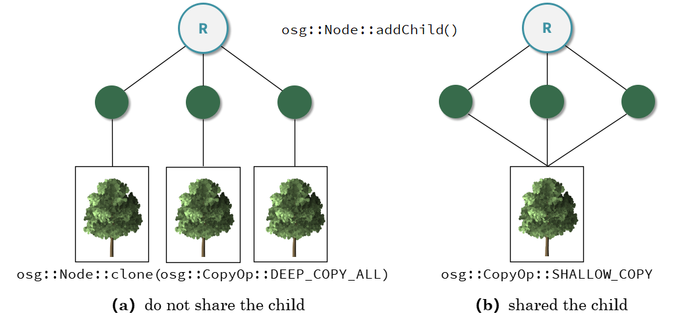
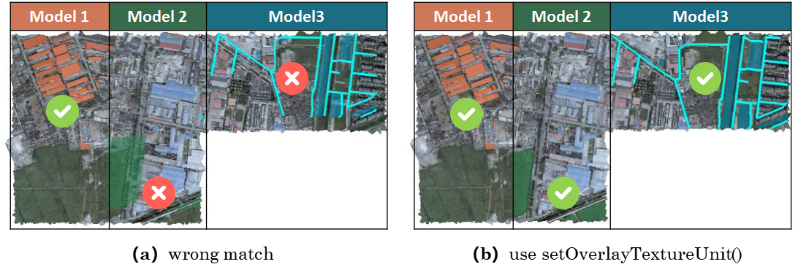
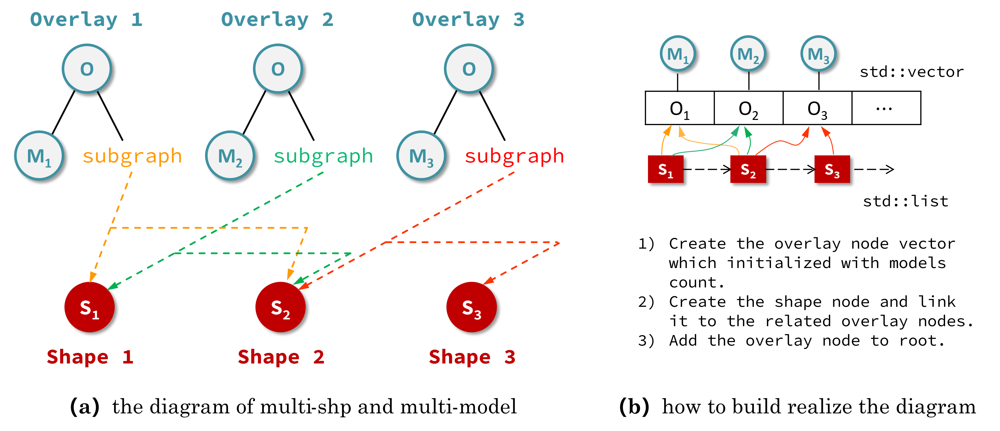
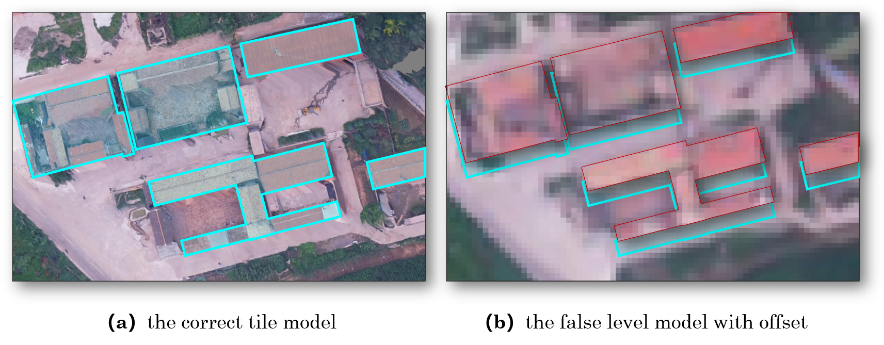
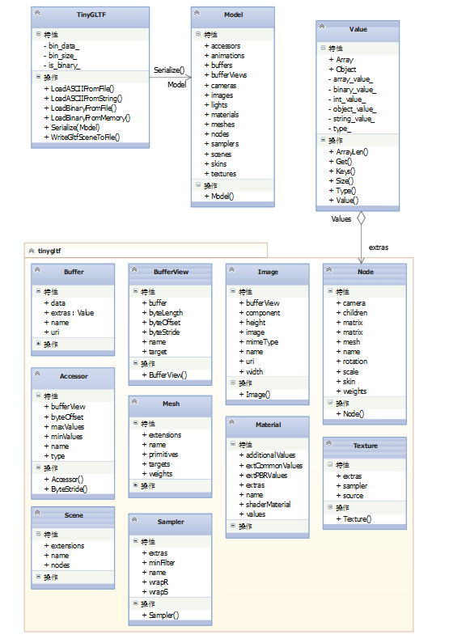
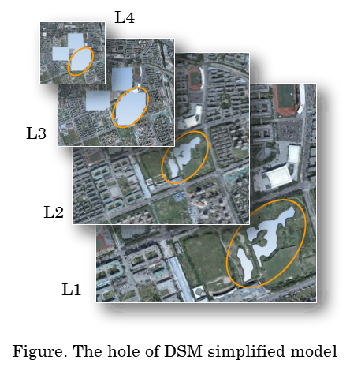

.. _header-n0:

Question List in December, 2020
===============================

⛄️ Winter is comming …

易与天地准，故能弥纶天地之道。仰以观于天文，俯以察于地理，是故知幽明之故。原始反终，故知死生之说。精气为物，游魂为变，是故知鬼神之情状。与天地相似，故不违。知周乎万物，而道济天下，故不过。旁行而不流，乐天知命，故不忧。安土敦乎仁，故能爱。范围天地之化而不过，曲成万物而不遗，通乎昼夜之道而知，故神无方而易无体。

.. _header-n4:

Q1、《建塔流程》12月修订版
--------------------------

实景模型金字塔索引是在原始瓦片文件的基础上，利用当前瓦片所对应的DSM影像和DOM影像进行模型顶点上采样并利用线性四叉树编码形成的一种顶层索引文件。其主要操作流程如下图所示：

具体的操作流程说明如下：

.. raw:: html

   <html xmlns="http://www.w3.org/1999/xhtml"><head></head><body>

       <strong>S100</strong>   用RaiDrive软件将局域网中的实景模型数据文件夹映射为本地磁盘以便进行后续操作，操作为：
       点击软件右上角<strong>[Add]</strong>按钮→点击Storage中的NAS标签选择<strong>[FTP]</strong>选项→<strong>取消勾选[Read-only]</strong> 复选框→在 <strong>[Address]</strong> 地址栏输入地址：ftp//192.168.9.28:21，用户名：Administrator，密码：Asd123；再点击<strong>[OK]</strong> 按钮即可将192.168.9.28处的实景数据文件夹映射为本地磁盘。
   

   

       <strong>S200</strong>   在“实景三维数字城市管理平台”中加载待处理区域的 Data 目录下的 main.osgb 文件，如需加载多个 文件，可尝试将工程保存起来并修改XML文件中的模型配置参数，选择性显示边界的几个瓦片进行显示，其他瓦片均予以隐藏，在框选完范围后缩放到较小范围并勾选所有瓦片来对 DSM 和 DOM 影像进行生成；依次执行以下操作：
   

S201   调整三维场景的背景颜色，主要是改变原有的渐变显示模式为纯色模式，以此保证在生成DOM影像时保持均匀的颜色背景：为了完成这一操作，需要在软件中点击<strong>[场景调节]</strong>→<strong>[背景]</strong>→<strong>[纯色]</strong>，选择淡蓝色；

   
S202   调整模型光照效果，使得生成的DOM影像与最底层瓦片模型关闭光照后的效果相同，以此来确保生成模型的纹理与原始娃瓦片模型相一致：为了完成这一操作，需要点击<strong>[场景调节]</strong>→<strong>[环境]</strong>→<strong>[关闭]</strong>按钮关闭模型光照，并按快捷键<strong>[l]</strong>打开全局光照；

   
S203   改变场景相机的投影模式，即由原来的透视投影变更为平行投影，以此来确保俯视生成DOM高清影像：为了完成这一操作，需要在<strong>[主页]</strong>中<strong>[相机]</strong>标签中依次点击<strong>[投影方式]</strong>→<strong>[平行投影]</strong>，设置<strong>高度为12000</strong>；

   
S204   在<strong>[主页]</strong>中<strong>[相机]</strong>标签中依次点击<strong>[输出影像]</strong>→<strong>[正射/2.5维]</strong>，选取范围恰好包围场景中的模型即可，勾选<strong>[同步生成DSM]</strong>复选框，设置<strong>分辨率100cm</strong>，单张<strong>等待时间6秒</strong>，点击<strong>[输出]</strong>，选择输出文件夹，文件夹命名最好以当前模型所在文件夹中的数字命名；文件输出成功后询问是否合并DSM和DOM均选择<strong>[是]</strong>；

   
S205   影像输出后，从输出文件夹下的DSM文件中拷贝CombinedDSM.tif文件到输出文件夹下，输出文件夹下必须有CombinedDOM.tfw，CombinedDOM.tif和CombinedDSM.tif三个文件，合并完成后注意检查CombinedDOM.tif文件是否有明显的缺失现象，如有缺失当重新生成。

   
<strong>S300</strong>   准备好上述数据之后，将相关文件路径输入到MeshSimplify软件中，在配置文件中完成对DSMDOM以及Folder、Resolution等的配置，直接点击软件运行即可。
   
</body></html>

由此即可实现实景三维模型的生成，但这里存在一点点问题，就是加载若干Block中的顶层文件到系统中时，某一段距离的切换显得十分卡顿，内存也变高了，再往近切一切好像又能好一点了（问题已修正，原因是代码中有一个
BUG 没解决，解决该 BUG
之后就没问题了）。一个常见的\ ``config.plod``\ 配置文件如下：

.. code:: makefile

   DSMDOM=C:\Users\Administrator\Desktop\experiment\test5\ztjt
   Folder=D:\Data\ztjt
   Checked=66,67,69
   Build=true
   Resolution=100

关于配置文件参数的说明：config.plod 配置文件采用 Makefile
形式来对各参数进行组织，参数名称与参数值之间用符号 ``=``
链接。其中，\ ``DSMDOM`` 标识生成的 DSM 影像和 DOM
影像的路径，该路径所对应的文件夹内应包含以下三个文件：CombinedDOM.tfw，CombinedDOM.tif和CombinedDSM.tif；\ ``Folder``\ 路径指定了要生成的多个
Block 实景模型的根路径；\ ``Checked``
参数标识生成根路径下指定数字所代表的 Block 模型，\ ``Build``\ 参
数标识是否执行建塔程序，若设定为 false 则只根据每个 Block
所生成的模型生成最顶层的 root.osgb 文件；而分辨率参数
``Resolution``\ 则指定了生成的 DSM 影像和 DOM 影像的分辨率。

需要说明的是，配置文件同时还支持仅生成一个 Block 的配置，其参数如下：

.. code:: makefile

   DSMDOM=C:\Users\Administrator\Desktop\experiment\test5\41-42-43-51-52-53-54-62-63
   Tile=D:\Data\SCGK-2\Production_SCGK_41_osgb
   Build=true
   Resolution=100

.. _header-n16:

Q2、回调函数
------------

回调函数就是一个被作为参数传递的函数。简单来说，回调函数就是在第三方函数运行期间，在特定的事件发生时通过回调使用方实现的函数，来体现对于特定事件或条件的响应。其函数机制包括：

| 1、定义一个普通函数；
| 2、将此函数的地址注册给调用者；
| 3、特定的事件或条件发生时，调用者使用函数指针调用回调函数。

C
语言中只能由函数指针实现回调的功能，而C++、Python等更现代的编程语言中还可以使用仿函数或匿名函数。在C++中实现函数回调有三种方式：\ **函数指针**\ 、\ **成员函数指针**\ 以及\ **函数包装连接器**\ ；比较常见的用函数指针回调方式就是
stdlib.h/cstdlib 中的快速排序函数\ ``qsort()``\ 中的\ ``strcmp``\ 参数。

.. _header-n20:

C.1. Function pointers
~~~~~~~~~~~~~~~~~~~~~~

.. code:: c++

   typedef int(*Function)(int, int);
   class Arithmetic{
   public:
       void dosomething(){ fun(a, b); }
       int a;
       int b;
       Function fun;
   };
   int add(int a, int b){ return a + b; }
   int main(){
       Arithmetic A;
       A.a = 18; A.b = 188; A.fun = add;
       A.dosomething();
   }

.. _header-n22:

C.2. Pointer to member function
~~~~~~~~~~~~~~~~~~~~~~~~~~~~~~~

.. code:: c++

   /* 定义的回调接口. */
   class Callback{
   public:
       virtual void callback(int result)  const = 0;
   };
   /* 为老板服务的财务部. */
   class Finance{
   public:
       Finance(Callback* call):_callback(call){}
       // 财务部核算工作
       void calculate(int* arr, int n){
           int result = 0;
           for (int i = 0; i < n; i++){
               result = result + *(arr + i);
           }
           if(_callback != NULL){ _callback->callback(result); }
       }
   private:
       // 核算反馈
       Callback* _callback;
   };
   /* 能够发出核算指令的老总. */
   class Boss: public Callback{
   public:
       // 部署财务部各项工作
       Boss(){ _finance = new Finance(this); }
       // 发出财务数据要求财务部核算并反馈
       void read(int* arr, int n) { _finance->calculate(arr,n); }
       // 老总为财务部特批的数据反馈渠道
       void callback(int result) const { printf("%d", result); }
   private:
       // 直属于老板的财务部
       Finance* _finance;
   };

.. _header-n24:

C.3. Use function and bind
~~~~~~~~~~~~~~~~~~~~~~~~~~

.. code:: c++

   #include <functional>
   typedef std::function<int(int,int)> func;
   class Arithmetic{
   public:
       void dosomething(){ fun(a, b); }
       int mult(int n1, int n2){ return n1 * n2; }
   public:
       int a;
       int b;
       func fun;
   };
   int main(){
       Arithmetric A;
       func f = std::bind(&Arithmetric::mult, &A, 18, std::placeholders::_1);
       f(188);//相当于调用A.mult(18, 188);
   }

.. _header-n26:

Fibonacci sequence
~~~~~~~~~~~~~~~~~~

斐波那契数列又称黄金分割数列，因数学家莱昂纳多·斐波那契（\ *Leonardoda
Fibonacci*\ ）以兔子繁殖为例子而引入故又称为“兔子数列”，指的是这样一个数列：\ :math:`0,1,1,2,3,5,8,13,21,34,55,\cdots`
在数学上，斐波那契数列以如下被以递推的方法定义：

.. math::

   f(n)=\begin{cases}
   0&n=0\\
   1&n=1\\
   f(n-1)+f(n-2)&n\geqslant2,n\in \mathbb{N}^+
   \end{cases}

在现代物理、准晶体结构、化学等领域，斐波纳契数列都有直接的应用，由此美国数学会从
1963
年起出版了以《斐波纳契数列季刊》为名的一份数学杂志用于专门刊载这方面的研究成果。斐波那契数列的通项公式为：

.. math:: a_n=\frac{1}{\sqrt{5}}\left(\left(\frac{1+\sqrt{5}}{2}\right)^n-\left(\frac{1-\sqrt{5}}{2}\right)^n\right)

计算该数列最简单的一种实现方式是如下的一种递归：

.. code:: c++

   int fibonacci(int N){
       if (N == 0) return 0;
       if (N == 1 || N == 2) return 1;
       return fibonacci(N - 1) + fibonacci(N - 2);
   }

但通过绘制这个函数的递归树可以发现这种递归函数存在很多重复性的计算，也就是\ **重叠子问题**\ ；其递归树为一个满二叉树故而可以计算这个函数的复杂度为
:math:`O(n^2)`\ ，指数爆炸。用一个一维数组充当备忘录可以对这种暴力递归函数进行计算上的优化以减少重复性的计算：

.. code:: c++

   int helper(vector<int>& memo, int N){
       if (N == 1 || N == 2) return 1;
       if (memo[N] != 0) return memo[N];
       memo[N] = helper[N - 1] + helper[N - 2];
       return memo[N];
   }

   int fibonacci(int N){
       if (N == 0) return 0;
       if (N == 1 || N == 2) return 1;
       vector<int> memo(N + 1, 0);
       helper(memo, N);
   }

由于每个数都只计算了一次，故而上面算法的复杂度为
:math:`O(n)`\ 。到此为止，这个算法仍是一种『\ **自顶向下**\ 』的计算模式，只需要添加简单的改动就可以将其转换为『\ **自底向上**\ 』的计算模式：

.. code:: c++

   int fibonacci(int N){
       if (N == 0) return 0;
       if (N == 1 || N == 2) return 1;
       vector<int> DP(N + 1, 0);
       DP[1] = DP[2] = 1;
       for(int i = 3; i <= N; i++){
           DP[i] = DP[i - 1] + DP[i - 2];
       }
       return DP[N];
   }

而事实上，对于这个函数而言，它只需要前两位数据，因此并不需要将所有的数据都存储在
DP 表中，也即：

.. code:: c++

   int fibonacci(int N){
       if (N == 0) return 0;
       if (N == 1 || N == 2) return 1;
       int prev = 1, curr = 1;
       for(int i = 3; i <= N; i++){
           int sum = prev + curr;
           prev = curr; curr = sum;
       }
       return curr;
   }

.. _header-n39:

参考文献
~~~~~~~~

1. 博客园.
   `C/C++之回调函数 <https://www.cnblogs.com/danshui/archive/2012/01/02/2310114.html>`__\ [EB/OL].

2. 知乎.\ `C++回调函数的实现 <https://zhuanlan.zhihu.com/p/83943973>`__\ [EB/OL].

3. 简书.\ `C++11
   中的std::function和std::bind <https://www.jianshu.com/p/f191e88dcc80>`__\ [EB/OL].

4. 博客园.\ `C++11<functional>深度剖析 <https://www.cnblogs.com/jerry-fuyi/p/functional_implementation.html>`__\ [EB/OL].

5. 博客园.\ `C++回调函数使用心得 <https://www.cnblogs.com/smartlife/articles/12519130.html>`__\ [EB/OL].//博客有漏洞，完全看明白还需要一点水平

6. CSDN博客.\ `C++学习回调函数 <https://blog.csdn.net/qq_29924041/article/details/74857469>`__\ [EB/OL].

7. 程序员小灰.\ `动态规划详解（修订版） <https://mp.weixin.qq.com/s/z38a5LhvlBIqh6P0y9W9Pw>`__\ [EB/OL].

.. _header-n55:

Q3、工程导入矢量模块
--------------------

在上月osgShp拓展库开发基本完成的基础上，设计基于osgShp类库和工程配置文件的\ **工程导入矢量模块**\ 。主要从以下几方面着手：A.工程配置文件shp功能区的定义；B.OsgProjectManagerX64工程项目中关于工程导入矢量模块的设计；C.完善矢量导入多矢量对多模型情况下的相关配置。

.. _header-n57:

Configure 3DXML file
~~~~~~~~~~~~~~~~~~~~

配置文件设计要满足：代码中的矢量加载不依赖于配置文件中的矢量位置，尽可能多的在配置文件属性中覆盖导入矢量功能对各个参数的要求。

.. code:: xml

   <?xml version="1.0" encoding="UTF-8"?>
   <TerrainGisProject>
       <POIs DisplayPOI="True" />
       <OsgBackGround Mode="Gradient"/>
       <LayerList>
           <Layer Expand="True" Load="True" Name="矢量" />
           <Layer Expand="True" Load="True" Name="实景三维地形" />
       </LayerList>
       <OsgFileList/>
       <VectorFileList>
           <ShapeFile Layer="矢量" Load="True" Name="Lake.shp">
               <TerrainLayer>"实景三维地形"</TerrainLayer>
               <Elevation>10.0</Elevation>
               <Clamp>true</Clamp>
               <Color>0,191,255,188</Color>
           </ShapeFile>
       </VectorFileList>
   </TerrainGisProject>

.. _header-n60:

OsgProjectManager
~~~~~~~~~~~~~~~~~

实现两个类，即：\ ``InputShapeEventAdapter``\ 类和\ ``InputShapeEventHandler``\ 类，稍后通过
UML 类图的方式对这两个类的使用方式进行简要介绍。

.. .. figure:: pic/202012/EventAdapterHandler.svg
..    :alt: 

.. _header-n63:

OSG 共享子节点
~~~~~~~~~~~~~~

王锐、钱学雷的《OpenSceneGraph三维渲染引擎设计与实践》一书中提到：OSG
中的场景结构不能被简单地视为树结构（只允许单一父节点），而是一种有向无环图（Directed
Acyclic Graph,
DAG）；在此有向无环图的定义是：对于其中的任意节点N，都不可能存在一条通路，以N作为通路的开始和结束。这一方式为OSG提供了一种多个父节点共享一个子节点的子节点实例化模式，也就是说多个父节点指向同一个子节点而不是每个父节点都指向一个新的子节点。

这个还涉及到 C++
关于深拷贝和浅拷贝的相关知识，有一点发现不知道是否准确：拷贝不同于指针赋值，拷贝出来的变量的指针指向的地址是不同的，即便其最终指向同一块内存。这个论述其实并不准确，拷贝是一个相对于对象的概念，一般发生在对象赋值过程中调用的拷贝构造函数中，而我们一般所指的指针赋值是相对于
C++
的常用数据类型来说的，也就是说浅拷贝“在拷贝过程中按字节复制，对于指针型成员变量只复制指针本身而不复制指针所指向的目标”。

.. _header-n67:

添加多个OvelayNode
~~~~~~~~~~~~~~~~~~

本文所使用的 OSG 中的\ ``osgSim::OverlayNode``\ 本质上应用的是 RTT
渲染策略，其通过在场景中提前渲染一个 Overlay
子图到纹理并将它映射到场景的方式来实现对场景纹理覆盖的要求，所以这个操作实际上是受电脑显卡设备所支持的纹理单元通道数目限制的，也就是
*Atlas Simen* 所说的：

   How do I add multiple OverlayNode to a scene?

   *I read the post* `"Viewer with 2 overlay
   nodes" <https://www.mail-archive.com/osg-users@lists.openscenegraph.org/msg17003.html>`__,
   *using* ``setOverlayTextureUnit()`` *to distinguish each OverlayNode,
   but this is limited by the number of multiple texture units
   supported.*

他所说的这篇博客已经被删掉了，但能够找到某些回复，摘录关键词如下：

   | *You probably need to set a different texture unit for each
     overlay;*
   | *see* ``OverlayNode::setOverlayTextureUnit(2)`` *for the second
     overlay node. Just a guess..*

为了正确实现我们想要的效果，必须使用\ ``setOverlayTextureUnit()``\ 函数来指定每个
OverlayNode 的纹理渲染单元，该函数的功能描述为：\ *Set the texture unit
that the texture should be assigned to.*

上图所示为添加多个 OverlayNode
时修正前和修正后的结果对比。由此基本解决了在使用 OverlayNode
过程中所遇到的共享 shp
子节点的问题。为了进一步确定实现多对多矢量导入的功能，设计如下链接方式：

三维场景中初始化加载了三个模型图层分别为 M1、 M2、
M3，图（a）所对应的配置需求是读进三个 \*.shp 文件并对应创建 Shape 节点
S1、 S2、 S3；其中 S1 节点需要覆盖在 M1,M2 模型上，S2 节点需要覆盖在
M1,M2,M3 模型上，而 S1 节点需要覆盖在 M2,M3 模型上。由此，根据 \*.shp
文件所要链接的模型图层来在三维场景中对应创建 Overlay 节点，每个 Overlay
节点都只挂接一个模型图层。

.. _header-n80:

参考文献
~~~~~~~~

1. 王锐, 钱学雷.OpenSceneGraph三维渲染引擎设计与实践[B]. 北京:
   清华大学出版社, 2009.

2. Atlas Simen.\ `Add multiple
   OverlayNode. <https://www.mail-archive.com/search?l=osg-users@lists.openscenegraph.org&q=subject:"\[osg\-users\]+Add+multiple+OverlayNode."&o=newest>`__\ [EB/OL].

.. _header-n86:

Q4、实景模型金字塔的调优工作
----------------------------

通过不懈努力，实景模型金字塔构建工作已基本完成 🍑
，我们终于来到了一个新的阶段，即对构建代码中的细节参数进行优化，并在功能上执行进一步的完善工作。接下来，我们一点点向前推进我们的工作；目前主要需要调整的参数和细节包括：

| 1、顶层以下一级的瓦片纹理有些过密，由此造成文件过大问题可能需要进行调整；
| 2、对构建的所有 plod 文件生成一个统一的根节点直接使用 ``osg::Group``
  似乎有些问题。

.. _header-n89:

RangeList 调优
~~~~~~~~~~~~~~

经测试，现行的 RangeList 距离设置方案在 L4 切换到 L3
时的范围有些过大，导致在一个很大的视野内就加载了全部的 L3
层文件，这显然是不科学的，在设计 RangeList
范围时需得对距离设置有一个更加明确的考量。这个距离在最基础的层级上扩大的过程本身就是一个指数级增长的函数，在其上再叠加一个线性增长的函数反而适得其反了，这样并不合理。而除此之外，纹理下降函数也需要进行进一步的调整，原来设计的函数在一个小范围区间内与线性递减函数太过接近了，所以导致最后几级的纹理有些过密。

.. _header-n91:

BUG in PLODBuilder::build() 
^^^^^^^^^^^^^^^^^^^^^^^^^^^

在建立其它层PLOD的 for 循环中使用了错误的 if else 语句。将：

.. code:: c++

   if (ft < 0.1 && is_adjust_range_scale){}else{} \\adjust to
   if(ft < 0.1){if(is_adjust_range_scale){}else{}}

此处为设置错误，由于这种设置使得后面所有的模型都被乘了一个很大的放大因子。

.. _header-n95:

RangeList 配置函数及修正因子
^^^^^^^^^^^^^^^^^^^^^^^^^^^^

上月文档中设计的由配置因子确定的 RangeList
配置函数形式为：\ :math:`L_x=f_x\cdot d`\ ，其中 :math:`L_x` 为由
:math:`x` 级金字塔切换到第 :math:`x+1` 级金字塔时为 PagedLOD 所配置的
Range 参数，对于配置因子 :math:`f_x` 有：

.. math:: f_x=f(x)=2^x+1.618\cdot x

这里把线性因子由原来的 0.618 调整为了
1.618，其主要目的在于，避免因对金字塔模型最底层 Range
施加的修正因子所导致的相邻两层因子过于接近问题。

如下表所示是一些基本的基于#41号模型数据所计算的一些 RangeList
数据，这里对引入的修正因子进行简要的说明如下：本文所说的修正因子
:math:`s` 是基于以上配置函数生成的 RangeList
配置因子进行的进一步调整，其设计之初的主要目的分为两种情况：一是实现实景模型切换到最底层实景金字塔时对距离放大的特殊要求；二是在实景金字塔的模型压缩比小于某个阈值时根据纹理压缩比将切换距离调整到恰当位置，因此有：

.. math::

   s_x=s(x)=
   \begin{cases}
      1.960,&\mathrm{when}\ x=0;\\
      1.618\cdot 0.18/F_{\mathrm{t}_x}=s_d,&\mathrm{when}\ F_{\mathrm{t}_x}\leqslant  0.1\ \mathrm{debut};\\
     2.0\cdot s_d,&\mathrm{when}\ F_{\mathrm{t}_x}\leqslant 0.1\ \mathrm{not\ first\ appeared;}\\
      1.618,& \mathrm{otherwise.}
   \end{cases}

由此实现对 RangeList
的局部修正，避免出现在调整视角与模型的距离时出现放大的马赛克纹理；并在切换到实景模型时选择一个恰当的距离，在加载内存和切换效果之间找到一个折中方案，如表中最后一列所示。按
3.14 来进行初始瓦片缩放有点大了，下调一下调整为 1.96 试试？啊 ZTJT
的是从 L2 开始升级的，那算了。将3.618改为 2.618 试试。

.. _header-n103:

实景模型金字塔配置因子
~~~~~~~~~~~~~~~~~~~~~~

经过前文的研究，目前采用的实景模型金字塔配置因子，也即数字表面模型简化率
:math:`V` 构成如下：

.. math:: V=\left\{\left( \underset{F_{\mathrm{v}}}{\underbrace{(S_{DSM}\cdot f_d)\cdot f_q}}\ ,\ \underset{F_{\mathrm{t}}}{\underbrace{S_{DOM}}} \right);\  S_{DSM},S_{DOM},f_{d},f_{q}\in[0,1]\right\}

式中，\ :math:`S_{DSM}`\ 为DSM影像的缩放因子，\ :math:`S_{DOM}`\ 为 DOM
影像的缩放因子，\ :math:`f_d`\ 为 DSM
影像离散取值参数，\ :math:`f_q`\ 为QSlim
库对顶点简化的简化因子；\ :math:`F_{\mathrm{v}}`
为顶点简化率，\ :math:`F_{\mathrm{t}}` 为纹理简化率。对一个层级数量
:math:`l=7` 的瓦片金字塔，其层级集合为
:math:`\mathbb{L}=\{0,1,2,3,4,5,6\}`\ ，其中 :math:`L_0`
为最底层瓦片，则有顶点简化率因子配置函数如下：

.. math::

   F_{\mathrm{v}_x}=F_{\mathrm{v}}(x)=\begin{cases}
   S_{{DSM}_x}&=({3/4})^{x-1}\cdot S_{{DSM}_0}\\
   f_{q_x}&=(1/3)^{x-1}\cdot f_{q_0}\\
   f_{d_x}&=f_{d_0}
   \end{cases};\ x\in\{i\in\mathbb{L}\mid i\neq0\}

而经过调整发现，\ :math:`f_q`
因子需要一个前两级基本保持原有模型顶点几何结构，而后面几级则尽可能压缩顶点的这样一种调整原则，因此上面的式子是难以满足这个原则的。需要对其添加一些调整，或直接修改配置因子：

.. math::

   \begin{align}{\color{Red}f_q(x)}
   &=-\arctan\left(18\cdot(x-1)\right)/\pi+0.5\\
   &=-\arctan\left(18\cdot(x-1)\right)/3.14+0.5
   \end{align}

测试函数，发现此函数对上面的原则适应性稍微好些。用高斯函数进行拟合可以得到新的函数：

.. math:: {\color{Cyan}f_q(x)}=1.037\cdot e^{-\left(\left(x+0.281\right)/1.509\right)^2}

纹理简化率因子配置函数如下：

.. math::

   F_{\mathrm{t}_x}=F_{\mathrm{t}}(x)=
   \begin{cases}
   F_{\mathrm{t}_0}\cdot\cos\left({1.44\cdot (x-1)}/{(l-1)}\right)\cdot0.6^{x-1}\\
   2\cdot F_{\mathrm{t}}(x)\quad\mathrm{while\ }F_{\mathrm{t}}(x)<0.1
   \end{cases};\quad
   \ x\in\{i\in\mathbb{L}\mid i\neq0\}

这个纹理简化率对于L3层来说有些太密了，切换视角的时候会有些不大好的现象，将调整因子由
0.8 下调为 0.6 试试；对于 :math:`l=4`
，DSM影像分辨率为100mm时的常见瓦片模型处理情形，计算其金字塔配置因子实例如下：

结合 RangeList 配置函数和实景模型金字塔配置因子，以 #41
号模型为实例，可以计算对应层级的 RangeList 修正因子与其相应的距离如下：

.. _header-n119:

金字塔模型偏移
~~~~~~~~~~~~~~

对于某集团的66、67、68、69号模型进行协同建模时发现，对于这一套模型所执行的
Q1
所述的建塔流程在模型表现上还有很多不尽如人意的地方，主要包括：\ **A.**
向上几级的金字塔模型纹理有些模糊， **B.** 金字塔模型与实景模型瓦片之间在
:math:`y` 轴上有一个不小的偏移，如下图：

那么，该如何分析这一问题呢。首先，排查根据包围盒进行裁剪后所生成的 DSM
和 DOM
在地理位置上是否产生了偏移，测试发现纹理有些偏移但偏移得并不严重；接下来，排查
metadata.xml 文件与 main.osgb
文件中所存储的地理坐标偏移是否一致，测试发现 main.osgb
所存储的偏移量在第 6 位数字做了一个四舍五入的处理。

由于存储精度的问题导致 main.osgb 中所存储的地理信息照比 metadata.xml
中所存储的偏移量少了一个精度， 其应用的偏移量为 ：

.. math::

   \mathbf{T}=\begin{bmatrix}\mathbf{t}_{66}\\\mathbf{t}_{67}\\\mathbf{t}_{68}\\\mathbf{t}_{69}\end{bmatrix}=\begin{bmatrix}
   498481&4.04648e+06&0\\
   496618&4.04685e+06&0\\
   494532&4.04675e+06&0\\
   492138&4.04525e+06&0
   \end{bmatrix}

而 metadata.xml 中所存储的偏移量为：

.. math::

   \mathbf{T}=\begin{bmatrix}\mathbf{t}_{66}\\\mathbf{t}_{67}\\\mathbf{t}_{68}\\\mathbf{t}_{69}\end{bmatrix}=\begin{bmatrix}
   498481&4046482&0\\
   496618&4046847&0\\
   494532&4046747&0\\
   492138&4045248&0
   \end{bmatrix}

为了解决这一问题，可以有两种手段。一是在读取 metadata.xml
文件中的数据之后，对其数据精度做一个保留 6
位有效数字的控制；二是直接读取 main.osgb
中的偏移量矩阵并从中获取三维偏移量向量。目前考虑还是暂且保留读取
metadata.xml 文件的功能，只对数据进行一个有效位保留的控制。

但即便做了有损的精度取值，使得偏移量与 main.osgb
文件中存储的数据保持一致，其仍然还是存在一个偏移效果，如下图中的左图所示。如龙哥猜测，是否与DSM本身存在的一个微小偏移有关呢，就是在执行重采样时没有以左上角的像素中心作为
GeoTiff
的控制标签，事实证明是的，像素偏移\ :math:`(-1.2,-1.5)`\ 时，偏移恢复正确。

.. figure:: pic/202012/pyramid_offset.png
   :align: center
   :scale: 55

这里还有一个很有意思的地方，就是针对 Production\ *SCGK*\ 41_osgb
**某某管控**\ 文件的处理并没有发现什么特别明显的偏移问题，而对 ZTJT
**某某集团**\ 模型所进行的处理产生的偏移效果就特别明显；这里能够看出
SCGK 的尺度实际上要比 ZTJT的大很多，也就是说 SCGK
的模型分辨率实际上应该是低于 ZTJT 的。

.. _header-n131:

设置纹理过滤解决摩尔纹问题
~~~~~~~~~~~~~~~~~~~~~~~~~~

在计算机图形学中，纹理过滤或者说纹理平滑是在纹理采样中使采样结果更加合理，以减少各种人为产生的穿帮现象的技术。纹理过滤分为放大过滤和缩小过滤两种类型。对应于这两种类型，纹理过滤可以是通过对稀疏纹理插值进行填充的重构过滤(需要放大)或者是需要的纹理尺寸低于纹理本身的尺寸时(需要缩小)的一种抗锯齿过滤。简单来讲，纹理过滤就是用来描述在不同形状、大小、角度和缩放比的情况下如何应用纹理。根据使用的过滤算法的不同，会得到不同等级的模糊、细节程度、空域锯齿、时域锯齿和块状结果。

.. code:: c++

   texture->setFilter(osg::Texture::MAG_FILTER, osg::Texture::LINEAR_MIPMAP_LINEAR);
   texture->setFilter(osg::Texture::MIN_FILTER, osg::Texture::LINEAR_MIPMAP_LINEAR);

就此，由于纹理过滤参数设置不当而引起的模型摩尔纹问题（Moire
pattern）得到了解决。但这种方式其实并不是解决摩尔纹问题的最佳策略，解决该问题的最佳策略是使用各向异性过滤（Anisotropic
filtering）的方式，通过采样一个非方形纹理的方式，解决物体的表面和相机有很大的夹角时纹理在屏幕上的对应填充区域不是方形的问题，这种方式虽然是当前消费级显卡中的最高质量的过滤方法，但这也同时意味着它需要更大的计算资源。

.. _header-n136:

参考文献
~~~~~~~~

1. CSDN博客.\ `渲染的本质: 纹理过滤(Texture
   filtering)技术 <https://blog.csdn.net/u013746357/article/details/90723268>`__\ [EB/OL].

2. CSDN博客.\ `纹理过滤 <https://blog.csdn.net/github_34181815/article/details/79774952>`__\ [EB/OL].

3. 博客园.\ `Mipmap与纹理过滤 <https://www.cnblogs.com/lancidie/p/12367756.html>`__\ [EB/OL].

4. 博客园.\ `纹理过滤模式中的Bilinear、Trilinear以及Anistropic
   Filtering <https://www.cnblogs.com/cxrs/archive/2009/10/18/JustAProgramer.html>`__\ [EB/OL].

.. _header-n146:

Q5、3DTiles与GLTF,GLB,B3DM模型
------------------------------

B3DM文件的全称为Batched 3D Data
Model，它是3DTiles规范的一部分，本质上B3DM也是使用glTF来存放数据的，用于表示3DTiles的每个瓦片；GLB文件的全称为Binary
GL Transmission Format，GLTF文件的全称为The GL Transmission
Format，GLB模型就是二进制的GLTF模型。

.. _header-n148:

Cesium 平台
~~~~~~~~~~~

目前的 Cesium 官网提供了五个官方产品：端对端地理可视化仿真的 Cesium
Platform，托管在云端的 3D 切片和全球 3D 渲染的 Cesium
ion，组织三维地形、建筑物和影像的 Cesium Global 3D
Content，用于在网络中进行开源三维地理空间可视化分析的
CesiumJS，创作工具和可视化引擎的 Cesium ion 集成产品 Integrations。

   Cesium本身隶属于AGI公司，也即Analytical Graphics
   Incorporation分析图形有限公司，该公司主要提供的产品为SKT（System/Satellite
   Toolkit
   Kit）和Cesium这两款。Cesium在美式英语中是元素周期表地55号元素铯的单词拼写，
   国际纯粹与应用化学联合会（International Union of Pure and Applied
   Chemistry,
   IUPAC）所提倡的规范拼写为Caesium，简写为Cs。作为化学元素的Cesium是一种非常柔软、延展性很强的白色金属，铯是已知所有元素中金属性最强的，其自身最外层电子绕原子核旋转的特性给人类带来了更为精准的时间。

   铯原子的最外层的电子绕着原子核旋转的速度，总是极其精确地在几十亿分之一秒的时间内转完一圈，稳定性比地球绕轴自转高得多。利用铯原子的这个特点，人们制成了一种新型的钟——铯原子钟，规定一秒就是铯原子“振动”9192631770次（即相当于铯原子的两个超精细电子迁跃9192631770次）所需要的时间。这就是“秒”的最新定义。

   这是Cesium开源JS库被命名为Cesium的原因，同时其也解释了为什么在Cesium
   Viewer中随附的标准指示器是基于时钟控件的而不是基于指南针控件的。总体而言，Cesium是一款面向三维地球和地图的，世界级的Java
   Script开源产品。它提供了基于Java
   Script语言的开S发包，方便用户快速搭建一款零插件的虚拟地球Web应用，并在性能，精度，渲染质量以及多平台，易用性上都有高质量的保证。具体参见Cesium员工\ *tom*\ 在\ `Is
   it Cesium or
   CesiumJS? <https://community.cesium.com/t/is-it-cesium-or-cesiumjs/1930>`__\ 论坛主题的官方回复：

   *The Cesium name came about because the element Cesium is used in the
   atomic clock and time accuracy is very important to us.*

.. _header-n156:

\*.glTF and \*.glb
^^^^^^^^^^^^^^^^^^

GLTF 模型格式是由 Khronos 组织推出的致力于使其成为 3D 界的 JPEG
那样的通用格式的一种格式，目前支持多种常用的三维软件通过插件直接读写
glTF 格式如 Maya、3ds Max、Unity 等。使用 glTF 模型的优势如下：

1. 使用 glTF
   可以享受三维数据格式统一的好处，避免不同三维软件间数据导入、导出脚本时存在的缩放、动画、纹理绑定以及材质问题，甚至连
   OpenGL 中的纹理平铺方法这类的属性都保存下来；

2. 对 GL 的 API 非常友好，可以用 glBufferData 将每个缓冲区加载到 GPU
   中，然后用
   glVertexAttribPointer解析每个访问器以绑定到缓冲区中每个顶点元素的位置；

3. 使用基于物理的光照 Physically Based Lighting, PBR 材质模型。

为了使用 glTF 格式，Syoyo Fujita 在 Github 上提供了 header only 的 C++
tiny glTF 2.0 library 用于操作三维模型数据，当然也可以用这个库来实现
\*.osgb 文件到 glTF 文件的转换。

glTF 资源可以带一个或者多个 .bin
文件，用来存储几何数据，动画数据，Skin等，在 “\*.gltf” 的 JSON
数据中有一个 “buffers” 字段，里面定义了这个 glTF 所包含的所有 .bin
文件，这个 .bin
文件可以将很多顶点缓冲、动画数据都打包在一个文件中，接下来就可以用
buffer view 和 accessor 来找到特定的数据了。Buffer View 就是指定 \*.bin
文件中的一段二进制数据，它可以对应一个 Vertex Buffer 或者 Index Buffer
等，每个 Buffer View 还有一个 target 字段，它可以是 GL\ *ARRAY*\ BUFFER
或者 GL\ *ELEMENT*\ ARRAY_BUFFER。

.. _header-n168:

\*.b3dm
^^^^^^^

B3DM文件的全称为Batched 3D Data
Model，意即批处理三维模型，支持离线批处理异质三维模型，能高效地流化到网络客户端进行渲染和交互。本质上b3dm也是使用glTF来存放数据的，用于表示3DTiles的每个瓦片，它将大量模型转换成单个请求，然后在尽量少的
WebGL绘 制命令下渲染；使用 3D Tiles
规范的核心语言，每个模型都是一个要素。B3DM文件主要由头文件和数据体两部分组成，其数据主体采用
glTF 格式二进制文件，只不过在此基础上添加了属性表信息。

.. _header-n170:

OSG2Cesium 工具
~~~~~~~~~~~~~~~

目前国内有三种提供 \*.osgb 到 tileset.json 也即 3D Tiles
的转换工具，其一为 `CesiumLab <http://www.cesiumlab.com/>`__
实验室工具；其二为爱好者
`windydreams <https://www.jianshu.com/u/00e85e349d1a>`__ 提供的
`osg2cesiumApp <https://www.jianshu.com/p/e1ee883ff7a5>`__
工具；这两种均为封装好的可执行程序，不提供开源支持，第三种则为由创建者
`fanvanzh <https://github.com/fanvanzh>`__
发布的完全开源的命令行执行程序
`3dtiles <https://github.com/fanvanzh/3dtiles>`__\ ，提供了可用的源码。除此之外，笔者在开源网站上根据
osg2cesium 关键词还搜索到了由 `MrBigDog <https://github.com/MrBigDog>`__
提供的 `osg2cesium <https://github.com/MrBigDog/osg2cesium>`__
工具，该代码可直接运行。

实际上在进行顶层重建的过程中，我们忽略了一个十分重要的内容：Mesh
合并。今天搜索了一下午的三维布尔运算操作库，目前来看能够提供这一功能的开源算法库有：CGAL，libigl
以及 MeshLab等。MeshLab
本身提供了覆盖其核心算法的可视化软件，其中对应进行布尔运算的工具名称为
Filters :math:`\rightarrow` Remeshing, Simlification and Reconstruction
:math:`\rightarrow` CSG Operation，这里的 CSG 是 Constructive Solid
Geometry operation 的缩写，该算法源自于 *C.Rocchini* 等人于 2001
年撰写的论文《Marching Intersections: an Efficient Resampling Algorithm
for Surface Management》。

但实际上，Mesh
合并不等同于布尔运算中的合并，本文所涉及到的顶层重构实际上是一种片元重构，它本身并没有几何实体，而仅仅是一种面结构，故而三维实体的布尔运算并不能很良好的适应于这种
Mesh 合并操作。

.. _header-n174:

压缩纹理图片
~~~~~~~~~~~~

压缩纹理图片并不能直接使用 ``osgDB::writeImageFile()`` 中的 ``option``
配置参数，实际上需要在纹理上对图片进行压缩，可能输出图像文件并未包含在
``option`` 的配置中：

.. code:: c++

   //压缩和写图片函数
   void compressAndWrite(osg::ref_ptr<osg::Image> image, const std::string& path)
   {
   	//压缩方式，是osg本身提供的。只是需要会运用即可，具体参数含义在函数体上说明，当然，从源码中粘来的。
   	osgDB::Registry::instance()->getImageProcessor()->compress(*image
   		, osg::Texture::USE_S3TC_DXT5_COMPRESSION
   		, true
   		, true
   		, osgDB::ImageProcessor::USE_CPU
   		, osgDB::ImageProcessor::NORMAL);
   	osgDB::writeImageFile(*image, path);
   }

这个好像需要 NVTT 库，因为在 osgEarth
的\ `合并日志 <https://github.com/gwaldron/osgearth/commit/823a621f677e8baa3d656fe22380b461cd3c83e1>`__\ 中发现了这样一行代码：

   .. code:: c++

      // Fint the NVTT plugin
      osgDB::ImageProcessor* ip = osgDB::Registry::instance()->getImageProcessor();
      if (!ip) return;

   这段代码意味着，必须依靠 osgDB::Registry::instance() 来获取
   ImageProcessor，否则我们所创建的这样一个图片处理器有可能无法正确的发挥作用。这个插件的形式为：osgPlugins-3.7.0/osgdb_nvtt.dll，所用到的
   NVTT 库全称叫 NVIDIA Texture Tools。用这个东西的话需要将 OSG
   源码重新编译一遍。

.. _header-n181:

GDALTranslate
^^^^^^^^^^^^^

所以后来还是使用了 GDAL 库中的 ``GDALTranslate()``
函数来进行图像的压缩转换，代码如下。在此过程中，考虑到文件读、写、删除所占用的时间，尝试直接将
``osg::Image`` 转换为 ``GDALDataset`` ，意外地发现似乎在调用
``GDALDataset::RasterIO()`` 函数时就已对图像进行了压缩。

.. code:: c++

   #include <gdal-2.2.4/gdal_priv.h>
   #include <gdal-2.2.4/gdal_utils.h>
   /* 压缩函数. */
   void compressor(std::string indir, std::string outdir)
   {
   	GDALAllRegister();
   	int error = FALSE;
   	char **argv = NULL;
   	argv = CSLAddString(argv, "-co");
   	argv = CSLAddString(argv, "COMPRESS=JPEG");
   	argv = CSLAddString(argv, "-co");
   	argv = CSLAddString(argv, "JPEG_QUALITY=40");
   	GDALDatasetH dataset = GDALOpen(indir.c_str(), GA_ReadOnly);
   	GDALTranslateOptions* opt = GDALTranslateOptionsNew(argv, NULL);	
   	GDALTranslate(outdir.c_str(), dataset, opt, &error);
   	GDALTranslateOptionsFree(opt);
   	CSLDestroy(argv);
   	GDALClose(dataset);
   	GDALDestroyDriverManager();
   }

.. _header-n184:

image2dataset
^^^^^^^^^^^^^

对于 JPEG 文件，实现\ ``osg::Image`` 转换为 ``GDALDataset``
的函数如下。这里的痛点是无法通过获取驱动器名称的方式来用 GDALDriver
直接创建 JPEG 文件，这个文件只支持用 CreateCopy 的形式创建，而且在 GDAL
中这种方式创建图片更为通用，而 Create 函数只支持几种文件格式。

.. code:: c++

   GDALDataset* image2dataset(osg::Image* image, std::string output)
   {
   	GDALAllRegister();
   	int w = image->s();
   	int h = image->t();
   	int channels = 3;
   	GDALDriver *memDriver = GetGDALDriverManager()->GetDriverByName("MEM");
   	GDALDriver *jpgDriver = GetGDALDriverManager()->GetDriverByName("JPEG");
   	GDALDataset* dataset;
   	dataset = memDriver->Create("", width, height, channels, GDT_Byte, NULL);
   	int size = _msize(image->data()) / sizeof(*image->data());
   	for (int channel = 0; channel < channels; channel++) {
   		GDALRasterBand *poBand = dataset->GetRasterBand(channel + 1);
   		unsigned char *banddata = new unsigned char[height * width];
   		for (int i = 0; i < height; i++) {
   			for (int j = 0; j < width; j++) {
   				int id = i * width + j;
   				int idp = (height - i - 1) * width + j;
   				int check = channel + idp * 3;
   				banddata[id] = image->data()[check];
   			}
   		}// osg 的图像是上下颠倒的，所以需要进行一个翻转
   		poBand->RasterIO(GF_Write, 0, 0, w, h, banddata, w, h, GDT_Byte, 0, 0);
   	}
   	dataset->RasterIO(GF_Write, 0, 0, w, h, image->data(), w, h, GDT_Byte, 0, 0, 0, 0, 0);
   	jpgDriver->CreateCopy(output.c_str(), dataset, 1, NULL, NULL, NULL);
   	GDALDestroyDriverManager();
   	return dataset;
   }

.. _header-n187:

参考文献
~~~~~~~~

1.  CSDN博客.
    `Cesium第一次搭建环境出不来地球的问题 <https://truedei.blog.csdn.net/article/details/96753384>`__\ [EB/OL].

2.  博客园.
    `Cesium简单使用 <https://www.cnblogs.com/baby123/p/10725231.html>`__\ [EB/OL].

3.  简书.\ `Cesium快速上手7-3dtiles加载 <https://www.jianshu.com/p/df5cde54e15b>`__\ [EB/OL].

4.  CSDN博客.\ `Cesium
    发布3dtiles模型IIS、Tomcat <https://blog.csdn.net/caozl1132/article/details/96288552>`__\ [EB/OL].

5.  知乎.\ `Cesium资料大全 <https://zhuanlan.zhihu.com/p/34217817>`__\ [EB/OL].

6.  GitBook.\ `基于物理的光照 <http://docs.cocos.com/creator3d/1.0/manual/zh/concepts/scene/light/pbr-lighting.html>`__\ [EB/OL].

7.  CSDN博客.\ `GLTF格式 <https://blog.csdn.net/qq_24634505/article/details/90260431>`__\ [EB/OL].

8.  CesiumGS.\ `Batched 3D
    Model <https://github.com/CesiumGS/3d-tiles/tree/master/specification/TileFormats/Batched3DModel>`__\ [EB/OL].

9.  MrBigDog.\ `osg2cesium <https://github.com/MrBigDog/osg2cesium>`__\ [EB/OL].

10. CSDN博客.\ `汇总几个开源的三维图形/计算几何算法库 <https://blog.csdn.net/dagunliyu123/article/details/100170446>`__\ [EB/OL].

11. eryar.\ `Boolean operations between triangle
    meshes <http://www.cppblog.com/eryar/archive/2018/05/17/Boolean_Operations_Mesh.html>`__\ [EB/OL].//使用MeshLab进行布尔运算

12. 博客园.\ `MeshLab <https://www.cnblogs.com/larry-xia/p/10075719.html>`__\ [EB/OL].//MeshLab的基本功能

13. CSDN博客.\ `osg图片优化手段，dds图片格式，Mipmap技术 <https://blog.csdn.net/W96866/article/details/105741502>`__\ [EB/OL].

14. OpenSceneGraph.\ `Serialization
    Support <http://www.openscenegraph.org/index.php/documentation/guides/user-guides/64-serialization-support>`__\ [EB/OL].

.. _header-n217:

Q6、类内使用多线程
------------------

.. _header-n218:

std::thread
~~~~~~~~~~~

std::thread 是 C++ 11
引入的新特性，其使用也非常简单。由资源抢占所引发的加锁问题，使用 mutex
互斥量对公共变量施加保护固然可以有效地保障线程安全，但是这种方式的代价也会比较昂贵，其耗时似乎有点大；C++
对此所引入的概念和 Java 很像，也就是原子操作 atomic。

.. code:: c++

   void function(int n) {}    // 定义需要用线程挂起的函数
   int n = 0;                 // 使用的参数
   std::thread t(funtion, n); // 创建线程
   t.join();                  // 阻塞主线程以等待子线程运行结束

在目前的简单分析看来，这个耗时性的影响与 mutex
锁所锁住的代码计算量密切相关，如果在一个耗时较短的且容易引发冲突的地方加锁对所线程计算时间的影响可能会小一些。互斥对象的使用，保证了同一时刻只有唯一的一个线程对这个共享进行访问，它保证了结果的正确性，但是也有非常大的性能损失。

引发资源抢占冲突的代码发生在 ``image2dataset()``
函数中，现在发现的问题是，这个函数被写在了 cpp
中成了一个变相的全局函数，如果将它收归到 OSGB2GLTF
类中是否一切都会不一样嘞。

.. _header-n223:

类与多线程
~~~~~~~~~~

类内多线程需要用到 Lambda 表达式，亦即 :math:`\lambda`
表达式；在用多线程 std::thread
调用时类内成员函数时要求其提供成员函数的实例，所以这个实例只能借助类似于
Q2 问题中的类外成员绑定的方式或直接在函数体内调用 :math:`\lambda`
表达式的方式来予以传递。

.. _header-n225:

Lambda 表达式
^^^^^^^^^^^^^

Lambda 表达式是一个基于数学中的 :math:`\lambda` 演算（Lambda
Calculus）得名的匿名函数，其直接对应于 :math:`\lambda` 演算中的 Lambda
abstraction，通常可以简单理解为一个没有函数名的函数。正统的
:math:`\lambda`
演算是一个只包含单个参数的匿名函数，把任意多参数函数都转换成单参数的高阶函数的转换又叫做柯里化（Currying），命名的目的在于向数学家
*Haskell Brooks Curry* 致敬。该匿名函数柯里化的过程体现了 Lambda
表达式创始人 *Alonzo Church*
为了简化函数概念而付出的努力。一个计算两个数平方和的 Currying 形式如下：

.. math:: x\mapsto(y\mapsto x\times x+y\times y)

退一步讲，写成含两个参数的映射的形式可以写为：

.. math:: (x,y)\mapsto x\times x+y\times y

这样，我们可以再退一步，得到常见的二元函数的形式，也即：

.. math:: f(x,y)=x\times x+y\times y

事实上，\ :math:`\lambda`
演算的语法只有三类表达式：函数定义、标识符引用以及函数应用。函数定义：\ :math:`\lambda`
演算中的函数是一个表达式，写成：\ ``lambda x . <函数体>``\ ，表示“一个参数参数为
x 的函数，它的返回值为函数体的计算结果” 这时我们说：Lambda
表达式绑定了参数
x。标识符引用：标识符引用就是一个名字，这个名字用于匹配函数表达式中的某个参数名。函数应用：函数应用写成把函数值放到它的参数前面的形式，如\ ``(lambda x . plus x x) y``\ 。此时，我们可以讲计算两个数平方和的
Lambda 表达式写成如下形式：

.. math:: \lambda\ x\ .\ \left(\lambda\ y\ .\ \left(\mathrm{times}\ x\ x\right)\ \mathrm{plus}\ \left(\mathrm{times}\ y\ y\right)\right)

:math:`\lambda`
演算伟大的的原因有很多，其中包括：非常简单；图灵完备；容易读写；语义足够强大，可以从它开始做任意推理；有一个很好的实体模型；容易创建变种，便于探索各种构建计算或语义方式的属性等。\ :math:`\lambda`
演算易于读写，这一点很重要。它导致人们开发了很多极为优秀的编程语言，他们在不同程度上都基于\ :math:`\lambda`
演算。

   图灵机是计算机的老祖先，虽然简单却可以用来模拟任何算法。图灵机的设计者
   *Alan Mathison Turing*
   将图灵机描述为对人们使用纸和笔进行数学计算的过程的抽象，目的是让机器代替人类进行数学计算。

   图灵机于1936年被设计出来，那时的它主要由\ **无限长的纸袋**\ 、\ **读写头**\ 和\ **控制器**\ 三部分组成：图灵机把抽象过程过程看作下列两种简单的动作：在纸上写上或擦除某个符号；把注意力从纸的一个位置移动到另一个位置；而在每个阶段，人要决定下一步的动作，依赖于（\ *a*\ ）此人当前所关注的纸上某个位置的符号和（\ *b*\ ）此人当前思维的状态。

常见的 C++ 的 Lambda 表达式有如下两种：

.. code:: c++

   [外部变量访问方式说明符](参数表)mutable->返回值类型 {函数体}
   [外部变量访问方式说明符](参数表){函数体}

微软官方文档中绘制了如下示意图，

.. figure:: pic/202012/lambdaexpsyntax.png
   :align: center
   :alt: Lambda 表达式

其中，

1. | 外部变量访问方式说明符，即 *Capture Clause* 捕获子句；
   | ``[]``\ 不访问封闭范围内的变量；
   | ``[&]``\ 以引用形式捕获所有外部变量；
   | ``[=]``\ 以值拷贝的形式捕获所有外部变量；
   | ``[=, &foo]``\ 以引用形式捕获 foo
     变量，其余变量均采用值拷贝的形式予以捕获；
   | ``[bar]``\ 以值拷贝的形式捕获 bar 变量，其余变量均不予捕获；
   | ``[this]`` 捕获封闭范围内的 this 指针变量；

2. 函数参数列表，除了捕获变量，lambda 还可接受输入参数；
   标准语法中的参数是可选的，在大多数情况下与函数的参数列表类似；

3. 可变规范，可有可无，\ ``mutable``\ 关键字用以说明表达式体内的代码可以修改值捕获的变量；用可变规范，Lambda
   表达式的主体可以修改通过值捕获的变量；

4. 异常规范，可有可无，可以使用 ``noexcept`` 异常规范来指示 lambda
   表达式不会引发任何异常。 与普通函数一样，如果 lambda 表达式声明
   ``noexcept`` 异常规范且 lambda 体引发异常，Microsoft C++
   编译器将生成警告 C4297；

5. 尾部返回类型，可有可无，使用 ``auto`` 时将自动推导 Lambda
   表达式的返回类型，此时不需要使用返回类型关键字；
   尾部返回类型类似于普通方法或函数的返回类型部分，但是匿名函数的返回类型必须跟在参数列表的后面，且必须在返回类型前面添加尾部返回类型
   ``->`` 关键字 。

6. Lambda函数体，函数需要执行的主体代码。

.. _header-n256:

类内成员调用
^^^^^^^^^^^^

后面又了解到类内成员函数的多线程执行方式其实一共有三种：\ **静态/非静态成员函数**\ 、\ **Lambda表达式**\ 以及与前文所介绍的第三种回调函数调用方式相似的\ **函数绑定**\ 。

**[1] 静态/非静态成员函数**

C++11标准中关于多线程的核心在于\ ``std::thread``\ 类的构造函数所指定的函数指针。因此，有两种方式实现类内成员函数的调用，其一是将成员函数指定为静态的，其二是将成员函数声明为非静态的并传入
``this`` 指针：

| 方法1：\ ``std::thread(&Class::function)``\ ，其中\ ``function``\ 为\ ``static``\ 的；
| 方法2：\ ``std::thread(&Class::fucntion, this)``\ ，其中\ ``fucntion``\ 为非静态的。

通过静态成员函数执行多线程的具体方案如下：

.. code:: c++

   class Cat{
   public:
       /* 喵喵的品种. */
       typedef enum _cat{
           SIAMESE, // 暹罗喵
           RAGDOLL  // 布偶喵
       } CatType;
   public:
       /* 饲养员的名字. */
       void feeder(std::string name){ _feeder = name; }
       /* 点个名检查一下需要投喂哪些猫. */
       void rollcall(CatType type){
           switch(type){
           case SIAMESE: {
               std::thread* cat = new std::thread(&Cat::SiameseCat);
               _cats.push_back(cat);break;}
           case RAGDOLL: {
               std::thread* cat = new std::thread(&Cat::RagdollCat);
               _cats.push_back(cat);break;}
           }
       }
       /* 投食机器开始并行投喂. */
       void feed(){ for(auto cat : _cats) cat->join(); }
   private:
       /* 投喂暹罗猫的静态成员函数. */
       static void SiameseCat() { 
           printf(">> Feeding siamese cat...\n"); 
           // 加一个时延，这样在多线程中暹罗将后被投喂完
           std::this_thread::sleep_for(std::chrono::milliseconds(10));
           printf("   Siagmese cat is full.\n"); 
       }
       /* 投喂布偶猫的静态成员函数. */
       static void RagdollCat() { 
           printf(">> Feeding rogdall cat...\n"); 
           printf("   Rogdall cat is full.\n"); 
       }
   private:
       /* 喵喵数组. */
       std::vector<std::thread*> _cats;
       /* 饲养员. */
       std::string _feeder;
   };

静态成员函数的缺陷是，除非将成员变量声明为静态的，否则在线程函数体内无法使用类内的成员变量。为了进一步完善这一缺陷，可以使用
Lambda 匿名函数表达式或者 C++11 的函数绑定特性。

**[2] Lambda 表达式**

前文已经阐述过 C++ 的 Lambda
匿名函数表达式的基本用法，现在来介绍它是如何使得上面的多线程可以在每个线程里调用饲养员的名字的，这里假定两只喵都由同一个饲养员喂养。

.. code:: c++

   class Cat{
   public:
       typedef enum _cat{
           SIAMESE,
           RAGDOLL
       } CatType;
   public:
       void feeder(std::string name){ _feeder = name; }
       void rollcall(CatType type){
           switch(type){
           case SIAMESE: {
               /* 投喂暹罗喵的匿名函数. */
               std::thread* cat = new std::thread([=](){
   				printf(">> %s is feeding siamese cat...\n", _feeder.c_str());
                   std::this_thread::sleep_for(std::chrono::milliseconds(10));
                   printf("   Siagmese cat is full.\n"); 
   			});_cats.push_back(cat);break;}
           case RAGDOLL: {
               /* 投喂布偶喵的匿名函数. */
               std::thread* cat = new std::thread([=](){
   			    printf(">> %s is feeding ragdoll cat...\n", _feeder.c_str());
                   printf("   Rogdall cat is full.\n"); 
   			});_cats.push_back(cat);break;}
           }
       }
       void feed(){ for(auto cat : _cats) cat->join(); }
   private:
       std::vector<std::thread*> _cats;
       std::string _feeder;
   };

这样一来，就可以在不声明静态成员函数的前提下使用多线程喂猫了。不过需要注意的是，虽然可以不用声明成员函数了，但这个
Lambda 表达式仍然需要声明外部成员变量访问方式修饰符。

**[3] 函数绑定**

前面说到的方法都是指在类内创建多线程调用类内的成员函数或成员变量，多线程的开启或终止对类外的使用者来说是不可见的，而函数绑定这种方式可以实现类外成员函数的绑定，也可以实现静态成员函数调用类内成员变量的需求，当然静态成员函数调用非静态成员变量的万剑归宗就是引用类的实例。

.. code:: c++

   class Cat{
   public:
       /* 喵喵的品种. */
       typedef enum _cat{
           SIAMESE, // 暹罗喵
           RAGDOLL  // 布偶喵
       } CatType;
   public:
       /* 饲养员的名字. */
       std::string& feeder(){ return _feeder; }
       /* 点个名检查一下需要投喂哪些猫. */
       void rollcall(CatType type){
           switch(type){
           case SIAMESE: {
               std::thread* cat = new std::thread(std::bind(&Cat::SiameseCat, this));
               _cats.push_back(cat);break;} 
           case RAGDOLL: {                  
               std::thread* cat = new std::thread(std::bind(&Cat::RagdollCat, this));
               _cats.push_back(cat);break;}
           }
       }
       /* 投食机器开始并行投喂. */
       void feed(){ for(auto cat : _cats) cat->join(); }
   private:
       /* 投喂暹罗猫的静态成员函数. */
       static void SiameseCat(Cat* cat) { 
           printf(">> %s is feeding siamese cat...\n", cat->_feeder.c_str()); 
           // 加一个时延，这样在多线程中暹罗将后被投喂完
           std::this_thread::sleep_for(std::chrono::milliseconds(10));
           printf("   Siagmese cat is full.\n"); 
       }
       /* 投喂布偶猫的静态成员函数. */
       static void RagdollCat(Cat* cat) { 
           printf(">> %s is feeding rogdall cat...\n", cat->_feeder.c_str()); 
           printf("   Rogdall cat is full.\n"); 
       }
   private:
       /* 喵喵数组. */
       std::vector<std::thread*> _cats;
       /* 饲养员. */
       std::string _feeder = "Default";
   };

.. _header-n271:

用循环创建多线程
~~~~~~~~~~~~~~~~

用 ``for`` 循环创建多线程时，要注意到 ``std::thread::join()``
函数发生阻塞的位置，该函数的目的在于阻塞主线程的执行，以便等待子线程的处理结果处理结束之后再来执行主线程的后续方法。所以一般的解决策略是在循环体内
``new`` 一个 ``std::thread``
指针出来放到容器中，并在循环结束后对容器中存储的所有线程指针执行接续的
``std::thread::join()`` 阻塞，当然用 ``new``
创建的指针在结束后也必须予以释放。

.. code:: c++

   std::list<std::thread*> threads; // 创建一个存储 std::thread 指针的容器
   for (int i = 0; i < 10; i++) { // 执行并行操作
       std::thread* thread_new = new std::thread(fun, arg1, arg2);
       threads.push_back(thread_new);
       // 不能在此处 join()，否则执行过程与串行一致，就白费功夫了
   }
   for (auto thread : threads) { thread->join(); } //阻塞主线程等待子线程执行完毕
   for (auto thread : threads) { delete thread; }  //创建的内存用完后销毁

.. _header-n274:

参考文献
~~~~~~~~

1. CSDN博客.\ `C++
   多线程编程之在类中使用多线程(thread)的方法 <https://blog.csdn.net/dumpdoctorwang/article/details/79729281>`__\ [EB/OL].

2. 菜鸟教程.\ `C++
   std::thread <https://www.runoob.com/w3cnote/cpp-std-thread.html>`__\ [EB/OL].

3. 知乎.\ `什么是 Lambda
   演算 <https://www.zhihu.com/question/21936396>`__\ [EB/OL].

4. CSDN博客.\ `C++多线程初探：thread、atomic及mutex的配合使用 <https://blog.csdn.net/yucicheung/article/details/82466302>`__\ [EB/OL].

5. Microsoft.\ `C++ 中的 Lambda
   表达式 <https://docs.microsoft.com/zh-cn/cpp/cpp/lambda-expressions-in-cpp?view=msvc-160>`__\ [EB/OL].

.. _header-n286:

Q7、精简顶层网格结构
--------------------

.. _header-n287:

M.S.1.0 极简 DSM 加适当格网简化
~~~~~~~~~~~~~~~~~~~~~~~~~~~~~~~

| **实验方案**\ ：下调 :math:`S_{DSM}` 缩放因子，上调 :math:`f_q`
  因子；具体方案为当 :math:`l\geqslant L.size()-2` 时，下调
  :math:`S_{DSM}\div 10` ，并上调顶点简化因子，令
  :math:`f_q\times 10`\ ；据此参数重新生成顶层文件；
| **实验结果**\ ：出现空洞现象。

.. _header-n290:

M.S.2.0 极简格网简化因子
~~~~~~~~~~~~~~~~~~~~~~~~

| **实验方案**\ ：下调 :math:`f_q` ，令
  :math:`f_q\div 10`\ ；据此参数重新生成顶层文件；
| **实验结果**\ ：消除了空洞现象。

.. _header-n292:

M.S.3.0 解决 L2 切换为 L1 时的卡顿
~~~~~~~~~~~~~~~~~~~~~~~~~~~~~~~~~~

**问题描述**\ ：建立实景模型顶层金字塔后，由顶层文件逐级向下切换的前几级没什么太大问题，但是在
L2 切换到 L1
级这个阶段会产生一些卡段的现象；对此现象，在龙哥的指导下进行了多角度的分析，得到几个可能方向：

| 🔘 **D–1**\ 重建顶层时的 L1 层文件顶点有些过于密集了，对 :math:`f_q`
  因子进行适当缩减；
| 🔘 **D–2**\ 顶层文件的图像纹理尚未由 TIFF 格式执行 JPEG 压缩；
| 🔘
  **D–3**\ 重建顶层时的文件调用了四张图片，将四张整理为一张可能会减少占用；
| 🔘 **D–4**\ 下调 L2 转 L1 和 L1 转实景模型的 RangeList
  因子，减少一次性加载的 L1 实景模型；

**实验方案**\ ：D–1
方案修正了模型调整因子，对顶点进行了精简，效果有但并不明显；D–2 读取
osg::Image 并使用开源库 GDAL 将其转换为 JPGE 格式并保存生成了 40k
左右的文件，但写入 \*.osgb
文件后大小又上去了一些，整体而言文件大小能够压缩 20% – 30% 左右；D–3
暂时还未想好处理方案；D–4 暂时使用 RangeList 修正程序进行简单调整。

.. math::

   s_x=s(x)=
   \begin{cases}
    1.618,&\mathrm{when}\ x=0;\\
      1.618\cdot 0.18/F_{\mathrm{t}_x}=s_d,&\mathrm{when}\ F_{\mathrm{t}_x}\leqslant  0.1\ \mathrm{debut};\\
     2.0\cdot s_d,&\mathrm{when}\ F_{\mathrm{t}_x}\leqslant 0.1\ \mathrm{not\ first\ appeared;}\\
      1.000,& \mathrm{otherwise.}
   \end{cases}

改了之后发现不行，所以继续原来的修正因子。采用的 100
米分辨率调整因子为：

.. math:: V=\{\left(S_{DSM},f_d,f_q\right);S_{DOM}\}=\{(0.5,0.05,1);0.8\}

**实验结果**\ ：到 D–2
方向为在一定程度上能提升加载速度，但效果不明显；使用 D–4
方向倒是有一点效果。
