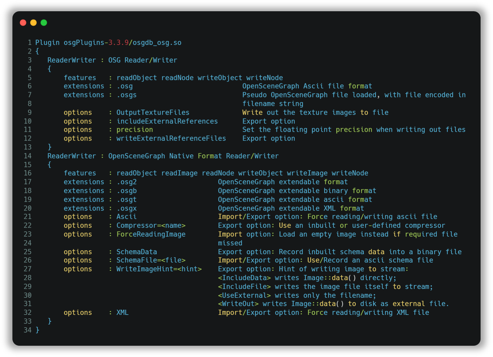
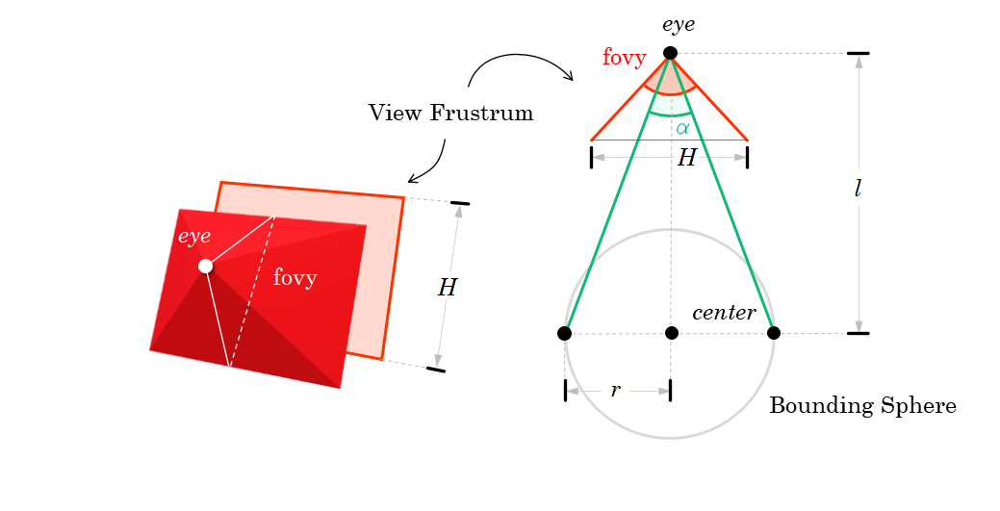
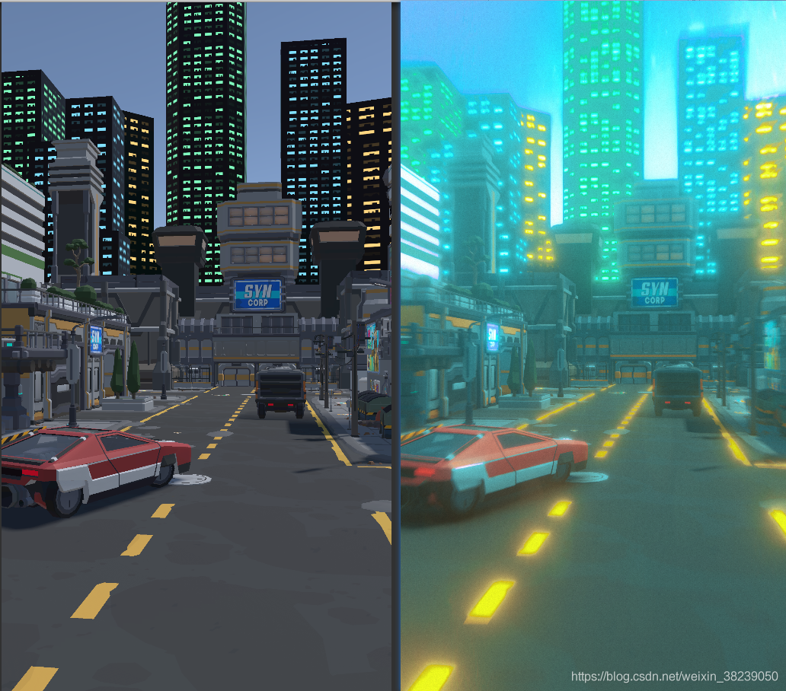

Question List in January, 2021
==============================

❄️ Wind, ice and snow makes what winter are, it’s cold, but beautiful.

| 孟子谓宋句践曰：“子好游乎？吾语子游。人知之，亦嚣嚣；人不知，亦嚣嚣。”
| 曰：“何如斯可以嚣嚣矣？”
| 曰：“尊德乐义，则可以嚣嚣矣。故士穷不失义，达不离道。穷不失义，故士得己焉；达不离道，故民不失望焉。古之人，得志，泽加于民；不得志，修身见于世。穷则独善其身，达则兼善天下。”

Q1、实景模型金字塔纹理问题
--------------------------

实景模型金字塔的 L2、L1
层级切换时非常卡顿，这两个层级中的每个文件几乎都能到到 2M
左右的大小；为了解决这一问题，试着将纹理图片舍掉而只保留顶点数组，文件大小降到128K
左右，切换时完全不卡。因此可以合理猜测，卡顿问题的内在诱因是纹理过大，或者说是纹理压缩没有做好。

这个纹理，并不能说\ ``osgDB::readImageFile()``\ 读进来的文件小了图片就会小，事实上这个纹理应该是对
osg 本身存储的 ``osg::Image``
这个数据结构的压缩，\ ``osgDB::ReaderWriter::Options``\ 中的 Compressor
实际上是对整个二进制流的压缩，所以有的时候压缩效果并不明显，也不是我们所想要看到的效果。

兜兜转换，还是绕不开纹理压缩这个坑，上回书说到如果想在 OSG
中使用纹理压缩需要编译 NVTT
库并将其集成到系统中；否则使用不了纹理压缩这个东西，在 osgEarth
的\ `合并日志 <https://github.com/gwaldron/osgearth/commit/823a621f677e8baa3d656fe22380b461cd3c83e1>`__\ 中发现了这样一行代码：

   .. code:: c++

      // Fint the NVTT plugin
      osgDB::ImageProcessor* ip = osgDB::Registry::instance()->getImageProcessor();
      if (!ip) return;

   这段代码意味着，必须依靠 osgDB::Registry::instance() 来获取
   ImageProcessor，否则我们所创建的这样一个图片处理器有可能无法正确的发挥作用。这个插件的形式为：osgPlugins-3.7.0/osgdb_nvtt.dll，所用到的
   NVTT 库全称叫 NVIDIA Texture Tools。用这个东西的话需要将 OSG
   源码重新编译一遍。

先尝试用 vcpkg 和 CMake
编译一下试试看能不能行。策略是，用VS2019写个工具，对生成的文件处理一下，直接压缩每个PLOD节点里面的图片。

.. _11-图片优化:

1.1 图片优化
~~~~~~~~~~~~

在过去的几十年中，计算机图形学得到了飞速的发展，其中就诞生了一系列纹理压缩技术，例如
S3TC、PVRTC 以及 ETC 等。S3TC 是由 S3 Incorporated
公司在1999年申请的专利号为
**USOO5956431A**\ 的专利，专利名称为\ **《System And Method For
Fixed-Rate Block-Based Image M pression with Inferred Pixel
Values》**\ ，这里的 TC 即 Texture Compression。本章参考文献 [1]
中提到了图片优化的相关知识：

-  | 模型贴图使用 **DDS+Mipmap** 的方式加载时间和显存占用时间明显降低。
   | **DDS格式**\ ：DDS是一种图片格式。Direct Draw Surface 的缩写，它是
     DirectX 纹理压缩的产物。
   | **MipMap**\ ：MipMap
     是一种电脑图形图像技术，用于在三维图像的二维代替物中达到立体感效应。

使用这种方法压缩纹理并不能使保存的文件变小，只是在某种程度上改变了纹理图像的格式，甚至有可能在不同的压缩选项中导致导出的
\*.dds 图像更大一些。

.. code:: c++

   //参数枚举
   enum CompressionMethod { USE_CPU, USE_GPU }
   enum CompressionQuality { FASTEST, NORMAL, PRODUCTION, HIGHEST }

   //压缩和写图片函数
   void compressAndWrite(osg::ref_ptr<osg::Image> image, const std::string& path)
   {
   	//压缩方式，是osg本身提供的。只是需要会运用即可，具体参数含义在函数体上说明，当然，从源码中粘来的。
   	osgDB::Registry::instance()->getImageProcessor()->compress(
           osg::Image& image,                                 // osg::Image 图像
   		osg::Texture::InternalFormatMode compressedFormat, // 压缩格式
   		bool generateMipMap,                               // 生成MipMap
   		bool resizeToPowewerofTwo,                         // Resize to power of two
   		CompressionMethod method,                          // 压缩处理计算方式
   		CompressionQuality quality                         // 压缩质量
       );                                                 
   	osgDB::writeImageFile(*image, path);                   // 写出文件
   }

除了这种压缩外，还可以使用 osgDB
的保存选项，在导出图像时对图像进行压缩，然后在将图像文件导入到模型当中时直接压缩文件流以实现对保存的
\*.osgb 文件的压缩：

用 WriteImageHint=IncludeFile 来直接对文件进行压缩并写入文件流。但是在
VS 2013 X64 位 OSG 3.4.0 版本库中使用这一命令遇到了如下错误：

   OutputStream::writeImage()：Failed to open image file “xxxx.jpg”

搜索源码，发现在 OutputStream 中有一个\ ``findDataFile()``
的函数用于根据 osg::Image 的 FileName 从当前设定的 DatabasePath
中搜索组合文件对应的绝对路径，但在 340 版本中存在 BUG
导致在使用这个方法时无法找出对应的绝对路径导致读不到图像文件，365
版本对这一问题进行了改进，在使用 ``findDataFile()`` 函数时指定了
osgDB::Options 选项。

.. _12-修改-outputstream-源码:

1.2 修改 OutputStream 源码
~~~~~~~~~~~~~~~~~~~~~~~~~~

根据上面发现的问题，将 osg 3.4.0 版本的 OutputStream.cpp 源码第 561
行的源码由原来的：

.. code:: c++

   std::string fullPath = osgDB::findDataFile( img->getFileName() );

修改为：

.. code:: c++

   std::string fullPath = osgDB::findDataFile( img->getFileName(), _options.get() );

看看能够解决我们保存文件的问题。实验证明，并不能解决，也许在执行这一步的处理时需要更多的辅助性代码来帮助
3.6.5 版本去解决 3.4.0
所隐藏的问题。既然不能修改源码，那就只能通过下面的方式添加路径了：

.. code:: c++

   osgDB::Registry::instance()->getDataFilePathList().push_back(dir);

.. _13-无法解析的-nvsquish-外部符号:

1.3 无法解析的 nvsquish 外部符号
~~~~~~~~~~~~~~~~~~~~~~~~~~~~~~~~

用 vcpkg 安装三方库 osg:x64-windows 时，如果不修改其 CMake
文件则默认是不使用 nvtt 库的；为了使用这个库，需要在
vcpkg\ :math:`\rightarrow`
buildtrees\ :math:`\rightarrow`\ osg\ :math:`\rightarrow`\ src
中存储的非 clean 源文件中对应修改 CMakeList.txt
文件，在文件开头为其添加一个启用 nvtt 三方库的设置语句：

.. code:: cmake

   SET(ENABLE_NVTT TRUE)

这样使用
``vcpkg install osg:x64-windows --editable``\ 时会出现无法解析的外部符号
nvsquish 的错误，经过调查发现，在源码文件夹的 CMakeModules 文件夹下的
FindNVTT.cmake 文件中，查找的是 squish 库而不是 nvtt 所编译进去的静态库
nvsquish 库：

.. code:: cmake

   # SQUISH
   FIND_LIBRARY(NVSQUISH_LIBRARY_RELEASE
   	NAMES squish # nvsquish
   	PATHS
   	/usr/local
   	/usr
   	$ENV{NVTT_DIR}
   	${3rdPartyRoot}
   	PATH_SUFFIXES lib64 lib lib/shared lib/static lib64/static
   )
   FIND_LIBRARY(NVSQUISH_LIBRARY_DEBUG
   	NAMES squish_d # nvsquish_d
   	PATHS
   	/usr/local
   	/usr
   	$ENV{NVTT_DIR}
   	${3rdPartyRoot}
   	PATH_SUFFIXES lib64 lib lib/shared lib/static lib64/static
   )

按照上面文件中的注释对应修改，即可查找正确的 nvsquish 链接库。在生成
Release 版本的第三方库时还得处理一下 MD 转 MT 的问题。

.. _14-对比本特利原厂-osgb-文件:

1.4 对比本特利原厂 \*.osgb 文件
~~~~~~~~~~~~~~~~~~~~~~~~~~~~~~~

| 对比发现两个问题：
| **[1].** 本特利原厂 PagedLOD 的 RangeMode 为
  PIXEL_SIZE_ON_SCREEN，而非 DISTANCE_FROM_EYE_POINT；
| **[2].** 本特利原厂纹理设置了 unRefImageDataAfterApply 属性为
  TRUE，用完即删除图片以减少占用；
| **[3].**
  原厂没有法线，而我们的则多配置了一个错误的法线数组，其实这个东西在这里并没有什么必要。

尝试第一步，不计算法线了 ✅；尝试第二步，图片用完即删 ✅
。两个步骤都尝试了，没什么太大效果，最后尝试减小纹理图像的大小，模型卡顿现象明显下降。

.. _参考文献-1:

参考文献
~~~~~~~~

1. CSDN博客.\ `OSG图片优化手段，DDS图片格式，MipMap技术 <https://blog.csdn.net/w96866/article/details/105741502>`__\ [EB/OL].

2. CSDN博客.\ `osg3.4.0编译nvtt失败的原因 <https://blog.csdn.net/sx341125/article/details/85010546>`__\ [EB/OL].

3. CSDN博客.\ `如何让VS识别OSG的头文件为C++格式 <https://blog.csdn.net/qq_16123279/article/details/82184020>`__\ [EB/OL].

4. Bentley.\ `ContextCapture <https://www.bentley.com/zh/products/brands/contextcapture>`__\ [EB/OL]//实景建模软件

Q2、根据点位生成路网并统计其长度
--------------------------------

参考文献 [1] 指出了如何读取 \*.csv 文件并将其进行 groupby
后转换成字典以便于后续处理。Spatialite 本身可能提供了直接导出 mdb 或者
shp 文件的方法，但我没有找到；

.. _21-操作步骤:

2.1 操作步骤
~~~~~~~~~~~~

| **Step**.1 导出数据表到 \*.csv 文件中，由 ArcPy 脚本读取 \*.csv
  文件并自主创建矢量点文件；
| **Step**.2
  根据矢量点文件调用\ ``PointsToLine_management``\ 函将矢量点转换为线文件。

.. _22-用到的-arcpy-相关函数:

2.2 用到的 ArcPy 相关函数
~~~~~~~~~~~~~~~~~~~~~~~~~

.. code:: python

   # 读取 csv 表格数据并执行分类汇总
   data = pandas.read_csv(csv)
   piece = dict(list(data.groupby('road')))

   # 取出某几列的数据
   point_data = data[['longitude', 'latitude', 'road', 'name']]

   # 创建多个矢量要素点
   point_feature = []
   point_feature.append(arcpy.PointGeometry(arcpy.Point(x, y)))

   # 创建矢量文件
   arcpy.CopyFeatures_management(point_feature, shp_point)

   # 在属性表中添加字段
   arcpy.AddField_management(shp_point, 'Road', 'TEXT', field_length=50)

   # 更新字段数据
   cursor_point = arcpy.UpdateCursor(shp_point)
   for row in cursor_point:
       row.setValue('Road', point_attr[i][0])  # Detail road id pinyin
       cursor_point.updateRow(row)
       
   # 点要素转为线要素
   arcpy.PointsToLine_management(shp_point, shp_line, 'Road')

.. _参考文献-2:

参考文献
~~~~~~~~

1. CSDN博客.\ `python/pandas数据挖掘（十四）-groupby,聚合，分组级运算 <https://blog.csdn.net/youngbit007/article/details/54288603>`__\ [EB/OL].

2. 博客园.\ `ArcGIS
   基于点创建线要素 <https://www.cnblogs.com/chengcheng1412/articles/5918707.html>`__\ [EB/OL].

Q3、Setting RangeMode in OSG
----------------------------

.. _31-convert-fomula:

3.1 convert fomula
~~~~~~~~~~~~~~~~~~

在 OSG 的 PagedLOD 节点设置中，有 PIXEL_SIZE_ON_SCREEN 和
DISTANCE_FROM_EYE_POINT 两种控制细节层次节点的方式。取
:math:`\mathrm{fovy}` 为 :math:`y` 方向上的视场角，也即 field of view in
:math:`y` 的缩写；取 :math:`H`
为显示在屏幕上的视口的高度；则显示在屏幕上的 Viewport
视口中的每个像素所代表的视场角的角度 Degree of Per-Pixel 为：

.. math:: \Delta p=\frac{\mathrm{fovy}}{H}

取 :math:`\alpha`
为物体包围盒范围在当前视口中所占据的角度，则其在数值上等于相机观察点距离物体中心的距离
:math:`l` （即 distance from eye to point）与物体包围盒半径之比
:math:`r` 的反正切的二倍，即：

.. math:: \alpha=2\cdot\arctan\frac{r}{l}

一般取
:math:`\mathrm{fovy}=30°,(H,W)=(1080,1980)`\ ，各个参数的联系如下图所示：

则根据距视点的距离 :math:`l` 计算在屏幕中的像素大小 :math:`p`
的方式如下：

.. math:: p=\frac{\alpha}{\Delta p}

综合上述公式即可实现 DISTANCE_FROM_EYE_POINT 到 PIXEL_SIZE_ON_SCREEN
的转换。需要注意像素方式的设置与原来的距离方式的设置是相反的，距离切换时加载到屏幕上的像素就会变多，所以当数目大于某一阈值时加载的精细模型，小于某一阈值时加载的是粗糙模型。

.. _32-codes:

3.2 codes
~~~~~~~~~

默认取
:math:`\mathrm{fovy}=30°,(H,W)=(1080,1980)`\ ，则执行相关计算的代码如下：

.. code:: c++

   /* 准备转换参数. */
   float r = geometry->getBound().radius();
   float l = range;
   float alpha = osg::RadiansToDegrees(2 * std::atan(r / l));
   float fovy = 30.0f;
   int H = 1080;
   float dpp = fovy / H;
   float pixel_size = alpha / dpp;

.. _参考文献-3:

参考文献
~~~~~~~~

1. 博客园博客.
   `OSG中距离转像素公式（PIXEL_SIZE_ON_SCREEN） <https://www.cnblogs.com/ningmouming/p/9798449.html>`__\ [EB/OL].

.. _q4三维特效渲染认知）:

Q4、三维特效渲染（认知）
------------------------

王锐的《OpenSceneGraph 3.0
Cookbook》中提到，目前的三维特效渲染策略有很多，其中在渲染效果上比较出名的是光线追踪技术，但这种技术需要的计算资源庞大，难以满足实时计算的要求；而目前比较适合用于
OSG 三维渲染引擎的高效、资源占用较小的高级技巧主要有四种：

-  | 四种特效渲染策略
   | **后处理**\ ，\ *post processing*\ ，场景渲染后的 Texture
     处理成新的 Texture 纹理；
   | **延迟渲染**\ ，\ *deferred shading*\ ，利用 G
     缓冲分解光照并将光照处理推迟到下一阶段进行；
   | **延迟光照**\ ，\ *deferred lighting，*
   | **全局照明**\ ，\ *global illustration，*

.. _41-后处理技术:

4.1 后处理技术
~~~~~~~~~~~~~~

直接作用于Unity 镜头的滤镜 SDK 插件 Post Processing Stack
提供了一个比较有趣的后处理渲染结果，这里直接引用这张图片，这张Bloom的效果图片具备很高的参考价值：

这里的内容后续再行研究，因为项目需要，此项研究暂时搁浅。

.. _42-延迟渲染:

4.2 延迟渲染
~~~~~~~~~~~~

.. _参考文献-4:

参考文献
~~~~~~~~

1. 王锐, 钱学雷. OpenSceneGraph 3.0 Cookbook[M].UK: Birmingham, Packt
   Publishing Ltd, 2012.

2. 博客园. `Deferred
   Shading <https://www.cnblogs.com/DeanWang/p/7084695.html>`__\ [EB/OL].

3. CSDN博客. `PostProcessing及滤镜资源Postprocessing
   Profile的使用介绍 <https://blog.csdn.net/weixin_38239050/article/details/100512742>`__\ [EB/OL].

4. Unity.
   `Post-processing <https://docs.unity3d.com/Manual/PostProcessingOverview.html>`__\ [EB/OL].
   // Unity 中常见的后处理特效

5. CSDN博客.
   `Unity后处理（图像优化特效技术） <https://blog.csdn.net/linxinfa/article/details/108283232>`__\ [EB/OL].

6. 知乎.
   `游戏中的PostProcessing(后处理) <https://zhuanlan.zhihu.com/p/105909416>`__\ [EB/OL].

7. CSDN博客. `On video game graphics -
   游戏中图形技术和特效、后处理技术盘点 <https://blog.csdn.net/poem_of_sunshine/article/details/80211281>`__\ [EB/OL].

Q5、Cesium 全景图浏览功能
-------------------------

采用 pano-cesium 插件。

.. _51-h5-前端内容:

5.1 H5 前端内容
~~~~~~~~~~~~~~~

**A. css display**

为 H5 添加按钮标签，并将 click 事件链接到脚本对应 function
函数中，由此实现点击事件的链接，如：

   按钮 Blue :math:`\mapsto` 链接到 function 函数 show() 中：

   .. code:: javascript

      function show(){
       var s1 = document.getElementById("div1");
       var s2 = document.getElementById("div2");
       var s3 = document.getElementById("div3");
       s1.style.display='block';
       s2.style.display='none';
       s3.style.display='none';
      }

   从文档中查找标签元素，并对元素进行相关设置，css 的 display
   属性[`type <https://www.w3school.com.cn/cssref/pr_class_display.asp>`__]有若干种可能的值，其中
   ：block 属性为显示为块级元素，元素后有换行符；none 为隐藏元素；inline
   为内联元素。

**B. css overflow**

设置 css 的 overflow 属性即可控制内容溢出元素框时的事情，比如 scroll
提供滚动条， hidden 裁剪溢出内容，visible 内容呈现在元素框之外，auto
提供滚动条，inherit 继承 overflow 属性。

.. _52-唤醒全景图:

5.2 唤醒全景图
~~~~~~~~~~~~~~

唤醒全景图的相关代码：

.. code:: html

    

.. _53-能源集团室内多幅全景:

5.3 能源集团室内多幅全景
~~~~~~~~~~~~~~~~~~~~~~~~

MarsGIS 全景功能
^^^^^^^^^^^^^^^^

参考 ``data\geojson\深圳360度全景2.json`` 写plotGeoJson文件，然后参考
``config.json``
文件对应写弹出窗的样式以及显示方法等等。其中对图上标签的事件的响应可以写在
``legendHtml`` 属性中的 ``<script/>`` 标签内，具体可以参考
``config.json`` 中的 ``图例测试`` 标签图层配置。一个常见的 geojson
文件：

.. code:: json

   {
     "type" : "FeatureCollection",
     "crs" : {
       "type" : "name",
       "properties" : {
         "name" : "EPSG:4326"
       }
     },
     "features" : [
       {
         "type" : "Feature",
         "id" : 1,
         "geometry" : {
           "type" : "Point",
           "coordinates" : [
             117.20267713200008,
             39.084716850000063
           ]
         },
         "properties" : {
           "OBJECTID" : 1
         }
       }
     ]
   }

这里获取 OBJECTID 属性的方法是
``pickedFeature.id._properties._OBJECTID.value``
，一般规律如此，如果对某些变量实在费解可以再 Chrome
中调试代码，打个端点去查看 ``pickedFeature`` 的各个属性。

多幅全景
^^^^^^^^

多幅全景的专业名词是 tour 模式，pannellum
开源库中介绍了使用它的方法，如链接[`link <https://pannellum.org/documentation/examples/tour/>`__]所示。只要发布的全景图服务
index.html 里面有 tour 模式的功能即可，如何添加可参考各自的开源库。

高生杰杰哥使用的全景图前端应用引擎是
krpano，所以目前的解决策略是可以依据这个全景图应用引擎去探索手动构建
tour 模式全景图的应用策略。寻访参考文献 9 的 Krpano
官方样例，即可找到对应用 hotspot 来指引用户跳转到下一场景 scene
的方法，一切配置均在 xml 文件中进行即可；这里在添加 combobox
时遇到了无法显示的问题，后来发现只是 Microsoft Edge
浏览器无法显示，Chrome 浏览器是可以正常显示 combobox
控件并根据需要进行相应的跳转的。

.. _参考文献-5:

参考文献
~~~~~~~~

1. Cesium. `The Cesium
   Blog <https://cesium.com/blog/categories/userstories/>`__\ [EB/OL]//看看别人都利用Cesium做过什么

2. Github.
   `cesium-threejs-experiment <https://github.com/CesiumGS/cesium-threejs-experiment>`__\ [EB/OL].//Cesium
   与 three.js 结合项目

3. Github.\ `Cesium-three.js
   examples <https://mikeswei.github.io/Cesium3js/examples/#webgl_lensflares>`__\ [EB/OL]//Cesium+three.js样例

4. Github.\ `apopiak <https://github.com/apopiak>`__/`pano-cesium <https://github.com/apopiak/pano-cesium>`__\ [EB/OL]//
   Cesium全景测试

5. Github.\ `mpetroff <https://github.com/mpetroff>`__/`pannellum <https://github.com/mpetroff/pannellum>`__\ [EB/OL]//Cesium全景所用到的全景库

6. 知乎.\ `Cesium资料大全 <https://zhuanlan.zhihu.com/p/34217817>`__\ [EB/OL].

7. CSDN博客.\ `CESIUM
   与百度全景API联动 <https://www.freesion.com/article/2378184407/>`__\ [EB/OL].

8. 网络博客.\ `球体全景图 <https://www.meiwen.com.cn/subject/gaacsxtx.html>`__\ [EB/OL].

9. Bwrong.
   `Krpano全景漫游开发手册 <https://www.bwrong.co/post/krpano/>`__\ [EB/OL].

Q6、osgb2cesium
---------------

本章节为将 osgb 文件转换为 cesium
格式的后续研究展开。先前研究中所遇到的问题是将总体的 json
文件拆分成每一个小文件自己生成自己的 json
文件的形式的过程中，转换后的文件无法读取了。在重新回到这个项目中时暂时还找不太到到底哪里出问题，应该先回退到原来能用的、生成总体
json 文件的那一步重新开始。

迭代转换为循环
~~~~~~~~~~~~~~

改变原有代码中 PagedLOD2Tiles 类下的 ``createNode()``
函数中迭代寻找子节点的过程函数更改为链表记录所有未书写的 json
子节点，通过 while 链表不为空来遍历所有的子节点并写出 json
文件，减少程序运行时间。
