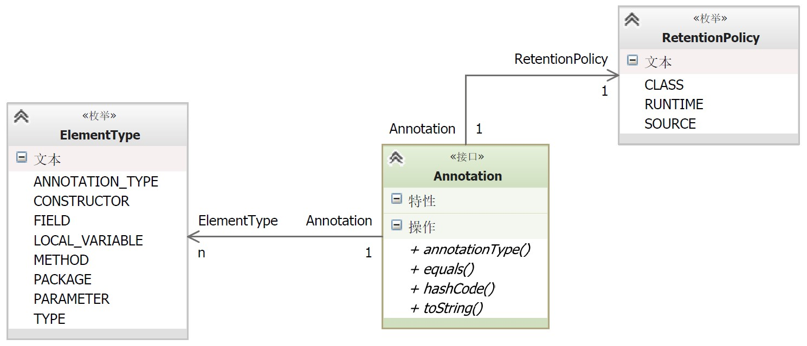
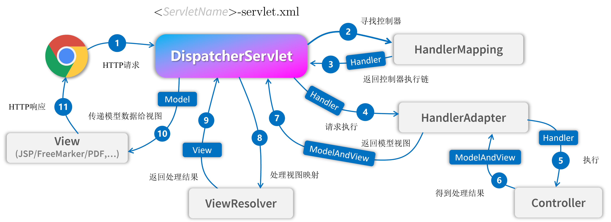
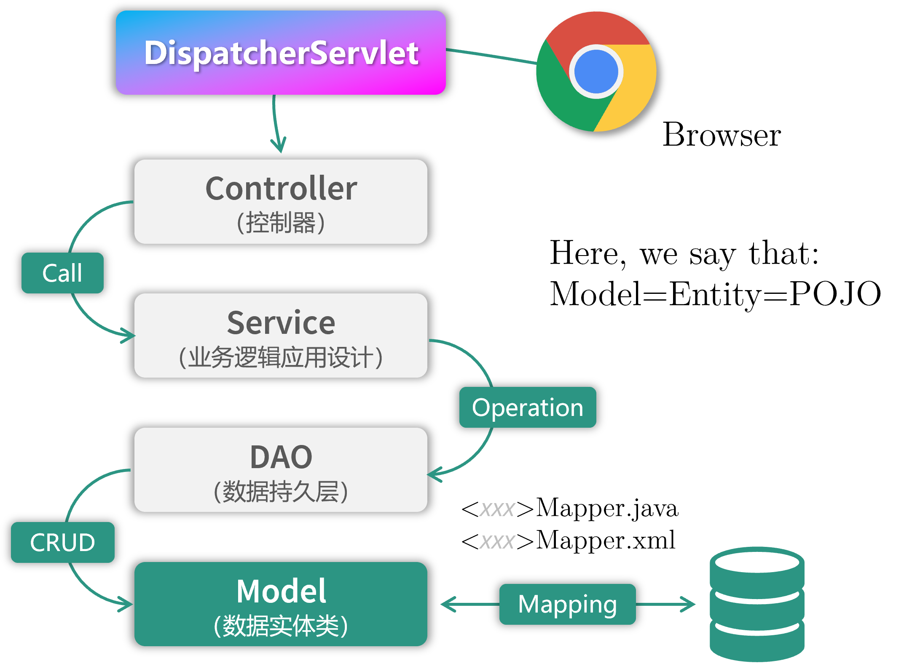
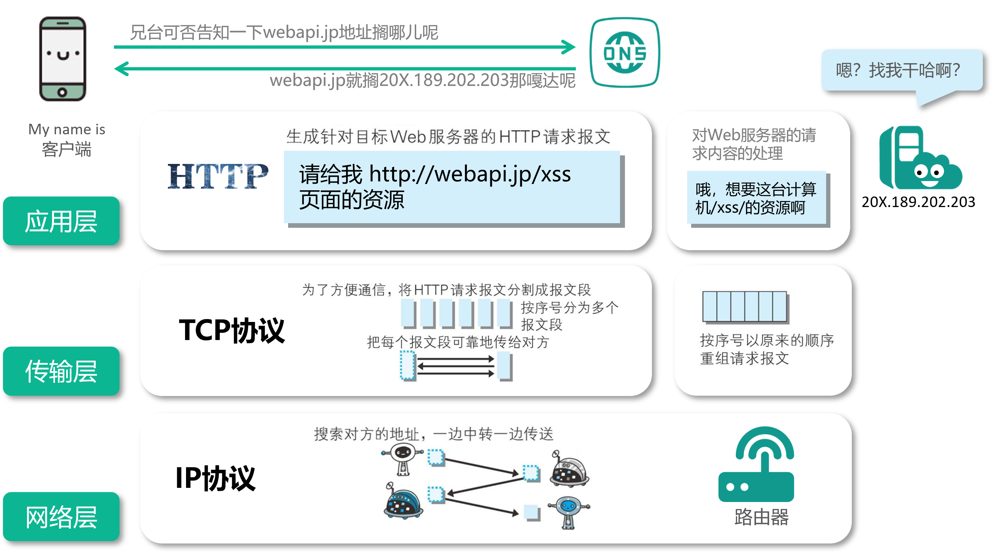
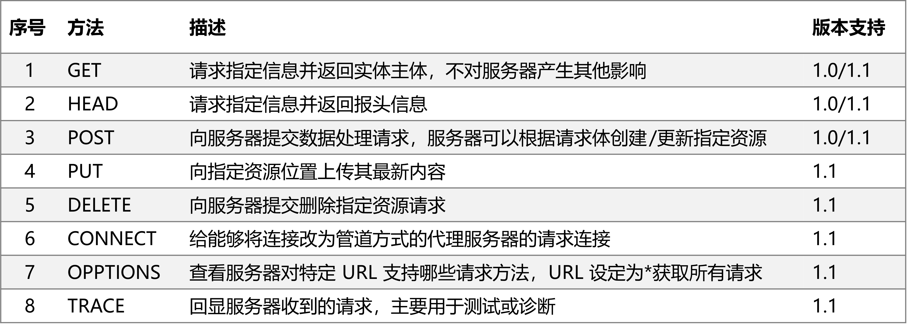
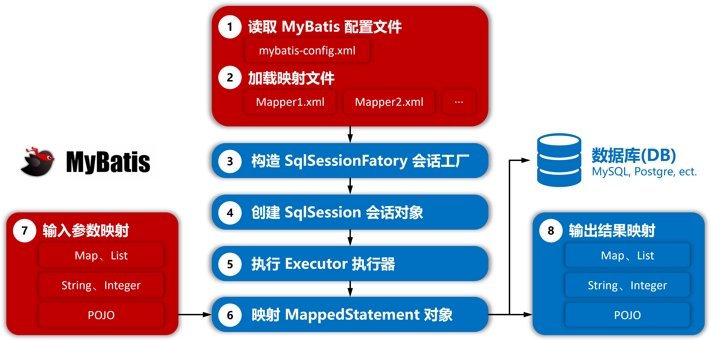
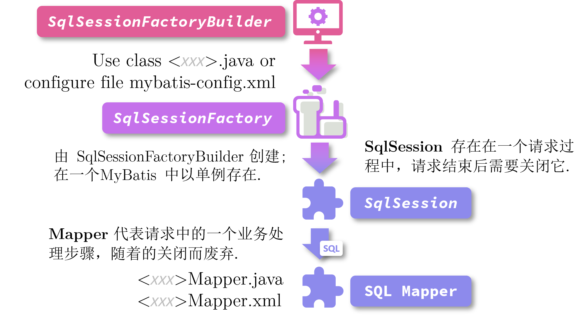

Question List in April, 2021
============================

🌱 When proud pied April, dressed in all his trim, Hath put a spirit of
youth in everything, That heavy Saturn laughed and leapt with him.
《\ *Shakespeare’s Sonnet*\ 》 XCVIII.

.. raw:: html

   <html xmlns="http://www.w3.org/1999/xhtml"><head></head><body><center>菩萨蛮<br />[唐] 温庭筠</center></body></html>

.. raw:: html

   <html xmlns="http://www.w3.org/1999/xhtml"><head></head><body><center><font size="4" face="华文楷体">小山重叠金明灭，鬓云欲度香腮雪。<br />懒起画峨眉，弄妆梳洗迟。<br />照花前后镜，花面交相映。<br />新帖绣罗襦，双双金鹧鸪。</font></center></body></html>

|

   
Q1、PP工具可视化界面
--------------------

PP 工具全称 Photogrammetry Pyramid Building Tools，也可称为 PPBT
程序，原名为 MeshSimplifier，后因主体功能与原名称不符，更名为现在的 PP
工具。

Qt 调用外部程序
~~~~~~~~~~~~~~~

使用 Qt 调用其他 EXE 程序的操作主要在 ``QProcess``
类中进行，这里有几个关键点暂时没搞明白，可能需要留到清明节之后再予以处理了：

-  | 程序调用以及信息反馈
   | a. 在使用 QProcess 调用其他 exe 程序时，指定运行环境在 exe
     程序目录下；
   | b. 如何根据 exe 返回的消息动态刷新界面中的控件消息。

清明节前基本将 Shape 矢量收尾工作提前完成，这里将上月的 Qt
调用外部程序的相关工作挪到本月的 1.1 章节中来进行相关研究和处理。

.. _参考文献-1:

参考文献
~~~~~~~~

1. Github.
   `PyQT5Examples <https://github.com/weih1121/PyQT5Examples>`__.[EB/OL]//
   主要参考了其设置 QScrollbar 样式表的相关代码.

Q2、全景项目
------------

.. _21-滨海新区街景项目:

2.1 滨海新区街景项目
~~~~~~~~~~~~~~~~~~~~

发现了一个问题，对于从左至右 FRAME 递增的 PGR 来说，
程序可能会有点奇奇怪怪的插值错误，得到的插值结果总是会有很大偏差。

1. | ArcPy 批处理：
   | 写好的 ArcPy 作为工具导入到 ArcCatalog
     中后，可以在工具处“右键”，在弹出菜单中选择“批处理”功能来对工具集进行批处理，批处理界面中支持直接从
     Excel
     中复制参数文本；使用时要先创建好对应的批处理个数，并选中全部的条目进行复制才能有效的执行批处理。

2. | Python 编写批处理 PGR 程序：
   | Pgr2gpsInfo.exe
     程序只支持单次文件输入，为了对其进行批处理，可以利用 Python
     工具读取每个街景文件夹中的第一个 PGR
     文件的文件路径，借此以如下形式生成批处理信息，随后在 bat
     文件中执行：
   | ``Pgr2gpsInfo <InputDir> <Outputdir>``

.. _22-能源集团大屏三维系统:

2.2 能源集团大屏三维系统
~~~~~~~~~~~~~~~~~~~~~~~~

大屏三维展示系统共五个需求：三维节点参数显示、负荷区域显示、参数云图、参数指标对比以及缺陷管理等。为了进一步完善相应的系统功能，暂时制定以下工作计划：

将 A3 实景模型替换为蓝模
^^^^^^^^^^^^^^^^^^^^^^^^

实现步骤，找到城市片区的建筑轮廓矢量文件，在 CesiumLab 中转换为 3DTiles
格式或通过 ArcScene 拉伸为 3D
模型，由此得到城市建筑白膜。随后，通过着色器或 Cesium
的材质更改方法为白膜赋予高端科技蓝的蓝色，即可实现通常所说的蓝模。目前采用更改材质的方法，其代码如下：

.. code:: javascript

   // A normal b3dm tileset of photogrammetry
   var tileset = new Cesium.Cesium3DTileset({
     url: Cesium.IonResource.fromAssetId(40866),
   });
   // Set the color of B3DM tileset model
   tileset.style = new Cesium.Cesium3DTileStyle({
     color: "rgba(72, 178, 255, 0.5)",
   });

如果要将白膜变成如下图所示的渐变色，则需要更改着色器的代码[3-4]；暂时看到的相关参考博客中关于着色器代码的修改可以在
Cesium 源码中进行，后续看看是否能找到 Cesium 修改着色器的接口。


这里还用到了在 Cesium
中根据节点名寻找节点的一个简单方法如下。该方法目前存在一个
BUG，就是在模型节点关掉重启之后，背景蓝色模型恢复为白膜了；可能后续在设计时需要修改
Shader 来完成相关操作了。

.. code:: javascript

   viewer.scene.primitives._primitives.map((val)=>{
       if(val.name = "背景蓝模"){
           val.style = new Cesium.Cesium3DTileStyle({
               color: "rgba(72, 178, 255, 0.5)",
           });
       }
   });

前端框架
^^^^^^^^

这里将以此为例，引入一些比较好的 UI
框架实现左侧导航抽屉效果，目前看到的能够拥有较好的抽屉支持效果的前端 UI
框架有：Vuetify、Quassar、Layui、Vant（偏向移动端）、Flutter 以及 Material-UI
框架。个人观感比较好的框架是 Vuetify、Quasar，以及
Layui。没错，列出的顺序代表主观评价。

1. | **AJAX**
   | AJAX， *Asynchronous JavaScript and XML*\ ，译即异步 JavaScript 和
     XML，在 2005 年由 *Jesse James Garrett*
     提出，是一种在无需重新加载整个网页的情况下能够更新部分网页的技术。AJAX
     可以通过在后台与服务器进行少量数据交换而使网页实现异步更新。也就是说，AJAX
     可以在不重新加载整个网页的情况下，对网页的某部分进行更新。jQuery
     库拥有完整的 Ajax
     兼容套件，其中的函数和方法允许我们在不刷新浏览器的情况下从服务器加载数据。

2. | **jQuery**
   | jQuery 是一个 JavaScript 函数库。2005 年 8 月，\ *John Resig*
     提议改进 Prototype 的 Behaviour 库；2006 年8 月, jQuery
     第一个稳定版本面世。自此，一个具有独特的链式语法和短小清晰的多功能接口的、具有高效灵活的
     CSS
     选择器并且可对CSS选择器进行扩展的、拥有便捷插件扩展机制和丰富插件的
     JavaScript 函数库正式在 Web 前端设计中持续发挥它的光和热。

3. | **JSONP**
   | JSONP，JSON with Padding，是 JSON
     的一种数据使用模式，可用于解决主流浏览器的跨域数据访问问题。为了便于客户端使用数据，逐渐形成了一种非正式传输协议，人们把它称作
     JSONP，该协议的一个要点就是允许用户传递一个 Callback
     参数给服务端，然后服务端返回数据时会将这个 Callback
     参数作为函数名来包裹住 JSON
     数据，这样客户端就可以随意定制自己的函数来自动处理返回数据了。

.. _1-三维节点参数显示:

#1 三维节点参数显示
^^^^^^^^^^^^^^^^^^^

首先，修改左侧树的样式为大连海心集团所设计的样式，目前花了一个小时调出来了左侧树顶层标题的样式为大屏系统中设计的样式了；至于左侧树具体的
Hover，Click 等 CSS
样式就留到后面进行设计吧。这里先搞一搞三维节点参数弹出窗体的 HTML
样式。样式包括两个核心点：雷达图、气泡图以及百分比图。

视频方面。目前考虑直接插入一个 MP4 本地视频到窗体标签中，视频内容依托于
H5 的 ``<video>`` 标签。如果考虑后期接入实时视频流，则可以考虑如下 RTSP
网络视频流测试地址：

   .. code:: 

      rtsp://wowzaec2demo.streamlock.net/vod/mp4:BigBuckBunny_115k.mov

   上述测试连接是一个兔子的动画，目前找到的测试流中只有这个能用。

.. _2-负荷区域的三维显示:

#2 负荷区域的三维显示
^^^^^^^^^^^^^^^^^^^^^

经过查看发现封顶立体几何在显示层级不大具有辨识度，所以目前考虑的是勾选
plotGeoJson
绘制立体墙面；将墙面导出后利用左侧树的图层显示按钮来控制负荷区域的显示。

在这里补充一下 js 获取 URL 传入数据的方法，提供一个靠谱的解析 URL
函数如下：

.. code:: javascript

   function getQueryVariable(variable)
   {
       let query = window.location.search.substring(1);
       let vars = query.split("&");
       for (let i=0;i<vars.length;i++) {
           let pair = vars[i].split("=");
           if(pair[0] === variable){return pair[1];}
       }
       return false;
   }

当 URL 中涉及到中文字符串时，直接应用上述函数会得到一个 UrlEncode
后的字符编码，所以还需要增添一个编码转换函数来得到我们想要的结果：

.. code:: javascript

   decodeURI(decodeURI(window.location.search.substring(1)));

.. _3-参数云图:

#3 参数云图
^^^^^^^^^^^

| 采用 EarthSDK 的热力图 ``HeatMap()``
  函数来设计本项目所需要的云图展示功能，其实施要点有：
| A.
  热力图位置参数中的经纬度为弧度制，与度的转换关系为：\ :math:`R=°\cdot\pi/180`\ ；
| B.
  热力图绘制时以实际距离确定统计时各个参数点的位置关系，所以需要设计函数去构建热力图网格参数；
| C. 热力图 ``position`` 参数为其图像中心点位置；
| D. 创建完热力图后如何将热力图移除出场景，MarsGIS 的 Widget
  设计的很有意思，有空看看源码。

.. code:: javascript

   mars3d.widget.bindClass(mars3d.widget.BaseWidget.extend({
       active: function(){},
       disable: function(){}
   }));// 由此来控制热力图的添加和移除
   let h = new XE.Obj.HeatMap(earth);
   h.xbsjFromJSON(config);
   h.destroy();// 销毁热力图并从场景中移除

由此，基本实现参数云图的实现样例；关于数据的衔接、标签的同步显示以及其他内容则需要后期再执行相关的设计和程序编写。此亦为很大的工作量，留待后续再说。

.. _4-参数指标对比:

#4 参数指标对比
^^^^^^^^^^^^^^^

留待下月处理。

.. _参考文献-2:

参考文献
~~~~~~~~

1. CSDN博客.
   `Cesium矢量白膜自定义shader <https://blog.csdn.net/xietao20/article/details/109912117>`__\ [EB/OL].

2. CSDN博客.
   `Cesium实战项目说明 <https://blog.csdn.net/xietao20/article/details/108457857>`__\ [EB/OL].

3. CSDN博客.
   `Cesium深入浅出之3dtiles渲染 <https://blog.csdn.net/fywindmoon/article/details/108414997>`__\ [EB/OL].

4. 博客园.
   `Shader之双色渐变(Cesium) <https://www.cnblogs.com/s313139232/p/14317566.html>`__\ [EB/OL].

5. CSDN博客.
   `cesium给tileset添加名称来控制对应tileset的显示隐藏 <https://blog.csdn.net/A873054267/article/details/88103452>`__\ [EB/OL].

6. 阮一峰. `Flex
   布局教程：语法篇 <http://www.ruanyifeng.com/blog/2015/07/flex-grammar.html>`__\ [EB/OL].

7. Mozilla. `使用 CSS
   弹性盒子 <https://developer.mozilla.org/zh-CN/docs/conflicting/Web/CSS/CSS_Flexible_Box_Layout/Basic_Concepts_of_Flexbox>`__\ [EB/OL].

8. 知乎.
   `Cesium的扩展工具包-EarthSDK使用指南3 <https://zhuanlan.zhihu.com/p/80749244>`__\ [EB/OL].

9. GitHub. `Cesium的扩展工具包
   EarthSDK使用指南5 <https://github.com/cesiumlab/XbsjEarthUI/wiki/Cesium%E7%9A%84%E6%89%A9%E5%B1%95%E5%B7%A5%E5%85%B7%E5%8C%85-EarthSDK%E4%BD%BF%E7%94%A8%E6%8C%87%E5%8D%975>`__\ [EB/OL].

Q3、发改委非首都功能项目
------------------------

开发 Java
微服务。目前接触到的几个专业名词包括：Maven、Gradle、Thymeleaf、JPA、Spring
MVC、Spring
CLI、Bean、Actuator、MyBatis、JDBC、JSP、xmlns、POJO、Grails、Groovy、POI
等等。在入门初期，比较绊脚的是相关的一系列配置以及网络知识，可能需要一点时间来消化。下面简单列一下待学习的提纲：

-  Thymleaf，SpringMVC， JSP 与 序列化

-  HTTP 的 POST、GET、PUT、DELETE 等方法

-  Bean，Maven 与 Gradle 配置

-  Java 的包管理与 Spring Boot 的特性

-  MyBatis，JDBC 与 JPA

-  用 Spring Boot 写接口服务

.. _31-thymeleaf-从入门到吃灰:

3.1 Thymeleaf 从入门到吃灰
~~~~~~~~~~~~~~~~~~~~~~~~~~

是用来开发 Web 和独立环境项目的服务器端的 Java 模版引擎，Spring
官方支持的服务的渲染模板中并不包含 JSP，而是 Thymeleaf 和 Freemarker
等。Thymeleaf 与 SpringMVC 的视图技术及 SpringBoot
的自动化配置集成非常完美，用户只需关注 Thymeleaf 的语法即可。

Thymeleaf 的主要作用是把 Model 中的数据渲染到 HTML
中，因此其语法主要是如何解析 Model 中的数据。JSP 采用 *Expression
Language*, EL 表达式简化书写，Thymeleaf 采用的是与之类似的对象导航图语言
*Object Graph Navigation Language*, OGNL
语法。这里先简单了解到这，后面有需求再说。

.. _32-concepts-of-springboot:

3.2 Concepts of SpringBoot
~~~~~~~~~~~~~~~~~~~~~~~~~~


实在是搞不定了，用《Spring Boot
实战》来入门，感觉还是挺费劲的。遇到问题的话很难继续搞下去，里面的内容实在是有点庞杂，还是需要一个系统的学习过程。

YML 文件
^^^^^^^^

YML，又称 YAML，全称为 *Yet Another Markup Language*\ ，是 Spring Boot
全局配置文件中的一种格式。Spring Boot
的全局配置文件可以有三种格式：application.yml，application.yaml 以及
application.properties；当项目中同时存在这三种格式时，后面的形式会对前面的形式进行覆盖。

1. application.properties 文件采用常规的 ``key=value`` 的语法格式，是
   IntelliJ IDEAR
   创建工程时的默认全局配置文件；使用该文件配置较多参数时，其层次性较弱，不便于阅读；

2. application.yml 文件采用 ``key: value`` 的语法格式，\ ``:``
   后必须跟一个空格 ````
   才能构成完整的语法规则；不同层级的关系用\ **空格**\ 表示,只要是左对齐的一列数据，都是同一层级的，具体规则可参考文献[4]。

该格式具有几种特性：\ **脚本语言**
由于实现简单，解析成本很低，该格式特别适合在脚本语言中使用；\ **序列化**
该格式是由宿主语言数据类型直转，的比较适合做序列化；\ **配置文件**
由于无需关注标签或引号，写 YAML 比写 XML 快得多，并且比 INI
文档功能更强。由于兼容性问题，不同语言间的数据流转建议不要用 YAML 格式。

.. _-注解:

@ 注解
^^^^^^

标题符号的全称是 *Annotation*\ ，译为 Java 注解或 Java 标注，是 JDK5.0
后引入的一种注释机制； Java
中的类、方法、变量、参数和包等都可以被标注。Java
注解可以通过反射获取注解内容，并在编译器生成类文件时将标注嵌入到字节码中，Java
虚拟机可以保留标注内容并在运行时获取相应内容。

**（1）实现机制**

Java
注解机制的实现依赖于三个主干类，分别是：\ ``ElementType``\ 、\ ``RetentionPolicy``
以及 ``Annotation``\ 。其中前两个主干都是枚举类型，\ ``ElementType``
用来指定注解的类型，\ ``RententionPolicy``
用来指定注解的策略，而最后一个主干 ``Annotation``
实际上就是一个接口。三个主干类的关系图如下：



Java
注解的通用定义中使用了四个注解：\ ``@Document``\ 、\ ``@Target``\ 、\ ``@Rentation``
以及 ``@interface``\ ，这些注解都是对定义注解的修饰，其使用方法如下：

.. code:: java

   @Documented
   @Target(ElementType.TYPE)
   @Retention(RetentionPolicy.RUNTIME)
   public @interface MyAnnotation1 {}

| ``@Document`` 可以用来让注解出现在 JavaDoc 中；
| ``@Target`` 作用是指定注解的类型；
| ``@Rentation`` 作用是指定注解的作用域策略；
| ``@interface`` 是一个必须的注解，意味着 ``MyAnnotation1`` 实现了
  ``java.lang.annotation.Annotation``
  接口，注解后其不能继承其他的注解或接口。

**（2）SpringMVC 的常用注解**

模型视图控制器 MVC 中，M 是指业务模型，V 是指用户界面，C
则是控制器，使用 MVC 的目的是将 M 和 V
的实现代码分离，从而使同一个程序可以使用不同的表现形式。其中，View的定义比较清晰，就是用户界面。MVC
是 Xerox PARC 在二十世纪八十年代为编程语言 Smalltalk-80
发明的一种软件设计模式，后来作为 Oracle 旗下 Sun 公司 Java EE
平台的设计模式而为人们所熟知。



Spring MVC 框架主要由中央控制器 DispatcherServlet、处理器映射
HandlerMapping、控制器 Controller、视图解析器 ViewResolver、视图 View
组成，其工作原理如上图所示。

1. | SpringMVC 执行过程：
   | ① 用户发送请求到前端控制器（DispatcherServlet）；
   | ② 前端控制器请求 HandlerMapping 查找 Handler，可以根据 xml
     配置、注解进行查找；
   | ③ 处理器映射器 HandlerMapping 向前端控制器返回 Handler；
   | ④ 前端控制器调用处理器适配器去执行 Handler；
   | ⑤ 处理器适配器执行 Handler；
   | ⑥ Handler 执行完成后给适配器返回 ModelAndView；
   | ⑦ 处理器适配器向前端控制器返回底层对象 ModelAndView；
   | ⑧
     前端控制器请求试图解析器去进行视图解析，根据逻辑视图名来解析真正的视图；
   | ⑨ 试图解析器向前端控制器返回 View；
   | ⑩ 前端控制器进行视图渲染，将 ModelAndView 对象中的模型数据填充到
     request 域；
   | ⑪ 前端控制器向用户响应结果。

2. | 几个重要 SpringMVC 注解：
   | **``@Controller``** 注解负责注入 Controller 类，通过控制器来相应
     HTTP 请求，必须配合模版来使用，Spring Boot
     支持的模板引擎包括：FreeMarker，Groovy，Thymeleaf，Velocity，JSP
     等；
   | **``@RequestMapping``**
     注解为每个请求与处理方法进行对应，其中：\ **方法级别注解** 使用
     value 属性配置 URL 映射参数，\ **类级别注解**\ 的请求直接使用
     “/index”、“/login”
     形式字符串的形式将所有方法映射为类级别的请求，方法中的
     org.springframework.ui.Model 类型参数可以通过
     addAttribute("key","value") 方法在视图中使用 EL 表达式 ``${key}``
     取出 Model 中的值；
   | **``@Autowired``** 是用在 JavaBean
     中的注解，用来给指定的字段或方法装配所需的外部资源[9]；
   | **``@PathVariable``** 可以用来注解方法中的参数，并将其绑定到 URI
     模板变量的值上（注意 Uniform Resource Locator, URL 是 Uniform
     Resource Identifier, URI 概念的一种实现方式），URI 模板
     ”/{userID}/delete“ 指定了变量名字 userID，控制器处理请求时，userID
     的值会被设定到 URI 中，如 “123/delete”，这样就可以获取 URI 中的
     userID 变量的值了；
   | **``@RequestParam``**
     注解负责获取请求参数的值，提供了一种允许用户不输入 ID
     时使用默认值的方法。

关于 SpringMVC 的注解还有
``@ExceptionHandler``\ 、\ ``@GetMapping``\ 、\ ``@RestController``\ 、\ ``@ModelAttribute``
等等，这里就暂时先了解到这里，后面将了解一下 Spring Boot 的几个逻辑层。

框架层级
^^^^^^^^

SpringBoot 框架的业务逻辑是：Controller\ :math:`\rightarrow`\ Service
接口\ :math:`\rightarrow`\ Service 实现\ :math:`\rightarrow`\ DAO
接口\ :math:`\rightarrow`\ DAO实现\ :math:`\rightarrow`
Mapper\ :math:`\rightarrow`\ DB 数据库，按常规设定可以指定为：Entity
实体层，DAO 持久层，Service 业务层以及 Controller 控制层等四个层级，DAO
的全称是 Data Access Object，即数据存储对象 。SpringBoot
框架结构如下图所示：



建立了 DAO 层后才可以建立 Service 层，而 Service 层又是在 Controller
层之下的，因而 Service 层应该既调用 DAO 层的接口，又要提供接口给
Controller
层的类来进行调用，它刚好处于一个中间层的位置。每个模型都有一个 Service
接口，每个接口分别封装各自的业务处理方法。

Java Servlet
^^^^^^^^^^^^

Servlet 全称为 Server Applet，即微服务。Java Servlet 是运行在 Web
服务器或应用服务器上的程序，它是作为来自 Web 浏览器或其他 HTTP
客户端的请求和 HTTP 服务器上的数据库或应用程序之间的中间层。使用
Servlet，可以收集来自网页表单的用户输入，呈现来自数据库或者其他源的记录，还可以动态创建网页。

DispatcherServlet 是前端控制器设计模式的实现，提供 SpringMVC
的集中访问点，负责职责的分派且与 Spring IoC 容器无缝集成，以此获得
Spring 的种种便利。在整个 Spring MVC 框架中，DispatcherServlet
处于核心位置，它负责协调和组织不同组件完成请求处理并返回响应工作。DispatcherServlet
继承自 HttpServlet，它遵循 Servlet 里的 “init-service-destroy”
三个阶段。

JSP 网页
^^^^^^^^

JSP 全称 Java Server Pages，是一种动态网页开发技术。它使用 JSP 标签在
HTML 网页中插入 Java 代码。标签通常以 ``<%`` 开头以 ``%>`` 结束。JSP
是一种 Java Servlet，主要用于实现 Java Web
应用程序的用户界面部分。网页开发者们通过结合 HTML 代码、XHTML 代码、XML
元素以及嵌入 JSP 操作和命令来编写 JSP。JSP
通过网页表单获取用户输入数据、访问数据库及其他数据源，然后动态地创建网页。JSP
标签有多种功能，比如访问数据库、记录用户选择信息、访问 JavaBeans
组件等，还可以在不同的网页中传递控制信息和共享信息。

Java 序列化
^^^^^^^^^^^

| 序列化[13]：将对象写入到 IO 流中；
| 反序列化：从 IO 流中恢复对象；
| 意义：序列化机制允许将实现序列化的 Java
  对象转换为字节序列，该序列可以保存在磁盘或通过网络进行传输，转换后的序列通过处理还可以恢复成原来的对象；序列化机制使得对象可以脱离程序的运行而独立存在。
| 使用场景：所有可在网络上传输的对象都必须是可序列化的，比如远程方法调用
  RMI，Remote Method
  Invoke，传入的参数或返回的对象都是可序列化的，否则会出错；所有需要保存到磁盘的
  Java 对象都必须是可序列化的。通常建议：程序创建的每个 JavaBean
  类都实现 Serializeable 接口。

Java Bean
^^^^^^^^^

爪哇豆是本人对 JavaBeans 的戏称，作为 Java 的公共类最初是为 Java GUI
的可视化编程实现的。爪哇豆有几种衍生，如普通 Java 对象 Plain Ordinary
Java Object，POJO 等；在逻辑层上有实体 Entity 、实体 Model
等。从狭义来说，指的是 JavaBeans 规范也就是位于 java.beans 包中的一组
API；从广义上来说，JavaBeans 指的是一系列的 API 集合，比如 Enterprise
JavaBeans。

符合以下四个规范： 所有属性为 private；提供默认构造方法；提供 getter 和
setter；实现 serializable 接口编写的类才是
JavaBean；在此基础上实现了一些要求的就是 EJB，否则就是普通 Java 对象
POJO。

Apache POI
^^^^^^^^^^

Apache POI 是基于Office Open XML标准（OOXML）和 Microsoft 的 OLE 2
复合文档格式（OLE2）处理各种文件格式的开源项目；用它可以使用 Java
读取和创建, 修改 MS Excel 文件. 而且, 还可以使用 Java 读取和创建 MS Word
和 MSPowerPoint 文件。Apache POI 提供 Java 操作 Excel 解决方案（适用于
Excel97-2008）。与之具有相似功能的 Excel 基础库还有 Excelize。

.. _33-hello-world:

3.3 Hello World
~~~~~~~~~~~~~~~

参照 StaticleoWay 博客所完成的第一个 SpringBoot
登录程序宣告完成啦[3]，感谢原 PO
主（QAQ）。这个实例程序中完整地复现了上面所述的 SpringBoot
框架层级：Mapper、POJO、DAO、Service 以及 Controller 层。由此简单了解了
MySQL 数据库以及 MyBatis
的简单应用。下面的学习进程是学习齐哥（曹中齐）的后端 Java
接口服务的相关代码，了解目前后端技术的简要内容。

SpringBoot+Vue
^^^^^^^^^^^^^^

实战课程学习前后端分离开发技术。编译别人代码时遇到的诸多包的问题可以参考设置设置
Maven > Runner > Delegate IDE build/run actions to
Maven，也就是将IDE构建/运行操作委托给 Maven 。

Swagger 接口文档
^^^^^^^^^^^^^^^^

通过 Swagger
定义接口及接口相关的信息，就可以做到生成各种格式的接口文档以及在线接口调试页面等等。这样一来，如果按照新的开发模式，在开发新版本或者迭代版本的时候，只需要更新
Swagger
描述文件，就可以自动生成接口文档和客户端服务端代码，做到调用端代码、服务端代码以及接口文档的一致性。

掌握接口文档的使用方法。在若依框架中的 Swagger 服务启动地址是：

.. code:: 

   https://localhost:8080/swagger-ui.html?urls.primaryName=ruoyi-system#/

这样的话，哪怕若依微服务的前端 Vue
框架服务没启动起来，也照样可以用接口文档调试了。

HTTP 的几种请求
^^^^^^^^^^^^^^^

HTTP，HyperText Transfer Protocol，超文本传输协议；是因特网上一个基于
TCP/IsP 通信协议来传递数据的应用最为广泛的一种网络传输协议，所有的 WWW
文件，即 World Wide Web
万维网文件都必须遵守这个标准。关于超文本传输协议有几点内容需要了解：



   | **统一资源定位器** Uniform Resource Locator，URL
   | 使用数字和字母来代表网页文件在网上的地址。Web
     上所能访问的资源都有唯一的 URL。URL
     包括所用的传输协议、服务器名称、文件的完整路径。标准的URL由3部分组成：协议类型、主机名和路径名。

   | **协议类型** Hyper Text Transfer Protocol over SecureSocket Layer
   | HTTPS 是以安全为目标的 HTTP 通道，在HTTP的基础上加入安全套接字协议
     Secure Sockets
     Layer，SSL，通过传输加密和身份认证保证了传输过程的安全性；HTTP
     默认端口为 80，而 HTTPS 的默认端口为 443。

当浏览器向 Web
服务器发出请求时，它向服务器传递了一个请求信息数据块，该数据块由 3
部分组成：请求行，请求头以及请求正文。其中请求行的格式是：\ ``请求方法 URI 协议/版本``\ 。HTTP
1.0 中定义了 3 种请求方法，而在 HTTP 1.1 中又新增了 5 种；所以目前的
HTTP 协议一共包括 8 种请求方法：



方法名称区分大小写，当某个请求所针对的资源不支持对应的请求方法时服务器应当返回状态码
405（Mothod Not
Allowed）；当服务器不认识或者不支持对应的请求方法时应返回状态码 501（Not
Implemented）。

.. _34-若依框架:

3.4 若依框架
~~~~~~~~~~~~

齐哥从达哥手中学到了 Java
前后端框架“若依”，并将其微服务版作为发改委对接争取北京非首都功能央企来津投资智慧管理平台的后端服务提供框架，由此精简一下学习过程，暂且了解怎么使用即可。

MyBatis
^^^^^^^

MyBatis 是一款优秀的持久层框架，它支持自定义
SQL、存储过程以及高级映射，且免除了几乎所有的 JDBC
代码中设置参数和获取结果集的工作；MyBatis 可以通过 XML
配置或注解两种方式来映射原始类型、接口、POJO
等数据并将记录反馈到数据库中。MyBatis 的工作原理如下图所示：



1. | MyBatis 工作流程：
   | ① 读取配置文件：mybatis-config.xml 配置了数据库连接等 MyBatis
     运行环境等信息；
   | ② 加载 SQL 映射文件：该文件中配置了操作数据库的 SQL
     语句，mybatis-config.xml
     文件可以加载多个映射文件，每个文件对应数据库中的一张表；
   | ③ 构造会话工厂：通过 MyBatis 的环境等配置信息构建会话工厂
     SqlSessionFactory;
   | ④ 创建会话对象：由会话工厂创建 SqlSession 对象，该对象中包含了执行
     SQL 语句的所有方法;
   | ⑤ Executor 执行器：MyBatis 底层定义了一个 Executor
     接口来操作数据库，它将根据 SqlSession
     传递的参数动态地生成需要执行的 SQL 语句，同时负责查询缓存的维护；
   | ⑥ MappedStatement 对象：在 Executor 接口的执行方法中有一个
     MappedStatement
     类型的参数，该参数是对映射信息的封装，用于存储要映射的 SQL 语句的
     id、参数等信息；
   | ⑦ 输入参数映射：输入参数映射过程类似于 JDBC 对 preparedStatement
     对象设置参数的过程；
   | ⑧ 输出结果映射：输出结果映射过程类似于 JDBC 对结果集的解析过程。

2. | MyBatis 核心组件如下图所示：
   | ① 构造器：它会根据配置或者代码来生成
     SqlSessionFactory，采用的是分步构建的 Builder 模式；
   | ② 工厂接口：依靠它来生成 SqlSession，使用的是工厂模式；
   | ③ 会话：一个既可以发送 SQL 执行返回结果，也可以获取 Mapper 的接口；
   | ④ 映射器：由会话工厂创建 SqlSession 对象，该对象中包含了执行 SQL
     语句的所有方法。



名词解释 *session*\ ：session, n.一段时间,
学年；当访问服务器否个网页的时候,会在服务器端的内存里开辟一块内存,这块内存就叫做
session，而这个内存是跟浏览器关联在一起的。

前后端服务部署
^^^^^^^^^^^^^^

启动前端代码遇到 While resolving: ruoyi@2.5.0 Found: webpack@5.20.2
Found: webpack@5.20.2 错误时，可以用 yarm 替换 npm 工具来安装包[18]：

.. code:: shell

   npm install -g yarn
   yarn install
   yarn run dev

..

   ：Yarn 是一个由 Facebook 贡献的 Javascript
   包管理器，是一款具有快速、可靠、安全等特性的依赖管理工具，能够在安装包工作流程方面与
   npm 或 Bower 保持相同。

启动 Redis 日志服务的代码是：

.. code:: shell

   redis-server --service-install redis.windows.conf --loglevel verbose

遇到 CreateService failed
错误的解决方式是：首先关掉启动的服务，随后卸载重装服务：

.. code:: shell

   redis-server --service-stop                       //关闭服务
   redis-server --service-uninstall                  //卸载服务
   redis-server --service-install redis.windows.conf //重装服务
   redis-server --service-start                      //启动服务

服务发布
^^^^^^^^

通过 Tomcat 服务器来部署 War 包进行 Java 微服务的发布是一种 War
服务发布方式，而若依采用的是 Jar
包服务发布的发布方式，具体操作方式为：首先生成 jar 包，随后将 jar
包拷贝到服务器上，依次调用如下代码：

.. code:: shell

   java -Dfile.encoding=UTF-8 -jar ruoyi-auth.jar
   java -Dfile.encoding=UTF-8 -jar ruoyi-gateway.jar
   java -Dfile.encoding=UTF-8 -jar ruoyi-modules-system.jar

由此，即可完成更新代码在服务器上的部署，而服务器端除了要先启动 Nacos
服务并进行配置外并没有什么更深层次的东西需要处理。

MySQL 数据库备份
^^^^^^^^^^^^^^^^

在文件夹中新建 BAT
文件，填写如下内容，此批处理文件旨在调用数据库的导出功能，根据系统时间自动生成数据库的备份文件到指定目录下。

.. code:: shell

   rem ************************* Code Start ********************************
   @echo off
   set ymd=%date:~,4%%date:~5,2%%date:~8,2%%
   for /f "tokens=1-3 delims=.: " %%1 in ("%time%") do set ymd=%ymd%-%%1m%%2s
   echo FileName=%ymd%
   cd C:\Program Files\MySQL\MySQL Server 5.7\bin
   mysqldump --default-character-set=utf-8 --opt -u xxgcy --password="Fgwxm" ry-cloud > 
   C:\User\Administrator\Documents\backup\bbs_%ymd%.sql
   @echo on
   rem ************************** Code End ********************************

Windows 系统开启备份操作可以通过 Windows 计划任务命令，即 “taskschd.msc”
来执行定时操作；而 Linux
系统的备份更为简单，似乎可以通过简单命令行来实现。

另外，如果需要其他计算机也能访问本机 MySQL 数据库，需要在 MySQL Command
Line Client 中依次执行以下两条语句修改数据库的 root
权限，注意语句末尾要加分号：

.. code:: sql

   use mysql;                                     --使用本机的 mysql 数据库
   select host from user where user='root';       --查看 root 的 IP
   update user set host='%' where user='root';    --更新 root 的 IP
   flush privileges;                              --使配置立即生效

数据库中文字符编码
^^^^^^^^^^^^^^^^^^

使用 MySQL
数据库存储中文数据时需要注意两点：其一是要将创建数据库的字符编码修改为
utf8，字符排序规则可以参考 utf8_general_ci；其二是要在部署环境中将 MySQL
数据库的字符编码修改为
utf8，否则在写接口进行数据库查询时往往会遇到查询不到结果的问题，修改方法参考[20]：

.. code:: shell

   # 打开 my.ini 数据库配置文件
   C:\ProgramData\MySQL\MySQL Server 5.7\my.ini
   # 修改配置文件，在 [client]、[mysqld] 下分别添加一行配置
   [client]
   default-character-set=utf8
   [mysqld]
   character-set-server=utf8
   # 注意在 MySQL5.7 中，不需要在 [mysql] 或者 [mysqld] 下添加 default-character-set=utf8，否则服务会启动不起来
   # Win+R 快捷键调出 Windows 服务界面
   services.msc
   # 找到其中的 MySQL 数据库服务
   MYSQL57
   # 重启服务即可

.. _35-jeecg-框架:

3.5 JEECG 框架
~~~~~~~~~~~~~~

JeecgBoot 是一款基于BPM的低代码平台！前后端分离架构 SpringBoot
2.x，SpringCloud，Ant Design & Vue，Mybatis-plus，Shiro，JWT
等，支持微服务。强大的代码生成器让前后端代码一键生成，实现低代码开发，
其引领新低代码开发模式 OnlineCoding-> 代码生成器-> 手工MERGE，
帮助Java项目解决70%的重复工作，让开发更多关注业务，既能快速提高效率，节省研发成本，同时又不失灵活性，一系列低代码能力：Online表单、Online报表、Online图表、表单设计、流程设计、报表设计、大屏设计等等。

.. _参考文献-3:

参考文献
~~~~~~~~

1.  51CTO博客. `记一次 Spring Boot
    搭建过程 <http://blog.51cto.com/14402006/2409528>`__\ [EB/OL].

2.  博客园. `使用 IDEA 创建一个 Spring Boot
    项目 <http://cnblogs.com/little-rain/p/11063967.html>`__\ [EB/OL].

3.  CSDN博客. `SpringBoot+Thymeleaf, POST
    方式实现登录 <https://blog.csdn.net/qq_42595527/article/details/110495208>`__\ [EB/OL].

4.  KeatsCoder. `SpringBoot 入门及 YML
    文件详解 <http://www.likecs.com/show-68517.html>`__\ [EB/OL].

5.  菜鸟教程. `Java
    注解 <https://www.runoob.com/w3cnote/java-annotation.html>`__\ [EB/OL].

6.  CSDN博客. `SpringBoot
    中常用注解介绍 <https://blog.csdn.net/u010412719/article/details/69710480>`__\ [EB/OL].

7.  博客园.
    `SpringMVC详解（二）------详细架构 <https://www.cnblogs.com/ysocean/p/7375405.html>`__\ [EB/OL].

8.  迹_Jason.
    `SpringMVC之Controller常用注解功能全解析 <https://segmentfault.com/a/1190000005670764>`__\ [EB/OL].

9.  CSDN博客.
    `@Autowired用法详解 <https://blog.csdn.net/onceing/article/details/89456290>`__\ [EB/OL].

10. 知乎. `Java bean
    是个什么概念？ <https://www.zhihu.com/question/19773379>`__\ [EB/OL].

11. 涂诣.
    `SpringBoot框架中各层（DTO、DAO、Service、Controller）理解 <https://www.cnblogs.com/tooyi/p/13340374.html>`__\ [EB/OL].

12. 简书.
    `SpringBoot四层结构 <https://www.jianshu.com/p/dcaaa8b9d47f>`__\ [EB/OL].

13. 博客园.
    `java序列化，看这篇就够了 <https://www.cnblogs.com/9dragon/p/10901448.html>`__\ [EB/OL].

14. Mr.Li. `程序包Org.Springframework.Boot
    不存在 <https://www.cnblogs.com/chenghu/p/13912969.html>`__\ [EB/OL].

15. C 语言中文网. `Java
    Mybatis框架入门教程 <http://c.biancheng.net/mybatis/>`__\ [EB/OL].

16. 若依. `RuoYi-Cloud <http://doc.ruoyi.vip/ruoyi-cloud/>`__\ [EB/OL].

17. 程序汪.\ `若依项目部署阿里云
    Centos8 <https://mp.weixin.qq.com/s?__biz=Mzg2ODU0NTA2Mw==&mid=2247484347&idx=1&sn=087b67ecbd0896146f4787dfe55d52be&source=41#wechat_redirect>`__\ [EB/OL].

18. Gitee.\ `npm install
    报错 <https://gitee.com/y_project/RuoYi-Cloud/issues/I371IH>`__\ [EB/OL].

19. CSDN.\ `在 WINDOWS 上安装 redis
    服务 <https://blog.csdn.net/qq_40897648/article/details/83819544>`__\ [EB/OL].

20. 博客园.\ `Windows下MySQL5.7版本中修改编码为utf-8 <https://www.cnblogs.com/tanghaorong/p/11923849.html>`__\ [EB/OL].

21. Mozilla 基金会.
    `HTTP概述 <https://developer.mozilla.org/zh-CN/docs/Web/HTTP/Overview>`__
    [EB/OL].

22. roverliang.\ `TTP协议——
    简单认识TCP/IP协议 <https://www.cnblogs.com/roverliang/p/5176456.html>`__\ [EB/OL].
