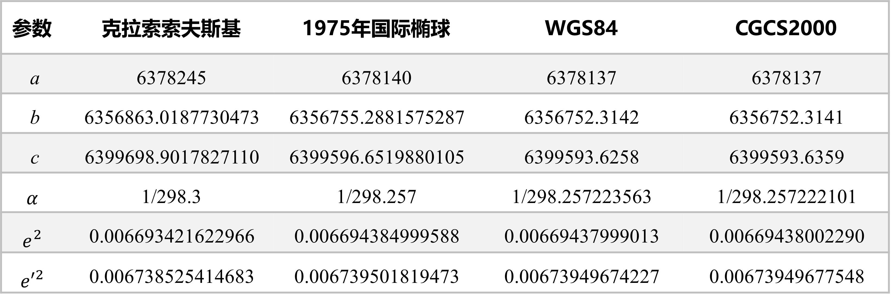
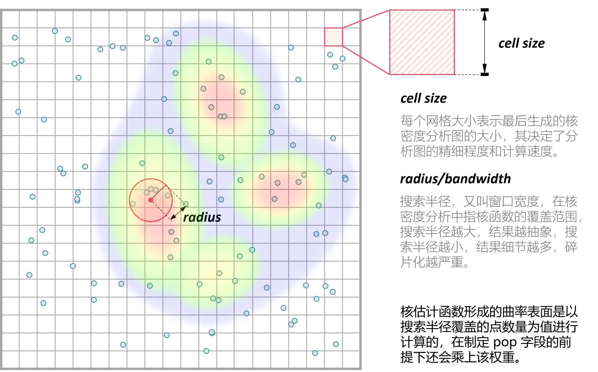
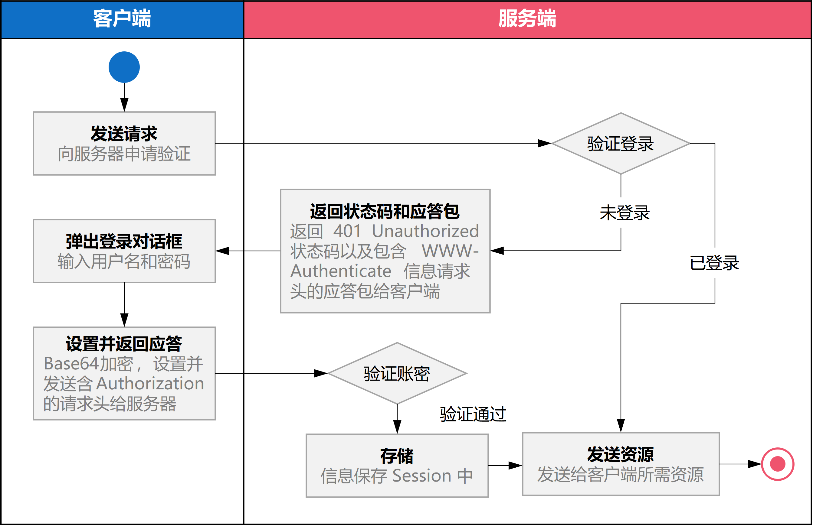
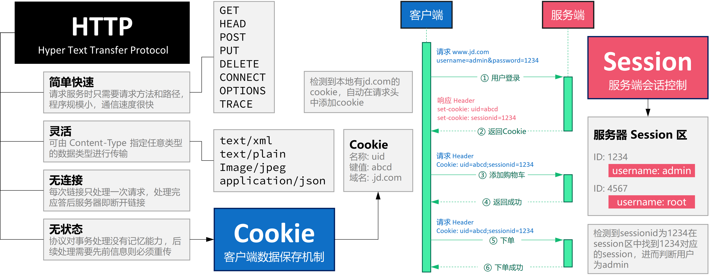
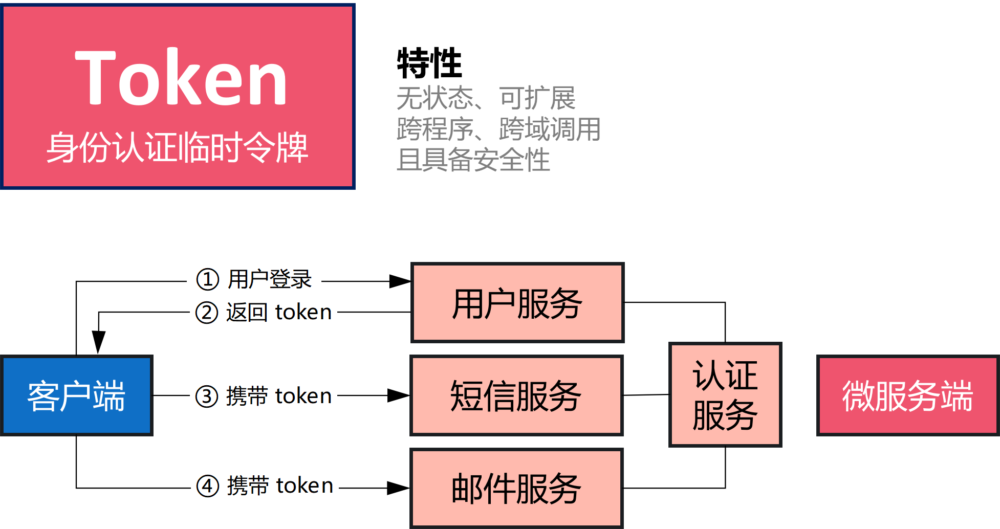
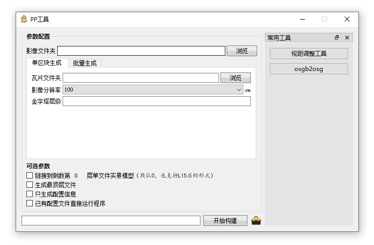

Question List in May, 2021
==========================

🐦 The birds singing in the morning, everything is ready to get up in
this summer.

“在为卖而买的过程中，开端和终结是一样的，都是货币，都是交换价值，单是由于这一点，这种运动就已经是没有止境的了。…因此，每一次为卖而买所完成的循环的终结，自然成为新循环的开始。…作为资本的货币的流通本身就是目的，因为只是在这个不断更新的运动中才有价值的增殖。因此，资本的运动是没有限度的。…为卖而买，或者说的完整些，为了贵买而买，即
G-W-G’…事实上是直接在流通领域内表现出来的资本的总公式。”摘自马克思《资本论》。

注：\ :math:`G-W-G'` 是指 “货币—商品—货币” 的流通形式，这里的
:math:`G'=G+\Delta G`\ ，是原有商品价值附加了剩余价值后所完成的价值的增殖。

Q1、能源集团大屏三维系统
------------------------

**【重大发现】html5tricks 网站资源的解压密码为\ ``RJ4587``\ ！望牢记。**

大屏三维展示系统共五个需求：三维节点参数显示、负荷区域显示、参数云图、参数指标对比以及缺陷管理等。上月已基本搭建完成相关内容的雏形，现对某些细节执行下一步的完善：

.. _11-三维节点参数显示:

1.1 三维节点参数显示
~~~~~~~~~~~~~~~~~~~~

三维节点参数显示对左侧树功能进行完善，执行了以下三个步骤：首先，利用
jQuery 搭建抽屉式导航菜单布局；其次，修改 CSS
代码定制科技风样式；最后，修改相应 js 逻辑代码触发 ztree 双击跳转事件。

jQuery 导航抽屉
^^^^^^^^^^^^^^^

上个月本打算使用 Layui 进行抽屉插件的设计和应用，但后来发现 Layui
所提供的抽屉折叠效果是非平滑的，不符合项目需求，且由于没有别的用处而会为项目引入冗余包
layui。通过调查发现，jQuery 库本身拥有非常强大的平滑功能，该功能由函数
``slideToggle()`` 实现，故而直接使用如下 js 代码控制菜单折叠显示：

.. code:: javascript

   // 控制菜单的折叠展开以及菜单项的点击样式
   $(document).ready(function() {
       $("#nav-pane .menu-body:eq(0)").show();
       $("#nav-pane h3.menu-head").click(function() {
           $(this).addClass("current").next("div.menu-body").slideToggle(300).siblings("div.menu-body").slideUp("slow");
           $(this).siblings().removeClass("current");
       });
       $("#nav-pane a").click(function() {
           $(this).addClass("ding");
           $("#nav-pane *").not(this).removeClass("ding");
           // 触发跳转事件
           let name = this.innerText;
           clickItemByName(name);
       });
   });

其中 html 中的主框架布局如下所示：

.. code:: html

   <!-- 集团组织机构图层控制菜单 -->
   

       

           

           

           

           

       

       

           
集团

           

           

           

       

   

由此基本实现了抽屉式导航抽屉的逻辑层构建。而为了使系统具备更加美观的效果，我们还需要为框架引入相关的测试数据并定制
CSS 科技框样式，本文的科技框样式已放入 CodePen 中。

数据与样式设计
^^^^^^^^^^^^^^

这里涉及到 JS 代码读取本地 JSON 数据的相关策略，即：首先在 data
文件夹中创建一个 js 文件，里面用一个函数体包裹相应的 JSON 数据，如下：

.. code:: javascript

   initTree({
       "L1":[
           {"id":"G01","name":"滨海热电"},
           {"id":"G02","name":"城安热电"},
       ]
   })//示例 JSON 数据文件

然后在 HTML 中通过相关代码进行数据读入：

.. code:: html

   

这里要注意的是，函数处理在回调函数 ``initTree()``
中执行；利用这种机制可以实现本地 JSON 的直接读取，而无需使用 jQuery
的服务器式网络读取，从而避免了读取本地配置文件时跨域问题的产生。关于数据框的样式，这里可以使用
div 组件与 CSS 的协同控制来实现，实现可以参照参考文献[2]中的实例。

Ajax 数据更新
^^^^^^^^^^^^^

关于 HTTP 超文本传输协议以及 URL
统一资源定位器的研究是展开网络端相关工作的基础，虽然这两个东西已经查询过很多遍了，但还是容易忘记，这里对其作个简单记录。

引用别人对这两个重要概念的论述：

   **HTTP 超文本传输协议**\ （Hypertext transfer protoco）

   即超文本传输协议，其规定了浏览器与互联网的沟通规则，实现了用户从互联网接收超文本文档的功能特性，其是用于\ **从服务器传输超文本到本地**\ 的一种高效的无状态传送应用层协议，它是\ **无状态、无连接的**\ 。HTTP
   是 TCP/IP 的应用层协议，其默认的端口号为 80。

关于 URL 资源定位器：

   **URL 统一资源定位器**\ （Uniform Resource Locator）

   因特网上的可用资源可以用简单字符串来表示，该文档就是描述了这种字符串的语法和语义。而这些字符串则被称为：统一资源定位器
   URL。进一步理解是，在 WWW
   上，每一信息资源都有统一的且在网上唯一的地址，该地址就叫 URL，它是
   WWW 的统一资源定位标志，就是指网络地址。

.. _12--参数热力图与直方图:

1.2 参数热力图与直方图
~~~~~~~~~~~~~~~~~~~~~~

上月基本完成了热力图的示例功能，本月还需完成直方图功能的设计以及参数展示功能的进一步完善，主要需要实现的内容是根据参数层级、参数指标来动态绘制热力图与直方图。在热力图设计时，发现用于展现热力图信息的地理坐标在一定程度上有所偏移，故而使用大地测量学的知识来将模糊计算进一步精确。

子午圈弧长、平行圈弧长公式
^^^^^^^^^^^^^^^^^^^^^^^^^^

在 Cesium 系统框架中使用的参考椭球是 WGS84
椭球，为了便于日后计算相关参数，这里列举一些常用的大地测量学参考椭球如下表所示：

代入 WGS84 椭球参数，可得到子午圈弧长计算公式如下：

.. math::

   \begin{align}
   X&=a_0B-\frac{a_2}{2}\sin 2B+\frac{a_4}{4}\sin 4B-\frac{a_6}{6}\sin 6B+\frac{a_8}{8}\sin 8B\\
   &=111132.953B°-16038.509\sin2B+16.833\sin4B-0.022\sin6B
   \end{align}

代入 WGS84 椭球参数，可得到纬度 B 处的平行圈弧长计算公式如下：

.. math::

   \begin{align}
   S&=N\cos B\frac{\Delta L^{''}}{\rho^{''}}=\frac{a\cos B}{\sqrt{1-e^2sin^2B}}\frac{\Delta L^{''}}{\rho^{''}}=\frac{6378137\cdot\cos B}{\sqrt{1-0.00669437999013\sin^2B}}\frac{\Delta L^{''}}{\rho^{''}}
   \end{align}

其中，\ :math:`\rho`
为测绘工程中常用的由秒转换为弧度的转换常数，其数值为
206265。由此即可计算 WGS84
坐标系下大范围经纬度坐标与实际地面距离之间的转换关系了。

热力图绘制原理
^^^^^^^^^^^^^^

百度百科中对热力图的定义是以特殊高亮的形式显示访客热衷的页面区域和访客所在的地理区域的图示，这一概念是由软件设计师
*Cormac Kinney* 于 1991
年提出并创造的。一般实现热力图的参数主要有两个：二维坐标和当前坐标点的数据值，合起来构成一个三维的数据向量：

.. math:: {\mathbf H}=\begin{bmatrix}x&y&v\end{bmatrix}^T

其中，\ :math:`(x,y)` 构成二维平面的坐标点，\ :math:`v` 表达坐标点
:math:`(x,y)` 的特定参数值。令
:math:`\mathbb X^2=\{x,y\ |\ x,y\in\mathbb R\}`\ ，为便于理解和书写代码也可将
:math:`\mathbf H` 写成集合的形式如
:math:`\mathbb H^3=\{\mathbb x,v\ |\mathbb x\in \mathbb X^2,v\in\mathbb R\}`
。则热力图旨在对集合 :math:`\mathbb H^3` 进行密度分析和图像绘制。

需要注意的是热点图与热力图的区分。热点图是根据高值或低值进行聚类形成聚类区域的，而热力图则是根据空间位置上的密集程度进行聚类区域的划分的；也就是说热点图是值
:math:`v` 强相关的，而热力图是空间 :math:`\mathbb x`
强相关的。所以在某种意义上也可以将热力图称之为核密度分析图。

**（1）核密度分析图**

ArcGIS
中对点要素的核密度分析是指用于计算每个栅格像元周围的点要素的密度。

   概念上，每个点上方均覆盖着一个平滑曲面。在点所在位置处表面值最高，随着与点的距离的增大表面值逐渐减小，在与点的距离等于\ **搜索半径**\ 的位置处表面值为零。仅允许使用圆形邻域。曲面与下方的平面所围成的空间的体积等于此点的
   **Population 字段**\ 值，如果将此字段值指定为 NONE 则体积为
   1。每个输出栅格像元的密度均为叠加在栅格像元中心的所有核表面的值之和。核函数以
   Silverman 的著作（1986 年版，第 76 页，equation
   4.5）中描述的四次核函数为基础。

由于核密度分析的中心思想是用概率密度函数估计样本数据周围邻域的数据情况，而核密度估计所做的工作就是估测所给样本数据的概率密度函数。即令概率密度函数为
:math:`f(x)`\ ，则其累积分布函数为：

.. math:: F(x)=\int_{-\infty}^xf(x)dx

由微分思想可反知某一点 :math:`x` 的概率密度函数：

.. math::

   \begin{align}
   f(x_0)&=F'(x_0)=\lim_{h\to0}\frac{F(x_0+h)-F(x_0-h)}{2h}
   \end{align}

引入累积分布函数的经验分布函数并进行相应的公式推导可得到 :math:`f(x)`
的表达式为：

.. math:: f(x)=\frac{1}{nh}\sum_{i=1}^nK_0\left(\frac{|x-x_i|}{h}\right)

式中，\ :math:`h` 是核密度估计中的带宽，也就是 ArcGIS
中所说的搜索半径。对于 ArcMap
的核密度分析工具而言，通常采用的四次核函数呈现如下形式：

.. math:: K_0(t)=\frac{3}{\pi}\cdot\left(1-t^2\right)^2

延续上文的公式，进一步得到的概率密度估测函数为：

.. math:: f(x,y)=\frac{1}{n\cdot (radius)^2}\sum_{i=1}^n\left(v_i\cdot K_0\left(\frac{dist_i}{radius}\right)\right)

式中：

| :math:`i=1,2,\cdots,n` 是输入点，如果它们位于 :math:`(x,y)`
  位置的半径距离内，则仅包括总和中的点；
| :math:`v_i` 是给定的权重字段，若不包含该字段则取值为 1；
| :math:`dist_i` 为点 :math:`i` 和 :math:`(x,y`)
  位置之间的距离，\ :math:`n` 为 POI 点的个数。
| :math:`radius` 为搜索半径，也就是核函数的带宽，参见参考文献[24]。

**（2）heatmap.js 绘制机制**

由此，即可知晓核密度分布函数的理论依据。当然在 heatmap.js 中使用前端
Canvas 渲染策略所渲染的热力图中并没有采用像 ArcGIS
理论这样复杂和精准的理论公式计算，而是采用了一种点模板和透明度叠加策略的前端热力图渲染策略，以此减少图像生成时间并提供实时新增热力点位予以生成热力图的功能。

注意到在 EarthSDK 中利用 heatmap.js
创建热力图时，其使用的数据要转化成整数格式，即使用 ``>>0``
来将二维平面坐标点 :math:`(x,y)` 转换为栅格整数形式。另外这里的
heatmap.js 仍保有核密度分析中的 radius
这一概念。关于其源码和设计机制的解读可以参考参考文献[26]。

▇ \ **点模板**\ 
点模板对应热力图数据点；它是一个圆点，根据可配置的模糊因子（blurFactor，默认.85）借助
Canvas 的 ``createRadialGradient()`` 函数使圆点带有模糊效果。

▇ \ **透明度叠加**\  透明度叠加是热力图的灵魂，在 RGB 通道之外的 A
通道施加近似线性的透明度叠加策略；该策略源自于透明度叠加算法 Alpha
Blending Algorithm，该算法中的 Alpha 通道由 1970 年代末期的 *Alvy Ray
Smith* 提出并在 1984年由 *Thomas Porter* 和 *Tom Duff*
进行了全面开发。混合算法包含 over、in、out、atop 以及 xor
等合成代数所指代的颜色混合。如对图像 A 和图像 B 的 Alpha 通道的 over
混合策略是：

.. math:: \alpha_0=\alpha_a+\alpha_b\cdot(1-\alpha_a)

在 heatmap.js
中对透明度叠加的策略是在上面策略基础上的进一步拓展，是一种综合考虑所有数据点存在混合可能性的一种近似混合策略，当前点的全局透明度计算公式为：

.. math:: \alpha_g=(v-v_{\min})/(v_{\max}-v_{\min})

由此，对全局透明度施加一个叠加策略，可以在不同程度上叠加
:math:`\mathbb x` 点处的透明度，\ :math:`\alpha_g` 越大，该点越不透明。

▇ \ **线性色谱**\  线性色谱 Palette 是通过 Canvas 的
``createLineGradient()``
函数使使用者能够自主定制的热力图色谱，其具体热力图颜色的配置可以通过
config.gradient 色谱配置文件进行配置。此后，将透明度的叠加值
:math:`\alpha_g` 映射到线性色谱，并取线性色谱中的颜色为 Canvas
上色即可得到最终的热力图了。

参数控制面板设计
^^^^^^^^^^^^^^^^

关于参数面板的相关内容，我们暂且先梳理一下组织机构、调用策略和具体的参数。根据
5-25
会议做出的要求，热力图的展示方式是以各大服务中心所下辖机构的点位、相关参数值为基础绘制的一个小区域范围内的离散热力图构造模式，前文的热力图绘制原理已将克里金插值算法下的热力图绘制调整为
heatmap.js
热力图，故而进一步需要做的是就是根据会议布置的各个参数设计相关的热力参数选择面板。

该项设计已于近日完成设计部署，设计的参数控制面板作为左侧树子项的同级目录，随着子项的点击事件而弹出，弹出窗口包含简单的两个控件，一个标题控件，以及一个
``<select>``
控件用于提供候选参数，设计在复选框进行切换时自动切换参数云图或者说热力图的显示参数。目前的代码保存在
Project_03 工程中，后续工作留待下个月再予以展开，下个月的主要工作事项是
3DTiles 的转换。

IIS 中的 Cesium JSON 读取问题
^^^^^^^^^^^^^^^^^^^^^^^^^^^^^

上个月简单认识了下 JSONP
的概念以及这个概念是为跨域问题所设计的，接下来本文将进一步对 JSONP
的设计机制以及网络的跨域问题进行相关的研究。

   JSONP，JSON with Padding，是 JSON
   的一种数据使用模式，可用于解决主流浏览器的跨域数据访问问题。为了便于客户端使用数据，逐渐形成了一种非正式传输协议，人们把它称作
   JSONP，该协议的一个要点就是允许用户传递一个 Callback
   参数给服务端，然后服务端返回数据时会将这个 Callback
   参数作为函数名来包裹住 JSON
   数据，这样客户端就可以随意定制自己的函数来自动处理返回数据了。

Cesium 中有一个专门用于解析 JSON 数据的工具叫
``Cesium.Resource(options)``\ ，其中有个 ``fectch()``
方法及其衍生负责根据 URL
实现数据解析的相关功能。遇到的问题是，当本地写好的 ``../data/data.json``
路径被放到 IIS 服务器中运行时，这个相对路径没有被 js
代码所承认，于是数据就没有被读取。目前的解决方案是：

   将 ``../data/data.json`` 文件放到服务器中，形成路径
   ``http://xxxx/data/data.json`` URL即可。

**Ajax** + **JSONP** 解决跨域问题

Asynchronous JavaScript and XML 是 Web 2.0 的关键技术。Ajax 允许在不干扰
Web 应用程序的显示和行为的情况下在后台进行数据检索。使用 XMLHttpRequest
函数获取数据，它是一种允许客户端 JavaScript 通过 HTTP 连接到远程服务器的
API。不过，由于受到浏览器的限制，该方法\ **不允许跨域通信**\ 。如果尝试从不同的域请求数据，会出现安全错误。

所有的浏览器都遵守同源策略，这个策略能够保证一个源的动态脚本不能读取或操作其他源的
HTTP 响应和
Cookie，这就使浏览器隔离了来自不同源的内容，防止它们互相操作。而跨域就是通过某些手段来绕过同源策略限制，实现不同服务器之间通信的效果。其具体策略可参见参考文献[9]。

.. _13-缺陷管理:

1.3 缺陷管理
~~~~~~~~~~~~

CSS 雪碧图
^^^^^^^^^^

Sprite 即雪碧的注册商标，所以在一般使用时会将 CSS Sprite 直译为 CSS
雪碧图。CSS Sprite 也有人叫它 CSS 精灵，是一种 CSS
图像合并技术，该方法是将小图标和背景图像合并到一张图片上，然后利用 CSS
的背景定位来显示需要显示的图片部分。使用雪碧图的优点有两点：一是将多张图片合并到一张图片中可以减小图片的总大小；二是将多张图片合并成一张图片后，下载全部所需的资源只需一次请求，可以减小建立连接的消耗。Sprite
这个单词的本意为“精灵”，是在游戏编程中常用的一个概念，是游戏发展早期为有条不紊的管理复杂游戏逻辑、随时间流逝均匀可控的运作、同时又要尽量优化性能所抽象出的一个概念，即如知乎
invalid s 的回答：

   **“精灵”抽象**\ ：游戏里一切能感知时间流逝、具有坐标位置的，都是精灵。至于为什么叫“精灵”，大概是因为它只是能“感知”有位置，却未必有实体吧——在西方传说里，“精灵sprite”本来就是有魔力的、介于虚实之间的幻想角色，如火之精灵、光之精灵之类。

针对可缩放矢量图形 Scalable Vector Graphics, SVG
图片来说，其使用方式既可以参考栅格图形的设计，同样也可以使用
``<symbol> +　<use>`` 这种语法改变 SVG 图片的内部组织方式并在 CSS
中进行调用。

.. _14-cookiesessiontocken:

1.4 Cookie、Session、Tocken
~~~~~~~~~~~~~~~~~~~~~~~~~~~

HTTP Basic Authentication 鉴权方式是 HTTP
协议实现的基本认证方式，我们在浏览网页时，从浏览器正上方弹出的对话框要求我们输入账号密码，正是使用了这种认证方式。

认证成功后，客户端每次发送请求都会带上 Authorization 头部参数，除了使
Session
过期外，客户端主动注销可采用如下方案：首先需要服务端专门设置一个专门用于注销的账号，客户端主动修改请求头
Authorization
信息，当服务端读取到是这个专用于注销的账户，就执行注销流程。这种认证方式存在缺陷，首先它把加密后的账密直接放在请求头，加上
Base64
加密的方式是可逆的，这样账密就容易泄露。所有这种认证方式一般用于对安全要求性不高的系统上。

随着互联网技术的发展，传统验证方式已鲜少有人在用，本章节从网络端会话出发研究一下
Cookie、Session 以及 Tocken 等概念，为后续研究作一个铺垫。下图展现了
HTTP、Cookie 以及 Session 之间的关系：

HTTP协议本身是无状态的，即服务器无法判断用户身份。Cookie 实际上是一小段
key-value
格式的文本信息。客户端向服务器发起请求，如果服务器需要记录该用户状态，就使用
Response 向客户端浏览器颁发一个 Cookie，里面包含了客户的会话标识，即
Session ID。客户端浏览器会把 Cookie
保存起来。当浏览器再请求该网站时，浏览器把请求的网址连同该 Cookie
一同提交给服务器。服务器检查该 Cookie，以此来辨认用户状态。

Cookie 和 Session
的框架是不予许跨域的，但现在各个互联网厂商在使用微服务来降低系统平台各个功能之间的耦合性，将一个个功能拆分为不同的服务；拆分为服务之后，每个服务之间的域名或者
IP 是不一样的，这样一来不同服务之间进行联动时，浏览器的 Cookie
将不能跨域携带，这个\ **鉴权**\ （Authentication）也就失效了。

为了解决这个跨域问题，并减轻服务器的压力，人们设计了 Token
这个概念。Token
是服务端生成的一串令牌字符串，当第一次登录后，服务器生成一个 Token
并将此 Token
返回给客户端，以后客户端请求数据时只需带上这个即可，而无需再次带上用户名和密码。

1. Token 是无状态的，并且能够被扩展。基于这种无状态和不存储 Session
   信息的特点，负载均衡器能够将用户信息从一个服务器传到另一个服务器上；如果将验证信息保存在
   Session 中，则根据 Session
   亲和性需要每次请求都要向已验证服务器发送验证信息，可能会造成拥堵。

2. Token 能够创建与其他程序共享权限的程序。这也是 Token
   被广泛使用的原因之一，它是具备多平台跨域安全性的一种用户鉴权方式，可以借助
   W3C 标准跨域资源共享 Cross-origin resource sharing，也即 CORS
   来实现，比如通过将 Access-Control-Allow-Origin 标头设置为通配符 (*)
   或单个源使得内容分发网络 Content Delivery Network，即 CDN 上的 CORS
   自动工作。

JSON Web Token，JWT
是一个非常轻巧的允许我们在用户和服务器之间传递安全可靠信息的规范，其通过一种紧凑的、自包含的方式以
JSON 对象在各方之间安全地传输信息。一个 JWT
实际上就是一个字符串，它由头部、载荷与签名三部分组成。

.. _参考文献-1:

参考文献
~~~~~~~~

1.  Q5. `jQuery垂直折叠效果 <https://www.jq22.com/webqd199>`__\ [EB/OL].

2.  Ashijero. `Technology blue
    box <https://codepen.io/Ashijero/pen/Bapezee>`__\ [EB/OL].

3.  HTML5 Tricks.
    `纯CSS3实现的无限级垂直手风琴菜单 <https://www.html5tricks.com/pure-css3-multi-accordion.html>`__\ [EB/OL].

4.  jQuery之家.
    `手风琴菜单特效 <http://www.htmleaf.com/jQuery/Accordion/>`__\ [EB/OL].

5.  invalid s.
    `请问游戏编程中的精灵是什么意思呢？ <https://www.zhihu.com/question/435692887>`__\ [EB/OL].

6.  博客园. `SVG Sprite
    入门，SVG图标解决方案 <https://www.cnblogs.com/10manongit/p/12639013.html>`__\ [EB/OL].

7.  CSDN博客.
    `雪碧图／精灵图使用教程 <https://blog.csdn.net/lp15203883326/article/details/83214044>`__\ [EB/OL].

8.  Cesium.
    `Resource <http://cesium.coinidea.com/docs/Resource.html>`__\ [EB/OL].

9.  该死的Hero.
    `JSONP跨域问题的解决方法 <http://code-ken.github.io/2016/07/13/jsonp-json-ajax/>`__\ [EB/OL].

10. 简书.
    `JSONP原理及实现 <https://www.jianshu.com/p/88bb82718517>`__\ [EB/OL].

11. CSDN博客.
    `URL中的#、？、&解释 <https://blog.csdn.net/zlingyun/article/details/83536589>`__\ [EB/OL].

12. 墨颜丶.\ `彻底理解Cookie/Sessin/Token <https://www.cnblogs.com/moyand/p/9047978.html>`__\ [EB/OL].

13. 简书.
    `常见的鉴权方式，你真的不想知道吗 <https://www.jianshu.com/p/4a00c0c3bf1d>`__\ [EB/OL].

14. 简书. `JWT <https://www.jianshu.com/p/99a458c62aa4>`__\ [EB/OL].

15. 知乎.
    `五分钟带你了解啥是JWT <https://zhuanlan.zhihu.com/p/86937325>`__\ [EB/OL].

16. 吃代码的兔子窝.\ `网页热力图绘制原理 <https://www.wangshaoxing.com/blog/how-to-draw-a-heatmap.html>`__\ [EB/OL].

17. CSDN博客.\ `（GIS可视化）热力图 <https://blog.csdn.net/qq_34149805/article/details/70233660>`__\ [EB/OL].

18. TheDataSchool.\ `Heat maps, heat-maps and
    heatmaps <https://www.thedataschool.co.uk/andrew-lehm/heat-maps-heat-maps-and-heatmaps>`__\ [EB/OL].

19. Patrick
    Wied.\ `heatmap.js <https://www.patrick-wied.at/static/heatmapjs/>`__\ [EB/OL].

20. Alexandre P, et al. `Large Interactive Visualization of Density
    Functions on Big Data
    Infrastructure <https://hal.archives-ouvertes.fr/hal-01188721/file/paper112.pdf>`__\ [J].

21. ArcMap.\ `How kernel density
    works <https://desktop.arcgis.com/zh-cn/arcmap/latest/tools/spatial-analyst-toolbox/how-kernel-density-works.htm>`__\ [EB/OL].

22. Silverman, B. W. *Density Estimation for Statistics and Data
    Analysis*.New York: Chapman and Hall, 1986.

23. CSDN博客.\ `核密度估计（KDE）原理及实现 <https://blog.csdn.net/qq_40996400/article/details/103772706>`__\ [EB/OL].

24. CSDN博客.\ `GIS
    核密度分析工具 <https://blog.csdn.net/weixin_33595317/article/details/112339336>`__\ [EB/OL].

25. 乌合之众. `RGBA alpha
    透明度混合算法实现和测试 <https://www.cnblogs.com/oloroso/p/10724803.html>`__\ [EB/OL].

26. 小番茄. `heatmap.js
    热力图源码解读 <https://segmentfault.com/a/1190000022263704>`__\ [EB/OL].

27. 知乎.\ `数据可视化：浅谈热力图如何在前端实现 <https://zhuanlan.zhihu.com/p/48341358>`__\ [EB/OL].

.. _q2pp工具-20-版本:

Q2、PP工具 2.0 版本
-------------------

根据上级要求，进一步完善实景模型顶层金字塔创建工作，其中包括原有设计功能的实现、模型视距调整功能的进一步完善等等；而关于程序的自动运行，可以用
Qt 自己调度，也可以直接双击 exe 手动运行。

.. _21-配置挂接到哪层实景模型:

2.1 配置挂接到哪层实景模型
~~~~~~~~~~~~~~~~~~~~~~~~~~

原始程序默认挂接到倒数第一层或倒数第 2
层文件上，现在需要手动指定挂接到哪层文件上，譬如 L15 层或是倒数第 2
层文件上，这个指定方式首选应该是选择第几层；当选择错误时默认选择倒数第一层，一般来说，模型文件命名都会以
L 开头设计金字塔层级，本文也采用这种方式好了。相关功能已于 5-17
日进行测试。

   配置文件新增标签：Link

.. _22-金字塔层级生成的控制:

2.2 金字塔层级生成的控制
~~~~~~~~~~~~~~~~~~~~~~~~

在配置文件中添加参数，指定是否生成最顶层文件；根据手动选择的几层文件，指定生成金字塔的哪几层文件。C++
提供了一个 ``stack`` 堆栈类型，引用头文件为
``#include <stack>``\ ，其实现了一个先进后出（FILO）的数据结构。相关功能已于
5-17 日进行测试。

   配置文件新增标签：Top、Level

此部分需要与主系统计算功能集成，保持默认状态下的层级选择符合要求；另外，生成层级不能随意选择，需要按照默认规则予以调整；若小于
4，则四层均可生成，若大于 4，则除 1，2 外逢偶数生成。

.. _23-视距调整功能集成:

2.3 视距调整功能集成
~~~~~~~~~~~~~~~~~~~~

视距调整功能需要作为工具提供给用户，此部分功能倒不是非常紧急。主要的设想是，根据用户需要，提供修改批量修改模型视距的功能，给定相关介绍。此外，还需修正关于修改视距后
DatabasePath 固定的问题。

目前设想，将 [**视距调整功能**]、[**osgb 转 osg 功能**] 作为常用工具，以
DockWidget 的形式展示在 Qt 主界面上。

.. _24-qt-链接到-exe-程序:

2.4 Qt 链接到 exe 程序
~~~~~~~~~~~~~~~~~~~~~~

调用 CMD 程序
^^^^^^^^^^^^^

主要技术点有：Qt
链接命令行窗口，相对路径转化，以及命令行窗口参数的设置。参照参考文献 [1]
可知 Qt 调用外部程序有以下三种策略：

| **策略 1**\ 、使用 ``system()`` 函数；
| **策略 2**\ 、使用 ``QProcess::startDetached()`` 函数；
| **策略 3**\ 、使用 ``QProcess::start()`` 函数。

其中，策略 1
会在弹出黑色命令提示符窗口后弹出主程序窗口，且主程序窗口不响应任何事件，且命令提示符窗口随着主程序窗口的关闭而关闭；策略
2 中调用程序不会随着主程序的退出而退出；策略 3
中调用程序会随着主程序的退出而退出。

经过测试，不含配置文件的普通程序是可以在 Qt
程序内自主运行的，但加了具有相对路径的配置文件后某些程序就跑不起来了；为了使程序具有更好的适用性，我们来给这个程序加个命令行参数。

CMD 实时回显
^^^^^^^^^^^^

实时回显可以通过 Qt 的信号槽来实现，但需要注意将 QProgress
声明为指针并主动控制销毁这一内存空间，因为在回显时该程序是一直在使用的，若非指针则会随着函数的结束而自动销毁，这样一来就会造成主程序还在运行但调用程序异常销毁的错误。

实时回显时，CMD 会返回一些头尾带 ``\r\n`` 的字符串，在 Qt 的 TextEdit
中进行显示时需要予以剔除，参照参考文献 [2-3] 提供的方法，可使用
``QString::trimed()`` 函数来移除字符两端的空白。

命令行参数解析
^^^^^^^^^^^^^^

以 C++ 的 ``main()``
函数作为入口时，通常省略了两个形参[8]，而这两个形参恰恰是本文完成的关键。其原型为：

.. code:: c++

   int main(int argc, char* argv)

``argc`` 是提供给主函数的参数个数，\ ``argv``
是参数的字符串数组的指针。Qt
调用外部程序时，很难进行目录跳转，从而使得配置文件无法生效。而通过命令行参数的方式，可以在调用时直接指定配置文件路径，这样一来就解决了关于调用程序自动运行的问题，而且改造后的程序在不知道设计理念的情况下是无法通过命令行来控制的。

``getopt()``

.. code:: c++

   #include <unistd.h>
   int getopt(
       int argc,             /* The argc parameter of main() function.*/
       char* const argv[],   /* The argv parameter of main() function.*/
       const char* optstring /* 格式控制符.*/
   );
   //格式控制符示例：如“ab:c:d”代表“-b”和“-c”后面必须跟一个参数，而“-a”和“-d”不需要参数
   extern char* optarg; /* 参数具体内容.*/
   extern int   optind; /* 下一个将被处理参数在argv中的下标.*/

``getopt_long()``

.. code:: c++

   #include <getopt.h>
   int getopt_long(
       int argc,              /* Same as getopt(). */
       char* const argv[],    /* Same as getopt(). */
       const char* optstring, /* Same as getopt(). */
       const struct option *longopts, /* 长参数组. */
       int* longindex                 /* 长参数组下标值. */
   );
   //长参数组：由option结构体构成的数组，数组元素指定长参如“--name”的名称和性质
   //长参数组下标值：非空时指向的变量将记录当前找到参数符合longopts里的第几个元素的描述
   struct option{
       const char* name; /*长参数名称*/
       int has_arg;      /*是否带参数值*/
       int* flag;        /*指定第四个参数的返回策略*/
       int val;          /*找到该选项时的返回值，可以理解为长参数名称的缩写*/
   }
   //是否带参数值
   //no_argument      (即0)，表明这个长参数不带参数（即不带数值，如：--name）
   //required_argument(即1)，表明这个长参数必须带参数（即必须带数值，如：--name Bob）
   //optional_argument(即2)，表明这个长参数后面带的参数是可选的，（即：--name和--name Bob）

哈哈哈，新版本 2.0 发布！如下图。

由此，关于 PP
工具的开发终于可以告一段落了。下文过一一一一一一一段时间再说。

.. _参考文献-2:

参考文献
~~~~~~~~

1. 程序员大本营.
   `总结Qt5调用windows本地程序的三个方法以及异同 <https://www.pianshen.com/article/20481210381/>`__\ [EB/OL].

2. CSDN博客. `QT
   QString中去除收尾空白换行 <https://blog.csdn.net/weixin_36323170/article/details/85231964>`__\ [EB/OL].

3. 博客园. `Qt 中QString
   字符串操作：连接、组合、替换、去掉空白字符 <https://www.cnblogs.com/meime7/p/6432529.html>`__][EB/OL].

4. 博客园. `Qt编程之QString
   处理换行，以行分割 <https://www.cnblogs.com/foohack/p/4605588.html>`__\ [EB/OL].

5. CSDN博客. `QT QProcess: Destroyed while process (“apple.exe“) is
   still
   running <https://blog.csdn.net/guorong520/article/details/107636599>`__\ [EB/OL].

6. CSDN博客. `QT
   QProcess执行终端命令并实时输出回显 <https://blog.csdn.net/sunxiaopengsun/article/details/109178274>`__\ [EB/OL].

7. CSDN博客.
   `QT--信号槽与Lambda表达式 <https://blog.csdn.net/alzzw/article/details/99628409>`__\ [EB/OL].

8. CSDN博客. `C++
   命令行参数解析 <https://blog.csdn.net/qq_34719188/article/details/83788199>`__\ [EB/OL].

Q3、矢量查询
------------

参考二维矢量查询的相关功能为三维矢量做一个查询功能，这些查询可能包括属性查询和空间查询两种。为了便于查询，提供两种思路：\ **其一，数据库方案**\ ，即使用
Spatialite 数据库，也即 SQLite
对空间的扩展数据库来进行矢量数据的保存，并通过其 C++
类库来实现相关数据的查询；\ **其二，矢量类库方案**\ ，即使用 GDAL
类库提供的相关二维矢量数据查询方法提供三维数据的联动查询。

.. _31-spatialite:

3.1 Spatialite
~~~~~~~~~~~~~~

SQLite
号称全世界最小的数据库，在几乎绝大多数数据库都具有空间数据的存储和查询功能后，SQLite
目前也有了空间数据支持的扩展，利用这个扩展，可以按照 OGC 的 Simple
Feature Access 标准存取空间数据。这个项目名叫
SpatiaLite，与其一同分发的还有一个 VirtualShape。前者为 SQLite
增加空间数据支持，后者可以把一个Shapefile 作为 SQLite 的数据库。

.. _32-gdal:

3.2 GDAL
~~~~~~~~

GDAL，Geospatial Data Abstraction Library 是一个在 X/MIT
许可协议下的开源栅格空间数据转换库。它利用抽象数据模型来表达所支持的各种文件格式，还提供一系列命令行工具来进行数据转换和处理。OGR
是 GDAL 项目的一个分支，功能与 GDAL
类似，只不过它提供对矢量数据的支持。有很多著名的 GIS
类产品都使用了该库，包括 ESRI 的 ARCGIS 9.3，Google Earth 和跨平台的
GRASS GIS 系统。利用 GDAL/OGR 库，可以使基于 Linux
的地理空间数据管理系统提供对矢量和栅格文件数据的支持。

.. _33-注册器模式:

3.3 注册器模式
~~~~~~~~~~~~~~

构造通用接口，以 3.2 GDAL 的开发类为基础，实现查询的相关功能。

Q4、Mybatis 学习
----------------

在进一步学习之前，有必要了解下在若依框架中如何动态输出程序创建的 SQL
语句；由于若依框架采用 Nacos 对服务文件进行统一配置，故而只需要在 Nacos
中对应找到 ruoyi-system-dev.yml 进行编辑：

.. code:: yaml

   # mybatis 配置
   mybatis:
     # 搜索指定包名
     typeAliasesPackage: com.ruoyi.system
     # 打开 SQL 输出面板
     configuration:
       log-impl: org.apache.ibatis.logging.stdout.StdOutImpl

由此，即可在 Idea 命令输出栏动态看到每次接口调用时生成的 SQL 语句了。

.. _41--与--的区别:

4.1 ``#{}`` 与 ``${}`` 的区别
~~~~~~~~~~~~~~~~~~~~~~~~~~~~~

``#{}`` 与 ``${}`` 是 Mybatis
中动态传递参数的两种方式。一般地，\ ``#{}`` 在 Mybatis
中表示占位符，会在进行 SQL 解析时首先执行预编译，也就是说字符串
``zhangsan`` 会被预编译为 ``‘zhangsan’`` 的形式；而 ``${}``
则表示拼接符，会直接将字符串 ``zhangsan`` 不加引号地写入 SQL
语句中，故而后者会引发 SQL
注入问题，而前者则不会。对于某些特殊需求，比如同时要求 ID 和
其他字段的联合查询时，使用 ``foreach`` 难免困难，故而采用 String
传参可能会更加轻松一些。

.. _42-标签-foreach-用法:

4.2 标签 ``foreach`` 用法
~~~~~~~~~~~~~~~~~~~~~~~~~

Foreach 元素的属性主要有
item，index，collection，open，separator，close。

-  | **item：**\ 集合中元素迭代时的别名，该参数为必选。
   | **index**\ ：在list和数组中,index是元素的序号，在map中，index是元素的key，该参数可选。
   | **open**\ ：foreach代码的开始符号，一般是(和close=")"合用。常用在in(),values()时。该参数可选。
   | **separator**\ ：元素之间的分隔符，例如在in()的时候，separator=","会自动在元素中间用“,“隔开，避免手动输入逗号导致sql错误，如in(1,2,)这样。该参数可选。
   | **close:**
     foreach代码的关闭符号，一般是)和open="("合用。常用在in(),values()时。该参数可选。
   | **collection:**
     要做foreach的对象，作为入参时，List对象默认用"list"代替作为键，数组对象有"array"代替作为键，Map对象没有默认的键。当然在作为入参时可以使用@Param("keyName")来设置键，设置keyName后，list,array将会失效。
     除了入参这种情况外，还有一种作为参数对象的某个字段的时候。举个例子：如果User有属性List
     ids。入参是User对象，那么这个collection = "ids".如果User有属性Ids
     ids;其中Ids是个对象，Ids有个属性List
     id;入参是User对象，那么collection = "ids.id"。

在使用foreach的时候最关键的也是最容易出错的就是collection属性，该属性是必须指定的，但是在不同情况下，该属性的值是不一样的，主要有一下3种情况：

-  | 如果传入的是\ **单参数**\ 且参数类型是一个\ **List**\ 的时候，collection属性值为list
     .
   | 如果传入的是\ **单参数**\ 且参数类型是一个\ **array**\ 数组的时候，collection的属性值为array
     .
   | 如果传入的\ **参数是多个**\ 的时候，我们就需要把它们封装成一个Map了，当然单参数也可以封装成map，实际上如果你在传入参数的时候，在MyBatis里面也是会把它封装成一个Map的，map的key就是参数名，所以这个时候collection属性值就是传入的List或array对象在自己封装的map里面的key.

传入多参数时的一个使用示例是，注意这里的 parameterType 不是 Tabel 而是
String 类型：

.. code:: xml

   <!--Mapper.xml-->
   <delete id="deleteByIDs" parameterType="String">
       delete from table where id in
       <foreach item="id" collection="array" open="(" separator="," close=")">
           #{id}
       </foreach>
   </delete>

对应的 Controller、Service 和 Mapper 应该这样写：

.. code:: java

   // Controller
   @DeleteMapping("/{ids}")
   public AjaxResult remove(@PathVarirable Long[] ids){
       return toAjax(service.deleteByIDs(ids));
   }
   // Service
   public int deleteByIDs(Long[] ids){
       return mapper.deleteByIDs(ids);
   }
   // Mapper
   public int deleteByIDs(Long[] ids);

.. _参考文献-3:

参考文献
~~~~~~~~

1. CSDN博客.
   `MyBatis中#{}和${}的区别 <https://blog.csdn.net/siwuxie095/article/details/79190856>`__\ [EB/OL].

2. 知乎. `Mybatis中
   #{}和${}的区别 <https://zhuanlan.zhihu.com/p/138855563>`__\ [EB/OL].

3. 博客园.
   `mybatis之foreach用法 <https://www.cnblogs.com/fnlingnzb-learner/p/10566452.html>`__\ [EB/OL].
