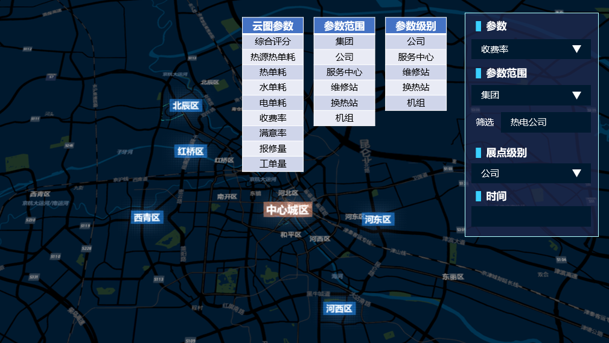

Question List in July, 2021
===========================

👊 Every body will change, just like the other things in the word,
nothing is true, everything is permitted.

自觉地个性的消失，以及感情和思想转向一个不同的方向，是就要变成组织化群体的人所表现出的首要特征。当群众聚集时往往都会情绪高涨，使个人的感情不分青红皂白的归顺集体思想，从而不自觉地进入到集体意识中去，群体行为脱离理性的的最明显体现就在于群体的无意识行为代替了个人的有意识行为。

.. _1osgb2cesium:

1、OSGB2CESIUM
--------------

.. _11-geometric-error:

1.1 Geometric Error
~~~~~~~~~~~~~~~~~~~

上个月提到，源程序作者 MrBigDog 提供了这样一种计算 Geometric Error
的算法，经过后面的分析发现，这里指定的令 ScreenPixels 为 0.5
恰恰是程序最外层瓦片有个 40000 多超大 GE 的原因：

.. math:: e_g=f(d)=\pi\cdot r^2/\text{ScreenPixels}

这个 ScreenPixels 的默认值是 0.5，而将其修改为 25
后虽然能够在一定程度上达到近似效果，但最精细一级的瓦片中，Geomatric
Error 的值已然被计算成了 0，哦豁，发现 CesiumLab 的转换结果也计算成了
0。

思考一下，是否有更好的计算几何度量误差 Geomatric Error
的算法。利用程序计算结果反推计算半径，并由半径数据计算我们所需要的函数，放到
Matlab 中使用 Curve FItting Tool 中的 Power
函数进行拟合可以得到如下所示的幂函数：

.. math:: f(x)=0.818\cdot x^{1.873}

如果数据估计没问题的话，应该就可以用这个函数来替代最开始的 Geometric
Error 计算方法了。\ **但是！！**\ 事实上源代码作者 MrBigDog
的设计思路中是使用 RangeList
来在不读取子节点的前提下根据父节点半径计算出所需要的子节点的 Geometric
Error，不得不说还挺有道理的，但效果确实需要调整。

在接下来的测试中，令 :math:`x=r/\text{ScreenPixels}` 则可在 Matlab
程序中利用 Curve Fitting Tool 曲面插值算法来将自变量和理想的 Geometrix
Error 衔接在一起，得到如下幂函数：

.. math:: f(x)=22.02\cdot x^{0.9979}

从函数效果和估计性原则看来，这个函数可以直接写成线性函数：\ :math:`f(x)=22.02\cdot x`\ ；咳，基本可用。接下来就需要确定最开始的那俩文件的
Geomerix Error 中的 ScreenPixels 的大小，暂且指定其为
:math:`0.5\cdot r`\ 。不过，原代码中函数 ``toTileSet()`` 的
``root["geometricError"]=maxGeometricError*1.5`` 不必乘
1.5，保持原大小即可。

.. _12-并行加速:

1.2 并行加速
~~~~~~~~~~~~

留待后续再说。

.. _2能源集团大屏展示系统:

2、能源集团大屏展示系统
-----------------------

本月接续上月未完成的能源集团大屏展示系统开发工作，主要进行包括底图切换、弹出签背景透明、参数面板数据交互、热力图图签控制等相关功能的后续研发内容，其中较为复杂的两个要点是\ **图签控制**\ 和\ **参数交互**\ 。

.. _21-底图切换:

2.1 底图切换
~~~~~~~~~~~~

用到了 1 个变量和 1 个函数，即：\ ``layersObj[]`` 字典和
``updateLayerVisible()`` 函数。前者存储了 Cesium
的所有图层，后者负责用来根据图层和布尔变量控制图层的显示和隐藏，故而，切换函数主体为：

.. code:: javascript

   // 遍历地图底图图层并进行底图的显示隐藏控制
   function checkItemByName(name){
       //获取[地图底图]图层节点
       let zTree = $.fn.zTree.getZTreeObj('treeOverlays');
       let nodes = zTree.getNodes()[0].children; 
       for(let i = 0; i < nodes.length; i++){
           //获取图层对象
           let key = nodes[i]._key;
           let layer = layersObj[key];
           if(nodes[i].name === name){
               // 控制泛光特效的开关
               earth.postProcess.bloom.enabled = name !== "天地图电子地图";
               // 更新图层显示
               updateLayerVisible(layer, true);
           }
           else{ updateLayerVisible(layer, false); }
       }
   }

至于 ``select``
标签向上展开问题就比较复杂了，参考博客[1]所使用的方法，能够基于 jQuery
库的 Chosen
控件来实现向上展开，但具体的样式需要进行后续调整，这里先暂且略过。

.. _22-负荷区域参数面板:

2.2 负荷区域参数面板
~~~~~~~~~~~~~~~~~~~~

有几个 CSS 要点总是忘记，这里总结一下：

背景图片自适应填充
^^^^^^^^^^^^^^^^^^

.. code:: css

   background-size:100% 100%;
   background-image: url("../image/background.svg");

字体拉伸、字间距调整和文字居中
^^^^^^^^^^^^^^^^^^^^^^^^^^^^^^

.. code:: css

   transform: scale(1.2,1);
   font-family: "Microsoft YaHei UI";
   letter-spacing: 0.2em;
   text-align: center;

控件居中
^^^^^^^^

.. code:: css

   width: 86%;
   height: 80%;
   margin: 0 auto;

.. _23-热力图图签:

2.3 热力图图签
~~~~~~~~~~~~~~

关于图签问题涉及到 mars3d 中对于 popup 以及 legendHtml
属性的处理，这里还是需要梳理一下相关内容并在必要时对原始代码进行修改和调整。

``popup`` 的背景样式
^^^^^^^^^^^^^^^^^^^^

从使用角度来看，\ ``popup`` 标签的用法是在 ``plotGeojson``
的配置文件中为 ``popup`` 属性添加一个从 URL 所指向的 JSON 数据结构中读取
``remark`` 等标识的方法，其代码也很简单：

.. code:: json

   "popup":"{remark}"

需要注意的是，类型为 GeoJSON 的 JSON 数据结构中必须手动添加 ``remark``
属性并赋值，一个可能的值为：

.. code:: json

   "remark": "<iframe src=\"http://60.28.130.106:8082/data3d/panel/hello.html?title=北辰第一供热服务中心&pano=GR24_gongre\" width=\"800px\" height=\"420px\" frameborder=\"0\"></iframe>"

这样一来，应该能够大概了解到在实际的标签弹出过程中，MarsGIS
所做的事情一定包括通过属性 ``popup`` 获取到 ``remark``
中的内容并将其嵌入到一个自适应大小的容器中。调试后，确定弹出窗的 div 的
className 为：

.. code:: css

   class="mars3d-popup-content-wrapper mars3d-popup-background"

由此定位到控制弹出窗样式的代码位于 cim3d.css 文件，也即原来的 mars3d.css
文件中。但是需要注意的是，这个更改是会影响到所有 popup 弹出窗的样式的。

``popup`` 的位置
^^^^^^^^^^^^^^^^

置于对 popup 标签位置的调整，目前有几种策略：其一是通过 js
代码找到可以设置标签偏移量的属性，但遗憾的是目前没有找到；其二是通过 css
代码控制 .mars3d-popup 这一 class
在屏幕中的显示位置。所以目前考虑通过第二种方式来进行位置调整：

.. code:: css

   .mars3d-popup {
       left: 0;
       top: 5px
   }

哦吼，后面又发现了 plotGeojson 中有一个 popupAnchor
属性可以一试。试了一试，好像可以哦。

Mars3D 的地图标绘
^^^^^^^^^^^^^^^^^

按功能搜索，依次按 “图上标绘” 定位到 openWidget.js 中的 tsbh_3d()
函数，该函数调用 widgets/plot/widget.js 文件打开标绘窗体 HTML
页，通过窗体控件 ID #plotlist 可定位至 vew.work.js 文件中的 showPlotList
函数，该函数调用 ``plotlist.statPlot()`` 函数并进一步读取
config/plotlist.json 中的数据到 ``item`` 中，以绘制图标点为例的
plotlist.json 部分结构为：

.. code:: json

   {
       "name": "图标点4",
       "type": "billboard",
       "edittype": "billboard",
       "style": {
           "image": "img/marker/mark4.png"
       }
   }

进一步地，由 [**vew.work.js**].\ *plotlist.startPlot*\ () 函数反过来调用
[**widget.js**].\ *startDraw*\ () 函数，函数中使用该窗体初始化的
mars3d.Draw 对象 drawControl 中的 ``mars3d.Draw.startDraw()``
函数绘制相应图签。所以兜了一大圈子还是在通过出触发鼠标点击事件来进行地图标绘，标绘功能不适用于热力图签的确定。

EarthSDK 的图签
^^^^^^^^^^^^^^^

Mars3D 还可以通过在配置文件中设定 type 类型为 plotGeojson 来调用
mars3d.layer.regLayerForConfig 函数将配置文件中的 plotGeojson 映射到
mars3d.plotGeojsonLayer
中去。总的来说没有提供什么可以动态添加和删除标绘图签的功能，所以感觉还是得借助
Cesium 来搞，但是 Cesium 又没有对带文字的 Billbord
做处理，就很难受沃日，找了一圈还是 EarthSDK 靠谱草。记录下相关代码：

.. code:: javascript

   // EarthSDK 的场景主体
   earth = new XE.Earth('earthContainer');
   // 可能是窗体控制吧
   window.l = createLabel(earth);
   // 创建标签的相关代码
   function createLabel(earth){
       // 设定位置
       let p = new XE.Obj.Pin(earth);
       p.position = [2.1204918655649285,0.5452743468087804,209.94294540636682];
       p.show = false;
       // 创建主体标签
       const labelDiv = document.createElement('div');
       labelDiv.width = width;
       labelDiv.height = height;
       // 将标签蒙在相机表面
       earth.czm.viewer.container.appendChild(labelDiv);
       // 创建内部标签
       const labelCanvas = document.createElement('canvas');
       labelDiv.appendChild(lableCanvas);
       // 标签浮动定位
       XE.MVVM.watch(
           // p.winPos 为一个含有4个元素的数组，分别表示[left, top, right, bottom]
           // 若想居中，设置 style.left = winPos[0]-width/2 即可
           () => [...p.winPos], winPos => {
               labelDiv.style.left = `${winPos[0]}px`;
               labelDiv.style.bottom = `${winPos[3]}px`;
           }
       )
   }

这里需要定制一下主体标签的样式和展示内容，还需要进一步探索如何将标签删除掉，估计可以利用代码
12 行提到的类查找一下相关功能。

.. code:: javascript

   const data_panel_div = document.createElement('div');
   data_panel_div.style = `
       border: 1px solid #00d3e7;
       border-radius: 5px;
       background: rgba(4, 15, 43, .8);
       box-shadow: 0 0 10px rgba(6, 124, 168, 1) inset,
                   0 0 0 2px rgba(6, 124, 168, 0.4) inset,
                   0 0 10px 15px rgba(6, 124, 168, 0.2) inset;
       width: 100px;
       height: 120px;
   `; 
   const base_circle_panel = document.createElement('div');
   base_circle_panel.style = `
       width: 40px;
       height: 40px;
       margin: 0 auto;
       background-size:100% 100%;
       background-image: url("https://i.ibb.co/hL4Tyv2/note.png");
   `;

虽然找到了设置实现椭圆环多重渐变的 CSS
方法，但是要在此基础上嵌套一个三角形有点困难，不如嵌套一图片简单明了。

.. code:: css

   width: 250px;
   height: 120px;
   border-radius: 50% / 50%;
   background-image: -webkit-radial-gradient(center center, ellipse cover, #00ffff 10%, transparent 14%,#00ffff 20%, #00ffff 30%,transparent 40%, rgba(0,255,255,0.8));

所以最后拟采用 Canvas 的方法来进行绘制，即：

.. code:: javascript

   // 获取canvas元素对应的DOM对象
   const label_canvas = document.createElement('canvas');
   label_canvas.width = 100;
   label_canvas.height = 40;
   // 添加元素
   labelDiv.appendChild(data_panel_div);
   labelDiv.appendChild(label_canvas);
   // 获取在 canvas 上绘图的 CanvasRenderingContext2D 对象
   const ctx = label_canvas.getContext('2d');
   // 平移坐标系统
   ctx.translate(50, 30);
   ctx.beginPath();
   // 添加圆环
   ctx.ellipse(0, 0, 14, 6, 0, 0, Math.PI*2);
   ctx.closePath();
   ctx.lineWidth = 2;
   // 设置使用圆形渐变作为填充颜色
   ctx.strokeStyle = "#00FFFF";
   ctx.stroke();
   // 画内部圆
   ctx.beginPath();
   ctx.ellipse(0, 0, 10, 4, 0, 0, Math.PI*2);
   ctx.closePath();
   ctx.fillStyle = "#00FFFF";
   ctx.fill();
   ctx.restore();
   // 画三角形
   ctx.beginPath();
   ctx.moveTo(-4, 0);
   ctx.lineTo(4, 0);
   ctx.lineTo(0, -30);
   ctx.fillStyle = "#00FFFF";
   ctx.closePath();
   ctx.fill();

接下来就可以在程序中进行测试了，测试通过噢耶。这里涉及到 JSON
数组的定义和查询，在现在的 JS 版本中定义 JSON 数组使用
``let array = []``\ ，清空时使用 ``array.length = 0``\ 。

.. _24-热力图参数控制:

2.4 热力图参数控制
~~~~~~~~~~~~~~~~~~

参照《能源集团项目7-21会议纪要》关于三维展示系统热力图、直方图参数选择逻辑的要求，设计如下面板。

JS 原生 AJAX
^^^^^^^^^^^^

AJAX = Asynchronous JavaScript and XML（异步的 JavaScript 和 XML）。AJAX
不是新的编程语言，而是一种使用现有标准的新方法。AJAX
是在不重新加载整个页面的情况下与服务器交换数据并更新部分网页的艺术。

**XMLHttpRequest 是 AJAX 的基础**

XMLHttpRequest 简称 XHR，所有现代浏览器（如IE7+、Firefox、Chrome、Safari
以及 Opera等）均在其内部建立了 XMLHttpRequest 对象。

.. code:: javascript

   var xmlhttp;
   if (window.XMLHttpRequest)
   {// code for IE7+, Firefox, Chrome, Opera, Safari
     xmlhttp=new XMLHttpRequest();
   }
   else
   {// code for IE6, IE5
     xmlhttp=new ActiveXObject("Microsoft.XMLHTTP");
   }

AJAX 指的是异步 JavaScript 和 XML（Asynchronous JavaScript and
XML）。XMLHttpRequest 对象如果要用于 AJAX 的话，其 open() 方法的 async
参数必须设置为 true，其中

1. | **open**\ (*method*, *url*, *async*) 用于规定请求的类型、URL
     以及是否异步处理请求：
   | **[+]** *method*\ ，请求的类型，GET 或 POST；
   | **[+]** *url*\ ，文件在服务器上的位置；
   | **[+]** *async*\ ，是否异步，为 true 时异步，为 false 时同步。

2. | **send**\ (*string*) 将请求发送到服务器：
   | **[+]** *string*\ ，仅用于 POST 请求。

3. | **setRequestHeader**\ (*header*,\ *value*) 用于向请求添加 HTTP
     标头：
   | **[+]** *header*\ ，规定头的名称；
   | **[+]** *value*\ ，规定头的值。

.. code:: javascript

   // 一个标准的 GET 请求
   xmlhttp.open("GET","ajax_test.asp",true);
   xmlhttp.send();
   // POST 请求
   xmlhttp.open("POST","ajax_test.asp",true);
   xmlhttp.setRequestHeader("Content-type","application/x-www-form-urlencoded");
   xmlhttp.send("fname=Bill&lname=Gates");

当使用 async=true 时，请规定在响应处于 onreadystatechange
事件中的就绪状态时执行的函数：

.. code:: javascript

   xmlhttp.onreadystatechange = function(){
     if (xmlhttp.readyState == 4 && xmlhttp.status == 200){
       document.getElementById("myDiv").innerHTML=xmlhttp.responseText;
     }
   }

不使用异步时，用 async=false，此时，JavaScript
会等到服务器响应就绪才继续执行。如果服务器繁忙或缓慢，应用程序会挂起或停止。请不要编写
onreadystatechange 函数 - 把代码放到 send() 语句后面即可：

.. code:: javascript

   xmlhttp.open("GET","test1.txt",false);
   xmlhttp.send();
   document.getElementById("myDiv").innerHTML=xmlhttp.responseText;

总结起来，原生 AJAX 请求的有五个步骤，即：

|  [**1st**] 首先，创建一个 XMLHttpRequest 异步对象；
|  [**2nd**] 然后，用 open 设置请求方式和请求地址；
|  [**3rd**] 接着用 send 发送请求；
|  [**4th**] 然后，监听状态变化；
|  [**5th**] 最后，接收返回的数据。

**jQuery 的 AJAX**
^^^^^^^^^^^^^^^^^^

jQuery 的 AJAX 请求可以很方便地解决异步和跨域问题。ajax() 方法用于执行
AJAX 异步 HTTP 请求。所有的 jQuery AJAX 请求都是通过 ajax()
方法来调用的。

   这里有一点内容要注意，\ **$** 就是 jQuery 的别称，所以
   $.ajax(*options*) 等同于 jQuery.ajax(*options*)，这个函数的作用是根据
   () 里的参数查找选择 html 文档中的元素，可以理解为是
   document.getElementByID 的代替，不过 jQuery 的 () 内不仅可以是
   ID，还可以是各类选择器。

**相关语法**

.. code:: javascript

   $.ajax({name:value, name:value, .....})

该参数规定 AJAX
请求的一个或多个名称/值对，可能的名称有：async，context，data，dataType，type，url
等等。这里注意到一个疑惑点：如何携带鉴权信息进行请求，参考相关博客提出的方法是：

|  [**1st**] 首先，向服务端发送请求获取 token 信息；
|  [**2nd**] 接下来，在向服务端发送其他请求时在 header 中携带秘钥 token
  信息。

但是在我们的应用中，这个东西显然没有在进行接口访问前设置鉴权验证信息，所以服务器也并没有反馈一个相关的
token
信息给我们；按接口文档的意思，将这个信息直接放到请求头里似乎就可以？

两种策略：一是直接放到请求头中，二是申请得到 token 后进行携带。

.. code:: javascript

   // 测试 ajax
   $.ajax({
       url: "http://192.168.9.182:8080/system/project/list?id=1",
       async: true,
       contentType: "application/json;charset=utf8",
       type: "GET",
       // 头信息
       headers:{
           "userName": "Tjny",
           "secretKey": "Tjny.net@2018"
       },
       // 另一种设置头信息的方式
       beforeSend: function (XMLHttpRequest) {
           // XMLHttpRequest.setRequestHeader("Authorization", "Admin-Token");
           XMLHttpRequest.setRequestHeader("token", "Admin-Token");
       },
       // 调用成功后的处理函数
       success:function (result) {
           let rows = result["rows"][0];
           $("#test").text(rows["detail"]);
       },
       // 错误信息
       error: (err) => {
           alert("错误信息：" + JSON.stringify(err));
       }
   })

.. _25-集团机构层级及负荷区域:

2.5 集团机构层级及负荷区域
~~~~~~~~~~~~~~~~~~~~~~~~~~

框架包括：集团、服务中心、维修站、换热站四个层级，其中维修站和换热站目前考虑以挂接窗口的形式绘制在左侧抽屉的旁边，通过复选框的选择来对维修站、换热站进行筛选和区分；如果甲方不那么傻逼了再给他们添加模糊搜索功能，草他们妈。至于框架下的其他内容要求留待后续添加。

服务中心负荷区域
^^^^^^^^^^^^^^^^

考虑到程序运行性能问题，目前考虑生成一个图层文件，坐标信息每次联动更新，即异步更新那个
geojson
文件并执行重新加载来界定负荷区域的相关围栏信息，以此减少内存占用。

维修站、换热站维修范围
^^^^^^^^^^^^^^^^^^^^^^

参考服务中心负荷区域界定方式。要注意到维修站和服务中心都需要坐标信息。

.. _参考文献-1:

参考文献
~~~~~~~~

1.  adamelevate. `Chosen-Drop
    Up <http://jsfiddle.net/adamelevate/WFejY/>`__\ [EB/OL].

2.  CesiumLab.\ `EartSDK
    数字城市实例 <http://earthsdk.com/v/last/Apps/Examples/?menu=true&url=./earth-digitalCity.html>`__\ [EB/OL].

3.  W3school.\ `CSS
    径向渐变 <https://www.w3school.com.cn/css/css3_gradients_radial.asp>`__\ [EB/OL].
    // 用于设计图签底座

4.  CSDN博客.\ `CSS3圆形和椭圆形渐变 <https://blog.csdn.net/cune1359/article/details/106846670>`__\ [EB/OL].

5.  博客园.\ `css实现椭圆、半椭圆 <https://www.cnblogs.com/Anita-meng/p/7873242.html>`__\ [EB/OL].

6.  W3school.\ `AJAX
    教程 <https://www.w3school.com.cn/ajax/index.asp>`__\ [EB/OL].

7.  mapshaper.\ `Mapshaper is an editor for map
    data <https://mapshaper.org/>`__\ [EB/OL].// Geojson 在线转换

8.  脚本之家.
    `js跨域请求数据的3种常用的方法 <https://www.jb51.net/article/75669.htm>`__\ [EB/OL].

9.  RUNOOB.COM.\ `jQuery ajax()
    方法 <https://www.runoob.com/jquery/ajax-ajax.html>`__\ [EB/OL].

10. CSDN博客.\ `使用jQuery发送AJAX请求时在header中添加Token <https://blog.csdn.net/qq_41725450/article/details/83086423>`__\ [EB/OL].

11. 博客园.\ `一问带你区分清楚Authentication,Authorization以及Cookie、Session、Token <https://www.cnblogs.com/snailclimb/p/11609561.html>`__\ [EB/OL].

.. _3矢量查询:

3、矢量查询
-----------

梳理 PropertyQueryX64、PropertyQueryManagerX64 工程以及相关使用类
``QueryLayerAttibutesByClickHandler``
的代码关系，可根据相关功能的调用关联制作如下 UML 类图：

由上图可知，进行矢量查询时只需写好查询工具并在相关代码中进行工具的注册即可；至于具体的使用案例可以参考
Extention 2 类库的 GuiEventAdapterEx2.cpp
文件。需要注意的是，具体在程序中调用已注册的哪个工具需要在
queryPropertyManager.cpp 文件中的函数 ``getProperty()``
中进行遍历和查找。而后续的展示工作需要借助 WidgetTextAdapter 以及
getHandlerTemplate 来进行。

.. _31-动态规划与回溯:

3.1 动态规划与回溯
~~~~~~~~~~~~~~~~~~

粗浅地了解了下动态规划算法与回溯算法的相关知识，下面对其要点进行简要记录：

动态规划
^^^^^^^^

动态规划问题有两个重要元素：\ **重叠子问题**\ 、\ **最优子结构**\ ，其算法要点有两个：\ **状态转移方程**\ 以及\ **Base
Case**\ 。这里记录一句话，最优子结构就是通过穷举得到所有子问题的最值来进一步得到原问题的最值。

1. | **斐波那契数列**\ 的状态转移方程
   | The state transition equation of **Fibonacci**.

   .. math::

      f(n)=\begin{cases}1,&n=1\ or\ 2\\
      f(n-1)+f(n-2),&n>2
      \end{cases}

   由此状态转移方程可直接写出嵌套的递归代码，带备忘录的递归代码只需要用字典或数组记录每一个子问题的答案即可，用
   DP 数组改写为迭代代码时只需自底向上计算出所有问题的答案然后输出 dp[n]
   即可。

2. | **凑硬币问题**\ 的状态转移方程
   | The state transition equation of **Coin**.

   .. math::

      f(n)=\begin{cases}
      -1,&n<0\\
      0,&n=0\\
      \min\{1+f(n-\text{coin})|\text{coin}\in coins\},&n>0
      \end{cases}

   此问题的 Base Case 迭代退出参考 :math:`n\leqslant0`
   的两个条件；状态转移的递归需要借助数组 :math:`coins`
   的遍历，在只需要最小硬币数时确保每一个子问题都最小即可，这里的 1
   是硬币数与硬币面额数无关哦。

   | 需要注意几点：
   | **a**. C++ 的正无穷需要引入 ``#include <limit.h>`` 文件取
     ``INT_MAX``\ ；
   | **b**. Python 的正无穷需引入 ``float('INF')``\ ；
   | **c**. 而 Java 的正无穷需要用 ``Float.POSITIVE_INFINITY`` 来表达；
   | **d**. 另外 Python
     的三目判断运算符可写为：\ ``a = b if true else c``\ 。

回溯
^^^^

在 labuladong
的算法小抄中指出回溯算法实际上是对决策树的一种遍历，其核心要义是以树的遍历（主要是先序：根左右、后序：左右根）递归算法的改写为基础，通过\ **路径**\ 、\ **选择列表**\ 、\ **结束条件**\ 等三个要素穷举所有可能。

1. | **全排列**\ 问题
   | Some interest things of **Permutation**.

   该问题的核心是列出决策树的所有路径，不使用数组交换策略时选择列表元素可以通过判断选择列表中的元素是否在
   track 中来变相的获取，由此可消除决策树中的重复元素。

   .. figure:: pic/202107/permute.png
      :align: center

   | 需要注意的是：
   | **a**. Python 的数组包含判断可以用 ``if a in array`` 来表达；
   | **b**. Python 没有 swap 函数，其数据交换可用 ``a,b = b,a`` 的形式；
   | **c**. Python 是全员引用的，如果需要使用值拷贝得引入
     ``import copy`` 然后使用 ``b = copy.deepcopy(a)``\ 。

2. | N皇后问题
   | Some interest things of **Eight queens**

   .. figure:: pic/202107/N-queen.png
      :align: center
   | 
   | 该问题与上面的全排列问题保有很强的相似性，只不过在回溯算法中执行了严格的选择和撤销操作，判断当前位置无法放置皇后时就撤回当前选择。

.. _32-留待下月:

3.2 留待下月
~~~~~~~~~~~~

.. _参考文献-2:

参考文献
~~~~~~~~

1. CSDN博客.
   `全排列算法的全面解析 <https://blog.csdn.net/lemon_tree12138/article/details/50986990>`__\ [EB/OL].

2. Godbolt. `Complier
   Explore <https://gcc.godbolt.org/>`__\ [OL]//极极极极极其好用的在线
   C++ 编译器.

3. Github.\ `省市区数据采集并标注拼音、坐标和边界范围 <https://github.com/xiangyuecn/AreaCity-JsSpider-StatsGov>`__\ [EB/OL].
