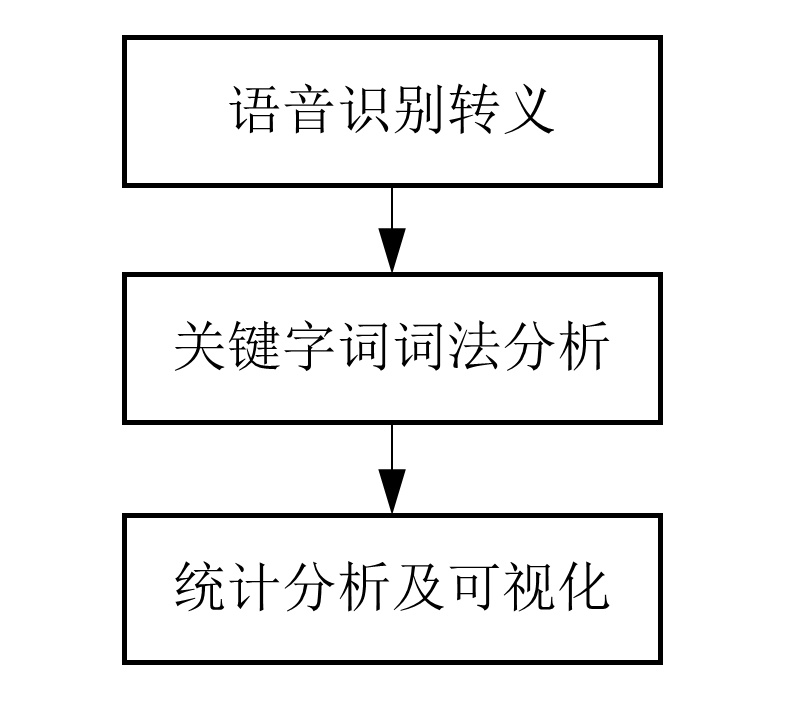
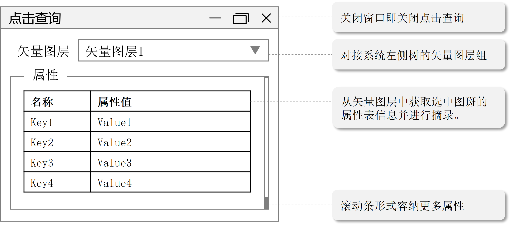

Question List in October, 2021
==============================

🍁 It’s getting colder and colder, another winter coming.

子曰：君子不器。

.. raw:: html

   <html xmlns="http://www.w3.org/1999/xhtml"><head></head><body>
《论语·为政》
</body></html>

乾坤成列，而《易》立乎其中矣。乾坤毁，则无以见《易》。《易》不可见，则乾坤或几乎息矣。是故形而上者谓之道，形而下者谓之器。化而裁之谓之变，推而行之谓之通，举而错之天下之民谓之事业。

.. raw:: html

   <html xmlns="http://www.w3.org/1999/xhtml"><head></head><body>
《易经·系辞上》
</body></html>

.. _1能源集团大屏展示系统:

1、能源集团大屏展示系统
-----------------------

历经磨难，大屏展示系统终于到尾声了。

.. _11-解决-chrome94-版本-cors-跨域问题:

1.1 解决 chrome94 版本 CORS 跨域问题
~~~~~~~~~~~~~~~~~~~~~~~~~~~~~~~~~~~~

问题描述：Access to XMLHttpRequest at '[地址]' from origin '[域名]' has
been blocked by CORS policy: The request client is not a secure context
and the resource is in more-private address space ``private``.

这可能是浏览器自身的一个
BUG。经测试在火狐浏览器中使用时完全没有遇到该问题，所以寻找解决策略时可以针对
Chrome 浏览器本身来搜索，具体方案为：

   | 1 打开浏览器，进入 ``chrome://flags/`` 界面；
   | 2 搜索 ``Block insecure private network requests`` 项；
   | 3 设置为 ``Disabled`` 后 ``Relaunch`` 即可。

由此，解决莫名其妙的跨域问题。

.. _12-参数数值定制化显示:

1.2 参数数值定制化显示
~~~~~~~~~~~~~~~~~~~~~~

根据参数的最大值和最小值甚至于频率分布确定标签颜色分级、直方图高度确定、云图颜色调整等内容的具体实施方案，并由此展开相关代码的更新。

标签颜色分级
^^^^^^^^^^^^

标签颜色分级按照数值大小进行均匀划分，以 :math:`[V_\min,V_\max]`
区间作为计算凭据划分为五段显示，目前是绿色代表评分较高、红色代表评分较低；同样还有数据约高约好的情况，还得再想想办法看如何设计。

直方图高度/颜色自适应
^^^^^^^^^^^^^^^^^^^^^

直方图高度以 HeightScale 参数做自适应处理，将直方图最高高度拟合到 10000
米，原来的 HeightScale 默认数值保持不变，仍为 100，则修改后的
HeightScale 计算公式为：

.. math:: HS=\frac{100}{V_\max}\cdot HS_0

由此，即可尽可能保持原有代码不变的基础上使直方图高度满足自适应的需求。而对于颜色自适应，需要用到的仍然为集合
:math:`\mathbb V=\left\{v|v\in[V_\min,V_\max]\right\}` 而言，将其映射到
:math:`\mathbb X\left\{x|x\in[0,100]\right\}` 区间，取映射
:math:`f:\mathbb V\mapsto \mathbb X`\ ，则有：

.. math:: f(x)=\frac{100\cdot(v-V_\min)}{V_\max-V_\min}

由此，即可实现直方图颜色的自适应。经测试，该公式可以取得预期的效果。

云图颜色调整
^^^^^^^^^^^^

初步考虑使用 h337
热力云图在传递数值时设定最大值最小值来对颜色区间进行补足，虽然有效果但并不能做到精细化的显示，所以可能要在数据的基础上再做一些处理分析试试。

.. _13-服务器迁移:

1.3 服务器迁移
~~~~~~~~~~~~~~

采购的服务器到了，但是是 Windows Server
系统，之前没用过，这次正好了解了解。

   Windows Server 是微软公司在 2003 年 4 月 24 日推出的 Windows
   服务器操作系统，其核心是 Microsoft Windows Server System，即
   WSS。其与台式机之间的主要区别在于支持内存量的差异，Win10 系统在 64
   位机器上的内存显示为 2TB，而在服务器中将大大增加。

在具体操作上，Windows 功能中的 IIS 服务在 Server 中被 **服务器管理器**
所接管，故而需要在管理器中用 **添加角色和功能** 选项卡并勾选 **Web
服务器(IIS)** 以启用 IIS 服务，也就是 International Information Services
微软提供的基于 Windows 的互联网基本服务。添加完成后，即可在工具中找到
IIS 了。

.. _离线安装-netframework-35:

离线安装 .NetFramework 3.5
^^^^^^^^^^^^^^^^^^^^^^^^^^

下载 NetFx3.cab 后将其放于 C 盘 WINDOWS 文件夹下，点击 “\ **开始**\ ”
找到 “\ **Windows PowerShell**\ ” 右击
“\ **以管理员身份运行**\ ”，输入如下命令：

.. code:: powershell

   dism.exe /online /add-package /packagepath:C:\WINDOWS\netfx3.caB

等待安装完成即可。我靠，历经磨难终于通过搜素 Windows Server 离线安装
.net 3.5 在博客园 *七月晓晓翁* 和 *望穿秋水*
两位博主的博客中找到了解决方案，Finally，可以安装 ArcGIS 10.2 了。

安装 JDK 的环境配置
^^^^^^^^^^^^^^^^^^^

直接下载 Java SE Development Kit 即可，其中的 SE 是指 Standard Edition
标准版。下载后本机安装，选择对应目录后配置环境变量即可：

.. code:: shell

   JAVA_HOME=D:\Java\jdk1.8.0
   CLASS_PATH=.;%JAVA_HOME%\lib;%JAVA_HOME%\lib\tools.jar
   PATH=%JAVA_HOME%\bin;%JAVA_HOME%\jre\bin;

ArcGIS Server 发布切片服务
^^^^^^^^^^^^^^^^^^^^^^^^^^

ArcGIS 的常规服务发布流程为：1st ArcMap 打开待发布的影像；2nd ArcMap
链接 ArcGIS Server。但是在发布已经切好并分级的文件时，需要先在 ArcGIS
Server 中调整一下：

   | 1st 登陆 ArcGIS Server 服务站点，新建 ``NYJT`` 文件夹；
   | 2nd 在 ``站点`` 下的 ``目录``
     中添加缓存文件所在的目录，目录类型选择 ``缓存``\ ；
   | 3rd 修改缓存文件夹结构，即在 ``_alllayers`` 外套
     ``NYJT_[LayerName]/Layers/`` 即可；
   | 4th 在 ArcMap 中打开对应缓存文件夹，进入正常发布流程。

一般需要注意的选项有：文件夹选择 ``NYJT``\ ，在 Server 的配置页中，选择
``Caching`` ，然后选择
``Using tiles from a cache``\ ，使用切片模式，进入下级树
``Advanced Settings``\ ，选择 ``Cache directory``\ 为 Manager
中设置的缓存文件夹，如果放在 Server 默认地址中可以不用设置。

**【缓存目录无法识别问题】**\ 如果使用服务器中的新建文件夹作为服务发布根目录的话，必须在本地缓存文件夹的
Layers 外的文件夹以 ``[新建文件夹]_[服务名称]``
作为缓存目录发布，否则会导致缓存目录无法识别的问题。

**【提示将数据复制到服务器问题】**\ 让窗口不执行复制时，需要在服务器上右键点击
``服务器属性``
然后点击添加文件夹，将缓存文件夹目录添加到服务器属性中即可，提示是否自动建立缓存时可以选择否。

**【手动建立缓存】**\ 按上面的步骤发布服务后无法以 xyz
格式访问数据，需要将切好图层文件夹中的 xml 文件拷贝到目录外，然后在
[缓存]\ :math:`\rightarrow`\ [切片方案]
中选择该切片方案进行读取；读取后选择手动重新建立切片，否则实际上发布的将是没有建立切片缓存的文件。

另外以这种方式发布的 xyz 格式的服务在远程调用时会提示跨域问题如下：

   | Access to XMLHttpRequest at
     'http://172.150.254.250:6080/arcgis/rest/services/TJ/DZDT_2020_gday/MapServer/tile/15/12512/27065'
     from origin 'http://localhost:63342' has been blocked by CORS
     policy: No 'Access-Control-Allow-Origin' header is present on the
     requested resource.
   | Cesium.js?time=20190603:1 An error occurred in
     "UrlTemplateImageryProvider": 无法获得图块 X: 27065 Y: 12512 Level:
     15.

为了解决这一问题，需要参考参考文献 12，将 ``cors-filter-1.7.jar`` 和
``java-property-utils-1.9.1.jar`` 这两个 jar 包复制到 Tomcat 的 lib
目录下，编辑 ``Tomcat\conf\web.xml`` 文件并在 ``web-app`` 标签内加入：

.. code:: xml

   <filter>
       <filter-name>CORS</filter-name>
       <filter-class>com.thetransactioncompany.cors.CORSFilter</filter-class>

       <init-param>
           <param-name>cors.allowOrigin</param-name>
           <param-value>*</param-value>
       </init-param>

       <init-param>
           <param-name>cors.supportedMethods</param-name>
           <param-value>GET, POST, HEAD, PUT, DELETE</param-value>
       </init-param>

       <init-param>
           <param-name>cors.supportedHeaders</param-name>
           <param-value>Accept, Origin, X-Requested-With, Content-Type, Last-Modified</param-value>
       </init-param>

       <init-param>
           <param-name>cors.exposed.headers</param-name>
           <param-value>Access-Control-Allow-Origin,Access-Control-Allow-Credentials</param-value>
       </init-param>

       <init-param>
           <param-name>cors.exposedHeaders</param-name>
           <param-value>Set-Cookie</param-value>
       </init-param>

       <init-param>
           <param-name>cors.supportsCredentials</param-name>
           <param-value>true</param-value>
       </init-param>
   </filter>

   <filter-mapping>
       <filter-name>CORS</filter-name>
       <url-pattern>/*</url-pattern>
   </filter-mapping>

随后在 Windows 服务中重启 ArcGIS Server 即可。

.. _14-百度地图坐标转换:

1.4 百度地图坐标转换
~~~~~~~~~~~~~~~~~~~~

矢量坐标转换
^^^^^^^^^^^^

国内在线地图的坐标都是经过加密的坐标，其中主流包括 BD09、GCJ02、WGS84
三种，分别为百度坐标、国家测绘局坐标和全球坐标 WGS
1984。为实现地图标点显示的过程，需要用到的内容有：

   百度地图根据地址查询 BD09 坐标[1]\ :math:`\rightarrow`\ BD09 转换为
   WGS84[2]\ :math:`\rightarrow`\ 批量转换

其中，[1]
的在线工具有\ `百度地图拾取坐标系统 <https://api.map.baidu.com/lbsapi/getpoint/index.html>`__\ 和\ `看看地图坐标拾取系统 <http://www.oogps.com/point/>`__\ 等；[2]
的工具目前查到的有\ `在线工具的坐标换算 <https://tool.lu/coordinate/>`__\ 、GitHub
上的开源项目\ `Coordtransform <http://wandergis.github.io/coordtransform/>`__\ 以及极海的
QGIS 插件\ `GeoHey
Toolbox <https://zhuanlan.zhihu.com/p/30174554>`__\ 等。在后续的操作中再对这些工具进行一个取舍。

最后采用的策略是用百度地图拾取坐标系统拾取坐标，用 ArcGIS 转换 CSV
为矢量图层，然后用 QGIS 的转换插件将原来的 BD-09 坐标转换为 WGS84 坐标。

**ArcGIS 切片服务转换**
^^^^^^^^^^^^^^^^^^^^^^^

目前的 EarthSDK
中提供了高德影像服务的纠偏，但是这个纠偏是针对谷歌歌（高德）地图标准切片
XYZ 格式来进行的，所以可以用相关工具将其转换为标准切片。这里介绍一下
OSGeo 体系下的 TMS， TMS 是 Tile Map Service
的缩写，也即瓦片地图服务；与 OGC 标准下的 WMTS，即 Web Map Tile Service
有所不同。一般来说， ArcGIS 的切片规则为：

   | L[级别]/R[行号]/C[列号]：行号、列号为 8 位
     16进制数，这里一般令[级别]=Z，[列号]=Y，[行号]=X，如：
   | ``_AllLayers/L02/R00000006/C0000000A.png``

而谷歌 XYZ 的切片规则为：\ ``Z`` 表示缩放层级，Z=zoom；\ ``XY``
的原点在左上角，\ ``X`` 从左向右，\ ``Y`` 从上对向下。TMS
标准服务的切片规则为：\ ``Z`` 的定义与谷歌相同；\ ``XY``
的原点在左下角，\ ``X`` 从左向右，\ ``Y`` 从下向上。百度地图 XYZ
的切片规则为：\ ``Z`` 从1开始，在最高级就把地图分为四块瓦片，\ ``XY``
的原点在经度 0 纬度 0 的位置，\ ``X`` 从左向右，\ ``Y`` 从下向上。

一般常见的 ``.bundle`` 格式切片服务在 ArcGIS 中表示 ``紧凑格式缓存文件``
类型，紧凑格式保存的切片小文件少，一个 Bundle 可以保存 128
张切片，易于缓存的迁移并在一定程度上节约计算机物理空间。

.. _参考文献-1:

参考文献
~~~~~~~~

1.  知乎.\ `解决谷歌浏览器最新chrome94版本CORS跨域问题 <https://zhuanlan.zhihu.com/p/414533145>`__\ [EB/OL].

2.  百度地图.\ `百度地图拾取坐标系统 <https://api.map.baidu.com/lbsapi/getpoint/index.html>`__\ [T/OL].

3.  看看地图.\ `看看地图坐标拾取系统 <http://www.oogps.com/point/>`__\ [T/OL].

4.  在线工具.\ `在线工具的坐标换算 <https://tool.lu/coordinate/>`__\ [T/OL].

5.  wandergis.\ `Coordtransform <https://github.com/wandergis/coordtransform>`__\ [EB/OL].

6.  知乎.\ `送一一个免费的百度火星WGS84坐标转换插件 <https://zhuanlan.zhihu.com/p/30174554>`__\ [EB/OL].

7.  博客园.\ `Windows Server 2016离线安装.NET Framework
    3.5 <https://www.cnblogs.com/qqflying/p/9914744.html>`__\ [EB/OL].

8.  CSDN.\ `ArcGIS
    Server利用现有的缓存地图文件发布切片服务 <https://blog.csdn.net/rrrrroy_Ha/article/details/79030116>`__\ [EB/OL].

9.  CSDN.\ `ArcGIS发布服务时提示将数据复制到服务器 <https://blog.csdn.net/dugushangliang/article/details/99659541>`__\ [EB/OL].

10. 简书.\ `ArcGIS切片转谷歌（高德）地图标准切片（XYZ） <https://www.jianshu.com/p/6d52b45fd277>`__\ [EB/OL].

11. 丹追兵.\ `瓦片地图原理 <https://segmentfault.com/a/1190000011276788>`__\ [EB/OL].

12. 游侠舒迟.\ `解决ArcGIS
    Server跨域问题 <https://www.cnblogs.com/hustshu/p/14628136.html>`__\ [EB/OL].

.. _2语音识别及文字云:

2、语音识别及文字云
-------------------

简单实现基于语音输入提取关键词，利用现有的技术手段对提取的关键词与预设关键词进行比对，其中出现频率较高的词汇需要进行差异化显示。

.. _21-关键技术:

2.1 关键技术
~~~~~~~~~~~~

目前采用的关键性技术有：科大讯飞的实时语音转写服务、Echarts.js
可视化开源库、D3.js
图形开源库。本项目的关键技术有两项：面向课堂环境的高频词实时语音识别技术，高频词汇的提取、分析以及可视化技术。面向课堂环境的高频词实时语音识别技术。该技术针对课堂嘈杂环境问题，旨在解决嘈杂环境下的关键语音识别及提取技术，采用音量统计或音色统计等方式从课堂环境中提取出针对某一问题的高频词信息，为后续的分析提供依据。高频词汇的提取、分析以及可视化技术。该技术是在前一步语音识别技术的基础上，根据汉语语境下的字符串处理方法，从语音文字中提取出项目所需要的高频词信息，对所有高频词汇进行统计分析，进而得到满足教师授课需求的可视化统计信息。

.. _22-技术路线:

2.2 技术路线
~~~~~~~~~~~~

本项目的技术流程分为三步：首先，使用科大讯飞的实时语音识别技术从音频输入设备中采集相关音频并进行识别处理；接下来，利用汉语词法分析算法从识别的文字中提取需要的关键字词信息；最后，使用可视化开发工具对关键字词进行显示。如下图所示：

语音识别转义
^^^^^^^^^^^^

科大讯飞的实时语音转写（Real-time
ASR）基于深度全序列卷积神经网络框架，通过 WebSocket
协议，建立应用与语言转写核心引擎的长连接，开发者可实现将连续的音频流内容，实时识别返回对应的文字流内容。支持的音频格式：
采样率为16K，采样深度为16bit的pcm_s16le音频。

课堂环境中的语音识别有三个特点：\ **其一，环境嘈杂**\ ，音频中的冗余噪声很多；\ **其二，音频重叠**\ ，课堂中可能有很多学生的问题回复是相同且重复的，同一时间点所识别的语音文字可能包含多名学生的回答结果；\ **其三，传播损耗**\ ，教室范围内距离教师麦克风越近的学生所发出的声音越容易被接收，而远离讲台的后排声音经较长距离的空气传播能量消耗较大，难以被麦克风所收容。

作为单机测试的笔记本电脑，则可以在一对一的情况下具有较好的语音识别效果。但综合考虑上面三个特点，该语音识别技术在课堂环境中的可实施性将大大降低。

关键字词词法分析
^^^^^^^^^^^^^^^^

关键字词词法分析系统，旨在根据上一步骤中识别出的字符串信息进行语义上的拆解和分析，通过相关分析算法的接入和应用，以预设关键字词为参考进行比对和分析，从而提取出部分关键字词的响应频率1或是响应强度2。

| 注1：响应频率，表示根据识别文字中关键字词的出现频率。
| 注2：响应强度，通俗理解为识别文字中关键字词的音量高低。

根据这两种策略，决定关键字词的统计数据，以为统计分析和可视化提供相关依据。

统计分析及可视化
^^^^^^^^^^^^^^^^

关键字词的统计数据预期采用文字云图、直方图表等形式进行可视化展现，在目前的技术环境中主要有
Echart 直方图及其针对文字统计的 worldcloud 变体两种形式。

.. _参考文献-2:

参考文献
~~~~~~~~

1. 科大讯飞.\ `讯飞开发者平台 <https://www.xfyun.cn/?ch=xfow>`__\ [EB/OL].

2. Apache
   ECharts.\ `动态排序柱状图 <https://echarts.apache.org/examples/zh/editor.html?c=bar-race>`__\ [EB/OL].

3. 博客园.\ `超酷的javascript文字云/标签云效果 - D3
   Cloud <https://www.cnblogs.com/gbin1/archive/2012/10/15/2724434.html>`__\ [EB/OL].

4. 博客园.\ `前端词云图-Echarts-Wordcloud <https://www.cnblogs.com/deng-jie/p/14250535.html>`__\ [EB/OL].

.. _3重建顶层的-osgb-和-3dtiles:

3、重建顶层的 osgb 和 3dtiles
-----------------------------

再谈格式转换，实践是检验真理的唯一标准。

.. _31-分析格式转换与半径:

3.1 分析格式转换与半径
~~~~~~~~~~~~~~~~~~~~~~

通过对算法的各种调试，发现下面这个比例，即半径\ ``radius``\ 与\ ``PIXEL_ON_SIZE``\ 参数之间的比例很有意思，这里简单将公式表述如下即可：

.. math:: F_p=radius/\text{PIXEL\_ON\_SIZE}

将测试模型j中的\ ``Tile_+027_+000``\ 瓦片单独拿出来，获取其下几个\ ``PagedLOD``\ 模型文件的半径和切换视距列表中的像素转换参数，可以计算出如下表格：

那么，从上面的表格中可以获知，\ :math:`F_p` 实际上是与模型的 LOD
等级密切相关的，也就是说视觉上每切换一级模型，这个 :math:`F_p`
因子就要对应在原始模型上乘以 2，直至达到需求为止。

.. _32-计算算法优化:

3.2 计算算法优化
~~~~~~~~~~~~~~~~

经过探索，发现目前的 osgb 转 3dtiles
算法中仍旧存在一些缺陷，尤其是对于重建顶层文件执行转换。也就是其顶层文件的几何误差
``geometricError``
的计算算法要施加一些特别的处理，这就需要一些分析和改进了。

尝试着修改 ``WriteBG()`` 函数，提供 ``isTJISM``
参数指定是否是计算重建顶层后文件的几何误差，当为重建顶层后的几何误差时使用
2 倍关系确保计算正确；但如同 3.1 节的表格中所述的，乘 2 只能确保链接到
L18 层级时对于最顶层文件的转换半径计算正确；而当最底层文件链接到
L17、L15 等时就只能手动修改了。目前就先这样吧。

.. _33-geometric-error-修改工具:

3.3 Geometric Error 修改工具
~~~~~~~~~~~~~~~~~~~~~~~~~~~~

修改工具使用 Python 编写，其名称暂定为
Ro3Modifier，其主要功能是用于按照层级文件夹修改 3DTiles
格式文件的几何误差，目前框架思路是通过乘积关系更改上下层级之间的视距切换方案。

如上图所示，目前的设计方案就是使用这样一个表格去勘测或调整各层级瓦片之间的缩放因子。需要注意的是如果某一级瓦片因子调整超限，以至于超过了其上层视距的大小则会使得瓦片无法正常调度，所以应该在程序中添加禁令以防止这种问题的出现。也就是说调整某一层级的
Child 的 Geometric Error 时，这个 GE 不应该超出当前这个文件内的 GE
属性的大小。

.. _4矢量查询界面:

4、矢量查询界面
---------------

继完成了 DotNetOsgApplicationX64 中矢量查询功能主体，亦即本体位于
OsgExtentionLibrary3X64 中的，代码继承于 PropertyQuery 类的工具类
QueryShapeTool.cpp 后；将接口写于 dotNetOsg.h
中，这里简单记录一下提供的主要方法：

|  **M1** ``AddBuildingQuery()`` 工具注册；
|  **M2** ``RemoveBuildingQuery()`` 工具卸载；
|  **M3** ``AddShapeForBuiding(String^ shp)`` 将路径 shp
  所指向的矢量文件添加到查询库中；
|  **M4** ``RemoveShapeForBuiding(String^ shp)`` 从当前查询中移除路径
  shp 所指向的矢量文件；
|  **M5** ``QueryBuidingInShape(xyz, keys, values)``
  根据坐标查询属性名称以及属性值。

使用方法为：M1\ :math:`\rightarrow`\ M3\ :math:`\rightarrow`\ M5。自己写自己的类库居然每次都要更新，就很烦，一旦更新本地就要重新编译然后才能提交代码，就日了狗。需要注意一下，那个
LC.exe 退出问题在本文件夹的开篇 202007.md 中有提到，就是因为那个 license
文件，删了就行。

界面设计
~~~~~~~~

简单设计了下点击查询矢量图斑的界面如下，为了尽可能简化用户操作，每次查询仅供一个图层的查询；多图层查询界面以及逻辑设计后面再说。

矢量点击查询应该做成一个工具图签放到系统中，点击时弹出该窗口，触发点击事件时根据复选框中选择的图层内容对注册图层进行刷新，并同步清空属性中的表格内容；该界面逻辑有两个要点：其一是矢量图层组的接入和映射，其二是关闭窗口时关闭属性查询功能。

.. _5centos-部署若依后台:

5、CentOS 部署若依后台
----------------------

应邀为 CenterrOS
系统部署后台服务，流程依旧是：数据库、数据库迁移、若依服务启动。这里介绍一下快速启动
Windows Ternimal 终端的方法，即在路径中敲入：\ ``wt`` 即可，同 ``cmd``
类似，但是这种方式不会像 CMD 一样直接跳转到当前目录下。

.. _51-centos-8-安装-postgresql-数据库:

5.1 CentOS 8 安装 PostgreSQL 数据库
~~~~~~~~~~~~~~~~~~~~~~~~~~~~~~~~~~~

这里介绍一下查看 CenterOS 版本号的方法，就是使用
``cat /etc/redhat-release`` 这样的代码。

下载安装源配置文件
^^^^^^^^^^^^^^^^^^

.. code:: powershell

   dnf install [安装源]

安装源最好从 PostgreSQL
`官网 <https://www.postgresql.org/>`__\ 中寻找相应的\ `下载链接 <https://download.postgresql.org/pub/repos/yum/reporpms/EL-8-x86_64/pgdg-redhat-repo-latest.noarch.rpm>`__\ 。

禁用安装模块
^^^^^^^^^^^^

本次打算安装 PostgreSQL 12 版本，所以禁用 96、10、13
版本。相关操作命令行如下：

.. code:: powershell

   dnf module list postgresql
   dnf config-manager --disable pgdg96
   dnf config-manager --disable pgdg10
   dnf config-manager --disable pgdg13
   dnf module disable postgresql

以上操作的主要执行内容为：列出安装模块，禁用官方库中本次不用安装的模块以及\ **禁用系统内置yum源的PostgreSQL安装模块**\ 。

安装客户端和服务端程序
^^^^^^^^^^^^^^^^^^^^^^

.. code:: powershell

   dnf install postgresql12
   dnf install postgresql12-server
   dnf install postgresql12-contrib

无法安装，提示 No match for argument:
postgresql12，不晓得咋回事哦。经过参考文献 2
的洗礼，发现可以用如下代码列出所有可供安装的 postgresql 版本：

.. code:: shell

   dnf repolist enabled

服务器上列出的版本如下：

   | pgdg11 PostgreSQL 11 for RHEL/CentOS 8 - x86_64
   | pgdg14 PostgreSQL 14 for RHEL/CentOS 8 - x86_64

所以安装 14 吧暂时，或者启动 12 的安装？哦豁，用如下代码启动后可以在
repolist enabled 表中看见了。

.. code:: shell

    dnf config-manager --enable pgdg12

注意：程序安装目录是
``/usr/pgsql-12``\ ，程序运行目录是\ ``/var/run/postgresql``\ ，程序运行用户和组是\ ``postgres:postgres``\ ，\ ``postgres``
用户和组安装时默认创建。

配置数据库
^^^^^^^^^^

**1st** 设置数据存储目录到 data 目录下

数据库实例的默认数据存储目录是 ``/var/lib/pgsql/12/data/``\ 。\ ``/var``
是一个系统目录，不宜存放大量业务数据。因此需要在初始化数据库实例之前设置数据存储目录\ **。**

.. code:: powershell

   mkdir /data/pgsql12-data                        #创建存储目录
   chown postgres:postgres /data/pgsql12-data      #设置目录所有者为 postgres:postgres

如果遇到 ``mkdir`` 失败，显示不存在此目录 mkdir: cannot create directory
: No such file or directory 时，说明命令行中的 data
目录也不存在，需要附加参数 ``-p``
遇见不存在的目录就自动创建。接下来需要修改 postgresql-12.service
文件，将其中的 Environment 修改为对应目录。

.. code:: pow

   vim /usr/lib/systemd/system/postgresql-12.service

注释原有的 Environment 行，修改为如下内容即可：

.. code:: shell

   #Environment=PGDATA=/var/lib/pgsql/12/data/
   Environment=PGDATA=/data/pgsql12-data/

**2nd** 初始化数据库实例

进入程序安装目录下的 ``bin`` 目录下，执行 ``postgresql-12-setup initdb``
命令。

.. code:: powershell

   cd /usr/pgsql-12/bin
   ./postgresql-12-setup initdb

**3rd** 启动数据库实例服务并设置为开机自启动

.. code:: powershell

   systemctl enable postgresql-12.service
   systemctl start postgresql-12.service

**4th** 设置数据库实例超级管理员

PostgreSQL12安装完成后 ``postgres``
的默认口令为空，为空时无法使用该用户登录数据库。

.. code:: powershell

   passwd postgres
   #BAD PASSWORD: The password contains the user name in some form
   #若报上述错误则需使用 passwd --stdin postgres

设置密码为 postgres 时若提示密码包含用户名错误，则需使用 ``--stdin``
来强制设置 postgres 用户的密码。接下来需要切换 root 用户为 postgres
用户查看相关信息。

.. code:: powershell

   su postgres

..

   需要注意的是，如果使用 ``su`` 命令切换的只是 root 身份，Shell
   环境仍然是普通用户的 Shell；而 ``su -`` 命令则会将用户和 Shell
   环境一起切换成 root 身份。只有切换了 Shell 环境才不会出现 PATH
   环境变量错误。\ ``su`` 切换成 root 用户以后，\ ``pwd``
   一下，发现工作目录仍然是普通用户的工作目录；而用 ``su -``
   命令切换以后，工作目录则会变成 root 的工作目录。

   修改发现没什么卵用，代码实际上报错的点是：

   .. code:: shell

      bash-4.4$ psql
      psql: error: could not connect to server: No such file or directory
           Is the server running locally and accepting
           connections on Unix domain socket "/var/run/postgresql/.s.PGSQL.5432"?

   按参考文献 4 的策略进行尝试。即首先用 ``which psql`` 查找 ``psql``
   所在路径，然后用 ``echo $PATH`` 查看\ ``PATH`` 中有没有
   ``psql``\ ，如若没有，则依次执行如下命令：

   .. code:: powershell

      vim /etc/profile    # 修改PATH环境
      # 在文档最后，添加:
      # export PATH="/usr/bin/psql:$PATH"
      # 退出保存 wq
      source /etc/profile  # 检查是否添加成功

   随后再次尝试 su postgres 命令。发现不行，那就看看服务启动了没：

   .. code:: powershell

      ps -ef|grep postgres        # 查看服务是否启动
      netstat -tlunp | grep 5432  # 监听端口 5432

哦豁，发现服务没启动，怎么回事啊。最后重新初始化了数据库，发现可以进入下面的界面了。

.. code:: powershell

   su postgres

   bash-4.4$ psql
   psql (12.3)
   Type "help" for help.

   postgres=# alter user postgres with password 'postgres';
   ALTER ROLE
   postgres=# \q
   bash-4.4$ exit

**5th** 设置数据库允许远程访问

PostgreSQL12安装完成后默认只允许本地访问。设置数据库实例访问策略，可以设置多个由主机类型、数据库、用户、IP地址组成的策略：

.. code:: powershell

   vim /data/pgsql12-data/pg_hba.conf

在 ``pg_hba.conf`` 文件的 ``# IPv4 local connections`` 策略中追加一条
``允许全部用户，通过全部网络地址访问全部数据库``
的策略并保存，策略定义如下：

.. code:: shell

   # 允许全部用户，通过全部网络地址访问全部数据库
   host    all             all             0.0.0.0/0               trust

设置数据库实例监听地址和端口。监听地址，\ ``*`` 表示全部地址，默认是
``localhost``\ ；监听端口，默认是 ``5432``\ 。

.. code:: powershell

   vim /data/pgsql12-data/postgresql.conf

在 ``postgresql.conf`` 文件中执行以下修改:

.. code:: powershell

   listen_addresses = '*'       # defaults to 'localhost'; use '*' for all
   port = 5432                  # (change requires restart)

设置防火墙端口，CentOS8 默认安装 firewall 防火墙，允许 ``5432``
端口（PostgreSQL默认端口）访问服务器。

.. code:: powershell

   firewall-cmd --zone=public --add-port=5432/tcp --permanent
   firewall-cmd --reload

防火墙操作的相关命令：

.. code:: powershell

   firewall-cmd --list-ports		# 查看已开启的端口
   firewall-cmd --state			# 查看防火墙状态
   systemctl start firewalld		# 开启防火墙
   firewall-cmd --zone=public --add-port=5432/tcp --permanent	#开启端口
   firewall-cmd --reload			# 重启防火墙

**6th** 重新启动数据库服务实例

.. code:: powershell

   systemctl restart postgresql-12.service

CenterOS 端口映射问题
^^^^^^^^^^^^^^^^^^^^^

.. code:: powershell

   curl cip.cc                                               # 查看服务器外网 IP 地址
   psql -h 220.194.147.102 -d postgres -U postgres -p 5432   # 登录本地服务器
   nmap 220.194.147.102                                      # 扫描该网址下开放的端口

经测试发现，远程链接到 220.194.147.102 网址 5432 端口所开放的 PosgreSQL
数据库时，出现无法连接问题。在网络上搜索相关问题，本文的问题是：

   | psql: error: could not connect to server: Connection refused
   |  Is the server running on host "220.194.147.102" and accepting
   |  TCP/IP connections on port 5432?

最相近的是参考文献 7 所列出问题 2 楼，raven_arkadon 说 postgres 不再用
``-i`` 命令启用对 listen_addresses
的监听，所以无论本地是否修改这个监听方式，都不会起作用。但本次修改
``/etc/environment`` 设置：

.. code:: powershell

   PGOPTIONS="-i"

后仍不起作用，考虑是否因为端口映射。问某龙后发现的确是因为端口映射问题，F**K，那么现在的问题就是如何将本地的端口
5432 映射到外网了，另外还需要开放 8085 端口以供 jar 包的后台使用。

.. _52-centos-运行-jar-包:

5.2 CentOS 运行 jar 包
~~~~~~~~~~~~~~~~~~~~~~

CentOS 安装 Java 运行环境
^^^^^^^^^^^^^^^^^^^^^^^^^

由于服务器端只需要运行 Java 环境而无需调试，故而只安装 JRE 即可：

.. code:: powershell

   wget [url]                         # 下载 jre 安装包
   ls -lht                            # 查看该目录下的文件及其大小
   rpm -ivh jre-8u301-linux-x64.rpm   # 安装
   java -version                      # 测试环境

但是这个 url
远程访问下载时始终提示无法下载，那怎么办嘛，先本地下载然后用工具在
Windows 和 CentOS 之间建立通讯链路，然后进行文件传输试试。

CentOS 安装 Redis 工具
^^^^^^^^^^^^^^^^^^^^^^

Redis，\ *Remote Dictionary
Server*\ ，译为远程字典服务；是一个开源的使用 ANSI C
语言编写、支持网络、可基于内存亦可持久化的日志型、Key-Value
数据库，并提供多种语言的 API。从 2010 年 3 月 15 日起，Redis
的开发工作由 VMware 主持。从 2013 年 5 月开始，Redis 的开发由 Pivotal
赞助。Redis
是一个开源的内存数据结构存储系统，通常可以用作数据库、缓存和消息中间件。其安装过程如下：

.. code:: powershell

   #1)下载 Redis 安装包
   wget http://download.redis.io/releases/redis-4.0.6.tar.gz
   #2)解压安装包
   tar -zxvf redis-4.0.6.tar.gz
   #3)安装 gcc 依赖
   yum install gcc
   #4)跳转到 redis 解压目录编译安装
   cd redis-4.0.6
   make MALLOC=libc
   cd src && make install

至此完成 Redis 的编译，启动 redis
有三种方式：直接启动、后台启动、开机自启动。这里选择开机自启动，不过启动之前可以到
redis 的 src 目录下运行直接启动以核验是否编译成功：

.. code:: powershell

   ./redis-server

运行成功后，考虑开机自启动的设置。首先在 ``/etc`` 目录下新建 ``redis``
目录：

.. code:: powershell

   mkdir redis

将 ``usr/local/redis-4.0.6/redis.conf`` 文件复制一份到 ``/etc/redis``
目录下，并命名为 ``6379.conf``\ ：

.. code:: powershell

   cp /usr/local/redis-4.0.6/redis.conf /etc/redis/6379.conf

将 redis 的启动脚本复制一份放到 ``/etc/init.d`` 目录下：

.. code:: powershell

   cp /usr/local/redis-4.0.6/utils/redis_init_script /etc/init.d/redisd

设置 redis 开机自启动：

.. code:: powershell

   cd /etc/init.d
   chkconfig redisd on
   # 提示 service redisd does not support chkconfig　时
   # 需要使用 vim 编辑 redisd 文件，在第一行加入注释：
   # chkconfig:   2345 90 10
   # description:  Redis is a persistent key-value database
   # 注释的意思是，redis服务必须在运行级 2，3，4，5 下被启动或关闭，启动的优先级是90，关闭的优先级是10。

以服务的形式启动和关闭 redis 只需要：

.. code:: powershell

   service redisd start # 启动 redis 服务
   service redisd stop  # 关闭 redis 服务

在 Windows 和 CentOS 间传递文件
^^^^^^^^^^^^^^^^^^^^^^^^^^^^^^^

Windows 远程链接 CentOS 有两款工具：XShell 和
SecureCRT。而远程传文件则需要用到 ``lrzsz`` 工具，也即 Linux Receive
ZMODEM and Send ZMODEM。

|  **1st** 使用 ``yum install lrzsc`` 命令安装 ``lrzsz`` 工具；
|  **2nd** 打开 SecureCRT 工具登录 Linux 系统并切换到管理员账户下；
|  **3rd** 在 SecureCRT 的命令行中，cd
  到你要放置上传文件的路径下，输入\ ``rz``\ 命令。

输入 ``rz``
命令后，SecureCRT会弹出文件选择对话框，在查找范围中找到你要上传的文件，按
Add 按钮。然后OK就可以把文件上传到 linux 上了。或者 Transfer->Zmodem
Upoad list 弹出文件选择对话框，选好文件后按 Add
按钮。然后在linux下选中存放文件的目录，输入rz 命令，由此，Linux
就把那个文件上传到这个目录下了。

这里需要注意，基于 pem 文件使用 SecureCRT 时需要执行一下 pub
文件转换工作，以使用 SSH2 公钥登录：

.. code:: powershell

   ssh-keygen -e -f key.pem >> key.pem.pub

这里的 pub 文件名必须为带 key.pem
的，否则在登录时会提示什么用户名与公钥不符。

后台运行及终止 jar 包
^^^^^^^^^^^^^^^^^^^^^

.. code:: powershell

   nohup java -jar tjchy-admin.jar >tjchy-admin.log &

``nohup`` 意为后台不挂断运行，与是否账号退出无关；后面加入
``>tjchy-admin.log`` 意为将相关日志输出到
tjchy-admin.log。如需终止进程，则需要使用
``ps -aux|grep tjchy-admin.jar`` 来查找进程，并用 ``kill -9 进程号``
来终止进程：

.. code:: powershell

   ps -aux|grep tjchy-admin.jar
   kill -9 [进程号]

数据库报 authentication failed 错误
^^^^^^^^^^^^^^^^^^^^^^^^^^^^^^^^^^^

需要将本地访问由 ident 模式改为 md5 模式：

.. code:: powershell

   vim /data/pgsql12-data/pg_hba.conf
   #host all all 127.0.0.1/32 ident
   host all all 127.0.0.1/32 md5

.. _53-安装vmware虚拟机:

5.3 安装VMWare虚拟机
~~~~~~~~~~~~~~~~~~~~

这里简单了解下 Linux 的相关命令，以列表的形式予以介绍：

|  **yum** 全称为 *Yellowdog Updater,
  Modified*\ ，本质上是一个包管理器，由 Python 写成。
|  **dnf** 全称为 *Dandified YUM*\ ，是新一代包管理器，由 libsolv
  解析依赖，由 SUSE 进行维护。
|  **chown** 全拼为 *change
  owner*\ ，主要用于更改文件所有者和变更文件关联组。
|  **systemctl** 这里的 ctl 全拼为 *control*\ ，该命令可以理解为 systemd
  系统和服务管理器的控制器。
|  **su** 英文全拼为 *switch user*\ ，命令用于变更为其他使用者的身份。
|  **sudo** 以系统管理者的身份执行指令，经由该命令的指令就好像是 root
  亲自执行。
|  **rz** 全拼为 Receive ZMODEM，使用 ZMODEM 协议将本地文件上传至 Linux
  服务器。
|  **sz** 全拼为 Send ZMODEM，使用 ZMODEM
  协议将远程服务器文件下载到本地。
|  **nohup** 全拼为 No Hung
  Up，用于在系统后台不挂断地运行命令，退出终端不会影响程序的运行。

注：常说的 *Modem* 其实是调制器 Modulator 与解调器
Demodulator的简称，中文称为\ **调制解调器**\ 。也有人跟据\ *Modem*
的谐音称之为“猫”。而 ZMODEM 协议是针对 modem 的一种错误校验协议。利用
ZMODEM 协议，可以在 modem 上发送 512
字节的数据块。如果某个数据块发生错误，接受端会发送“否认”应答，重传数据块。

安装 MySQL 数据库
^^^^^^^^^^^^^^^^^

CenterOS 7 版本后删除了对 MySQL 包的直接下载，进而使用 MariaDB
数据库管理系统。MariaDB 是 MySQL 的一个分支，主要由开源社区维护，采用
GPL 授权许可；由于 MySQL
被甲骨文公司收购后存在闭源的风险，故而社区采用分支的方式来完全兼容 MySQL
并使其成为 MySQL 的替代品。安装方法如下：

.. code:: powershell

   yum install mariadb-server mariadb

相关操作命令如下：

.. code:: powershell

   systemctl start mariadb    #启动 MariaDB
   systemctl stop mariadb     #停止 MariaDB
   systemctl restart mariadb  #重启 MariaDB
   systemctl enalbe mariadb   #设置开机启动

设置 root 账户的用户名和密码以及创建新账户：

.. code:: powershell

   mysql -u root # 用 root 账户进入 MySQL 数据库
   set password for 'root'@'localhost' =password('mysql');
   create user 'tjch'@'%' identified by 'Tjch@1234';

其配置文件位于 ``/etc/my.cnf``\ ，需在最后加上与
``/usr/share/mysql/charsets/Index.xml``
中保持一致的字符编码配置，一般设置为 ``utf-8``\ 。

.. code:: powershell

   [mysql]
   default-character-set=utf8

最后设置远程连接配置：

.. code:: powershell

   mysql -u root # 进入数据库
   grant all privileges on *.* to tjch@'%' identified by 'Tjch@1234';

需要注意的是，也需要在防火墙中添加端口号，MySQL 的端口号默认为
3306。而且，通过查看本机的 IP
地址也可以很方便的在本机系统中远程链接到相应的数据库服务，就很方便和神奇。

空间地理库测试环境
^^^^^^^^^^^^^^^^^^

天津市空间地理库的迁移似乎是比较复杂，因为它的电脑配置是通过一台电脑连接另一台电脑这样来操作的，也就是说其计算机网络的布置如下图所示：

如上所示，做数据库迁移时，需要将 102 上的 MySQL
数据库迁移到本地作为测试环境；而远程的 PostgreSQL
数据库具体是用来干什么的则需要后续在环境测试时予以考量。目前需要 Redis
和 Navicat 两个工具。

安装过程中发现了几个问题：

1. **检查 Redis 环境是否装好**\ 可以在其安装目录下输入 ``redis-cli``
   并回车，如正确提示 ``127.0.0.1:6379>``
   则表示安装成功且服务已成功启动；如需设置密码，使用
   ``config set requirepass "password"`` ，如不想使用密码则需要在
   ``application.yml`` 文件中对应注释掉 Redis 设置的 ``password``
   一行，否则会提示连接不上。

2. 提供一个\ **合并多个 ``*.sql`` 文件**\ 的 BAT 命令：

   .. code:: shell

      copy *.sql final.sql

   将该命令复制到新建文本文档中并修改后缀名为 ``*.bat``
   即可在当前文件夹中合并所有的 SQL 文件了。

3. **MySQL 数据库在 Linux 环境下是区分大小写的**\ ，而在 Windows
   环境下则不区分；所以为了确保程序的无伤移植最好使用同一套大小写规则，对于空间地理库项目而言数据库换到
   Windows 下就不报错了。

4. **固定虚拟机的 IP 地址**\ 需要在软件中进行虚拟网络编辑，设置 VMnet
   信息为 NAT 模式并指定子网 IP 和 网关，同时在 Windows
   平台中对应修改本地 VMnet 8 的 IPV4 地址和网关一致，如
   192.168.150.2；最后在虚拟机中登录 ``root`` 账号，执行： ``vim``
   /etc/sysconfig/network-scripts/ifcfg-ens33 命令，修改：

   .. code:: shell

      BOOTPROTO="static"
      IPADDR=192.168.150.128
      GATEWAY=192.168.150.2
      DNS1=192.168.150.2

   由此即可将虚拟机的 IP 地址固定下来了。

5. **关于若依框架的后台部分**\ ，遇到了 Java 版本不匹配问题，提示 java
   1.5 无法使用某些功能；解决该问题需要对应修改两项内容：

   **1st**\ ，找到 ``File`` :math:`\rightarrow` ``Settings``
   :math:`\rightarrow` ``Build, Execution, Deployment``
   :math:`\rightarrow` ``Java Complier`` 并对应修改项目编译版本，将
   Project bytecode version 修改为 8 版本；

   **2nd**\ ，找到 ``File`` :math:`\rightarrow` ``Project Structure``
   选项卡，修改 ``Project`` 为对应版本；找到 ``Modules``
   下的每个项目，修改其 Language level 为对应的 JDK
   开发版本即可解决版本问题。

6. 此外，后台还遇到了 **IDEA 里面的 Maven
   无法下载安装源**\ 的问题，这个问题查找了很多资料也没有解决，最终在参考文献
   18 的思路下解决了，记录一下主要的操作步骤：

   **1st**\ ，项目右键，选择 ``Maven`` :math:`\rightarrow`
   ``Open ‘settings.xml’`` 打开设置文件，在设置中添加镜像标签：

   .. code:: xml

      <mirrors>
          <mirror>
              <id>alimaven</id>
              <name>aliyun maven</name>
              <url>http://maven.aliyun.com/nexus/content/groups/public/</url>
              <mirrorOf>*</mirrorOf>
          </mirror>
      </mirrors>

   **2nd**\ ，保存后在项目右侧点开 Maven
   侧边栏，点击最左侧的刷新按钮🔄即可更新项目所需的各个安装包了。

7. **关于若依框架的 Vue 部分**\ ，在使用 Node.js 框架下的 ``npm``
   命令时始终无法正确下载编译 ``node-sass`` 包，切换 ``yarn``
   安装也不行，最后通过降低 Node 版本解决了；最终使用的 Node
   版本为：\ ``12.22.7``\ 。另外如遇到找不到对应版本开发包问题，就尝试使用：

   .. code:: shell

      npm view [包名]    # 找到相应的tar包链接地址，如[链接]，然后使用 install
      npm install [链接] # 通过相应链接对应安装包

至此，完成了天津市空间地理库项目在政务外网上的测试环境的安装和部署；通过前后端协同测试，证明项目已经可以在测试环境上正常运行了。

.. _参考文献-3:

参考文献
~~~~~~~~

1.  博客园.\ `CentOS8安装PostgreSQL12 <https://www.cnblogs.com/gispathfinder/p/13054284.html>`__\ [EB/OL].

2.  Stack Overflow.\ `Unable to install Postgresql server on Centos 8,
    using
    Ansible <https://stackoverflow.com/questions/61817371/unable-to-install-postgresql-server-on-centos-8-using-ansible>`__\ [EB/OL].

3.  CSDN博客.\ `Ubuntu中mkdir失败，显示不存在此目录 <https://blog.csdn.net/weixin_39450145/article/details/110151342>`__\ [EB/OL].

4.  博客园.\ `psql: could not connect to server: No such file or
    directory <https://www.cnblogs.com/nightswatch/p/4440336.html>`__\ [EB/OL].

5.  博客园.\ `linux下查看和添加PATH环境变量 <https://www.cnblogs.com/nightswatch/articles/4439776.html>`__\ [EB/OL].

6.  CSDN博客.\ `从pg_hba.conf文件谈谈postgresql的连接认证 <https://blog.csdn.net/u013412772/article/details/80801695>`__\ [EB/OL].

7.  Stack Overflow.\ `Cannot connect to postgres from remote
    host <https://stackoverflow.com/questions/6150738/cannot-connect-to-postgres-from-remote-host>`__\ [EB/OL].

8.  LinuxProbe.\ `详解apt、yum、dnf 和
    pkg <https://www.linuxprobe.com/aptyum-dnfpkg-diff.html>`__\ [EB/OL].

9.  博客园.\ `CentOS 7 安装 JAVA环境（JDK
    1.8） <https://www.cnblogs.com/stulzq/p/9286878.html>`__\ [EB/OL].

10. CSDN博客.\ `CentOS
    7安装JRE8 <https://blog.csdn.net/u011140116/article/details/86504422>`__\ [EB/OL].

11. 博客园.\ `windows
    与CentOS之间互传文件操作步骤 <https://www.cnblogs.com/firestar277/p/14588268.html>`__\ [EB/OL].

12. CSDN博客.\ `配置SecureCRT密匙登录 <https://blog.csdn.net/kepa520/article/details/77594197>`__\ [EB/OL].

13. 博客园.\ `nohup和&后台运行，进程查看及终止 <https://www.cnblogs.com/yunwangjun-python-520/p/10713564.html>`__\ [EB/OL].

14. 博客园.\ `linux-centos-pgsql-Ident authentication failed for user
    “postgres”错误出现解决方法 <https://www.cnblogs.com/cyh2009/p/8564406.html>`__\ [EB/OL].

15. 博客园.\ `CENTOS7下安装REDIS <https://www.cnblogs.com/zuidongfeng/p/8032505.html>`__\ [EB/OL].

16. CSDN博客.\ `Windows下安装redis环境并测试是否成功 <https://blog.csdn.net/qq_43571415/article/details/103715019>`__\ [EB/OL].

17. CSDN博客.\ `虚拟机固定IP地址设置 <https://blog.csdn.net/qq_45811072/article/details/120288160>`__\ [EB/OL].

18. CSDN博客.\ `idea 2020 2021
    maven不能下载jar包解决办法 <https://blog.csdn.net/weixin_41613232/article/details/106688970>`__\ [EB/OL].
