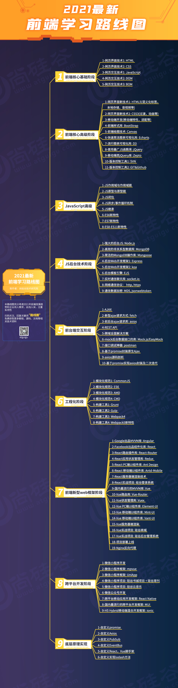
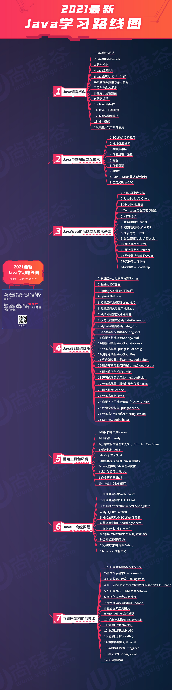
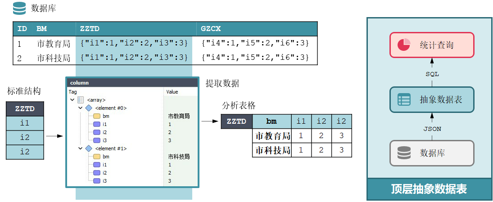
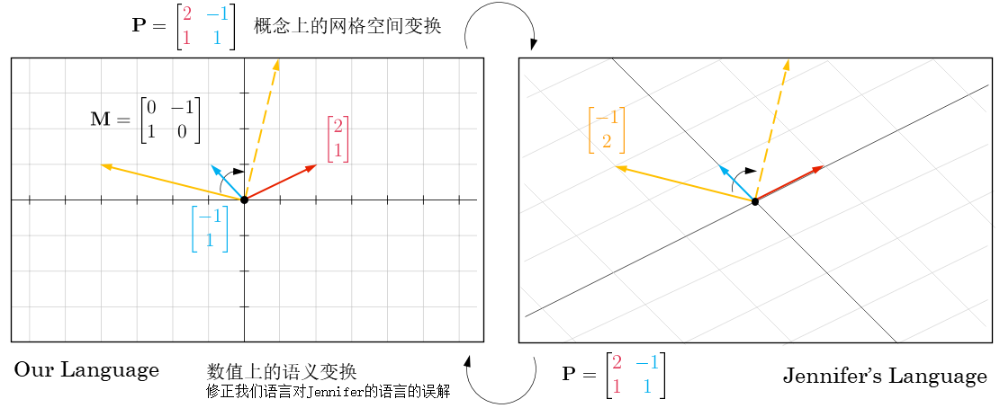
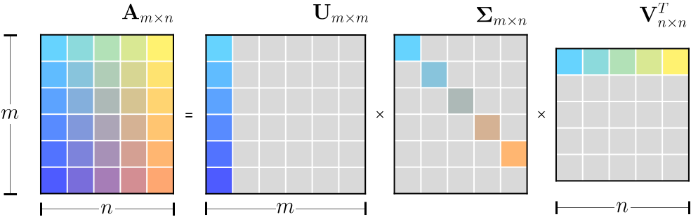

.. _header-n461:

Question List in December, 2021
===============================

🚋 Running to tomorrrow when you are ready.

.. raw:: html

   <html xmlns="http://www.w3.org/1999/xhtml"><head></head><body>江河都往海里流，海却不满；江河从何处流，仍归还何处。万物满有困乏，人不能说尽，眼看看不饱，耳听听不足。已有的事，后必再有；已行的事，后必再行；日光之下并无新事。</body></html>
   <html xmlns="http://www.w3.org/1999/xhtml"><head></head><body>
——所罗门《圣经 · 传道书》
</body></html>

.. _header-n466:

1、学习框架
-----------

目前前端框架中 React、Vue、Angular 三足鼎立，中间又穿插一些 ES6/ES7 以及
TypeScript 等脚本语言之间的特性差异，故而有下图。

但是 jQuery
虽好却不能贪多，更何况框架要解决的是针对一个项目所需要的组件、交互、逻辑、事件控制、生命周期等在内的诸多内容进行统一管理的问题，其所不能的正是这些框架所擅长的。所以啊少年，来学习或者说了解一下这三家主流框架的基本开发要点，开发几个小项目吧。

.. _header-n470:

1.1 认识前端框架
~~~~~~~~~~~~~~~~

.. _header-n471:

React
^^^^^

React 是一个用于构建用户界面的 JavaScript 库。React 主要用于构建
UI，很多人认为 React 是 MVC 中的 V（视图）。React 起源于 Facebook
的内部项目，用来架设 Instagram 的网站，并于 2013 年 5 月开源。React
拥有较高的性能，代码逻辑非常简单，越来越多的人已开始关注和使用它。

.. _header-n473:

Vue
^^^

Vue，读音 ``/vjuː/`` 的发音类似英文中的
View，是一套用于构建用户界面的渐进式框架。与其它大型框架不同的是，Vue
被设计为可以自底向上逐层应用。Vue
的核心库只关注视图层，不仅易于上手，还便于与第三方库或既有项目整合。另一方面，当与现代化的工具链以及各种支持类库结合使用时，Vue
也完全能够为复杂的单页应用提供驱动。

.. _header-n475:

Angular
^^^^^^^

AngularJS 诞生于 2009 年，由 *Misko Hevery* 等人创建，后为 Google
所收购。是一款优秀的前端 JS 框架，已经被用于 Google
的多款产品当中。AngularJS
有着诸多特性，最为核心的是：MVVM、模块化、自动化双向数据绑定、语义化标签、依赖注入等等。

.. _header-n477:

1.2 项目配置
~~~~~~~~~~~~

在项目开发过程中发现了一个较为好用的字体，JetBrains Mono；在 VSCode
中使用起来看着很舒服，感觉上要比 Source Code Pro
更加舒适，虽然不知道原理，但目前已成为俺的首推字体。

.. _header-n479:

项目配置
^^^^^^^^

**(1)** 在 package.json 的 ``scripts`` 组中添加 serve-open
命令，编译运行后调用 ``--open`` 直接启动浏览器。

.. code:: json

   "scripts": { "serve-open": "vue-cli-service serve --open" }

**(2)** 关闭 eslint 校验工具，避免诸如声明未使用的代码行为被拦截；创建
vue.config.js 文件。

.. code:: javascript

   module.exports = { lintOnSave: false }  // 关闭 eslint

**(3)** 给 src 文件夹起一个别名叫做
``@``\ ，方便日后组件间相互调用方便；创建 jsconfig.json 文件。

.. code:: json

   {
       "compilerOptions": {
           "baseUrl": "./",
           "paths": { "@/*": ["src/*"] }
       },
       "exclude": ["node_modules", "dist"]
   }

其中的 ``exclude`` 组标识在 ``node_modules, dist`` 两个文件夹中禁用
``@`` 别名缩写。另外 IDEA 中格式化代码的快捷键一般为 ``Ctrl`` + ``Alt``
+ ``L``\ ，望日后牢记。

.. _header-n487:

1.3 项目路由
~~~~~~~~~~~~

分析项目预期结构，提取不变量页眉和页脚分别命名为 ``header`` 组件和
``footer`` 组件，二者作为非路由组件统一放置到 ``src/components``
公共组件当中。

1. | 路由组件：一般放在 ``views|pages`` 文件夹内；
   | 提供这样几个路由组件
     ``home``\ 、\ ``search``\ 、\ ``login``\ 、\ ``register`` 等；

2. | 非路由组件：一般放在 ``components`` 文件夹内；
   | ``header``\ ：页眉组件，在所有路由页面中显示；
   | ``footer``\ ：页脚组件，仅在 ``home`` 以及 ``search``
     路由页面中显示；

项目样式需要使用 less 而非 css，故而需要使用 less 和 less-loader 来将
less 编译为浏览器所支持的 css 样式，另外为了避免版本冲突使用
less-loader@5 这一版本。

.. code:: shell

   cnpm install --sava less less-loader@5

而后需要在 vue 的 ``

.. _header-n498:

注册使用
^^^^^^^^

（1）路由组件的注册

路由组件在使用前需要在 ``main.js``
的代码中进行引用和注册，注册后实际上为 **所有组件** 都添加了 ``$route``
和 ``$router`` 两个属性。这里：

   | ``$route``\ ：一般获取路由信息，如路径、query、params 等等；
   | ``$ruoter``\ ：一般进行编程式导航路由跳转，如 push \| replace
     等等。

（2）路由组件的使用

路由组件一般需要在 ``router``
文件夹中进行注册，使用的时候以组件名字的形式出现；而非路由组件在使用的时候一般以标签的形式出现。

.. _header-n505:

跳转与隐藏
^^^^^^^^^^

（1）路由的 2 种跳转方式

路由组件的跳转有两种形式：一种是通过 **声明式导航** ``router-link``
进行路径式的路由跳转，另一种是通过 **编程式导航**
``push``\ ，\ ``replace`` 进行路由跳转。

   | ``router-link``\ ：使用时必须加上 ``to``
     属性，适用于一些简单的跳转场景；
   | ``push``\ \|\ ``replace``\ ：使用时可以施加一些其他的程序命令处理，如登录请求后的页面跳转。

另外，路由的跳转还支持重定向操作，如在 router 中添加这样一条路由
``{path:"*",redirect:"/home"}`` 即可点开网页时自动跳转到主页面。

（2） 路由组件的 2 种隐藏方式

路由组件的隐藏也有两种形式：一种是通过 ``v-if``
进行组件判断；另一种是通过 ``v-show`` 进行组件显示。其中的判断逻辑
``v-if`` 需要操作 DOM 节点，并判断 DOM
节点是有还是没有，所以在性能上会有所损耗。而相对的组件显示 ``v-show``
则仅仅是对控件 CSS 样式的一种控制。

   ``meta``\ ：路由元信息，是在设置路由数组 ``routes``
   中的记录时允许用户施加控制的字段。

.. _header-n515:

跳转时传参
^^^^^^^^^^

路由跳转传参有 **字符串传参** 、 **模板字符串传参** 和 **对象传参**
三种形式。

（1）字符串传参

其中，字符串传参有 ``params`` 和 ``query`` 两种参数，其中：\ ``params``
相当于路径中的一部分需要占位，而 ``query`` 则类似于 ajax 中的
``/home?k=v&v=s`` 查询字符形式。

   | ``params``\ ：路由参数，直接写在路径中以占位符 ``:`` 标识，如
     ``/search/:keyword`` 占位的 ``keyword`` 参数；
   | ``query``\ ：遵循 URL 语法规则的 ``?`` 形式参数传递方式，类似于
     ``/search?k=*`` 传递的值为 ``*`` 的 k 参数。 

（2）模板字符串传参

模板字符串传参是针对上面字符串传参的一种改进方式，其语法形式如下：

.. code:: javascript

   this.$router.push('/search/{$this.keyword}?k={this.keyword.toUpperCase()}');

（3）对象传参

最常用的对象传参方式遵循相似的语法规则，不过要在路由中以
``name: 'search'``
的形式为路由命名，随后就可以通过代码的形式进行参数传递了：

.. code:: javascript

   this.$router.push({
       name:'search', //不可以写 path:"/search" 的形式结合 path 一起使用
       params:{keyword: this.keyword},
       query:{k: this.keyword.toUpperCase()}
   })

指定 params 参数可传可不传可以使用正则表达式的 ``?``
来控制，即在路由后面加上相应的字符；而传递空字符的情况则可以使用
``this.keyword || undefined`` 的技巧来规避路径问题。

.. code:: javascript

   path: '/search/:keyword?'

（4）传递 ``props`` 数据

路由组件传递布尔值的方式也有三种形式：\ **布尔值写法**\ 、\ **对象写法**
以及 **函数写法**\ 。其一是通过在路由中指定 ``props`` 为 ``true``
来开启传递 ``params`` 参数的功能，这样就可以在跳转目的地使用如下代码

.. code:: javascript

   export default {
       name: '',
       props: ['keyword']
   }

来将路径中的 ``params`` 参数传递给目的地，并直接通过 ``{{keyword}}``
来读取相关数据。

其二，是通过对象方式在 ``props``
中额外添加一些属性进行传递。其三，是通过函数的形式直接在路由中指定所需要传递的参数信息：

.. code:: javascript

   pros: ($route)=>{
       return {keyword: $route.params.keyword, k:$route.params.keyword.toUpperCase()}
   }

.. _header-n535:

重定向错误
^^^^^^^^^^

使用 ``push`` 或 ``replace`` 进行路由跳转时会在控制台输出异常警告，提示
NavigationDuplicated 重定向错误，其描述如下所示：

   Uncaught (in promise) NavigationDuplicated: Avoided redundant
   navigation to current location:

该异常是 vue-router@3.5.3 引入的异步编程解决方案 promise
模块所引起的，这个模块作为 ``push`` 函数的返回值时，如果在调用 ``push``
时不指定正确回调和错误回调就会在控制台直接输出异常，将异常挪到别的地方处理可以使用如下代码：

.. code:: javascript

   $router.push({name: 'search',meta: {keyword: 'a'}},()=>{},(errro)=>{})

这样是正确的异常处理逻辑，但还没有深入到异常的出现原因。透，这个老师也没有讲具体原因，只讲了一种折衷减少代码量的策略，就是重写
``push`` 提供一个默认的成功或失败的回调：

.. code:: javascript

   let originPush = VueRooter.prototype.push;
   VueRooter.prototype.push = function(location, resolve, reject){
       if(resolve && reject){
           originPush.call(this, location, resolve, reject);
       }else{
           originPush.call(this, location, ()=>{}, ()=>{});
       }
   }

这里介绍一下 ``push`` 和 ``replace`` 的区别：

   | ``push`` 相当于 ``<router-link>`` 回向 History
     栈中添加一条记录，浏览器后退时退回到原有 URL；
   | ``replace`` 则和其字面意义一样，会直接覆盖掉原有 History
     历史栈中的记录，不存储原有 URL。

.. _header-n546:

1.4 前端相关知识点
~~~~~~~~~~~~~~~~~~

.. _header-n547:

前端 UI 框架
^^^^^^^^^^^^

依据参考文献 5 的说法，目前国内主流的 Web 端开发框架还是 Layui 和
Element，而国外开发者依旧很喜欢由 Twitter 公司开发的 Bootstrap
框架。其他框架可以参照博客主动观察。另外观察了几个源自 B 站一位外国 UP
主推荐的前端设计开发者的个人简介网站，摘录如下：

⭐️⭐️⭐️⭐️⭐️⭐️ *Riccardo Zanutta* 响应式布局
`连接 <https://riccardozanutta.com/>`__

⭐️⭐️⭐️⭐️ *Prashantsani* 响应式布局 `连接 <https://prashantsani.com/>`__

.. figure:: pic/202112/prashantsani.png
   :align: center

⭐️⭐️⭐️⭐️ *Suzesh Muzali* 非响应式布局
`连接 <https://sureshmurali.github.io/>`__

.. figure:: pic/202112/suzesh.png
   :align: center

⭐️⭐️⭐️⭐️ *Mattfarley* 响应式布局 `连接 <https://mattfarley.ca/>`__

.. figure:: pic/202112/mattfarley.png
   :align: center

.. _header-n557:

DIV 换行
^^^^^^^^

依据参考文献 6 的相关内容，在 DIV 中换行可以使用 ``\n`` 换行符，但是要为
DIV 标签添加一个 ``white-space`` 属性以显示空白符。各中原由在于 DIV
在默认情况下会将文本中的空白、换行符当作空格，统一进行忽略处理；所以需要更改其默认属性：

.. code:: html

   
换个 行\n终究是错付啦！

其中：\ ``pre`` 保留换行和空白，\ ``pre-line``
标识只保留换行。其他标签的换行可以参考文献 6 的说明。

.. _header-n561:

Vue 更新表格
^^^^^^^^^^^^

在用 Chrome 浏览器的 Vue.js devtools
插件调试本地文件时，需要点开插件详情，选中 [允许访问文件网址]
并启用该功能，如此才能在调试的时候使用 Vue 调试工具。

Vue 执行数据的双向绑定，所以只要知道 Vue
对象的实例，就可以通过对象实例的 ``$data``
属性来更改相应的数据并对视图进行同步刷新；同样地，视图中的数据进行了修改后，相应的数据也会对应进行更新，这就是
Vue 的双向绑定数据机制；这个机制在 Element UI 中的表格中对应实现了。

.. code:: javascript

   this.$data.data = [新数据]

.. _header-n565:

读取本地 JSON 文件
^^^^^^^^^^^^^^^^^^

至此简单实现表格的刷新。另外，读取本地 JSON 文件需要用到 axios
包，引入后可以通过下面的代码读取后台服务发送的 JSON 对象。

.. code:: html

   

.. code:: javascript

   mounted(){
       axios.get("./memo.json").then(res => { 
           this.$data.data = res 
       }).catch(error=>{
           console.log(error);
       })
   },

但在调用本地文件时会提示跨域问题：

.. code:: shell

   Access to XMLHttpRequest at 'file:///C:/xxxxxxx/memo.json' from origin 'null' has been blocked by CORS policy: Cross origin requests are only supported for protocol schemes: http, data, chrome, chrome-extension, chrome-untrusted, https

问题的原因在于请求时使用了 file 协议，而非浏览器请求时所需要的 http,
data, chrome, chrome-extension, chrome-untrusted, https
等协议。所以解决起来或者可以使用 JSONP 为 JSON
加个回调函数体，并在代码中使用回调函数，亦或者调整浏览器设置使其接受
file 协议。

参照参考文献 8 可以实现用 JS 原生的 FileReader
来调用本地文件，但这种文件需要手动点击按钮才行，不是很方便和灵活，看看有没有其他方式。

.. _header-n573:

生成 Word 文档
^^^^^^^^^^^^^^

目前从知乎了解到 Vue 中可以使用 jquery.wordexport.js
导出插件进行导出，另外还了解到有一个利用 XML 徒手实现的 OpenOffice
桌面端程序。从 Github 上找到了隶属于 SheetJS 的 js-word
插件，也是一种基于 XML 实现的 Word 生成程序；以及 *mwilliamson* 提供的
mammoth.js 转换 .docx 文件为 HTML 的插件。

   UNPKG 在线引用 JS 库，\ `UNPKG <https://unpkg.com/>`__

JSON 填充 HTML 的方式有两个插件：1、Github 上 *moappi* 提供的 json2html
插件；2、\ *bloopletech* 提供的 JSON 2 HTML
插件。后者更贴近于工程，前者更趋近于使用插件，所以目前考虑采用第一种方式。

.. _header-n579:

参考文献
~~~~~~~~

1.  知乎.\ `目前流行的9大前端框架 <https://zhuanlan.zhihu.com/p/76463271>`__\ [EB/OL].

2.  Bilibili.\ `尚硅谷VUE项目实战，前端项目-尚品汇(大型\重磅) <https://www.bilibili.com/video/BV1Vf4y1T7bw?p=1>`__\ [EB/OL].

3.  Gitee.\ `尚品汇项目源码 <https://gitee.com/jch1011/shangpinhui_0415>`__\ [EB/OL].

4.  Jetbrains.\ `Jetbrains Mono. A typeface for
    developer <https://www.jetbrains.com/lp/mono/>`__\ [EB/OL].

5.  CSDN博客.\ `18个公认的
    世界顶级UI开源框架汇总 <https://blog.csdn.net/weixin_40362806/article/details/107227345>`__\ [EB/OL].

6.  博客园.\ `换行符在textarea、div、pre中的区别 <https://www.cnblogs.com/yanze/p/6358020.html>`__\ [EB/OL].

7.  知乎.\ `加载本地文件出现跨域解决方案 <https://zhuanlan.zhihu.com/p/359881121>`__\ [EB/OL].

8.  博客园.\ `JS读取本地文件 <https://www.cnblogs.com/ezhar/p/13035134.html>`__\ [EB/OL].

9.  CSDN博客.\ `ElementUI中的el-table表格设置全透明 <https://blog.csdn.net/qq_41813208/article/details/109324796>`__\ [EB/OL].

10. 简书.\ `VUE+Element
    UI实现简单的表格行内编辑效果 <https://www.jianshu.com/p/79f39f2c1382>`__\ [EB/OL].

11. 知乎.\ `vue中jquery.wordexport.js将含echarts图表的HTML导出生成word文档 <[vue中jquery.wordexport.js将含echarts图表的HTML导出生成word文档 - 知乎 (zhihu.com)](https://zhuanlan.zhihu.com/p/157591802)>`__\ [EB/OL].

12. Github.\ `js-word <[GitHub - SheetJS/js-word: Word Processing Document Library](https://github.com/SheetJS/js-word)>`__\ [EB/OL].

13. moappi .\ `json2html • lightning fast HTML templating for node.js &
    jquery <http://www.json2html.com/started/>`__\ [EB/OL].

14. bloopletech .\ `JSON 2 HTML
    (bloople.net) <https://json.bloople.net/>`__\ [EB/OL].

.. _header-n610:

2、前后端技术路线图
-------------------

本技术路线图引用自尚硅谷 B 站前端 57 群中的相关图片。

.. _header-n612:

2.1 前端技术路线
~~~~~~~~~~~~~~~~

.. _header-n614:

2.2 后端技术路线
~~~~~~~~~~~~~~~~

.. _header-n617:

3、发改委非首都二期
-------------------

此项目有关于专项绩效评价部分的内容，经前期测试现已确定五个基本表格和两个视图。基本表格包括：部门信息表、指标填报表、指标填报表字段的数据结构表、配置信息表以及快照表；两个视图是在部门信息表的部门以及部门类型两个字段基础上做关联而形成的市级部门视图、各区政府视图。现需考虑的问题有：

1. 指标填报表数据结构严重依赖于初始化数据库时内部存储内容，需要依据指标填报表字段的数据结构表对指标填报表的
   CRU 操作进行逻辑验证并提交相关代码。

2. 依据指标填报表的建立规则，部门信息表与指标填报表是允许一对多关联的；所以要考虑是否严格确保指标填报表中部门字段的唯一性。

3. 考虑是否需要提供数据库指标填报表中各个填报字段的初始化操作接口。

依据上述问题，对相关功能逻辑进行梳理。

.. _header-n627:

3.1 指标填报表字段的数据结构
~~~~~~~~~~~~~~~~~~~~~~~~~~~~

以示例为基础，当某一条记录中的指标填报表中的 ``[zztd]``
字段为空时的情况：

| （1）查询当前记录时，字段内容将不影响程序输出，只不过返回的是一个空的
  JSON 对象；
| （2）修改当前记录时，由于字段原有内容为空，所以更新的数据无法存储到数据库结构当中。

综合上面的查询和修改分析，需要建立一个 JSON
对象来管理每次填写到当前记录中的数据的数据结构；这个结构的描述文本存储在
**指标填报表字段的数据结构表** 之中。当执行 CRU
服务时，从结构表中读取出所需要的字段的结构信息并解析为 JSON
对象，更新、查找和新增时均以这个对象为基准。

.. code:: java

   /** 
    * 从数据库中查询某表格某字段的标准数据结构
    * 
    * @param table 需要查询的数据表：1-市级部门，2-各区政府；
    * @param type 需要查询的字段：zztd-组织推动，zhfw-综合服务，gzcx-工作成效，jjfx-加减分项目；
    */
   JSONObject standardJSON(String table, String type);

写好该函数之后，改写现在的增加、修改、读取代码，将其中的唯一 JSON
对象判断修改为标准对象。

.. _header-n633:

3.2 填报信息表的 ``bm`` 唯一性
~~~~~~~~~~~~~~~~~~~~~~~~~~~~~~

需要是的填报信息表中的 ``[bm]``
字段维持唯一性，以方便后面的数据处理和服务提供；设计到填报信息表内容增加或者删除时均要与部门信息表保持一致，这样能减少很多很多问题；首先，视图中不会有重复字段；其二，修改时不会出现部门重复修改两条记录的问题；其三，维护正确的表格操作逻辑。

   ADD 操作同步 ADD，DELETE 操作同步 DELETE

.. _header-n637:

3.3 JSON 字段的纵向管理
~~~~~~~~~~~~~~~~~~~~~~~

由于项目设计之初采用了存储 JSON 字段的模式进行管理，所以对于 JSON
字段的某一纵列的管理就需要重新写代码进行处理，特在这里梳理一下通用逻辑，为后面的处理提供方便。这里发现了两种方式：

.. _header-n639:

顶层抽象数据表
^^^^^^^^^^^^^^

自主设计并梳理逻辑，确定如下的顶层抽象数据表，旨在还原数据库中存储的
JSON 对象构建一个用于分析的抽象数据表，并再次基础上执行 SQL 语句。

但这种模式困难度略有些大，遂暂且搁置。在查找资料的过程中发现了可以在数据库中直接操作
JSON 对象，所以研究下这种模式，并测试下是否可以用 MyBatis
定制化相关代码。

.. _header-n643:

SQL 直接操作 JSON 对象
^^^^^^^^^^^^^^^^^^^^^^

该功能仅限 MySQL 5.7 及以上版本，其核心语句是：

.. code:: sql

   JSON_UNQUOTE(JSON_EXTRACT([字段名],'$[0].[JSON对象名]')) AS [JSON对象名]

另一种语法是：

.. code:: sql

   [字段名]->>'$[0].[JSON对象名]' AS [JSON对象名]

其中，\ ``JSON_EXTRACT`` 负责将表格中的 JSON
对象解析出来，\ ``JSON_UNQUOTE`` 负责删除解析结果首尾的双引号 ``"``
信息。这样一来核心内容就变成写 SQL 语句的问题了，即 MyBatis 如何定制 SQL
语句。

首先，MyBatis 支持在 Mapper 中返回 ``List<JSONObject>``
类型数据；其次，Mapper 中也可以传递字符串参数到 SQL
语句中，这样一来就可以直接通过前端传送的数据生成
SQL语句了；最后，直接返回 JSON
格式数据的这种形式将把一切类型转换为数字，所以为了判断是否是数字，需要使用：

.. code:: java

   NumberUtils.isNumber([字符串]);
   NumberUtils.createNumber([字符串]);

来将字符串形式的数字转换为直接的字符串。

.. _header-n652:

Mybatis 插入记录后获取该条记录ID
^^^^^^^^^^^^^^^^^^^^^^^^^^^^^^^^

.. code:: xml

   <insert id="insert" useGeneratedKeys="true"  keyProperty="id">
       insert into t_user  (name,password)  values  (#{name}, #{password});
   </insert>

.. _header-n654:

3.3 Spring Boot 定时任务
~~~~~~~~~~~~~~~~~~~~~~~~

根据任务需要，需要定时执行快照创建任务；在确保服务器时间与真实时间一致之后，就可以着手创建定时任务来对快照进行系统自动创建了。系统自动创建的备份每月只有一次，可以确保其唯一性。

.. _header-n656:

CRON 表达式
^^^^^^^^^^^

CRON 取自英文单词 *cron*\ ，译为定时器，同时也是 Linux
内置的定时执行工具。其在 Java 中具化为一种表达式，该表达式字符串以 5 或
6 个空格分割为 6 或 7 个域；其有如下两种语法格式：

   | **[1]** 6 空格：\ ``Seconds`` ``Minutes`` ``Hours`` ``DayofMonth``
     ``Month`` ``DayofWeek`` ``Year``
   | **[2]** 5 空格：\ ``Seconds`` ``Minutes`` ``Hours`` ``DayofMonth``
     ``Month`` ``DayofWeek``

每一个域都使用数字，还可以使用如下特殊字符：

1. | ``*`` 表示匹配该域的\ **任意值**\ 。
   | 假如在 ``Minutes`` 域使用 ``*`` ，即表示每分钟都会触发事件。

2. | ``?`` 只能用在 ``DayofMonth`` 和 ``DayofWeek`` 两个域。
   | 它理论上也匹配域的任意值，但由于 ``DayofMonth`` 和 ``DayofWeek``
     会相互影响所以不会有任意值的效果；例如想在每月的 20
     日触发调度，不管 20
     日到底是星期几，则只能使用如下写法：\ ``13 13 15 20 * ?``\ ，其中最后一位只能用
     ``?``\ ，而不能使用 ``*``\ ，如果使用 ``*``
     表示不管星期几都会触发，实际上并不是这样。

3. | ``-`` 表示\ **范围**\ 。
   | 例如在 ``Minutes`` 域使用 ``5-20``\ ，表示从 5 分到 20
     分钟每分钟触发一次。

4. | ``/`` 表示起始时间开始触发，然后每隔固定时间触发一次。
   | 例如在 ``Minutes`` 域使用 ``5/20``\ ，则意味着 5 分钟触发一次，而
     25，45 等分别触发一次。

5. | ``,`` 表示列出枚举值。
   | 例如在 ``Minutes`` 域使用 ``5,20``\ ，则意味着在 5 和 20
     分每分钟触发一次。 

6. | ``L`` 表示最后，只能出现在 ``DayofWeek`` 和 ``DayofMonth`` 域。
   | 如果在 ``DayofWeek`` 域使用
     ``5L``\ ，意味着在最后的一个星期四触发。 

7. | ``W`` 表示有效工作日，只能出现在 ``DayofMonth``
     域，系统将在离指定日期的最近的有效工作日触发事件。
   | 例如在 ``DayofMonth`` 使用 ``5W``\ ，如果 5
     日是星期六，则将在最近的工作日：星期五，即 4 日触发；如果 5
     日是星期天，则在 6 日（周一）触发；如果 5
     日在星期一到星期五中的一天，则就在 5 日触发；另外 ``W``
     的最近寻找不会跨过月份 。

8. ``LW``
   这两个字符可以连用，表示在某个月最后一个工作日，即最后一个星期五。

9. ``#`` 用于确定每个月第几个星期几，只能出现在 ``DayofMonth``
   域。例如在 ``4#2``\ ，表示某月的第二个星期三。

至此，系统自动创建快照功能开发完成。若想允许用户修改系统创建快照的时间，则仍然需要进一步的开发工作。

.. _header-n681:

Scheduled Task
^^^^^^^^^^^^^^

实现 Scheduled Task 有两种方式：一是静态的 ``@Scheduled``
注解，另一种是重写 ``SchedulingConfigurer``
类并在该类中实现相应的控制。按照博客 14
中的方法可以实现动态调整计时时间，但这种方式有问题：

   修改了数据库中的执行时间后，代码具体执行的时候会有一个执行周期（修改前的执行周期）的延迟。

   比如说之前设置的是 30 秒执行一次，修改为 20
   秒执行一次后，会再执行一次 30 秒的任务后才能执行 20
   秒的任务。简单的说就是修改数据库后，因为代码中没有通知项目修改执行时间的机制，所以项目需要再执行一次原有任务来加载新的执行时间；新的执行时间到达后执行任务，不管是减少还是增加执行时间都有这个问题。

参照博客 15
的解决方案，可以创建一个线程池对定时任务进行管理，包括定时任务的开启、关闭、重启等。通过这种线程管理策略，可以实现完备的任务管理机制。

   Scheduled Task 是一种轻量级的任务定时调度器，相比于 Quartz
   减少了很多的配置信息。但是相对地，Scheduled Task
   不适用于服务器集群，其在服务器集群下会出现任务被多次调度执行的情况；这是因为集群的节点之间是不会共享任务信息的，故而每个节点的定时任务都会定时执行。

.. code:: java

   /**
    * 利用线程池实现任务调度
    *
    * 原理: (1) 实现一个类：ThreadPoolTaskScheduler 
    *          线程池任务调度器，能够开启线程池进行任务调度
    *      (2) ThreadPoolTaskScheduler.schedule() 方法会创建一个定时计划 ScheduleFuture 类
    *          在这个方法中添加两个参数:
    *          a. 一个是 Runable 线程接口类
    *          b. 一个是 CronTrigger 定时任务触发器
    *      (3) 在 ScheduleFuture 中有一个 cancel 可以停止定时任务
    * 
    * @author Corn-玉米
    * @modifier Ashinjero
    */

   @RestController
   @EnableScheduling
   public class DynamicTask {
       
       @Autowired
       private ThreadPoolTaskScheduler scheduler;
       private ScheduledFuture future;

       @Bean
       public ThreadPoolTaskScheduler threadPoolTaskScheduler() {
           return new ThreadPoolTaskScheduler();
       }

       /**
        * 1.定义启动定时任务方法：
        * 2.定义终止定时任务方法：
        * 3.定义修改定时任务时间方法：ChangeTask()
        */

       /** 启动定时器 */
       @RequestMapping("start")
       public String StartTask() {
           /**
            * task:定时任务要执行的方法
            * trigger:定时任务执行的时间
            */
           future = scheduler.schedule(new Task(), new CronTrigger("0/5 * * * * *"));
           return "StartTask";
       }

       /** 停止定时任务 */
       @RequestMapping("end")
       public String EndTask() {
           if (future != null) { future.cancel(true); }
           System.out.println("End Task");
           return "EndTask";
       }

       /**
        * 改变调度的事件：
        *   1.先停止定时器
        *   2.再启动定时器
        */
       @RequestMapping("change")
       public String ChangeTask(CronTrigger cron) {        
           EndTask();//停止定时器        
           future = scheduler.schedule(new Task(), cron);//定义新的执行时间        
           System.out.println("Change Task");
           return "ChangeTask";
       }

       /** 定义定时任务执行的方法 */
       public class Task implements Runnable {
           @Override
           public void run() {
               System.out.println("定时任务要执行的方法" + new Date());
           }
       }
   }

Spring应用启动过程中，肯定是要自动扫描有@Component注解的类，加载类并初始化对象进行自动注入。加载类时首先要执行static静态代码块中的代码，之后再初始化对象时会执行构造方法。在对象注入完成后，调用带有@PostConstruct注解的方法。当容器启动成功后，再根据@Order注解的顺序调用CommandLineRunner和ApplicationRunner接口类中的run方法。因此，加载顺序为：

   ``static`` > ``constructer`` > ``@PostConstruct`` >
   ``CommandLineRunner`` 和 ``ApplicationRunner``.

以上，为服务启动时预先执行一部分代码的相关知识。

.. _header-n694:

3.4 问题记录
~~~~~~~~~~~~

.. _header-n695:

网络架构图的绘制方法
^^^^^^^^^^^^^^^^^^^^

此外，了解了下伪 3D 物理网络架构图的设计，最后还是觉得 PPT
绘制比较方便，但其文字三维效果会模糊，所以看看有没有什么其他方式，如
CoreDraw 等。最后查阅了设计师们用的软件，发现 Figma
的确很靠谱，里面的各种插件很有用，还有 Vectary 3D 插件支持三维图形引入
Figma；用到的倾斜插件是 SkewDat。

.. _header-n697:

Protocol Buffers
^^^^^^^^^^^^^^^^

Protocal Buffers 是 Google
的一个开源项目，它是用于结构化数据串行化的灵活、高效、自动的方法，它比
XML
更小、更快、也更简单。支持用户定义自己的数据结构，然后使用代码生成器生成的代码来读写这个数据结构。

.. _header-n699:

前端 Excel 控件
^^^^^^^^^^^^^^^

目前了解到的有 `spreedsheet <https://www.spreadsheet.com/>`__ 和
`SpreadJS <https://www.grapecity.com.cn/developer/spreadjs>`__
两款。风格都可以做到与 Excel 极其相似。

.. _header-n701:

解决 Gihub 访问慢问题
^^^^^^^^^^^^^^^^^^^^^

利用 GitHub 520 项目：

   https://github.com/521xueweihan/GitHub520

.. _header-n705:

URL的 ``%E2%80%8E`` 问题
^^^^^^^^^^^^^^^^^^^^^^^^

这里主要强调一下复制 URL 时很容易出现特殊字符 ``%E2%80%8E`` ，略作解释：

   当URL出现 %E2%80%8E 就代表你的URL里面有包含一个ZERO-WIDTH SPACE
   (ZWSP)，这个是肉眼无法发现的空白，ZWSP一般情况是打不出来的，但是如果你是通过WORD等等的文件编辑器复制贴上的就很有可能含有ZWSP，一般情况下ZWSP并不影响阅读但是当它变成URL的一部分，就会变成
   %E2%80%8E ，使你的URL出现错误。

解决问题就注意一下就行了，在代码中可以通过替换字符串来自动处理 URL。

.. _header-n710:

若依分页请求
^^^^^^^^^^^^

若依的分页请求是通过前端 Vue 的 ``<pagination>`` 控件标签和后端的
``startPage()`` 函数共同作用来实现的。在此过程种，前端控件的
``:page.sync`` 和 ``:limit.sync``
属性分别定义了当前页号和每页显示的条数，具体到请求体代码中应遵循如下规则：

.. code:: json

   queryParams: {
       pageNum: 1,
       pageSize: 10
   }

而后端则通过 ``startPage()``
函数来响应分页。下沉到代码的具体实现，基本逻辑是通过
RequestContextHolder 获取 RequestAttributes
类，从中传递参数中响应如下参数：

.. code:: java

   pageNum       //当前记录起始索引
   pageSize      //每页显示记录数
   orderByColumn //排序列
   isAsc         //排序的方向：desc 或 asc

至此，通过 ServletUtils 类，TableSupport 类以及 PageDomain
类的层层封装，实现分页请求。

.. _header-n717:

参考文献
~~~~~~~~

1.  CSDN博客.
    `如何画好架构图 <https://blog.csdn.net/phasorhand/article/details/90176690>`__\ [EB/OL].

2.  CSDN文库.
    `知名互联网公司网站架构图 <https://download.csdn.net/download/weixin_38651273/15471701>`__\ [EB/OL].

3.  阿里云.
    `安徽云栖大数据技术有限公司 <http://www.theyun.cn/>`__\ [EB/OL].

4.  draw.io. `Draw.io+aws3d+citrix 制作伪 3D
    架构图 <https://app.diagrams.net/>`__\ [EB/OL].

5.  Figma.\ `Figma中文版 <https://www.figma.cool/cn>`__\ [EB/OL].

6.  博客园.\ `若依管理系统源码分析-分页的实现以及post请求时的分页 <https://www.cnblogs.com/badaoliumangqizhi/p/13507493.html>`__\ [EB/OL].

7.  博客园. `Protocol
    Buffers <https://www.cnblogs.com/silvermagic/p/9087593.html>`__\ [EB/OL].

8.  CSDN博客.\ `【图解】Web前端实现类似Excel的电子表格 <https://blog.csdn.net/weixin_34162695/article/details/90069354>`__\ [EB/OL].

9.  博客园.\ `SQL语句中对json数据的查询 <https://www.cnblogs.com/87060524test/p/11612633.html>`__\ [EB/OL].

10. 百度百家号.\ `MySQL的json查询之->、->>、json\ extract、json\ unquote <https://baijiahao.baidu.com/s?id=1719223559880876355&wfr=spider&for=pc>`__\ [EB/OL].

11. iteye.\ `Mybatis类型转换介绍 <https://www.iteye.com/blog/elim-1847854#_Toc353481987>`__\ [EB/OL].

12. CSDN博客.\ `Mybatis中插入记录后获取该条记录ID <https://blog.csdn.net/Mr_YeShaoFei/article/details/89511197>`__\ [EB/OL].

13. 知乎.\ `解决URL出现%E2%80%8E（Zero-Width
    Space） <https://zhuanlan.zhihu.com/p/88624084>`__\ [EB/OL].

14. 博客园.\ `springboot 基于@Scheduled注解
    实现定时任务 <https://www.cnblogs.com/nongzihong/p/11193974.html>`__\ [EB/OL].

15. CSDN博客.\ `spring-boot 定时任务之Scheduled
    Task <https://blog.csdn.net/qq_34125349/article/details/77430956>`__\ [EB/OL].

16. CSDN博客.\ `探究SpringBoot启动时实现自动执行代码 <https://blog.csdn.net/u011291072/article/details/81813662>`__\ [EB/OL].

.. _header-n752:

4、C++ 相关内容
---------------

此处日常记录本月 C 艹的相关知识点。

.. _header-n754:

4.1 CRTP
~~~~~~~~

CRTP 是 *Curiously Recurring Template Pattern*
的简称，中文译文一般可以翻译为
**奇异递归模板**\ ，是通过将子类类型作为模板参数传递给基类的一种模板使用技巧。在很多开源项目中都可以见到这种技术，其使用场景通常包括两种类型：即
静态多态 和 引用计数。

每个派生类继承 ``CRTP``
类时都要将自身的类型传给基类，在此过程中发生了模板实例化；而这一过程本质上并没有一个基类（接口）对应多个派生类（实现）。CRTP
作为快速扩展类的手段，基类可以获得到派生类的类型，提供各种操作，比普通的继承更加灵活。但
CRTP 基类并不会单独使用，只是作为一个模板的功能。

.. _header-n757:

静态多态
^^^^^^^^

通过 CRTP 这种编程技巧可以在 C++
中实现编译时绑定进而实现静态多态，这种绑定方式可以降低动态多态调用虚表虚指针的开销。常见的示例如下：

.. code:: c++

   template <class Drived>
   class Base{
   public:
       void Interface(){ static_cast<Drived*>(this)->Implementation(); }
       void Implementation() {cout << "Base Implementation." << endl; }
   };
   class Drived1: public Base<Drived1>{
       void Implementation() {cout << "Drived 1 Implementation." << endl; }
   };
   class Drived2: public Base<Drived2>{};

这样，在创建 ``Drived1`` 和 ``Drived2`` 两个实例并调用各自的
``Implementation()``
方法时将产生不同的结果，且这个过程没有产生任何额外的开销，无需在运行时去调用虚函数和虚表。

.. _header-n761:

计数
^^^^

通过为基类引入静态成员变量，就可以实现对类对象实例个数的统计；在此基础上，将静态成员改为动态成员并在此基础上，进一步改造拷贝构造函数以及赋值运算符，就可以实现智能指针
``shared_ptr`` 的引用计数类。

.. code:: c++

   template<typename T>
   class Counter{
   public:
     Counter(){ add(1);}
     Counter(const Counter& other){ add(1); }
     ~Counter(){ add(-1); }
   public:
     static size_t get(){ return _count; }
   private:
     static void add(int n) { _count += n; }
   private:
     static int _count;
   };

   template<typename T> 
   int Counter<T>::_count = 0;

   class A: public Counter<A>{};
   class B: public Counter<B>{};

通过上面的代码即可实现对类 ``A`` 和类 ``B``
所创建并使用的实例对象的个数进行相应的统计了。这种逻辑同时也是智能指针传递自身指针时所使用的：

.. code:: c++

   struct Good: std::enable_shared_from_this<Good>{
       std::shared_ptr<Good> getptr() {
           return shared_from_this();
       }
   };// 避免直接传递 share_ptr<this> 造成两个非共享的 share_ptr 指向同一个对象
   // 若这样的话，未增加引用计数导对象被析构两次

.. _header-n766:

4.2 CentOS 运维
~~~~~~~~~~~~~~~

此为承接奇哥在 CentOS 上运维所需要的相关软件和运行库，其清单如下：

-  Java 环境： 运行服务器环境；

-  GDAL： 解析 SHP 文件时使用；

-  Nacos： 若依微服务使用；

-  MySQL 5.7： 若依服务的数据库；

-  PostgresSQL： 存储双城业务表；

-  PostGIS： 存储双城矢量 SHP 文件；

-  SuperMap iServer：超图服务；

-  Redis： 若依使用的 Redis 缓存；

-  Nginx： 反向代理工具；

-  GBase8s： 南大通用数据库；

-  FTP： 远程传输文件，考虑使用 ``lrzsz`` 工具。

依据清单内容进行相应的软件安装和试运行。

.. _header-n792:

远程连接
^^^^^^^^

构建远程连接方式的方法如下：

.. code:: shell

   systemctl status sshd.service # 检查 SSH 状态
   ip addr                       # 查看本机 IP 地址

.. _header-n795:

修改国内镜像
^^^^^^^^^^^^

1、首先备份系统自带yum源配置文件/etc/yum.repos.d/CentOS-Base.repo

.. code:: 

   mv /etc/yum.repos.d/CentOS-Base.repo /etc/yum.repos.d/CentOS-Base.repo.backup

2、进入yum源配置文件所在的文件夹

.. code:: 

   cd /etc/yum.repos.d/

3、下载ailiyun的yum源配置文件到/etc/yum.repos.d/

**CentOS8**

.. code:: shell

   wget -O /etc/yum.repos.d/CentOS-Base.repo http://mirrors.aliyun.com/repo/Centos-8.repo

**CentOS7**

.. code:: shell

   wget -O /etc/yum.repos.d/CentOS-Base.repo http://mirrors.aliyun.com/repo/Centos-7.repo

**CentOS6**

.. code:: shell

   wget -O /etc/yum.repos.d/CentOS-Base.repo http://mirrors.aliyun.com/repo/Centos-6.repo

4、运行yum makecache生成缓存

.. code:: shell

   yum makecache

5、这时候再更新系统就会看到以下 mirrors.aliyun.com 信息：

.. code:: shell

   [root@localhost ~]# yum -y update
   已加载插件：fastestmirror, refresh-packagekit, security
   设置更新进程Loading mirror speeds from cached hostfile
   \* base: mirrors.aliyun.com
   \* extras: mirrors.aliyun.com
   \* updates: mirrors.aliyun.com

至此，完成镜像源更新。

.. _header-n812:

VMware 错误
^^^^^^^^^^^

VMware Workstation 不可恢复错误: (vcpu-0)；解决方案如下：

   | 1、重启电脑进入 BIOS，按 F1 或 F2、或 F5、或 delete 等；
   | 2、找到菜单 Advanced 进入 CPU configuration 
   | 3、将 intel virtual technology 设置为 Enable，F10，然后保存退出；
   | 4、重新打开虚拟机即可。

开启电脑的 CPU 虚拟化；最后发现外星人的 x17 笔记本不支持 CPU
虚拟化操作，就很日。

.. _header-n817:

传递文件
^^^^^^^^

win10秒传文件到VMwareCentos7虚拟机，参考自博客 9 的相关内容。首先在
Windows 中创建用户并以此作为登录凭证共享某一文件夹 share，随后在 Linux
系统中添加 samba 服务，输入如下命令：

.. code:: shell

   mount.cifs //192.168.9.192/share /mnt/Windows/ -o username="jjfly",sec=ntlmssp

然后输入创建的 Windows 用户账号密码即可通过 share 文件夹实现文件传递。

.. _header-n821:

4.3 开发环境
~~~~~~~~~~~~

.. _header-n822:

激活 Clion 并创建快捷方式
^^^^^^^^^^^^^^^^^^^^^^^^^

参考网站 http://idea.javatiku.cn/ 获取激活码即可，验证码
1567；经过测试发现该网站可用。创建快捷方式的方法如下：首先在应用程序目录新建一个文件：

.. code:: shell

   sudo vim /usr/share/applications/Clion.desktop

输入：

.. code:: shell

   [Desktop Entry]

   Encoding=UTF-8
   Name=Clion
   Comment=Clion IDE for C++
   Exec=/home/jjfly/Documents/clion-2020.3.1/bin/clion.sh %u
   Icon=/home/jjfly/Documents/clion-2020.3.1/bin/clion.svg
   Terminal=false
   StartupNotify=true
   Type=Application
   Categories=Application;Development;

保存后执行命令赋予权限：

.. code:: shell

   sudo chmod a+x /usr/share/applications/Clion.desktop

.. _header-n829:

安装 Eigen
^^^^^^^^^^

1. 从官网获取安装目录：

   .. code:: shell

      wget https://gitlab.com/libeigen/eigen/-/archive/3.3.9/eigen-3.3.9.tar.gz

2. 下载后解压：

   .. code:: shell

      tar -zxvf eigen-3.3.9.tar.gz

3. 然后打开解压的目录进行编译：

   .. code:: shell

      cd eigen-3.3.9 # 进入解压目录
      mkdir build    # 创建编译文件夹
      cd build       # 进入编译文件夹
      cmake ..       # 用 CMake 生成 Makefile
      make install   # 安装

.. _header-n840:

安装图像开发包
^^^^^^^^^^^^^^

Ubuntu 系统用 ``apt-get`` 安装 libjpeg-dev 和 libtiff-dev 的命令，在
centos 中使用 ``yum`` 命令时要改为：

.. code:: shell

   yum install -y libjpeg-devel
   yum install -y libtiff-devel

.. _header-n843:

安装 OpenGL
^^^^^^^^^^^

Mesa 是 OpenGL
类的开源实现。OpenGL的高效实现一般依赖于显示设备厂商提供的硬件，如
NVidia、AMD、英特尔驱动程序所提供的 OpenGL 实现；而 Mesa 3D
则是一个纯基于软件的图形应用程序接口。

其中 GLUT 是 OpenGL 工具库，即 OpenGL Utility Toolkit；这部分函数以 glut
开头，主要包括窗口初始化、窗口大小、窗口位置等窗口操作函函数；响应刷新消息、键盘消息、鼠标消息、定时器函数等回调函数；创建复杂的三维物体；菜单函数；程序运行函数。

GLUT 或者 FREEGLUT 主要是 1.0 的基本函数功能；GLEW 是使用 OPENGL2.0
之后的一个工具函数。不同的显卡公司也会发布一些只有自家显卡才支持的扩展函数，若想用这数函数不得不去寻找最新的
glext.h；而有了GLEW扩展库之后，就再也不用为找不到函数的接口而烦恼，因为
GLEW 能自动识别你的平台所支持的全部 OpenGL
高级扩展函数。也就是说只要包含一个 glew.h 头文件就能使用
gl、glu、glext、wgl、glx 的全部函数。

.. code:: shell

   yum install -y mesa*
   yum install -y freeglut*
   yum install -y *GLEW*

Ubuntu 安装 OpenGL：

.. code:: shell

   sudo apt-get install build-essential libgl1-mesa-dev
   sudo apt-get install freeglut3-dev
   sudo apt-get install libglew-dev libsdl2-dev libsdl2-image-dev libglm-dev libfreetype6-dev

.. _header-n851:

参考文献
~~~~~~~~

1.  知乎.\ `Eigen的速度为什么这么快？ <https://www.zhihu.com/question/28571059>`__\ [EB/OL].

2.  CTJ's Blog.
    `【C++】C++的特殊技术：CRTP <https://ctj12461.netlify.app/2019/179eb0e9.html>`__\ [EB/OL].

3.  知乎.\ `C/C++杂谈：CRTP <https://zhuanlan.zhihu.com/p/408668787>`__\ [EB/OL].

4.  博客园.\ `C++
    奇特的递归模板模式(CRTP) <https://www.cnblogs.com/rainySue/p/c-qi-te-de-di-gui-mo-ban-mo-shi-CRTP.html>`__\ [EB/OL].

5.  博客园.\ `修改linux下yum镜像源为国内镜像 <https://www.cnblogs.com/yanguhung/p/10789129.html>`__\ [EB/OL].

6.  博客园.\ `CentOS
    7教程（四）-使用SSH工具远程连接CentOS <https://www.cnblogs.com/dhanchor/p/11442790.html>`__\ [EB/OL].

7.  CSDN博客.\ `centos7安装clion <https://blog.csdn.net/XXX1238XGH/article/details/104185320>`__\ [EB/OL].

8.  CSDN博客.\ `C/C++-在CentOS7
    中安装CLion <https://www.jianshu.com/p/5732282dbb63>`__\ [EB/OL].

9.  CSDN博客.\ `win10秒传文件到VMwareCentos7虚拟机 <https://blog.csdn.net/qq_40310480/article/details/105799732>`__\ [EB/OL].

10. CSDN博客.\ `centos7 添加快捷方式
    Clion <https://blog.csdn.net/xmcy001122/article/details/117023098>`__\ [EB/OL].

.. _header-n874:

5、矩阵分解
-----------

主要想学习下 SVD 奇异值分解。

.. _header-n876:

5.1 基变换
~~~~~~~~~~

基变换实际上在线性变换的基准上描述了一种坐标系的变换。对于矩阵
:math:`\mathbf{P}`
所定义的线性变换而言，这一变换将我们所在的标准笛卡尔坐标空间变换成为另一个
*Jennifer* 坐标空间；对于用 *Jennifer* 坐标空间描述的向量，可以通过矩阵
:math:`\mathbf{P}`
纠正我们对其向量坐标的误解而换算到我们的坐标系下；这就是线性变换的魅力。

对于未知的 *Jennifer*
坐标空间来说，如果想在其中对某一个向量作线性变换就需要借助基变换的力量了。对上图所示的黄色向量
:math:`[-1\quad 2]^T` 执行逆时针 90° 旋转操作，其流程为：

首先，修正我们的语言对 *Jennifer* 坐标空间中的向量 :math:`[-1\quad 2]^T`
的误解，将其变换到笛卡尔坐标系下：

.. math::

   \begin{bmatrix}
   2 &-1 \\ 
   1&1
   \end{bmatrix}\begin{bmatrix}
   -1 \\ 
   2
   \end{bmatrix}=\mathbf{P}\cdot\begin{bmatrix}
   -1 \\ 
   2
   \end{bmatrix}

然后，对笛卡尔坐标系中的向量执行逆时针 90° 的变换，有：

.. math::

   \begin{bmatrix}
   0 &-1 \\ 
   1&0
   \end{bmatrix}
   \begin{bmatrix}
   2 &-1 \\ 
   1&1
   \end{bmatrix}\begin{bmatrix}
   -1 \\ 
   2
   \end{bmatrix}=\mathbf{M}\cdot\mathbf{P}\cdot\begin{bmatrix}
   -1 \\ 
   2
   \end{bmatrix}

最后，将笛卡尔坐标系中的向量变换回 *Jennifer* 坐标空间，用 *Jennifer*
坐标空间的语言进行描述，则有：

.. math::

   \begin{bmatrix}
   2 &-1 \\ 
   1&1
   \end{bmatrix}^{-1}\begin{bmatrix}
   0 &-1 \\ 
   1&0
   \end{bmatrix}
   \begin{bmatrix}
   2 &-1 \\ 
   1&1
   \end{bmatrix}\begin{bmatrix}
   -1 \\ 
   2
   \end{bmatrix}=\mathbf{P}^{-1}\cdot\mathbf{M}\cdot\mathbf{P}\cdot\begin{bmatrix}
   -1 \\ 
   2
   \end{bmatrix}

由此得到了基变换的基本表达式
:math:`\mathbf{P}^{-1}\mathbf{M}\mathbf{P}`\ ，用
`3Blue1Brown <https://space.bilibili.com/88461692>`__ 的话说就是：

   An expression like :math:`\mathbf{P}^{-1}\mathbf{M}\mathbf{P}`
   suggests a mathmetical sort of empathy. That middle matrix represents
   a transformation of some kind as you see it, and the outer two
   matrices represent the empathy, the shift in prespective. The full
   matrix product represents that the same transformation, but as
   someone else sees it.

翻译过来就是：基变换表达式暗示了一种数学上的转移作用，中间的矩阵代表一种如你所见的变换，而另外两个矩阵则代表着转移作用，也就是视角上的转化；矩阵乘积仍然代表者同一个变换，只不过是从其他人的角度来看的。

.. _header-n890:

5.2 特征值和特征向量
~~~~~~~~~~~~~~~~~~~~

给定一个 :math:`n\times n` 的矩阵 :math:`\mathbf{A}`
，由该矩阵定义了一个由 :math:`n` 维空间变换到另一个 :math:`n`
维空间的线性变换；在该变换下若有 :math:`n` 维向量 :math:`\mathbf{v}`
的模变换为原来的 :math:`\lambda` 倍，且张成空间
:math:`\text{span}\{\mathbf{v}\}`
在变换前后不发生变化，就可以将其看作特征值 :math:`\lambda `
的特征向量；其定义公式如下：

.. math:: \mathbf{A}\mathbf{v}=\lambda\mathbf{v}

若求出了矩阵 :math:`\mathbf{A}` 的 :math:`n` 个特征值
:math:`\lambda_1\geqslant\lambda_2\geqslant\cdots\geqslant\lambda_n`
由其构成对角矩阵
:math:`\mathbf{\Lambda}`\ ；并求出由与各特征值相对应的特征向量
:math:`\mathbf{w}_1,\mathbf{w}_2,\cdots,\mathbf{w}_n`\ ，将其作为基向量构成基变换矩阵
:math:`\mathbf{W}`\ ；利用基变换表达式，可以确定下面这样一种从一组特征基的视角所看到的
:math:`\mathbf{A}` 的同一变换：

.. math:: \mathbf{W}^{-1}\mathbf{A}\mathbf{W}=\mathbf{\Lambda}

这样一种变换最终生成了一个对角矩阵，这是因为特征向量在由矩阵
:math:`\mathbf{A}`
所定义的线性变换影响下，其变换前后的张成空间未发生改变，以其为基所定义的空间坐标系只有缩放操作，反馈到矩阵中就形成了特征值对角矩阵。

反过来可以得到矩阵 :math:`\mathbf{A}` 的特征分解表达式：

.. math:: \mathbf{A}=\mathbf{W}\mathbf{\Lambda}\mathbf{W}^{-1}

将上述特征向量 :math:`\mathbf{w}_1,\mathbf{w}_2,\cdots,\mathbf{w}_n`
进行标准化，使得
:math:`\|\mathbf{w}_i\|=1,i\in[1,n]`\ ，则此时基变换矩阵
:math:`\mathbf{W}` 的 :math:`n` 个特征基为标准正交基，满足
:math:` \mathbf{W}^{T}\mathbf{W}=\mathbf{I}`\ ，也就是说
:math:`\mathbf{W}` 为酉矩阵，此时可将特征分解表达式变换为：

.. math:: \mathbf{A}=\mathbf{W}\mathbf{\Lambda}\mathbf{W}^{T}

.. _header-n900:

5.3 奇异值分解
~~~~~~~~~~~~~~

矩阵的奇异值分解是指，将一个非零的 :math:`m\times n` 实矩阵
:math:`\mathbf{A},\mathbf{A}\in\mathbb{R}^{m\times n}`\ ，表示为以下三个实矩阵乘积形式的运算，即进行矩阵的因子分解：

.. math:: \mathbf{A}=\mathbf{U}\mathbf{\Sigma}\mathbf{V}^T

其中，\ :math:`\mathbf{U}` 是 :math:`m` 阶正交矩阵，\ :math:`\mathbf{V}`
是 :math:`n` 阶正交矩阵，\ :math:`\mathbf\Sigma`
是由降序排列的非负对角元素组成的 :math:`m\times n`
矩形对角矩阵，其满足：

.. math::

   \begin{array}{c}
   \mathbf{U}\mathbf{U}^T=\mathbf{I}\\
   \mathbf{V}\mathbf{V}^T=\mathbf{I}\\
   \mathbf{\Sigma}=\text{diag}(\sigma_1,\sigma_2,\cdots,\sigma_p)\\
   \sigma_1\geqslant\sigma_2\geqslant\cdots\sigma_p\geqslant0\\
   p=\min\{m,n\}
   \end{array}

此时，\ :math:`\mathbf{U}\mathbf{\Sigma}\mathbf{V}^T` 称为矩阵
:math:`\mathbf A` 的奇异值分解，即 *Singular Value Decomposition*,
**SVD**\ ；\ :math:`\sigma_i,i\in[1,p]` 称为矩阵 :math:`\mathbf A`
的奇异值；\ :math:`\mathbf{U}`
的列向量称为左奇异向量，\ :math:`\mathbf{V}` 的列向量称为右奇异向量。

SVD 分解的形象记忆如上图所示。一个 :math:`m\times n` 实矩阵定义了一个由
:math:`n` 维空间变换到 :math:`m`
维空间的线性变换，从几何意义上进行抽象，\ :math:`\mathbf{U}\mathbf{\Sigma}\mathbf{V}^T`
表述了 :math:`n` 维空间旋转反射\ :math:`\to`\ 跨纬度缩放\ :math:`\to`
:math:`m` 维空间旋转反射的变换过程。

.. _header-n909:

参考文献
~~~~~~~~

1. 知乎.
   `奇异值分解（SVD） <https://zhuanlan.zhihu.com/p/29846048>`__\ [EB/OL].

2. 知乎. `算法理论01
   SVD奇异值分解 <https://zhuanlan.zhihu.com/p/342922980>`__\ [EB/OL].

3. 知乎.
   `矩阵分析(一)：空间变换与基变换 <https://zhuanlan.zhihu.com/p/69069042>`__\ [EB/OL].

4. Bilibili. `线性代数的本质 P9
   基变换 <https://www.bilibili.com/video/BV1ys411472E?p=13>`__\ [EB/OL].

5. 李航. 统计学习方法[M]. 北京: 清华大学出版社, 2012.
