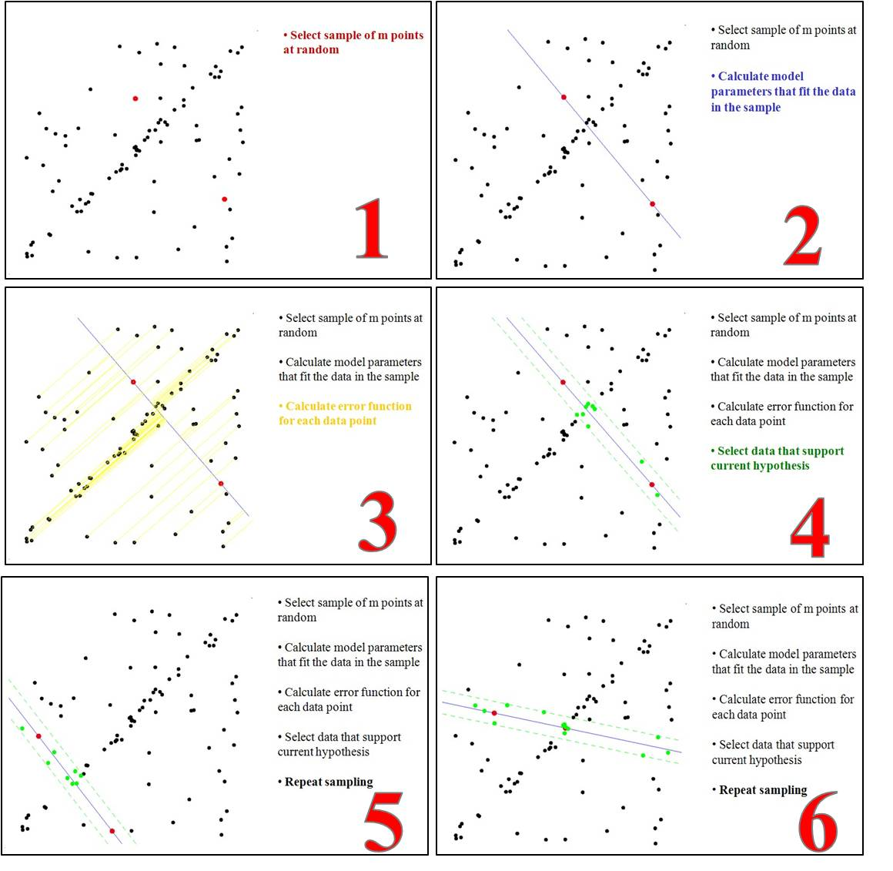

Question List in January, 2022
==============================

👨‍👨‍👦 Happy new year Ashinjero, we are coming to a new day of this year.

.. raw:: html

   <html xmlns="http://www.w3.org/1999/xhtml"><head></head><body>
新民主主义的革命，不是任何别的革命，它只能是和必须是无产阶级领导的，人民大众的，反对帝国主义、封建主义和官僚资本主义的革命。
</body></html>

.. raw:: html

   <html xmlns="http://www.w3.org/1999/xhtml"><head></head><body>
——毛泽东《在晋绥干部会议上的讲话》
</body></html>

.. raw:: html

   <html xmlns="http://www.w3.org/1999/xhtml"><head></head><body>
为什么在国民党主要统治集团领导下会产生这种严重情况呢？因为这个集团所代表的利益是中国的大地主、大银行家、大买办阶层的利益。这些极少数人所形成的反动阶层，垄断着国民党政府管辖之下的军事、政治、经济、文化的一切重要的机构。···他们在各方面都采取这样的两面政策。···一面在口头上宣称要发展中国经济，一面又在实际上积累官僚资本，亦即大地主、大银行家、大买办的资本，垄断中国的主要经济命脉，而残酷地压迫农民，压迫工人，压迫小资产阶级和自由资产阶级。一面在口头上宣称实行“民主”，“还政于民”，一面又在实际上残酷地压迫人民的民主运动，不愿实行丝毫的民主改革。
</body></html>

.. raw:: html

   <html xmlns="http://www.w3.org/1999/xhtml"><head></head><body>
——毛泽东《论联合政府》
</body></html>

.. _1三维基础:

1、三维基础
-----------

这里重点回顾并整理一下之前学习过的相机矩阵、特征匹配算子、基础矩阵、本征矩阵、单应矩阵等相关内容，并学习掌握应用直接线性变换求解未知矩阵参数的方法。

.. _11-相机矩阵:

1.1 相机矩阵
~~~~~~~~~~~~

相机将三维世界的物体拍摄成为二维影像的过程中，其拍摄物体在数学上经历了\ **世界坐标系**\ 、\ **相机坐标系**\ 、\ **归一化像平面坐标系**\ 、\ **物理像平面坐标系**\ 的线性空间变换，其数学关系如下图所示。这里的归一化像平面坐标系由于在针孔相机模型的基础上对相机坐标系下三个维度的坐标进行了同比缩放，实际上相当于在针孔相机前面设定了一个单位为
1 的焦平面，并将所有的点都投放到了这个平面上。

由相对关系以及矩阵推导可知，相机的位置就是 :math:`\vec{t}`
向量所描述的空间位置；相机的朝向 :math:`z` 轴对应着旋转矩阵
:math:`R^{3\times 3}` 的第 3 列矩阵元素；相机的 UP 轴 :math:`y`
对应着旋转矩阵 :math:`R^{3\times 3}` 的第 2 列元素。

故而，相机矩阵 :math:`P^{3\times4}` 有如下的表现形式：

.. math:: P=K[R\quad\vec{t}\ ]\tag{1}

由此得到相机的 6 个外参数 :math:`R,\vec{t}` 以及 5 个内参数
:math:`f_\alpha=f_\beta,k_1,k_2,u_0,v_o`\ 。内参数中的 :math:`f_\alpha`
和 :math:`f_\beta` 的物理意义是横纵方向上每毫米 CCD
阵列上存储多少个像素， :math:`k_1,k_2`
为径向畸变系数，用来纠正透镜与理想针孔成像模型之间的理论偏差。

在确定相机矩阵时，求解外参数的过程称为\ **姿态估计**\ ，求解内参数的过程称为\ **相机标定**\ 。令
:math:`r` 为 :math:`(u,v)` 点与相机投影中心 :math:`(u_0,v_0)`
的距离，则径向畸变对物理像平面坐标系中的坐标的影响如下：

.. math::

   \begin{bmatrix}\tilde{u}\\ \tilde{v}\end{bmatrix}=(1+k_1r^2+k_2r^4)
   \begin{bmatrix}u-u_0\\v-v_0\end{bmatrix}+
   \begin{bmatrix}u_0\\v_0\end{bmatrix}

径向畸变既可以通过棋盘格等相机标定的方法来进行标定，也可以作为系数放到求解参数中进行求解优化；参数求解出来后即可通过双线性/三线性插值来纠正畸变的影像。为方便计算，可以将径向畸变的计算转移到归一化像平面坐标系中进行计算，即：

.. math::

   \begin{bmatrix}\tilde{x}\\ \tilde{y}\end{bmatrix}=(1+k_1r^2+k_2r^4)
   \begin{bmatrix}x\\y\end{bmatrix}

至此，即梳理完成了世界坐标系中的三维坐标换算到物理像平面上塌缩为二维坐标的数学计算过程。对于
SLAM
而言相机矩阵到这里就结束了；而对于三维计算机图形学来说，只了解相机矩阵并不够。

在执行完空间变换后，图形学将以深度的形式存储世界坐标系转换为像平面坐标系后塌缩的
:math:`z`
变量；而且向像平面转换的过程将以\ **投影矩阵**\ 的形式进行，以规范化设备坐标立方体为辅助工具在电脑屏幕上绘制三维物体的平面视觉效果。

.. _12-射影几何:

1.2 射影几何
~~~~~~~~~~~~

欧式空间中的平面可以用集合 :math:`\mathbb{R}^2` 中的点对 :math:`(x,y)`
来表示；而在射影几何中，由于其对二维点做了齐次变换，故而其射影平面在数学形式上采用了如下定义：

   在 :math:`\mathbb{R}^3-\left(0\ \ 0\ \ 0\right)^T`
   中的矢量等价类的集合组成射影空间
   :math:`\mathbb{P}^2`\ ，其中：\ :math:`-\left(0\ 0\ 0\right)^T`
   表示矢量 :math:`\left(0\ 0\ 0\right)^T`
   不与任何直线对应，因而被排除在外。

齐次直线
^^^^^^^^

将直线 :math:`ax+by+c=0` 表示为矢量
:math:`\mathbf{l}=(a\ \ b\ \ c)^T`\ ，则给定任意一个非零 :math:`k`
，矢量 :math:`(a\ \ b\ \ c)^T` 与 :math:`k(a\ \ b\ \ c)^T`
均表示同一条直线，也即只相差一个全局缩放因子的矢量是等价的。基于这样的定义，我们称矢量
:math:`(a\ \ b\ \ c)^T` 是其所属矢量等价类的一个代表。矢量
:math:`\mathbf{l}` 就是射影几中齐次直线的一种描述。

齐次点
^^^^^^

点 :math:`\mathbf{x}=(x\ \ y)^T` 在直线
:math:`\mathbf{l}=(a\ \ b\ \ c)^T` 上的充要条件是
:math:`ax+by+c=0`\ ，也即：

.. math:: (x\ \ y\ \ 1)\cdot(a\ \ b\ \ c)^T=0

由于直线 :math:`\mathbf{l}` 的矢量等价性，非零 :math:`k`
可以借助上面的方程转移到点上；故而可以用齐次点
:math:`\mathbf{x}=(x_1\ \ x_2\ \ x_3)^T` 表示欧式平面
:math:`\mathbb{R}^2` 中的点
:math:`(x_1/x_3\ \ x_2/x_3)^T`\ ，如此，点的齐次矢量也是射影空间
:math:`\mathbb{P}^2` 的元素。

点线关系
^^^^^^^^

先不加证明的给出射影几何中的点线关系：

| **结论 1** 齐次直线 :math:`\mathbf{l}_1` 和 :math:`\mathbf{l}_2`
  的齐次交点是 :math:`\mathbf{x}=\mathbf{l}_1\times\mathbf{l}_2`.
| **结论 2** 过齐次点 :math:`\mathbf{x}_1` 和 :math:`\mathbf{x}_2`
  的齐次直线是 :math:`\mathbf{l}=\mathbf{x}_1\times\mathbf{x_2}`.

这两个结论均可通过混合积来证明，首先给出混合积的定义图如下：

.. figure:: pic/202201/TirVM_2.png
   :align: center
   :scale: 20

如上图所示，向量 :math:`\mathbf{A}` 和向量 :math:`\mathbf{B}`
的叉乘结果的单位向量为垂直于二者构成的平面的法向量
:math:`\mathbf{n}`\ ，数值为平面上两个向量构成的平行四边型的面积；向量
:math:`\mathbf{C}` 在平面单位法向量 :math:`\mathbf{n}`
上的投影即为平行六面体的高， 即 :math:`\mathbf C\cdot \mathbf n`
为高；所以三个向量的混合积
:math:`\mathbf A\times\mathbf B\cdot\mathbf C`
的结果为平行六面体的体积。

定义矢量 :math:`\mathbf{x} = \mathbf l_1\times \mathbf l_2`
，由混合积的定义可知若混合积三个向量位于同一平面上则其混合积为 0，即：

.. math:: \mathbf l_1\cdot(\mathbf l_1\times\mathbf l_2)=\mathbf l_2\cdot(\mathbf l_1\times\mathbf l_2)=0

故有：\ :math:`\mathbf l_1\cdot\mathbf x=\mathbf l_2\cdot\mathbf x=0`\ 。进而，根据射影几何点的定义描述，确定
:math:`\mathbf x` 向量同时位于直线 :math:`\mathbf{l}_1` 和
:math:`\mathbf{l}_2` 上，也就是说为齐次直线的交点。

射影平面
^^^^^^^^

前文中描述过，在 :math:`\mathbb{R}^3-\left(0\ \ 0\ \ 0\right)^T`
中的矢量等价类的集合组成射影空间
:math:`\mathbb{P}^2`\ ，这个射影空间是在三维空间中对二维平面的一种理解。这个射影空间
:math:`\mathbb{P}^2` 一般称之为射影平面模型，如下图所示：

理解射影空间 :math:`\mathbb{P}^2` 的一种方式是将其看作
:math:`\mathbb{R}^3` 中一种射线的集合，该集合中的所有矢量
:math:`k(x_1\ \ x_2\ \ x_3)^T` 当 :math:`k`
变化时形成过原点的射线。这样一来， :math:`\mathbb{P}^2` 中的点可以看作是
:math:`\mathbb{R}^3` 中的一条射线，如上图中的点 :math:`\mathbf{x}_1`
和点 :math:`\mathbf{x}_2` 所对应的射线；\ :math:`\mathbb{P}^2`
中的直线可以看作是 :math:`\mathbb{R}^3`
中过原点的一个平面，如上图所示的由点 :math:`\mathbf{x}_1,\mathbf{x}_2`
和 :math:`\mathbf O` 构成的平面就是射影空间中直线 :math:`\mathbf l`
所表征的平面。

将射影平面上的点和线映射到欧式平面上，可以由这些射线与 :math:`x_3=1`
所对应的平面 :math:`\pi`
相交得到，表示无穷远点的射线和表示无穷远线的平面都与 :math:`x_3=1`
所对应的平面 :math:`\pi` 平行，\ :math:`\mathbf{l}_\infty` 平面对应
:math:`\mathbf{O}-x_1x_2`\ 。无穷远点的齐次坐标中第三个变量恒定为
0，这是因为两条平行直线的齐次向量积结果的第三个元素为
0，这也是射影几何的魅力之一。

.. _13-对极几何:

1.3 对极几何
~~~~~~~~~~~~

基础矩阵 :math:`F`
建立了两个相片的同名点在\ **物理像平面坐标系**\ 下之间的联系，本征矩阵
:math:`E`
描述了两个相片的同名点在\ **相机坐标系**\ 下之间的联系。最开始的对极几何在相机坐标系下建立了相机位置变换所对应的数学关系：

本征矩阵
^^^^^^^^

如上图所示由对极平面的共面关系建立起向量 :math:`\vec{p}_0` 和向量
:math:`\vec{p}_1` 之间的旋转平移关系：

.. math:: \vec{p}_1^{\ T}\cdot E\cdot\vec{p}_0 = 0\tag{2}

其中的矩阵 :math:`E` 就是本征矩阵，具有如下表现形式：

.. math::

   E=
   R\begin{bmatrix}
   0 &-t_3&t_2\\
   t_3&0&-t_1\\
   -t_2&t_1&0
   \end{bmatrix}
   =R\left[\vec{t}\right]_{\times}

基础矩阵
^^^^^^^^

随后在本征矩阵的诱导下，根据相机坐标系的定义可以确定物理像平面坐标系中的齐次坐标向量
:math:`\mathbf{x}` 可以由向量 :math:`\vec{p}` 借助相机内参数矩阵
:math:`K` 代表的线性变换计算得到：

.. math:: \mathbf{x}=K\vec p

这样一来包含本征矩阵的基础矩阵就有了如下的数学关系：

.. math:: \mathbf{x}_1^T\cdot F\cdot\mathbf{x}_0=0\tag{3}

其中，中间那一堆就称为基础矩阵，\ :math:`\mathbf{x}`
被称为列矢量，\ :math:`\mathbf{x}^T` 被称为行矢量而非向量
:math:`\mathbf{x}`
的转置。在《计算机视觉中的多视图几何》中描述了基础矩阵的数学表现形式：

.. math:: F=\left(K_1^{-1}\right)^TEK_0^{-1}\tag{5}

（1）\ **极线约束**

射影几何中的点和直线都可以以非齐次向量进行表示。极线约束可以描述为，已知左图映射点
:math:`p_0` 的齐次坐标为 :math:`\mathbf{x}_0`\ ，那么右图映射点
:math:`p_1` 的齐次坐标 :math:`\mathbf{x}_1` 一定在 :math:`\mathbf{x}_0`
所对应的极线 :math:`\mathbf{l}_1`
上；而由射影几何的点线关系推导可以确定极线 :math:`\mathbf{l}_1`
的计算公式：

.. math:: \mathbf{l}_1=F\mathbf{x}_0\tag{6}

而同样地可以确定极线 :math:`\mathbf{l}_0` 的计算公式为
:math:`\mathbf{l}_0=\mathbf{x}_1^TF`\ ，这样一来就建立了所谓的极线约束；在实际计算中，通过极线约束可以减少待匹配的点数量。

（2）\ **相关性质**

基础矩阵是对极几何的代数表示，根据极线的计算公式不难看出，基础矩阵表示了第一幅图像的二维\ **射影平面**\ 到通过对极点
:math:`\mathbf{e}_1` 的对极线束的映射，表示一个从 2 维到 1
维的摄影空间映射；所以必须是一个秩为 2 的秩亏矩阵。

其自由度包括 3 个平移自由度、3 个旋转自由度和 1 个尺度因子共 7
个自由度；当然自由度也可以从计算角度来看，基础矩阵共 9
个元素，一般将最后一个元素定为尺度因子在计算时指定为 1 而损失 1
个自由度，再减去 1 个因秩亏而减少的自由度，故而为 7 个自由度。

.. _14-基础矩阵求解:

1.4 基础矩阵求解
~~~~~~~~~~~~~~~~

总的来说，基础矩阵求解有\ **直接线性变换法**\ 和\ **基于 RANSAC
的鲁棒方法**\ 两种：其中直接线性变换法适用于没有外点的情况，一般有 8
点法和多于 8
个点时超定解的最小二乘求法等两种方式；基于RANSAC的鲁棒方法则适用于有外点的情况，可以得到更加稳定的基础矩阵。

直接线性变换法
^^^^^^^^^^^^^^

取一对匹配点
:math:`\mathbf x_0=(u_0\ \ v_0\ \ 1)^T,\mathbf x_1=(u_1\ \ v_1\ \ 1)^T`\ ；将公式
3 的齐次点和基础矩阵展开成元素的形式进行显式表达，则有如下方程：

.. math::

   (u_1\ \ v_1\ \ 1)
   \begin{bmatrix}
   F_{11}&F_{12}&F_{13}\\
   F_{21}&F_{22}&F_{23}\\
   F_{31}&F_{32}&F_{33}
   \end{bmatrix}
   \begin{pmatrix}
   u_0\\v_0\\1
   \end{pmatrix}=0

令
:math:`\vec f=(F_{11}\ \ F_{12}\ \ F_{13}\ \ F_{21}\ \ F_{22}\ \ F_{23}\ \ F_{31}\ \ F_{32}\ \ F_{33})^T`
则有：

.. math:: (u_0u_1\ \ v_0u_1\ \ u_1\ \ u_0v_1\ \ v_0v_1\ \ v_1\ \ u_0\ \ v_0\ \ 1)\cdot\vec f = 0\tag{7}

便于编程的形式：

.. math:: (u_1u_2\ \ v_1u_2\ \ u_2\ \ u_1v_2\ \ v_1v_2\ \ v_2\ \ u_1\ \ v_1\ \ 1)\cdot\vec f = 0\tag{8}

其中每一对匹配点提供一个对极约束，虽然上文论述了基础矩阵有 7
个自由度，但除了尺度因子可以将 :math:`F_{33}` 元素固定为 1
外，另一个损失的秩亏自由度无法显式的进行表达，所以求解时最少需要 8
对匹配点。当有 :math:`n` 对匹配点时可以将公式 7
左侧的行向量顺次排列形成矩阵 :math:`A`\ ，即：

.. math:: A\cdot\vec f=\vec 0

当 :math:`n=8` 时，如果矩阵 :math:`A` 为非奇异矩阵则方程有唯一解，即 8
点法；当 :math:`n\geqslant8`
时方程具有超定解可以用最小二乘法进行求解。判断奇异矩阵可以通过矩阵行列是否为
0 来进行，行列式为 0
则说明矩阵所代表的线性变换是一个塌缩变换，其必定是一个秩亏矩阵。当矩阵
:math:`A` 超定时，\ :math:`A^TA` 的最小特征值对应的特征向量即为最优解。

此外，为了确保基础矩阵 :math:`F` 具有 7
个自由度，需要对求解的矩阵进行重构；首先对通过上述直接线性变换法求得得矩阵
:math:`\hat F` 进行 SVD 分解得到：

.. math:: \hat F=U\hat\Sigma V^T

为了满足 :math:`3\times 3` 矩阵秩为 2 的条件，可令奇异值对角矩阵
:math:`\hat\Sigma` 的第三个元素为 0 得到
:math:`\Sigma=\text{diag}(\sigma_1,\sigma_2,0)`\ ，进一步地，通过
:math:`\Sigma` 矩阵重构基础矩阵 :math:`F` 得到：

.. math:: F=U\Sigma V^T

至此，完成基础矩阵的直接线性变化法求解。

   **定理** 在 :math:`\|\vec x\|=1` 条件下，\ :math:`A\vec x=0`
   的最小二乘解是 :math:`A^TA` 的最小特征值对应的特征向量.

证明上式等同于证明如下命题：\ :math:`A^TA`
的最小特征值所对应的特征向量可使 :math:`\|A\vec x\|`
最小。该证明需要提供两个互斥条件的证明，即 :math:`\vec x` 为
:math:`A^TA` 的特征向量时和 :math:`\vec x` 不为 :math:`A^TA`
的特征向量时；其中第二种情况相对复杂，需要在证明过程种对矩阵 :math:`A`
作 SVD 分解，这里暂且略过只讨论第一种情况，完整证明参照参考文献 5
的证明。

若 :math:`\vec x` 为 :math:`A^TA` 的特征向量，则有
:math:`A^TA\vec x=\lambda \vec x`\ ，由此可得：

.. math::

   \begin{align}
   \|A\vec x\|&=\left(A\vec x\right)^T\cdot\left(A\vec x\right)\\
   &=\vec x^TA^TA\vec x\\
   &=\vec x^T\lambda\vec x\\
   &=\lambda\|\vec x\|\\
   &=\lambda
   \end{align}

由上式可知，取 :math:`A^TA` 的最小特征值 :math:`\lambda` 可使
:math:`\|A\vec x\|` 最小。

RANSAC
^^^^^^

RANSAC，\ *RANdom SAmple Consensus*
随机抽样一致性算法，是一种在包含离群点在内的数据集里，通过迭代的方式估计模型的参数。在这里主要用来解决直接线性变化法的外点问题。外点与噪声是随机抽样一致性算法的重要内容，噪声是可以建模的而外点不能建模，在最小二乘法的计算过程中，外点的影响十分显著。

取 :math:`n` 为样本点个数，\ :math:`k`
为求解模型需要最少的点的个数，\ :math:`p` 为样本点为内点的概率；对
RANSAC 的处理步骤进行概述和精简，如下：

   | 1st 随机采样 :math:`k` 个点；
   | 2nd 对 :math:`k` 个点拟合模型；
   | 3rd
     计算其他点到拟合模型的距离，小于某一阈值作为\ **内点**\ 并统计个数；
   | 4th 重复 :math:`m` 次，选择内点最多的模型；
   | 5th [*利用所有的内点重新估计模型*\ （可选）]

令事件 A 为随机采样的 :math:`k` 个点都是内点，其概率为：

.. math:: P(A)=p^k

则其互斥事件 B 为采样的 :math:`k`
个点中至少有一个外点（采样失败），其概率为：

.. math::

   \begin{align}
   P(B)&=1-P(A)\\
   &=1-p^k
   \end{align}

则 :math:`m` 次采样全部失败的概率为 :math:`\left(1-p^k\right)^m`
，所以得到 :math:`m` 次采样至少有一次成功这一事件概率 :math:`z` 为：

.. math:: z=1-\left(1-p^k\right)^m

故而可得迭代次数 :math:`m` 的计算公式如下：

.. math:: m=\frac{\log(1-z)}{\log(1-p^k)}\tag{9}

依据维基百科中的描述并结合国内的常规变量命名规则，有如下伪代码：

根据上面的伪代码，简单通过 Python 写一个求 :math:`y =x` 直线方程的
RANSAC 算法，可以得到下图：

针对基础矩阵求解所设定的内点判断依据是 Sampson Distance 判别公式：

.. math:: e=d(\mathbf{x}_0,\mathbf{x}_1)=\frac{(\mathbf{x}_1^TF\mathbf{x_0})^2}{(F\mathbf x_0)_x^2+(F\mathbf x_0)_y^2+(\mathbf x_1^TF)_x^2+(\mathbf x_1^TF)_y^2}\tag{10}

写成便于编程的形式：

.. math:: e=d(\mathbf{x}_1,\mathbf{x}_2)=\frac{(\mathbf{x}_2^TF\mathbf{x_1})^2}{(F\mathbf x_1)_x^2+(F\mathbf x_1)_y^2+(\mathbf x_2^TF)_x^2+(\mathbf x_2^TF)_y^2}\tag{11}

相应的判阈值 :math:`\tau` 取 1 或 0.5 个像素即可，判断条件为
:math:`d(\mathbf{x}_0,\mathbf{x}_1)<\tau`\ 。

.. _15-相机姿态恢复:

1.5 相机姿态恢复
~~~~~~~~~~~~~~~~

求解完基础矩阵 :math:`F` 之后，通过引入对极几何中两个相机的内参数矩阵
:math:`K_1,K_2` 即可求得两个相机位姿之间的状态转移矩阵，也即本征矩阵
:math:`E`\ ，矩阵的计算可由公式 5 推导得到：

.. math:: E=K_1^TFK_0

本征矩阵性质
^^^^^^^^^^^^

本征矩阵的性质主要有：（1）是一个 :math:`3\times3` 的矩阵，矩阵的秩为
:math:`2`\ ；（2）具有 5 个自由度；（3）本征的矩阵的奇异值为
:math:`[\sigma\quad\sigma\quad 0]^T`\ 。通过性质 3
可以在对矩阵进行分解后重构，首先对求得的矩阵 :math:`\hat E` 进行 SVD
分解得到：

.. math:: \hat E=U\text{diag}(\sigma_1,\sigma_2,0) V^T

误差优化
^^^^^^^^

为了满足 :math:`3\times 3` 矩阵秩为 2 的条件，可令奇异值对角矩阵
:math:`\hat\Sigma` 的第三个元素为 0 并取两个奇异值的平均数：

.. math:: \sigma=\frac{\sigma_1+\sigma_2}{2}

重新组织对角矩阵
:math:`\Sigma=\text{diag}(\sigma,\sigma,0)`\ ，进一步地，通过
:math:`\Sigma` 矩阵重构本征矩阵 :math:`E` 得到：

.. math:: E=U\Sigma V^T

姿态求解及筛选
^^^^^^^^^^^^^^

令 :math:`\mathbf{u}_3` 为矩阵 :math:`U` 第 3 列元素构成的列向量
:math:`U(:,3)` ，则通过对本征矩阵进行分解可以得到两个不同的
:math:`\mathbf{t}` 位移向量可以表示为如下形式：

.. math:: \mathbf{t}_1=\mathbf u_3,\mathbf{t}_2=-\mathbf u_3

令正交矩阵 :math:`R_z(\pi/2)` 表示如下矩阵

.. math::

   R_z=\begin{bmatrix}
   0&-1&0\\1&0&0\\0&0&1
   \end{bmatrix}

则得到的两个不同的旋转矩阵参数可以表示为：

.. math:: R_1=UR_zV^T,R_2=UR_zV^T

由此两个 :math:`R` 和两个 :math:`\mathbf t`
排列组合构成四组不同的位姿参数，如下：

.. math:: (R_1,\mathbf{t}_1),(R_1,\mathbf{t}_2),(R_2,\mathbf{t}_1),(R_2,\mathbf{t}_2)

其几何意义如下：

在以 :math:`C_1` 为原点的世界坐标系中
:math:`O=C_1=\mathbf 0`\ ，世界坐标系中的 :math:`C_2` 相机的位置为
:math:`C_2=-R^T\mathbf{t}`\ ，前文提到的对极几何关系将有如下表现形式：

令 :math:`C_1 `\ 相机在世界坐标系中的朝向为
:math:`\mathbf{d}_0`\ ，则有：

.. math:: \mathbf{d}_0=[0\quad 0\quad 1]^T

将旋转矩阵 :math:`R` 表示为
:math:`[\mathbf{r}_1\quad \mathbf{r}_2\quad \mathbf{r}_3]^T`\ ，则可将
:math:`C_2` 相机在世界坐标系中的朝向为：

.. math::

   \mathbf{d}_1=[\mathbf{r}_1^T\quad\mathbf{r}_2^T\quad\mathbf{r}_3^T\quad -R^T\mathbf{t}]\begin{bmatrix}0\\0\\1\\0
   \end{bmatrix}=\mathbf{r}_3^T

通过前方交会获得 P 点在世界坐标系中的点 :math:`P` 后即可筛选出正确的解：

|  **方法 1** :math:`R,\mathbf{t}` 同时满足
  :math:`(P-C_0)^T\mathbf{d}_0>0` 和 :math:`(P-C_1)^T\mathbf{d}_1>0`
  两个条件。
|  **方法 2** 通过 公式 :math:`(x_c\quad y_c\quad z_c)^T=RP+\mathbf{t}`
  计算出点 :math:`P` 在两个相机坐标系下的点的深度 :math:`z_c>0` 。

由此即可得到正确的相机位置和姿态了。

.. _参考文献-1:

参考文献
~~~~~~~~

1. CSDN博客.
   `激光slam最新的研究和过渡方向 <https://blog.csdn.net/zjguilai/article/details/96491732>`__\ [EB/OL].

2. Kollmorgen. `设计制造
   AGV <https://www.kollmorgen.cn/zh-cn/solutions/automated-guided-vehicles/building-agvs/?utm_source=baidu&utm_plan=AGV-Desktop&utm_unit=Navigation&utm_keyword=slamjgdh&e_matchtype=1&e_creative=40491958359&e_adposition=cr1&e_pagenum=1&e_keywordid=334100326200&bd_vid=8581972276997114948>`__\ [EB/OL].

3. 深蓝学院. 图像的三维立体重建[EB/OL].

4. 小时百科.
   `三矢量的混合积 <https://wuli.wiki//online/TriVM.html>`__\ [EB/OL].

5. CSDN博客.
   `证明\ :math:`A\vec x=0`\ 的最小二乘解是\ :math:`A^T A`\ 的最小特征值对应的特征向量(:math:`\|\vec x\|=1`) <https://blog.csdn.net/baidu_38172402/article/details/89520326>`__\ [EB/OL].

6. CSDN博客.
   `RANSAC <https://blog.csdn.net/pi9nc/article/details/26596519>`__\ [EB/OL].

7. CSDN博客.
   `RANSAC算法理解 <https://blog.csdn.net/robinhjwy/article/details/79174914>`__\ [EB/OL].

8. CSDN博客.
   `python中matplotlib的颜色及形状 <https://blog.csdn.net/weixin_43697287/article/details/88876680>`__\ [EB/OL].

.. _2日常积累:

2、日常积累
-----------

这里记录一些日常内容。

.. _21-记录:

2.1 记录
~~~~~~~~

Chrome 访问网页故障
^^^^^^^^^^^^^^^^^^^

去年花了 N 久，终于在今年解决了只有 Chrome 无法访问外网的问题：

   在浏览器账户中删除账号，然后重新登录就行了

不知道有什么玄机就很淦。

SQL 转换字符串为数字
^^^^^^^^^^^^^^^^^^^^

一个简单可行的方法是：

.. code:: sql

   SELECT [列名]+0 AS col FROM [表名] WHERE [判断语句]

.. _22-github520:

2.2 Github520 
~~~~~~~~~~~~~

该章节主要用于解决 Github 登录访问时灵时不灵的问题，用创建者的话说：

   | 对 GitHub 说"爱"太难了：访问慢、图片加载不出来。
   | *注：* 本项目还处于测试阶段，仅在本机测试通过。

   本项目无需安装任何程序，通过修改本地 hosts 文件，试图解决：

   |  GitHub 访问速度慢的问题
   |  GitHub 项目中的图片显示不出的问题

   花 5 分钟时间，让你"爱"上 GitHub。

需要下载软件 SwitchHosts 工具，然后配置远程地址
https://raw.hellogithub.com/hosts 即可，如果本地 host
文件权限不足的话，需要进入 ``C:\windows\system32\drivers\etc`` 目录找到
host 文件，取消勾选其只读属性即可用软件自动托管 host 文件了。

.. _23-ngrok-内网穿透:

2.3 ngrok 内网穿透
~~~~~~~~~~~~~~~~~~

经过种种测试，包括花生壳、net123 等国内穿透网站都不是很好用，还是 ngrok
特别靠谱，域名也在其公司进行了自己的备案，能够方便快捷的满足用户的开发使用要求。

   ngrok http 8080

通过上面的简单命令就可以实现内网穿透的工能了，就很奈斯。

.. _参考文献-2:

参考文献
~~~~~~~~

1. CSDN博客. `切换了个chrome用户就可以正常上网了评论 <>`__\ [EB/OL].

2. 王永杰.
   `推荐一个github国内访问加速神器GitHub520 <https://www.cnblogs.com/xiaodongxier/p/tui-jian-yi-gegithub-guo-nei-fang-wen-jia-su-shen.html>`__\ [EB/OL].

.. _3津南疫情防控平台:

3、津南疫情防控平台
-------------------

记录一下相关内容。

.. _31-若依分离版白名单:

3.1 若依分离版白名单
~~~~~~~~~~~~~~~~~~~~

分离版若依鉴权服务的位置位于：

   ruoyi-framework/src/main/java/com/ruoyi/framework/config/SecurityConifig.java

修改相应代码后需要前端配合修改白名单的相关设置。

.. _32-获取-arcgis-的-token:

3.2 获取 arcgis 的 token
~~~~~~~~~~~~~~~~~~~~~~~~

请求链接为：

   http://localhost:6080/arcgis/tokens/generateToken

请求体为：

.. code:: bash

   username:abc
   password:aaaa
   ip:127.0.0.1
   expiration:1

.. _33-spring-获取访问-ip:

3.3 Spring 获取访问 IP
~~~~~~~~~~~~~~~~~~~~~~

参照参考文献 2 的说明，先写工具类：

.. code:: java

   import javax.servlet.http.HttpServletRequest;
   import java.net.InetAddress;
   import java.net.UnknownHostException;
    
   /**
    * @Author : Ashinjero
    * @CreateTime : 2022-01-27
    * @Description : 获取 IP 地址工具
    * @Point: Keep a good mood
    **/
   public class IpUtil {
       /* 检测 IP 地址是否有效 */
       public static boolean check(String ipAddress){
           return ipAddress == null || 
                  ipAddress.length() == 0 || 
                  "unknown".equalsIgnoreCase(ipAddress)
       }
       /* 获取 IP 地址 */
       public static String getIpAddr(HttpServletRequest request) {
           String ipAddress = null;
           try {
               ipAddress = request.getHeader("x-forwarded-for");
               // 尝试申请 Proxy-Client-IP
               if (check(ipAddress)) 
                   ipAddress = request.getHeader("Proxy-Client-IP");
               // 尝试申请 WL-Proxy-Client-IP
               if (check(ipAddress)) 
                   ipAddress = request.getHeader("WL-Proxy-Client-IP");
               // 常规处理
              if (check(ipAddress)) {
                   ipAddress = request.getRemoteAddr();
                   if (ipAddress.equals("127.0.0.1")) {
                       // 根据网卡取本机配置的IP
                       InetAddress inet = null;
                       try {
                           inet = InetAddress.getLocalHost();
                       } catch (UnknownHostException e) {
                           e.printStackTrace();
                       }
                       ipAddress = inet.getHostAddress();
                   }
               }
               // 对于通过多个代理的情况，第一个IP为客户端真实IP,多个IP按照','分割
               if (ipAddress != null && ipAddress.length() > 15) { 
                   // "***.***.***.***".length() = 15
                   if (ipAddress.indexOf(",") > 0) {
                       ipAddress = ipAddress.substring(0, ipAddress.indexOf(","));
                   }
               }
           } catch (Exception e) {
               ipAddress="";
           }
           return ipAddress;
       }
   }

然后使用：

.. code:: java

   @RequestMapping(value = "/test", method = RequestMethod.GET)
   public String test(HttpServletRequest request){
       //获取IP地址
       String ipAddress =IpUtil.getIpAddr(request);
       return ipAddress;
   }

如果获取到的 IP 地址为 ``0:0:0:0:0:0:0:1`` 则说明该地址为本机 IPV6
地址，等同于 IPV4 的
``127.0.0.1``\ ；所以解决这一问题只需要避免请求时使用 ``localhost``
即可，或者也可以再添加一个判断。

.. _参考文献-3:

参考文献
~~~~~~~~

1. CSDN博客. `arcgis server地图服务访问权限设置及arcgis server
   token获取 <https://blog.csdn.net/weixin_44011559/article/details/109463883>`__\ [EB/OL].

2. CSDN博客. `springboot
   获取访问接口的请求的IP地址 <https://blog.csdn.net/qq_35387940/article/details/84391784>`__\ [EB/OL].

.. _4java-积累:

4、Java 积累
------------

此处记录有关 Java 的学习内容，原本设计之初是想用 Java
发布地图服务、3DTiles 切片服务来着；后来发现有人用 JavaScript
实现了一个简易的地图服务发布程序，所以饶了一下；最终还是绕回 Java
并顺表了解下动态代理的相关知识。经了解，GeoServer 就是基于 Java
做的切片服务，但归于 Java
本身的运行机制其运行效率并不突出，所以有人考虑用 C++ 或者 Python
来建立自己的 GIS Server 服务器。

.. _41-bean-依赖注入:

4.1 Bean 依赖注入
~~~~~~~~~~~~~~~~~

Spring 的 Bean 是其核心的内容；通常可以通过在类前加 ``@Componet``
注解，在函数前加 ``@Bean`` 注解来声明并实现一个
Bean。在使用这个豆孵化相关服务和应用时，其底层操作流程如下：

周瑜老师在其视频公开课中作了如下介绍：

   ``UserService.class``
   :math:`\rightarrow`\ ``推断构造函数``\ :math:`\rightarrow`\ ``普通对象``\ :math:`\rightarrow`\ ``依赖注入``\ :math:`\rightarrow`\ ``初始化前``\ [1]\ :math:`\rightarrow`\ ``初始化``\ [2]\ :math:`\rightarrow`\ ``初始化后``\ [3]\ :math:`\rightarrow`\ ``代理对象``\ :math:`\rightarrow`\ ``放入 Map 单例池容器``\ :math:`\rightarrow`\ ``Bean 对象``

   | [1] 通过\ ``@PostConstruct``\ 注解来实现初始化前 Bean
     对象成员的操作；
   | [2] 通过实现 ``InitializingBean`` 类并重写其 ``afterPropertiesSet``
     方法来执行；
   | [3] 也就是常说的 AOP 操作，面向切面编程，AOP 是 Spring
     框架的重要内容。

Bean 对象内成员变量添加依赖注入注解 ``@Autowired``
时，依赖注入满足这样的逻辑：在 Spring 容器中先 by type
类型搜索，若存在多个则进一步地通过 by name
自动注入的变量名来搜索。注意，这里举了两个可选的插件为例说明代理对象的神奇之处：AOP
面向切面编程和 Transaction 事务。

.. code:: java

   public UserServiceProxy extends UserService{
       private UserService target;
       public void test(){
           // 1  扫描 @Transational
           // 2  事务管理器 DataSource 对象新建一个数据库连接 conn
           //    存放到 ThreadLocal<Map<DataSource对象,conn>> 中
           // 3  conn.autocommit = false
           
           // target.test(); //普通对象.test() 如果用 super 则会为空的
           // conn.commit(); or conn.rollback();
       }
   }

AOP\*
^^^^^

在软件业，AOP 为 *Aspect Oriented Programming*
的缩写，意为：面向切面编程，即通过预编译方式和运行期间动态代理实现程序功能的统一维护的一种技术。AOP
是 OOP 的延续，是软件开发中的一个热点，也是 Spring
框架中的一个重要内容，是函数式编程的一种衍生范型。利用 AOP
可以对业务逻辑的各个部分进行隔离，从而使得业务逻辑各部分之间的耦合度降低，提高程序的可重用性，同时提高了开发的效率。

AOP
可以通过预编译方式和运行其动态代理实现在不修改源代码的情况下给程序动态统一添加某种特定功能的一种技术。AOP
实际是 GoF
设计模式的延续，设计模式孜孜不倦追求的是调用者和被调用者之间的解耦,提高代码的灵活性和可扩展性，AOP
可以说也是这种目标的一种实现。

Transaction\*
^^^^^^^^^^^^^

Spring 事务 transaction
是一个很好用的东西，执行数据库操作时如果抛异常还可以回滚；在 Spring
中为相关函数添加事务可以由 ``@Transactional``
注解完成。比如在一个函数中执行三条 SQL
语句，那么这三条语句应该在该事务中同时提交同时回滚，如果使用普通函数会导致
JDBCTemplate 的 ``autocommit`` 属性默认为 ``true``\ ，即每条 SQL
语句都是执行完提交，不满足同时提交同时回滚的要求。

.. code:: java

   conn.commit();   //提交
   conn.rollback(); //回滚

Spring 还允许自己注入自己的操作，这样的逻辑会使得 Bean
本身的成员变量以注入的形式从 Spring
容器中拿到自己的代理对象，这样即可通过下面的调用同时执行两个事物并报错：

.. code:: java

   @Autowired
   private UserService userService;

   @Transactional
   public void test(){
       jdbcTemplate.excute("insert into t1 values (1,1,1,1,'1')");
       a();// 普通对象调用普通成员函数
       userService.a();// 代理对象通过事务的方式调用成员函数
   }

   @Transactional(propagation = Propagation.NEVER)// 已有一个事务了就报错
   public void a(){
       jdbcTemplate.excute("insert into t1 values (1,1,1,1,'1')");
   }

以上即为普通对象、代理对象的一个抽象理解。AOP 与 ``@Configuration``
底层都用到了动态代理，加了另一个注解之后可以确保不管调用几次
``dataSource()`` 返回的都是同一个对象，即便函数中使用了 ``new`` 方法。

.. _42-mongodb:

4.2 MongoDB
~~~~~~~~~~~

MongoDB 是由 C++ 语言编写的基于分布式文件存储的开源数据库系统，旨在为
WEB
应用提供可扩展的高性能数据存储解决方案；在高负载的情况下，添加更多的节点可以保证服务器性能。MongoDB
将数据存储为一个文档，数据结构由键值对 ``{key:value}`` 组成；MongoDB
文档类似于 JSON
对象；字段值可以包含其他文档，数组及文档数组等。与之具有同等地位的分布式数据库还有
HBase 列存储数据库以及 Redis 键值存储数据库。

   2007 年，Dwight、Eliot 和 Kevin Ryan 一起创办了一家叫作 10gen
   的新公司，10gen 专注于提供一个带有自有应用程序和数据库栈的 PaaS
   托管解决方案，以便解决数据库的水平伸缩问题。

   .. figure:: pic/202201/mongodb_creator.png
      :align: center 
      :scale: 50

   随后，MongoDB 开源 NoSQL 数据库诞生了。2009 年 2 月 MongoDB 1.0
   版本发布，该版本提供了一种具有文档模型、索引和基本复制功能的查询语言，还提供了实验版的分片功能，但生产版本的分片集群功能要等到一年后发布的
   1.6 版本中才会出现。

MongoDB 的 Map–Reduce 主要用来进行数据的批量处理和聚合操作；Map 函数调用
``emit(key,value)`` 以遍历集合中所有的记录，并将 ``key`` 与 ``value``
传给 ``Reduce`` 函数进行处理。Map 函数和 Reduce 函数使用 JS
编写，并可以通过 ``db.runCommand`` 或 ``mapreduce`` 命令来执行
Map/Reduce 操作。

.. _map--reduce:

Map–Reduce
^^^^^^^^^^

Map–Reduce 是一种用于大规模数据集并行运算的编程模型，其主要思想是 **Map
映射**\ 和 **Reduce
归约**\ ，二者均借鉴于函数式编程语言，并从矢量编程语言里借来了某部分特性。它极大地方便了编程人员在不会分布式并行编程的情况下将自己的程序运行在分布式系统上。通俗来讲，目前的模型主要是指定一个
Map 函数用来把一组键值对映射成一组新的键值对，随后指定并发的 Reduce
函数来对映射后的键值对进行处理。

不同的 Map 任务之间不会进行通信，不同的 Reduce
任务之间也不会发生任何信息交换，用户不能显式地从一台机器向另一台机器发送消息，所有的数据交换都是通过
MapReduce 框架自身去实现的。

.. _43-spring-文件映射:

4.3 Spring 文件映射
~~~~~~~~~~~~~~~~~~~

通过配置文件映射、解决跨域问题即可实现 3dtiles
文件服务的发布；其中**映射的真实路径末尾必须加 ``/``
，否则将无法映射。参考如下代码：

.. code:: java

   @Configuration
   public class FilePathConfig extends WebMvcConfigurationSupport {

       @Override
       public void addResourceHandlers(ResourceHandlerRegistry registry){
           registry.addResourceHandler("/**")
                   .addResourceLocations("classpath:/static/")
                   .addResourceLocations("classpath:/templates/");
           registry.addResourceHandler("/3dtiles/**")
                   .addResourceLocations("file:C:/Users/xxgcy/Desktop/42/");
           super.addResourceHandlers(registry);
       }

       @Override
       public void addCorsMappings(CorsRegistry registry){
           registry.addMapping("/**")
                   .allowedHeaders("Content-Type", "X-Requested-With", "token")
                   .allowedOrigins("*")
                   .allowedMethods("GET", "POST", "PUT", "DELETE")
                   .maxAge(3600);
       }
   }

.. _44-chrome-线上修改代码:

4.4 Chrome 线上修改代码
~~~~~~~~~~~~~~~~~~~~~~~

通过百度找到了一个在线修改前端 JS 代码的调试方法，就很奈斯；参考参考文献
11 其相关步骤如下：

   | **1st** F12
     打开调试面板\ :math:`\rightarrow`\ 网络\ :math:`\rightarrow`\ 搜索需要覆盖调试的代码文件\ :math:`\rightarrow`\ 保存为覆盖格式到本地；
   | **2nd**
     覆盖\ :math:`\rightarrow`\ 选择本地文件夹\ :math:`\rightarrow`\ 选择保存文件的完整目录；

然后就可以随便玩儿啦。比如说有的网站屏蔽了小窗播放的功能，但可以通过找到
``<video>`` 标签触发其小窗播放函数来执行小窗，相关代码如下：

.. code:: javascript

   document.getElementsByClassName("video")[0].requestPictureInPicture()

但是网站会包装自己的 player 对小窗播放的 ``enterpictureinpicture``
事件进行侦听，添加自己的判断以拒绝用户的小窗播放请求，这样就需要线上修改代码来帮助我们定位关闭小窗的代码，然后注释掉就行了。

.. _参考文献-4:

参考文献
~~~~~~~~

1.  Bilibiil. `Spring
    核心技术底层原理讲解 <https://www.bilibili.com/video/BV1fr4y1Y7UH?p=3>`__\ [EB/OL].

2.  ProcessOn. `图灵 Java
    架构师体系脑图 <https://processon.com/view/link/617be37ee0b34d7894fcf545#map>`__\ [EB/OL].

3.  知乎. `从零开始实现GIS
    Server <https://zhuanlan.zhihu.com/p/57491936>`__\ [EB/OL].

4.  maptiler.
    `在线交互式地图服务及下载 <https://www.maptiler.com/>`__\ [EB/OL].

5.  CSDN博客.
    `基于Spring搭建文件服务器 <https://blog.csdn.net/ljyhust/article/details/83421749>`__\ [EB/OL].

6.  简书.
    `Java不到10行代码做个简单的反向代理服务器 <https://www.jianshu.com/p/92b8f626e0e3>`__\ [EB/OL].

7.  博客园.
    `SpringBoot配置本地文件映射路径 <https://www.cnblogs.com/zys2019/p/14252954.html>`__\ [EB/OL].

8.  CSDN.
    `WebMvcConfigurerAdapter类被弃用后的两种选择 <https://www.shangmayuan.com/a/a3c7932c616046eabbb1c49b.html>`__\ [EB/OL].

9.  博客园. `“WebMvcConfigurerAdapter is
    deprecated”解决方法 <https://www.cnblogs.com/shenyuanfeng/p/13449804.html>`__\ [EB/OL].

10. 简书.
    `Springboot动态修改资源映射路径 <https://www.jianshu.com/p/cd5bea8fc8d6>`__\ [EB/OL].

11. CSDN博客. `Chrome
    DevTools调试/修改代码 <https://blog.csdn.net/weixin_41935198/article/details/118114505>`__\ [EB/OL].

12. CSDN博客.
    `用Python+Flask+GDAL开发一个动态栅格切片服务 <https://blog.csdn.net/GISuuser/article/details/119706814>`__\ [EB/OL].
