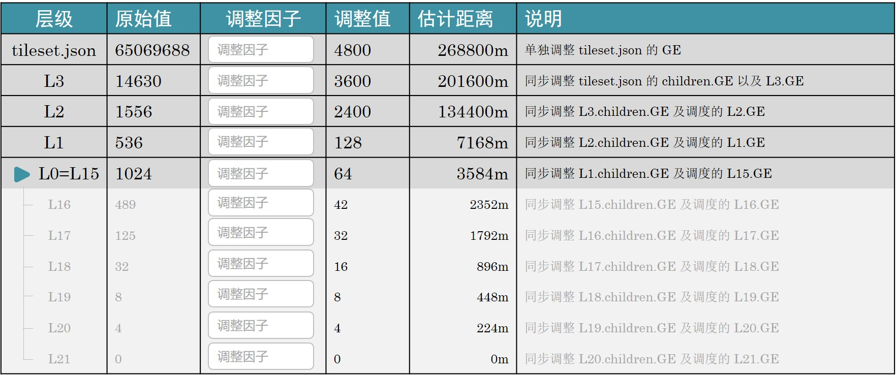
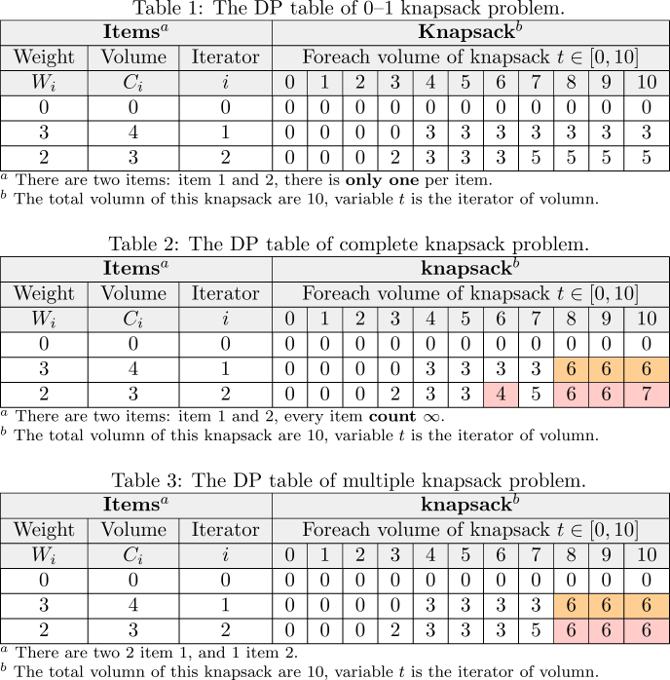
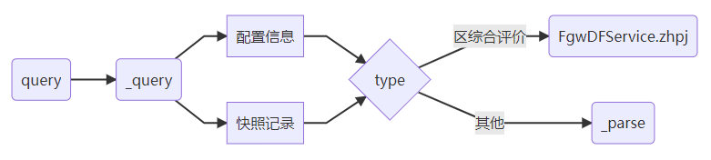
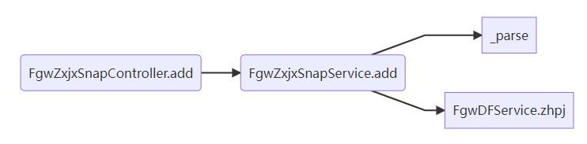

Question List in February, 2022
===============================

🧨Happy new year in this Spring Festival, hope for creating someting in
happiness.

.. raw:: html

   <html xmlns="http://www.w3.org/1999/xhtml"><head></head><body>
苏联自上世纪80年代末不断走向削弱，之后彻底分崩离析。今时今日，俄仍应从中吸取教训，苏联解体证明，权力和国家意志的瘫痪是走向全面倒退和瓦解的开端。我们不知从何时起变得不自信了，从此世界力量对比的平衡也被打破。···北约进一步东扩，将军事装备部署在乌克兰境内于俄来讲绝不可接受，当然，问题不在于北约本身，北约只是美国的外交工具。···请注意，无论是在苏联成立时还是在二战后，那些现代乌克兰领土上的居民，他们对生活的想法从来无人问津。 我们政策的核心是自由，包括让所有人自主选择本人和子女未来的自由。我们认为，生活在当今乌克兰领土上的所有民族、全体人民都应享有这种选择权。···因此，根据联合国宪章第7条第51款和俄联邦委员会今年2月22日批准的俄同顿涅茨克人民共和国和卢甘斯克人民共和国友好互助条约，经俄联邦安全会议批准，我已决定采取特别军事行动。

       ——俄罗斯总统 普京《2022年2月24日电视讲话》
   
</body></html>

.. _1日常积累:

1、日常积累
-----------

此处记录日常积累的相关内容。

.. _11-vscodereadthedocs:

1.1 VSCode+ReadTheDocs
~~~~~~~~~~~~~~~~~~~~~~

Sphinx 是一个基于 Python 的文档生成项目，最早只是用于使用
reStructuredText 格式用来生成 Python 的项目文档。后来，随着 Sphinx
项目的逐渐完善而发展成为一个大众可用的框架，很多非 Python 的项目也采用
Sphinx 作为文档写作工具，甚至已经完全可以用 Sphinx 来写书。

Sphinx+reStructuredText
^^^^^^^^^^^^^^^^^^^^^^^

由于 Sphinx 是一个 Python 文档生成项目，所以首先需要安装 Python3
环境。安装成功之后，使用 ``pip`` 工具先后安装
sphinx，restructuredtext-lint 以及 sphinx_rtd_theme 主题包，即：

.. code:: bash

   pip install shpinx
   pip install restructuredtext-lint
   pip install sphinx_rtd_theme

接下来即可在任意文件夹创建使用 reStructuredText 项目了，命令为：

.. code:: bash

   sphinx-quickstart

可以通过修改 ``conf.py`` 的 ``html_theme`` 来修改主题，例如：

.. code:: python

   html_theme = 'sphinx_rtd_theme'

生成文档时要在工程目录，即 ``source`` 目录的上一级执行 ``make`` 命令：

.. code:: bash

   ./make clean
   ./make html

Visual Studio Code
^^^^^^^^^^^^^^^^^^

在 VS Code 中支持 reStructuredText 文档预览只需要安装
``reStructuredText``
插件并重启即可，在有实时预览或文档高亮功能的需求时可以根据提示自主选择安装
VS Code 插件。

插入图片。

.. code:: rst

   .. figure:: pic/202010/TanShiXiong.png
      :align: center
      :scale: 8

插入带有字体的 HTML 块。

.. code:: rst

   .. raw:: html

      <html xmlns="http://www.w3.org/1999/xhtml"><head></head><body>插入内容。</body></html>

另外在 reStructuredText 文档中，空行只要在开头顶头敲上 ``|``
即可实现，如下所述。

.. code:: rst

   上一行
   |
   隔行另起

文档撰写好之后，将整个工程文档上传到 GitHub 或者 Gitee 上，然后用
ReadTheDocs 连接 GitHub 上的工程连接上，之后的构建就交给 ReadTheDocs
就行了。不过由于使用了 Latex 编辑器，所以对 SVG
格式图片的支持并不良好，所以最好用 Node.js 里面的 ``svg2png`` 工具将 SVG
矢量图片转换为 PNG 图片。

.. _12-win10-激活:

1.2 Win10 激活
~~~~~~~~~~~~~~

从网上了解到一个 Windows10
破解激活工具，云萌。该工具是一个开源项目，官方网页位于：

   https://cmwtat.clouldmoe.com/cn.html

使用起来也很方便，直接运行即可。实测好用。

.. _13-java-cron:

1.3 Java CRON
~~~~~~~~~~~~~

今天发现调度器设置成上午的时间执行，下午的时间不执行。查看代码发现是
``Calendar.HOUR_OF_DAY`` （24小时）设置成 ``Calendar.HOUR``
（12小时）造成的时间不对，只需要修改：

.. code:: java

   int hour = calendar.get(Calendar.HOUR_OF_DAY);

这样一来就完成了 24 小时调度任务的设定。

.. _14-双城管控-nginx:

1.4 双城管控 nginx
~~~~~~~~~~~~~~~~~~

由于在双城管控代码中使用了 nginx 反向代理来处理端口，这里对 CentOS
中使用 nginx 的方法进行简单的梳理，了解一下怎么设置反向代理。

.. code:: bash

   #1.下载安装包
   wget http://nginx.org/packages/centos/7/x86_64/RPMS/nginx-1.10.0-1.el7.ngx.x86_64.rpm
   #2.安装
   rpm -ivh nginx-1.10.0-1.el7.ngx.x86_64.rpm 
   #3.检查安装目录
   # 执行目录：/usr/sbin/nginx
   # 模块所在目录：/usr/lib64/nginx/modules
   # 配置所在目录：/etc/nginx/
   # 默认站点目录：/usr/share/nginx/html
   whereis nginx
   #4.查看 nginx 状态
   systemctl status nginx.service
   #5.启动、停止、重载命令
   systemctl start nginx.service
   systemctl stop nginx.service
   systemctl reload nginx.service
   #6.查看进程
   ps -ef|grep nginx
   #7.检查端口
   netstat -ano|grep 80

以上即为基本的安装使用步骤，如果有配置需求，可以手动配置
``etc/nginx/nginx.conf`` 文件；该文件也是在使用 nginx
时所特别需要注意的地方。

.. _参考文献-1:

参考文献
~~~~~~~~

1. 博客园.
   `sphinx+reStructuredText制作文档 <https://www.cnblogs.com/zhaojiedi1992/p/zhaojiedi_python_013_rst_spinx.html>`__\ [EB/OL].

2. 灰信网. `VSCODE+SPHINX+READTHEDOCS
   从环境搭建到放弃 <https://www.freesion.com/article/9320649465/>`__\ [EB/OL].

3. CSDN博客. `200624
   VSCode配置reStructedText <https://blog.csdn.net/qq_33039859/article/details/106954082>`__\ [EB/OL].

4. CSDN博客.
   `[Git]通过ssh方式上传代码 <https://blog.csdn.net/weixin_43843847/article/details/89668720>`__\ [EB/OL].

5. CSDN博客. `centOS7
   安装nginx并启动 <https://blog.csdn.net/qq_38872310/article/details/79805445>`__\ [EB/OL].

6. CSDN博客.\ `nginx系列之一：nginx入门 <https://blog.csdn.net/qq_29677867/article/details/90112120>`__\ [EB/OL].

7. 博客园.\ `centos7
   nginx安装/启动/进程状态/杀掉进程 <https://www.cnblogs.com/hailang8/p/8664413.html>`__\ [EB/OL].

.. _2osgb2cesium:

2、OSGB2CESIUM
--------------

本月重启 3DTiles
转换工作，进行金字塔转换算法的优化。通过这段时间的测试和应用，发现目前的实景模型金字塔转换工作最大的问题在于，将遍历
OSGB
节点树的递归算法改为迭代算法时，由于堆栈内存储了过多的待处理文件路径而造成的堆栈溢出问题；接下来的工作是优化这个改写算法，减少栈内存的存储空间。

.. _21-recursion-to-iteration:

2.1 Recursion to Iteration
~~~~~~~~~~~~~~~~~~~~~~~~~~

递归的英文为 *recursion*\ ，迭代的英文为
*iteration*\ ，将递归改写为迭代是一种优化算法过分占用内存并提高其算法执行效率的策略。目前了解到的递归改写迭代的策略有两种：

   | 1-
     *尾递归优化*\ 。通过简单的变换让递归作为最后一条语句，并且仅此一个递归调用。
   | 2- *自底向上*\ 。深刻理解程序结构后自底向上计算，如 Fibnacci
     数列的递归向迭代的转化。

.. figure:: pic/202202/recursion.png
   :align: center
   :scale: 68

接下来的学习中将首先了解一下尾递归，然后再了解自底向上的策略。

尾递归的优化
^^^^^^^^^^^^

尾递归优化的策略包括两个步骤，首先将普通递归转换为尾递归，然后再将尾递归转换为迭代函数。如下：

.. math:: \text{recursion}\rightarrow\text{tail recursion}\rightarrow\text{iteration}

尾递归和一般的递归不同在对内存的占用，普通递归创建 Stack
累积而后计算收缩，尾递归则和迭代类似只会占用恒量的内存。从代码上来看，尾递归比线性递归多一个上次调用函数得到的结果这一参数；其每次调用都在收集结果，避免了线性递归不收集结果只能依次展开消耗内存的坏处，更严谨一点的描述是：

   怎么写尾递归？形式上只要最后一个return语句是单纯函数就可以。

普通递归改写为尾递归有 **Cooper
变换、反演变换**\ 等方法。这里只给出相关变换的形式，具体证明和相关内容的说法应用，似乎比较学术，后面有机会再了解。首先，给定一个普通递归函数
:math:`f(x)`\ ，其对应的 Cooper 变换和 Function inversion
反演变换的形式如下：

如下面的普通递归，由于在函数结束时存在临时变量仍需处理，所以当前的函数运行状态将被存储到
Stack 中而造成内存的逐渐增加，如下面代码运行时产生的函数栈。

.. code:: c++

   int recsum(int x){
       if (x == 1) return x;
       else return x + recsum(x - 1);
   }

..

   | recsum(5)
   | 5 + recsum(4)
   | 5 + (4 + recsum(3))
   | 5 + (4 + (3 + recsum(2)))
   | 5 + (4 + (3 + (2 + recsum(1))))
   | 5 + (4 + (3 + (2 + 1)))
   | 5 + (4 + (3 + 3))
   | 5 + (4 + 6)
   | 5 + 10
   | 15

改写为尾递归后，下面形式的函数调用过程并未引入未加处理的临时变量，其每次调用都在搜集结果而非每次都需要保存函数的临时变量，故而其内存调用将是恒定的：

.. code:: c++

   int tailrecsum(int x, int running_total = 0){
       if (x == 0) return running_total;                   //递归终止
       else return tailrecsum(x - 1, running_total + x);   //尾递归
   }

..

   | tailrecsum(5, 0)
   | tailrecsum(4, 5)
   | tailrecsum(3, 9)
   | tailrecsum(2, 12)
   | tailrecsum(1, 14)
   | tailrecsum(0, 15)
   | 15

函数栈存在的意义就在于保持入口环境，让函数能够最终返回最开始调用时所需要的结果，即
LIFO
后入先出栈这一数据结构的功能。而在尾递归的情形下，这种入口环境没有意义：\ ``tailrecsum()``
函数里面的 ``tailrecsum`` 返回时\ ``tailrecsum()``
函数直接就返回了，所以逻辑上并不需要存到函数栈里面；这就是尾递归优化的策略。但需要注意的是，尾递归优化与编译器有关，C
语言的编译器内部大多做了尾递归优化处理，而另外有些语言的编译器如
Java、Python 是没有做尾递归优化的。

接下来就可以考虑如何手动去将尾递归函数处理成循环迭代函数了。

1. | **提取迭代变量**\ 。
   | 摘抄代码，将参数提取出来，成为迭代变量，原来的参数则用来初始化迭代变量。

2. | **创建迭代函数**\ 。
   | 在迭代函数中，函数只用来更新迭代变量。

3. | **原始代码封入循环体**\ 。
   | 除迭代函数和迭代变量初始化代码外，将原来函数的里面所代码包在一个
     ``while(true)`` 迭代循环里面；可创建一个 ``label``
     变量用于标识循环。

4. | **确定返回值**\ 。
   | 递归终止的 ``return`` 不变，尾递归的 ``return``
     替换成迭代函数，并且 ``continue`` 掉上面的迭代循环。步骤 3 中创建的
     ``label`` 可以用在这里。

以上面的 ``tailrecsum()`` 函数为例，将其改写为迭代循环则有如下的代码：

.. code:: c++

   int tailrecsum(int x, int running_total = 0){
       // 1.提取迭代变量
       int _x = x;
       int _running_total = running_total;
       // 2.创建迭代函数
       auto _tail = [&](int a, int b) {
           _x = a;
           _running_total = b;
       };
       // 3.原始代码封入循环
       while(true){
           // 4.确定返回值
           if(_x == 0) return _running_total; 
           else{
               _tail(_x - 1, _running_total + _x);
               continue; //在 C++ 中可以忽略，这里为了符合上面的步骤
           }
       }
   }

这样一来，就可以将原来的尾递归优化为循环迭代了。

自底向上
^^^^^^^^

最经典的例子就是将斐波那契数列的递归算法从自顶向下的递归改写为自底向上的迭代，这种转换是一种间接转换形式。参考文献
2 的雷鹏的博客中提到：

   对于非尾递归，就必须使用堆栈。可以简单生硬地使用堆栈进行转化：把函数调用和返回的地方翻译成汇编代码，然后把对硬件
   stack 的 push, pop 操作转化成对私有 stack 的 push, pop
   ，这其中需要特别注意的是对返回地址的 push/pop，对应的硬件指令一般是
   call/ret。

对于斐波那契数列：

.. math::

   f(n)=\begin{cases}
   0&n=0\\
   1&n=1\\
   f(n-1)+f(n-2)&n\geqslant2,n\in \mathbb{N}^+
   \end{cases}

其递归代码如下：

.. code:: c++

   int fibonacci(int N){
       if (N == 0) return 0;
       if (N == 1 || N == 2) return 1;
       return fibonacci(N - 1) + fibonacci(N - 2);
   }

改成自底向上的格式：

.. code:: java

   int fibonacci(int N){
       if (N == 1 || N == 2) return 1;
       int prev = 1, curr = 1, sum = 0;
       for(int i = 0; i <= N; i++){
           sum = curr + prev;
           prev = curr;
           curr = sum;
       }
       return curr;
   }

但是并非所有的内容都能准确得知初始状态或者最底层的数据逻辑，所以一个通用的计算模板是这样的：

.. code:: javascript

   function BottomUp(){
       stack.push(s0);               // s0 初始状态
       while(!stack.empty()){
           s = stack.pop();
           if(isSolution(s)) return; //返回条件
           else stack.push(s1);      //s1 更新状态
       }
   }

.. _22-ro3modifier:

2.2 Ro3Modifier
~~~~~~~~~~~~~~~

修改工具使用 Python 编写，其名称暂定为
Ro3Modifier，其主要功能是用于按照层级文件夹修改 3DTiles
格式文件的几何误差，目前框架思路是通过乘积关系更改上下层级之间的视距切换方案。

如上图所示，目前的设计方案就是使用这样一个表格去勘测或调整各层级瓦片之间的缩放因子。需要注意的是如果某一级瓦片因子调整超限，以至于超过了其上层视距的大小则会使得瓦片无法正常调度，所以应该在程序中添加禁令以防止这种问题的出现。也就是说调整某一层级的
Child 的 Geometric Error 时，这个 GE 不应该超出当前这个文件内的 GE
属性的大小。

在后续的研究中，可视化时最好能够显示几个瓦片层级切换时的 GE
的大小，这样一来不仅方便调试，也能够更加直观的展现转换关系；同时，需要考虑到半径相同的瓦片之间的模型切换
GE，

Python 判断浮点数相等
^^^^^^^^^^^^^^^^^^^^^

不仅仅是
Python，很多编程语言里面，浮点数都不一定是精确的。最常被用来作为例子的是：\ ``0.1 + 0.2``\ 。在
Python 里面，这个加法的结果可能为：

   0.30000000000004

因为这个原因，显然不能直接用等号判断两个浮点数是否相等。在工程上，我们不要求
``绝对精确``\ ，只要求
``足够精确``\ 就可以了。所以当判断两个数是否相等时，只需要判断这两个数的差值是否小于某一个特定的值即可。

.. code:: python

   def compare_float(a, b, precision):
       if precision == 0:
           return a == b
       elif precision < 0:
           raise Exception('precision 不能小于0')
       elif precision >= 1:
           if abs(a - b) <= precision:
               return True
       else:
           if (1 / precision) * abs(a - b) <= 1:
               return True
       return False

相应的 ``math`` 包中的代码为 ``math.isclose()`` 函数，即：

.. code:: python

   math.isclose(a, b)

这是较为便利的正确判断两个浮点数是否相等的方法。

GE 与视距的转换
^^^^^^^^^^^^^^^

通过简单实验，目前测试了一下 GE 大小与视距之间的转换可视为简单线性关系
:math:`f`\ ，在不影响主观视觉观感的情况下通过 Matlab 插值拟合，令
Geometric Error 为自变量 :math:`x`\ ，则其与视距 :math:`d`
之间的转换关系为：

.. math:: d=f(x)=56\cdot x

经数据转换与测试，这一变换关系能够满足基本的视距切换比例；对于后续处理，如果需要更加贴合人眼视觉观感的视距转换模型，则需要更多的测试和实验。

.. _参考文献-2:

参考文献
~~~~~~~~

1. CSDN博客.
   `递归与分治java策略实验报告_【算法设计与分析】递归与分治策略（一） <https://blog.csdn.net/weixin_42445810/article/details/114557970>`__\ [EB/OL].

2. CSDN博客.
   `将递归转化成迭代的通用技术 <https://blog.csdn.net/whinah/article/details/6419680>`__\ [EB/OL].

3. 简书.
   `递归与迭代的区别 <https://www.jianshu.com/p/32bcc45efd32>`__\ [EB/OL].

4. 知乎.
   `什么是尾递归？ <https://www.zhihu.com/question/20761771>`__\ [EB/OL].

5. CSDN博客.
   `递归和迭代_尾递归为啥能优化？ <https://blog.csdn.net/weixin_30536391/article/details/112712545>`__\ [EB/OL].

6. 蔡经球, 刘柏丽. 程序变换中的 Cooper 变换与函数反演变换之比较[J]
   微电子学与计算机, 1997(03).

7. 腾讯云. `一日一技：在 Python
   里面，如何正确判断两个浮点数相等 <https://cloud.tencent.com/developer/article/1554081>`__\ [EB/OL].

.. _3algorithm:

3、Algorithm
------------

算法是门科学，有着系统的理论知识和研究思路，这里需要进一步掌握相关理论内容，服务于后续研究。

DP
~~

DP，即 *Dynamic Programming* 动态规划算法。

背包问题
^^^^^^^^

目前经常提到的背包问题包括三种：\ *0–1背包*\ 、\ *完全背包*\ 和\ *多重背包*\ 。背包问题主要有两个对象，一个是有限或无限的物品，另一个是有限的背包；这类问题的核心处理需求就是，在有限的背包容量内使收纳物品的价值达到最大化。而三者的差异在于：

|  **0–1背包** 每种物品只有 1 个，故而每种物品只有选择和不选择两种情况。
|  **完全背包** 每种物品有 :math:`\infty` 个，可选择范围很大。
|  **多重背包** 每种物品都有各自不同的数量限制，问题更加复杂。

（1）\ **0–1背包问题状态转移方程**

给定 :math:`N` 件物品和容量为 :math:`V` 的背包；第 :math:`i`
件物品消耗的容量为 :math:`C_i`\ ，价值为
:math:`W_i`\ ，求解放入哪些物品可以使得背包种物品的总价值最大。此时
:math:`V` 容量背包中放入第 :math:`i` 件物品时的最大价值为：

.. math:: f(i,V)=\max\{f(i-1,V),\ f(i-1,V-C_i)+W_i\},\ i\in[1,N]

| 式中：\ :math:`f(i-1,V)` 表示容量 :math:`V` 背包尽可能多地放入物品
  :math:`i-1` 时所能创造的最大价值；
|  :math:`f(i-1,V-C_i)` 表示放入物品 :math:`i` 后，剩余容量
  :math:`V-C_i` 尽可能多地放入第 :math:`i-1` 件物品时的最大价值；
|  :math:`f(i-1,V-C_i)+W_i` 表示 :math:`V` 容量背包中放入物品 :math:`i`
  时能创造的最大价值。

由于 0–1 背包中的每种物品只有一个，所以背包的剩余容量只需计算一次
:math:`V-C_i` 即可。

（2）\ **完全背包问题状态转移方程**

有 :math:`N` 种物品和一个容量为 :math:`V`
的背包，每种物品都有无限件可用；第 :math:`i` 种物品消耗的容量为
:math:`C_i`\ ，价值为
:math:`W_i`\ ，求解放入哪些物品可以使得背包种物品的总价值最大。此时的状态转移方程为：

.. math:: f(i,V)=\max\{f(i-1,V-kC_i)+kW_i\ |\ k\in\mathbb{N},\ kC_i\leqslant V\},\ i\in[1,N]

| 式中：\ :math:`k` 表示放入物品 :math:`i` 的个数，\ :math:`k`
  的取值范围为自然数，即 :math:`k` 为整数且 :math:`k\geqslant 0`\ ；
|  :math:`f(i-1,V-kC_i)` 表示放入 :math:`k` 件物品 :math:`i`
  后，剩余容量 :math:`V-kC_i` 尽可能放入第 :math:`i-1`
  件物品时的总价值；
|  :math:`f(i-1,V-kC_i)+kW_i` 表示 :math:`V` 容量背包中放入 :math:`k`
  件物品 :math:`i` 时能创造的最大价值。

（3）\ **多重背包问题状态转移方程**

有 :math:`N` 种物品和一个容量为 :math:`V` 的背包；第 :math:`i`
种物品最多有\ :math:`M_i` 件可用，消耗的容量为 :math:`C_i`\ ，价值为
:math:`W_i`\ ，求解放入哪些物品可以使得背包种物品的总价值最大。

.. math:: f(i,V)=\max\{f(i-1,V-kC_i)+kW_i\ |\ k\in[0,M_i],\ kC_i\leqslant V\},\ i\in[1,N]

| 式中：\ :math:`k` 表示放入物品 :math:`i` 的个数，\ :math:`k`
  为整数且其取值范围为 :math:`k\in[0,M_i]`\ ；
|  :math:`f(i-1,V-kC_i)` 表示放入 :math:`k` 件物品 :math:`i`
  后，剩余容量 :math:`V-kC_i` 尽可能放入第 :math:`i-1`
  件物品时的总价值；
|  :math:`f(i-1,V-kC_i)+kW_i` 表示 :math:`V` 容量背包中放入 :math:`k`
  件物品 :math:`i` 时能创造的最大价值。

以这样一个问题为例：桌面上有两种物品，物品 1 的价值为 3 并需要占据 4
个背包容量，物品 2 的价值为 2 且占据 3 个背包容量；给定一个容量为 10
的背包，求背包的最大物品价值。将该问题的 DP 表列出来，可得下图：

其三类背包问题的迭代代码如下：

.. code:: c++

   vector<int> C = {4, 3};
   vector<int> W = {3, 2};
   vector<int> K = {2, 1};
   // 0-1背包问题
   int f1(int i, int V){
       if(i == -1) return 0;
       return max(f(i-1, V), f(i - 1, V - C[i]) + W[i]);
   }
   // 完全背包问题
   int f2(int i, int V){
       int res = 0, k = 0;
       while(k * C[i] <= V){
           res = max(res, f(i - 1, V - k * C[i]) + k * W[i]);
           k++;
       }
       return res;
   }
   // 多重背包问题
   int f3(int i, int V){
       int res = 0, k = 0;
       while(k <= K[i] && k * C[i] <= V){
           res = max(res, f(i - 1, V - k * C[i]) + k * W[i]);
           k++;
       }
       return res;
   }
   // 调用
   f1(1, 10);f2(1, 10);f3(1, 10);

自底向上的 DP 表循环遍历代码如下：

.. code:: c++

   //预置变量
   vector<int> C = {4, 3};
   vector<int> W = {3, 2};
   vector<int> K = {2, 1};
   // 完全背包问题，无限容量，所以只有两个维度的变量
   int f2(int V, vector<int>&C, vector<int>&W){
       vector<int> dp(V + 1, 0);
       for(int i = 0; i < C.size(); i++){
           for(int j = C[i]; j <= V; j++){
               if(C[i] > j) continue;
               dp[j] = max(dp[j], dp[j - C[i]] + W[i]);
           }
           cout << endl;
       }
       return dp[V];
   }
   // 变体，多重背包问题和 0-1背包问题
   int f1(int V, vector<int>&C, vector<int>&W, vector<int>&K){
       vector<int> dp(V + 1, 0);
       vector<int> count(V + 1, 0);//引入辅助的计数变量，每次都会重置背包
       for(int i = 0; i < C.size(); i++){
           int k = W[i];
           count = {0};//重置 K 计数
           for(int j = C[i]; j <= V; j++){
               if(C[i] > j) continue;
               int a = dp[j];
               int b = dp[j - C[i]] + W[i];
               if(b > a) {
                   if(count[j - C[i]] + 1 > K[i]) dp[j] = max(a, dp[j - 1]); 
                   else {
                       dp[j] = b;
                       count[j]++;//背包中放入一件物品 i
                   }
               }
           }
       }
       return dp[V];
   }

至此梳理完成三种背包问题的处理思路。根据这种模式，可以尝试处理牛客网中关于凑硬币方案问题的相关案例，具体内容的描述如下：

   **凑硬币问题**
   给定不同面额的硬币和一个总金额。写出函数来计算可以凑成总金额的硬币组合数。假设每一种面额的硬币有无限个。

   **输入描述**:

   .. code:: 

      第一行两个个整数N和K， N代表需要达到的总金额，K代表有K种面额的硬币，用空格分隔。
      第二行为K个整数a1,a2...ak，用空格分隔，代表K种面额的硬币。

   **输出描述:**

   .. code:: 

      一个整数代表用所给面额的硬币组合成N的方案数。

   处理示例

   **输入**

   .. code:: 

      5 3
      1 2 5

   **输出**

   .. code:: 

      4

   **说明**

   .. code:: 

      5 = 5
      5 = 2 + 2 + 1
      5 = 2 + 1 + 1 + 1
      5 = 1 + 1 + 1 + 1 + 1

   **备注:**

   .. code:: 

      0<=N<=5000,1<=K<=500
      1<=ai<=5000,
      因为结果很大，请将其对1e9+7(1000000007)取模

该问题与经典的凑最小硬币的问题有所区别，最小硬币数问题需要用
:math:`\min`
来逐渐迭代每一个子问题的最小解；而方案问题则需要统计每一个子问题的方案数。根据动态规划问题的经典思路，需要在该问题的
DP
表中找到行列所表述的具体含义：行表示总金额，列表示硬币种类。对应到背包问题上，即总金额
:math:`N` 为背包容量，硬币数组 :math:`\mathbb{C}`
为相应的物品。由此，可以列出上述问题的状态转移方程：

.. math::

   f(i,N)=
   \begin{cases}
   1,&i=0,N=0\\
   0,&N<0\\
   f(i-1,N)+f(i,N-c_i),&i\in[1,K],\ c_i\in\mathbb{C}
   \end{cases}

由于递归的两个变量同时引用了自己，所以 :math:`i, N`
两个变量都需要明确的递归边界条件。对应写出递归代码如下：

.. code:: c++

   int coin(int i, int N, vector<int>& coins){
       if(i == -1) {
           if(N == 0) return 1;
           else return 0;
       }
       if(N == 0){
           return 1;
       }else if (N < 0) return 0;
       return coin(i - 1, N, coins) + coin(i, N - coins[i], coins);
   }

众所周知，递归算法在很大程度上影响了程序的计算性能，所以计算 DP
问题的最佳方式是自底向上将递归函数改写为 DP 表格的循环遍历，如下：

.. code:: c++

   int coin(int N, vector<int>& coins){
       vector<int> dp(N + 1, 0);
       dp[0] = 1;
       for(int i = 0; i < coins.size(); i++){
           int coin = coins[i];
           for(int j = coin; j <= N; j++){
               dp[j] = dp[j] + dp[j - coin];
           }
       }
       return dp[N];
   }

.. _参考文献-3:

参考文献
~~~~~~~~

1. 弗兰克的猫.
   `【动态规划】一次搞定三种背包问题 <https://www.cnblogs.com/mfrank/p/10849505.html>`__\ [EB/OL].

2. 牛客网.\ `凑硬币 <https://www.nowcoder.com/questionTerminal/1ea65b6dd6a54620a09383476eb97a6d>`__\ [EB/OL].

3. 牛客网.\ `算法笔面试真题精讲中级班 <https://www.nowcoder.com/study/live/718/1/1>`__\ [EB/OL].

4. 飞书.\ `LeetCode
   所有题型总纲 <https://ufbva3m5zn.feishu.cn/mindnotes/bmncnCHC1pfRzhYtTJ0tIDPXzcg>`__\ [EB/OL].

5. 夜深人静写算法.\ `算法入门指引 <https://docs.qq.com/mind/DU01SVGpab2tWdlNj>`__\ [EB/OL].

.. _4相关项目问题:

4、相关项目问题
---------------

这里介绍相关的项目问题。

.. _41-发改委服务优化:

4.1 发改委服务优化
~~~~~~~~~~~~~~~~~~

项目运行过程中发现了快照数据的读取过程很慢的问题，本次优化将着重优化数据的
CRUD 操作。通过接口测试模式，发现数据返回过程中出现了 800ms
的处理时延，分析得知时间主要集中在 19 个部门、200 个字段、200
个映射关系的处理和计算上；和超哥的讨论分析，确定了本次后台存储专项绩效快照的优化思路。

|  **1.**
  总体思路为将\ **读取计算**\ 变更为\ **存储计算**\ ，在生成快照时计算相关数据，降低时延；
|  **2.** 处理过程要点在于：数据填报表、配置表、映射表之间的协同处理；
|  **3.**
  重点解决读取计算变更为存储计算过程中相关函数接口的调整，注重逻辑一致性。

根据上面的优化思路，逐步调整相关代码。

原代码逻辑
^^^^^^^^^^

原有的新增流程如下所示，在 Controller
中根据传入参数同时进行市/区级快照的新增，新增服务的具体逻辑代码体现在
Service 中，主要包括：标题版本、配置信息版本等配置数据写入 snap
表，完整记录写入 snap_rec 表这两项内容。

.. figure:: pic/202202/fgw-01.png
   :align: center
   :scale: 80

而读取过程相对复杂，在 Controller 中的代码执行步骤为：

优化思路
^^^^^^^^

在尽可能保留原始代码，同时确保位于另一个 Controller
中的定时系统保存任务顺利执行的情况下，需要将端口代码中的服务迁移到
Service 服务之中，包括 ``_query``\ ，\ ``_parse``
及其调用的相关函数。随后，只需要修改快照的 Service 服务中的 ``add``
函数，在其常规内容处理完成后接续 ``type`` 之后的操作即可。

代码处理逻辑梳理完成，开工。经测试，存储时间从原来的秒级退化为
6.7s，读取时间从原来的 800ms 提升到现在的
40ms。因为快照不会经常保存，所以这个时间优化应该算是正向的。

.. _42-双城管控大屏系统:

4.2 双城管控大屏系统
~~~~~~~~~~~~~~~~~~~~

双城大屏系统目前的要求是新增全景按钮、街景按钮；在地图中通过全景按钮生成全景标签并调用全景图像，测试视频的用例等等相关内容。

全景查看
^^^^^^^^

全景图片的查看功能借用原有的 leaflet 地图全景图签的内容，用 ``<iframe>``
标签以及 ``
`` 压盖技术完成同一 ``
``
内的内容切换。但有一部分问题是压盖内容有时不能完美覆盖父标签。修改原
popup 弹出代码为 marker
标注并进行文字自定义标注，用到的重要接口函数如下：

.. code:: javascript

   // 添加自定义标签
   let markerIcon = L.divIcon({
       html: "
"+title+"
",
       iconSize: [36, 36],
   })
   // 添加标注
   var markers = L.marker(latlng, {icon: markerIcon})
   // 点击事件
   .on('click',function (e) {
       ViewPano(url);
   })
   // hover 事件
   .on('mouseover', function(e){
       L.popup().setLatLng(e.latlng)
           .setContent("
"+ title + "
")
           .openOn(map);
   })

视频
^^^^

解决用 ``document.getElementById('video').pause()``
总是报错的问题，拆开就行：

.. code:: 

   var video = document.getElementById('video');
   video.pause()

如果想直接获取某个属性，可能需要下面的代码，

.. code:: javascript

   var myVideo = document.getElementById("videoPlayerNew");
   myVideo.onloadedmetadata = function() {
     console.log('metadata loaded!');
     console.log(this.duration);//this refers to myVideo
   };

PDF
^^^

目前了解到在前端展示 PDF 有两大类方法，一是使用由浏览器的提供 PDF
预览功能，二是使用 PDF.js 插件库。通过对比分析，发现 PDF.js
更符合项目需求；其简单使用可以借助其预编译包下面的 ``web``
目录，将整个包解压后放到 IIS 服务器中，通过传递参数的形式显示 PDF 文件：

.. code:: http

   http://localhost/pdfjs-2.12.313-dist/web/viewer.html?file=files/laodongfa.pdf

而将网页嵌入 HTML 页则主要有两种方式：使用 ``<embed>`` 标签或使用
``<frame>`` 标签；同时，如果选择采用浏览器自带的 PDF
查看功能，则可以使用 ``<a>`` 标签。

地图交互
^^^^^^^^

Leaflet 可以通过自定义投影和相关转换函数实现读取 GeoJSON
数据并对其坐标点进行坐标转换；比如该项目需要使用从 PostGIS 数据库中通过
SQL 语句读取并生成的 TJ2000 坐标系的 GeoJSON 数据：

.. code:: sql

   with features as (
       select st_asgeojson(HP.*)::json as feature 
       from "管控分区边界" as HP 
       where "管理级别"='一级'
   )
   select json_build_object(
       'type', 'FeatureCollection',
   		'features', json_agg(features.feature)
   ) from features

在 Leaflet 中将 TJ2000 坐标系转换为经纬度坐标，则首先需要定义 TJ2000
的坐标投影关系：

【此处数据应隐藏】

.. code:: javascript

   Proj4js.defs("EPSG:200022",
                "投影参数敏感，此处隐藏"
               );
   crs = new L.Proj.CRS('EPSG:200022', {
       origin: [-500000, 5000000],
       resolutions: [分辨率数组]
   });

然后在读取 GeoJSON 时添加处理函数即可：

.. code:: javascript

   L.geoJson(data,{
       coordsToLatLng: function(p){
           let point = L.point(p[0], p[1]);
           return crs.unproject(point);;
       },
       style: function(feature){
           return {
               color: color,
               fillColor: color,
               weight: 2,
               opacity: 1,
               fillOpacity: 0.8
           };
        }}
   ).addTo(map);

这样一来就可以将数据库中存储的矢量文件显示到 Leaflet 底图上了。

若依数据权限
^^^^^^^^^^^^

若依权限控制由 **角色\ :math:`-`\ 用户\ :math:`-`\ 部门**
模式控制，分配给角色的数据权限将按照部门进行组织，从某种意义上来讲，这种权限更像是一种借助
``@DataScope`` 注解实现的数据筛选机制；更具体的权限控制将交给 Shiro
安全框架来进行处理。如菜单的权限管理就是通过 Shiro 的 ``@PreAuthorize``
注解来实现的：

.. code:: java

   @PreAuthorize("@ss.hasPermi('system:menu:list')")

而执行数据筛选的数据权限控制则是这样实现的：

.. code:: java

   @DataScope(deptAlias="d", userAlias="u")

该数据权限落实到代码上其实是在执行 SQL 语句时通过
``${params.dataScope}`` 来调用 ``DataScopeAspect``
类中的函数将后面的数据筛选字符缀到 SQL 后面。

.. _43-能源集团项目:

4.3 能源集团项目
~~~~~~~~~~~~~~~~

修改全景图片的错误连接地址，修正部分锅炉房全景图片没有挂接到 legentHtml
上的问题；本月的核心内容是与大连海心对接相关代码，完成项目的主体内容。

   一星期过去了，大连海心仍旧没有调试完，发微信也不回，神烦。

截至今日，仍然没有回复。好的，2 月 23 日下午回复了，说是还在调试。2 月
25 日周五了，仍在调试中还没有收到海心的接口调试完成通知。

.. _参考文献-4:

参考文献
~~~~~~~~

1.  菜鸟教程. `typora
    画流程图、时序图(顺序图)、甘特图 <https://www.runoob.com/markdown/md-advance.html>`__\ [EB/OL].

2.  CSDN博客. `leaflet
    点击地图marker，popup弹框展示chart图效果实现 <https://blog.csdn.net/zcylyzhi4/article/details/112345207>`__\ [EB/OL].

3.  GIS开发者.\ `leaflet添加Marker和文字标注 <https://www.giserdqy.com/secdev/leaflet/36301/>`__\ [EB/OL].

4.  CSDN博客. `Leaflet 学习心路历程之 —— 自定义 Popup
    基础教学（自定义Marker标记气泡） <https://blog.csdn.net/qq_43438095/article/details/107025110>`__\ [EB/OL].

5.  StackOverFlow. `Trying to get full video duration but returning as
    Nan <https://stackoverflow.com/questions/40763057/trying-to-get-full-video-duration-but-returning-as-nan>`__\ [EB/OL].

6.  CSDN博客.
    `展示PDF <https://blog.csdn.net/qq_42824147/article/details/107889270>`__\ [EB/OL].

7.  CSDN博客.
    `PDF.js专题 <https://blog.csdn.net/xiangcns/article/details/42089189>`__\ [EB/OL].

8.  Mozilla. `PDF.js 官网 <>`__\ [EB/OL].

9.  简书.
    `html中前端页面预览pdf文档的6种方法 <https://www.jianshu.com/p/61065b749ff8>`__\ [EB/OL].

10. 微信公众号.
    `Postgis实现空间数据转GeoJSON <https://mp.weixin.qq.com/s?__biz=MzI2NTU5NTk5NA==&mid=2247483780&idx=1&sn=2df642b29c5bf8f65f15b5ad1ba86f74&chksm=ea9bbcb1ddec35a784a42a653fdf898a74df1314b8705ff6c295b2f85a54af8a831225eca820&token=875189029&lang=zh_CN#rd>`__\ [EB/OL].

11. ThinBug. `使用Leaflet显示geojson
    featureCollection <https://www.thinbug.com/q/47609638>`__\ [EB/OL].

.. _5三维基础:

5、三维基础
-----------

这里衔接一下射影测量的前方交会与 SLAM
中的三角量测的相关内容，并整理一下相关知识点。

.. _51-三角量测:

5.1 三角量测
~~~~~~~~~~~~

三角量测的问题可以描述为：通过已知参数的 :math:`n` 台相机对某一空间点
:math:`\mathbf{X}=[x\ \ y\ \ z\ \ 1]^T` 进行观测后得到的 :math:`n`
个图像坐标，求得空间点 :math:`X` 在世界坐标系中的坐标。

其中，第 :math:`i` 台相机的相机矩阵为：

.. math:: 
   \begin{equation}
   P_i=K_i[R_i\quad\mathbf{t}_i]=[P_{i}^1\quad P_{i}^2\quad P_{i}^3]^T\tag{1}
   \end{equation}

在第 :math:`i` 台相机视角下拍摄同名点 :math:`X` 的图像坐标为：

.. math:: \mathbf{x}_i=[x_i\quad y_i\quad 1]^T

令 :math:`d_i` 为空间中的点 :math:`\mathbf{X}` 投影到第 :math:`i`
台相机的相机平面上的点的深度，则可得到方程：

.. math:: d_i\mathbf x_i=P_i\mathbf{X}

方程两侧同时叉乘 :math:`\mathbf{x}_i`
向量则左侧向量与自己叉乘得到一个零向量，即：

.. math:: \mathbf x_i\times (P_i\mathbf X)=\mathbf 0\tag{2}

将公式 (1) 带入上述方程可将 :math:`P_i\mathbf X`
写成三行一列的形式，根据向量积的叉乘公式：

.. math:: \begin{bmatrix}a_x\\a_y\\a_z\end{bmatrix}\times\begin{bmatrix}b_x\\b_y\\b_z\end{bmatrix}=\begin{bmatrix}a_yb_z-a_zb_y\\a_zb_x-a_xb_z\\a_xb_y-a_yb_x\end{bmatrix}

按叉乘公式对公式 (2) 进行处理可得到：

.. math::

   \begin{bmatrix}
   x_i(P_i^3\mathbf X)-P_i^1\mathbf X\\
   y_i(P_i^3\mathbf X)-P_i^2\mathbf X\\
   x_i(P_i^2\mathbf X)-y_i(P_i^1\mathbf X)\mathbf X\end{bmatrix}=\begin{bmatrix}0\\0\\0\end{bmatrix}

第三行为前两行的线性组合，故而上述方程实际上等同于：

.. math::

   \underset{A}{
   \underbrace{
   \begin{bmatrix}
   x_iP_i^3-P_i^1\\
   y_iP_i^3-P_i^2\\
   \end{bmatrix}
   }}
   \mathbf X=\mathbf0

一个观测点提供两个约束，而 :math:`\mathbf{X}`
有三个自由度，所以求解该方程至少需要两对点。从几何意义上来讲也即：空间中的两条直线相交确定空间中的一个三维点。得到如下观测方程：

.. math:: A\mathbf X=\mathbf 0

这样一来，就可以沿用前面的直接线性变换法，使用 SVD 分解求解矩阵 V
的最后一列作为该方程的解。
