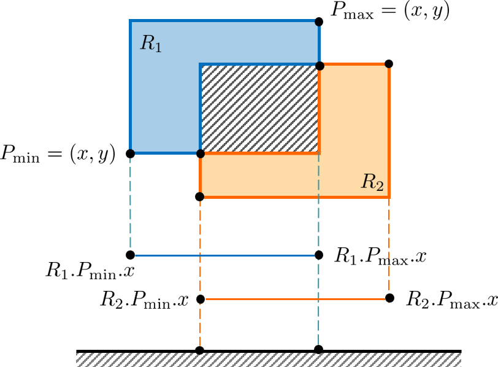
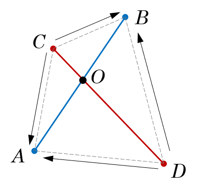

Question List in March, 2022
============================

🌳 No matter how long the winter, spring is sure to follow.

.. raw:: html

   <html xmlns="http://www.w3.org/1999/xhtml"><head></head><body>
看一看这些历史事实，再看一看《海瑞罢官》中的假海瑞，就不难发现，这是一个编造出来的假海瑞。这是一个用资产阶级观点改造的人物。历史剧需要艺术加 工，需要再创造，我们并不要求新编历史剧的细节都同历史一样，但必须要求在人物的阶级立场、阶级关系上符合于历史真实。······国家是阶级斗争的工具，是一个阶级压迫另一个阶级的机关。没有什么非阶级的、超阶级的国家。 这是马克思列宁主义对待国家问题的基本观点。从这种观点出发，就不能不承认，封建国家是地主阶级对农民实行专政的工具。

       ——姚文元《评新编历史剧&lt;海瑞罢官&gt;》
   
</body></html>

.. _1三维基础:

1、三维基础
-----------

此处记录三维基础的相关内容。

.. _11-平面算法:

1.1 平面算法
~~~~~~~~~~~~

简单记录一下几何相关知识。

矩形相交面积
^^^^^^^^^^^^

矩形相交算法的基本内容。平行矩形相交问题有很多种可能，其实可以拿基本相交的情况来测试，如下。

将二维降低到一维，则可以将相交矩形的问题简化为在 :math:`x,y`
两个轴上确定相交区域的问题，这样一来相交区域可以如下定义：

.. math::

   x_{\min}=\max(R_1.P_{\min}.x,R_2.P_{\min}.x)\\
   x_{\max}=\min(R_1.P_{\max}.x,R_2.P_{\max}.x)

这样一个简单的公式就可以确定相交区域了，当 :math:`x_\max-x_\min`
小于等于 0 时证明矩形没有相交区域。

线段交点
^^^^^^^^

这里只记录更加高效的矢量叉乘算法，线段相交问题的一般解情况如下：

向量叉乘几何数值公式为：

.. math:: |\vec{a}\times\vec{b}|=|\vec{a}|\cdot|\vec{b}|\cdot\sin\theta

若
:math:`\vec{a}=(x_a\ \ y_a)^T,\vec{b}=(x_b\ \ y_b)^T`\ ，则叉乘出的三维向量写成坐标形式为：

.. math::

   \vec{a}\times\vec{b}=
   \begin{pmatrix}
   0\\
   0\\
   x_ay_b-y_ax_b
   \end{pmatrix}

考虑向量叉乘出的法线方向可以把顺时针点位三角形称为逆向三角形，反之为正向三角形；如上图的
:math:`\triangle CAB`
就是正向三角性。根据叉乘确定三角形向量叉乘可以确定三角形的面积，根据值的正负可以确定正向或反向三角型。公式如下：

.. math:: S_{\triangle CAB}=0.5\cdot(\overrightarrow{CA}\times\overrightarrow{CB})_z

线段存在交点的情况就是 C 和 D 在 AB 的两侧，同时 A 和 B 在 CD
的两侧，也即：

.. math::

   (\overrightarrow{CA}\times\overrightarrow{CB})_z\cdot(\overrightarrow{DA}\times\overrightarrow{DB})_z\leqslant0\\
   (\overrightarrow{AC}\times\overrightarrow{AD})_z\cdot(\overrightarrow{BC}\times\overrightarrow{BD})_z\leqslant0

确定了上述关系之后根据 :math:`\triangle CAB` 、 :math:`\triangle DAB`
以及 :math:`\triangle ACD` 的面积可以确定 :math:`\lambda` 比例关系，令

.. math:: \lambda=\frac{AO}{AO+OB}=\frac{S_{\triangle ACD}}{S_{\square ABCD}}

即：

.. math:: \lambda=\frac{|\overrightarrow{AC}\times\overrightarrow{AD}|}{|\overrightarrow{CA}\times\overrightarrow{CB}|\cdot|\overrightarrow{DA}\times\overrightarrow{DB}|}

则可得交点坐标为：

.. math:: O=A+\lambda\cdot\overrightarrow{AB}

.. _12-数据结构:

1.2 数据结构
~~~~~~~~~~~~

简单记录一下手撕数据结构的要点。

堆
^^

每个节点的子节点都大于该节点称之为最大堆，每个节点的字节点都小于该节点的堆称之为最小堆，一般实现的堆都是最小堆。堆本质上是一个完全二叉树，因而具备下面的性质：

   | 给定任意一个节点的序号为 :math:`i`\ ，则其：
   | 左子节点序号为 :math:`2i+1`\ ；
   | 右子节点序号为 :math:`2i+2`\ ；
   | 父节点序号为 :math:`(i-1)/2`.

由此一来就可以用数组来存储堆结构了。在具体的实现过程中需要编写两个函数，一个称为
Heapify 维护堆的操作，一个称之为 Build 的建堆操作。

.. _参考文献-1:

参考文献
~~~~~~~~

1. 苦行僧.
   `计算平面两线段的交点（转载） <https://zhuanlan.zhihu.com/p/158533421>`__\ [EB/OL].

2. 卢涛.\ `【几何·Hard】求线段交点 <https://zhuanlan.zhihu.com/p/363849472>`__\ [EB/OL].

3. C语言中文网.
   `C++堆用法详解 <http://c.biancheng.net/view/481.html>`__\ [EB/OL].

4. 知乎.
   `数据结构：堆 <https://zhuanlan.zhihu.com/p/25820535>`__\ [EB/OL].

.. _2ro3modifier:

2、Ro3Modifier
--------------

经上月论证和测试，现已形成 Ro3Modifier
工具的基本轮廓，其效果图如下所示。这里假设处理后的顶层金字塔文件包括
L1、L2、L3，且 L1 层文件连接到的原始瓦片层级为 L15；则从 tileset.json
开始向下读取整个转换后的 3dtiles 文件的过程中，依次调用了 L3、L2 和 L1
文件，直至读取到 L0 层原始 Tiles 文件，即 L15 文件；此后的文件调用开始沿
L15、L16、L17、L18、L19、L20、L21 等原始瓦片文件的脉络进行。

.. figure:: pic/202202/ro3modifier.jpg
   :align: center
   :scale: 40

经过分析，在利用软件进行 3dtiles 文件格式转换的过程中，最顶层的
tileset.json 文件、L0
层文件等都与目标值产生了较大的差距，所以需要在原来的转换程序中进行相应的调整。

.. _21-基本操作设定:

2.1 基本操作设定
~~~~~~~~~~~~~~~~

通过调整 OSGB2Cesium 程序的相关代码，可以使得包含 L0
在内的原始瓦片文件的 GE
有一个较为合适的结果，但为确保后续使用方便，仍应保留原始瓦片文件的调整代码。

|  **a**. 程序自动获取 OSGB 文件的 GE 参数显示在原始值一栏 ；
|  **b**.
  将估计距离设置为主调整参数，调整值为辅调整参数，调整因子为可调整参数；
|  **c**. 调整估计距离，自动计算调整值和调整因子；
|  **d**. 调整调整值，自动计算估计距离和调整因子；
|  **e**. 调整调整因子，自动计算调整值和估计距离；
|  **f**. 默认折叠 L0 的下属原始瓦片层。

几何误差的调整策略将依据后面的参数说明来进行。

.. _22-pyqt5:

2.2 PyQt5
~~~~~~~~~

基于现在的情况，预期通过 PyQt
实现可视化界面；所以需要在这里对相关技术流程进行一个梳理。

PyQt5+VSCode
^^^^^^^^^^^^

安装时需要的编程环境为 Python3；环境安装完成之后，需要用 ``pip``
命令安装本次应用所需要的 PyQt5 插件，具体的安装命令为：

.. code:: ··bash

   pip install pyqt5 pyqt5-tools --use-feature=2020-resolver

后面的 ``--use-feature=2020-resolver`` 是为了解决 ``pip`` 工具 2020 年
10
月之后包解析调整的问题，如不加该命令则会遇到安装错误信息。两个包安装完成之后，在
VSCode 中进行配置：

|  **(1)**. 在插件中心安装 PYQT Integration 拓展；
|  **(2)**. 在
  文件\ :math:`\rightarrow`\ 首选项\ :math:`\rightarrow`\ 设置\ :math:`\rightarrow`\ 扩展
  中配置 PyQT Integration：
|  配置 ``Pyuic`` 路径为：\ ``**\Python39\Scripts\pyuic5``\ ，
|  配置 ``Qtdesigner`` 路径为
  ``**\Python39\Lib\**\Qt\bin\designer.exe``\ ；
|  **(3)**. 在资源管理器中右键即可新建 ``PYQT: New Form`` 可视化窗体.

通过上述操作即可在 VSCode 中构建 QT
的基础界面了；至此完成基本脚手架的搭建。

GUI 事件交互 
^^^^^^^^^^^^

为了进一步实现 GUI 界面与 Python 代码的交互，需要执行下面两个步骤：

(1). 将 ``*.ui`` 文件转换为 Python 文件代码，即：

.. code:: bash

   pyuic5 -o Main.py Main.ui

(2). 新建 ``WinForm.py`` 文件继承 ``Main.py`` 类：

.. code:: python

   from PyQt5 import QtWidgets
   from Main import Ui_Form

   # 继承 Main.py 类并改写
   class WinForm(QtWidgets.QWidget, Ui_Form):
       def __init__ (self):
           super(WinForm, self).__init__()
           self.setupUi(self)

   # 程序主入口函数
   if __name__=="__main__":
       import sys
       app = QtWidgets.QApplication(sys.argv)
       ui = WinForm()    
       ui.show()
       sys.exit(app.exec_())

(3). 在 ``Winform`` 类中书写 QT 的信号槽连接功能。

QT 事件积累
^^^^^^^^^^^

为了日后方便回忆和联想，这里简单记录一下遇到的 PyQT 事件响应相关操作。

| **(1)**. QStackedWidget 切换面板可以用
  ``self.statckedWidget.setCurrentIndex(0)`` 代码；
| **(2)**. 打开读取文件对话框可以用
  ``QtWidgets.QFileDialog.getOpenFileName()`` 函数；
| **(3)**. QLineEdit 设置文本可以用 ``setText()`` 函数，设置只读可以用
  ``setReadOnly()`` 函数；
| **(4)**. QTableWidget 设置表头样式可用
  ``orizontalHeader().setSectionResizeMode()`` 函数；
| **(5)**. QCheckBox 事件响应通常使用 ``stateChanged()`` 信号；
| **(6)**. 设置行高最小值可用
  ``QTableWidget.verticalHeader().setMinimumSectionSize(1)`` 函数；

PyQt 信号槽
^^^^^^^^^^^

首先，与 C++ 一样，使用信号槽首先需要引入 QObject：

.. code:: python

   from PyQt5.QtCore import pyqtSignal, QObject
   class StandardItem(QObject):
       signal = pyqtSignal(str, str, name="clicked") # 两个参数名为 clicked 的信号

激发信号的代码为：

.. code:: python

   def update(self):
       self.dataChanged.emit("old status", "new status")

然后在别的地方使用槽函数进行连接即可。需要注意的是：

   子类使用槽的时候，只能继承一个父类，否则报 *multiple bases have
   instance lay-out conflict.* 错误。

打包 EXE 程序
^^^^^^^^^^^^^

打包 EXE 程序的相关命令如下：

.. code:: python

   pyinstaller -F -i psyduck_32.ico WinForm.py 

.. _参考文献-2:

参考文献
~~~~~~~~

1. CSDN博客.
   `VSCode配置Python、PyQt5、QtDesigner环境并创建一个ui界面测试 <https://blog.csdn.net/weixin_40014984/article/details/104531359>`__\ [EB/OL].

2. CSDN博客. `Python制作小软件——1.
   安装并使用PyQt5进行界面设计 <https://blog.csdn.net/weixin_41929524/article/details/81456308>`__\ [EB/OL].

3. CSDN博客. `Python制作小软件——2.
   实现界面中的退出功能 <https://www.csdn.net/tags/MtTaEg4sNDE2NzE4LWJsb2cO0O0O.html>`__\ [EB/OL].

4. 博客园.
   `PyQt5中QTableWidget设置列宽大小的几种方式 <https://www.cnblogs.com/liugp/p/10509123.html>`__\ [EB/OL].

5. QT. `Qt for
   Python <https://doc.qt.io/qtforpython-5/index.html>`__\ [EB/OL].

6. QT.\ `Animation to hide rows in a
   QTableWidget <https://stackoverflow.com/questions/65018957/animation-to-hide-rows-in-a>`__\ [EB/OL].

7. CSDN博客. `PyQt
   5信号与槽的几种高级玩法 <https://blog.csdn.net/broadview2006/article/details/78475842>`__\ [EB/OL].

8. 51CTO博客.
   `PyQt5快速入门（二）PyQt5信号槽机制 <https://blog.51cto.com/quantfabric/2422187>`__\ [EB/OL].

.. _3项目相关:

3、项目相关
-----------

此处记录相关项目遇到的问题。

.. _31-空间地理库:

3.1 空间地理库
~~~~~~~~~~~~~~

此处记录空间地理库开发过程中遇到的相关问题。

若依 NGINX 部署
^^^^^^^^^^^^^^^

在政务外网部署 NGINX 反向代理时遇到了这样的问题：主机开放 80
端口作为对外访问的唯一端口，同步映射到外网的端口为 80
端口；部署服务时需要在 80 端口下部署若依服务，但默认的 ``/`` 地址已被
``81`` 端口使用。在应用中首先尝试新建服务端口 82 进行部署，测试如下：

.. code:: nginx

   http{
       # 主机 80 端口的服务块
       server 80{
           location / {
               proxy_pass http://localhost:81;
           } # 主机 IIS 服务
           location /kjdlkht/{
               proxy_pass http://localhost:82;
           } # 跳转到 82 端口进行若依服务
       }
       # 主机 82 端口服务
       server 82{
           location /{
               # 若依本地文件地址
           }
           location /prod-api/{
               proxy_pass http://localhost:8085;            
           }
       }
   }

备注一下 NGINX 解决跨域问题的相关配置：

.. code:: nginx

   # 指定允许跨域的方法，*代表所有
   add_header Access-Control-Allow-Methods *;
   # 预检命令的缓存，如果不缓存每次会发送两次请求
   add_header Access-Control-Max-Age 3600;
   # 带cookie请求需要加上这个字段，并设置为true
   add_header Access-Control-Allow-Credentials true;
   # 表示允许这个域跨域调用（客户端发送请求的域名和端口） 
   # $http_origin动态获取请求客户端请求的域   
   # 不用*的原因是带cookie的请求不支持*号
   add_header Access-Control-Allow-Origin $http_origin;
   # 表示请求头的字段 动态获取
   add_header Access-Control-Allow-Headers 
   $http_access_control_request_headers;
   # OPTIONS预检命令，预检命令通过时才发送请求
   # 检查请求的类型是不是预检命令
   if ($request_method = OPTIONS){
       return 200;
   }

在测试过程中发现，这样发布的若依前端网页无法找到相关的静态资源文件；明明在
CentOS
系统中相同的配置能够运行啊呜呜。所以经过周达师兄的测试，提出了另外一种解决方案，即：

   | a. 首先修改若依路径配置文件修改 ``/`` 为
     ``/kjdlkht/``\ ，并同步修改路由中的 ``/`` 为 ``/kjdlkht``\ ；
   | b. 在 nginx 中部署若依前端时添加静态资源路径 ``/static/``
     进行映射。

总体思路如下：

.. code:: nginx

   server 80{
       location / {
           proxy_pass http://localhost:81;
       } # 主机 IIS 服务
       location /kjdlkht/{
           # 若依本地文件
       } # 跳转到 82 端口进行若依服务
       location /kjdlkht/static/ {
            alias C:/kjdlk-ui/dist/static/;
       } # 若依打包后的静态资源目录
       location /prod-api/{
           proxy_pass http://localhost:8085;
       }# 若依后台文件
   }

至此，暂时解决了相关动态代理的问题。

修复 OpenSSH 漏洞
^^^^^^^^^^^^^^^^^

因为离线环境中扫描除了 OpenSSH 的版本漏洞，根据漏洞的一系列说明，需要将
OpenSSH 版本从 7.4p1 升级为最新的 8.9p1
版本。这就很蛋疼了，如何在离线内网环境中升级 OpenSSH
包呢？目前首先考虑使用内网环境构建镜像 RPM
库；如果不行，则一步步查找相关 OpenSSH 的版本包。

   最新指令，暂且不用管 SSH
   升级问题了，如果后面需要的话再根据参考文献及进行调整。

.. _32-osgb2cesium:

3.2 osgb2cesium
~~~~~~~~~~~~~~~

本月重点修复 Release 打包 EXE
运行转换时程序莫名闪退的问题。经过思路验证，发现可能是因为原始程序使用的是广度优先搜索的思路存储了大量的无效待处理信息而占据了内存，目前的思考是将广度有限搜索修改为深度优先搜索的设计思路，首先纵深式的解决问题以减少内存占用。

.. _33-天津水运院:

3.3 天津水运院
~~~~~~~~~~~~~~

经过前期调研，天津市测绘院与天津水运院就提升水运院海洋工程勘测数据利用效率等方面展开需求研讨，在初期确定了海洋工程勘测数据管理、海洋空间地理信息可视化、以及海洋搜寻系统模拟演练等三方面的项目需求。本月为此展开相应的技术学习工作，为后续工作做好准备。

.. _cesiumthreejs:

cesium+three.js
^^^^^^^^^^^^^^^

参考文献 10 中列举了 5 个 Cesium 与 Three.js
两相融合的方案，这种方法在目前的前端 3D WebGIS
平台开发中仍是主流思想；而在 PC 平台上，游戏引擎的接入已然成为三维 GIS
领域发展不可抵挡的趋势，Cesium 为此创造了 Cesium for Unreal 插件以为 UE4
提供一定精度的地理信息服务。

参考文献 7 中提到了将 Three.js 的着色器迁移到 Cesium
中进行渲染的一种思路，但代码无法直接复现，原文中的部分细节并没有完整附录。不过直接修改
Cesium 着色器的思路的确可行，参见参考文献 11 和 12。

飞渡 DTS
^^^^^^^^

飞渡 Freedo 二次开发工具套件名为 AirCity Cloud.iso
镜像文件，使用时可参考官网相关教程。值得注意的是在飞渡科技的官方网页右的免费试用可以登录其产品中心，产品中心中唯一能用的
DTScharts 大屏展示系统能够为初期的 demo
浏览测试提供原始效果。但具体的功能开发还是得依托于其核心镜像框架。参考连接有：

| *a*. DTSchart 网址：\ http://dtscharts.ifreedo.cn/.
| *b*. DTS 安装帮助文档：\ https://dtsdoc.g-bim.cn/5.1/.
| *c*. DTS API 使用文档：\ http://sdk.g-bim.cn/.

参考上面的连接可以对飞渡 DTS
的核心产品框架以及具体使用步骤有简单的了解，具体需拿到开发套件再说。

UE4
^^^

虚幻 4
引擎是一款能够拿到源代码的游戏开发引擎，其下载使用有两种方式：其一是使用
Epic 启动器下载指定版本的编译好引擎，其二是使用 GitHub
源代码进行编译。前者可以自如使用 MarketPlace
上面的各种插件，并安装到本地引擎程序中，后者则只能通过 Laucher
下载资源后再行于编译好的 UE4Editor.exe 应用程序中使用。需要注意的是，用
Laucher 则一定会下载官方编译好的 UE 最新版本。

.. _34-双城管控接入-rtsp-视频流:

3.4 双城管控接入 RTSP 视频流
~~~~~~~~~~~~~~~~~~~~~~~~~~~~

主要探索双城管控大屏系统接入 RTSP 视频流的相关功能。

目前查阅到 5 种方案，主要为：VLC 网络串流[13]，FFmpeg
方案[15,18]，Kurento + WebRTC 方案[17]，零视技术公司的 H5Stream
平台[19]以及 Streamedian 解决方案[16]等。

**VLC 网络串流**
^^^^^^^^^^^^^^^^

该方式本质上是利用 VLC 应用程序的串流功能做中转服务器进行串流，由此将
RTSP 流媒体转换为 HTTP 服务在本机进行显示，具体步骤为：

| *a*. 下载 VLC 应用程序；
| *b*. 选择 [媒体] :math:`\rightarrow` [打开网络串流]
  :math:`\rightarrow` [串流]；
| *c*. 选择 [HTTP] 后 [添加]，配置视频流服务地址；
| *d*. 勾选 [激活转码]、[Video-Theora+Vorbis(OGG)] 选项；
| *e*. 勾选 [串流所有基本流] 后点击 [流] 执行串流转换；
| *f*. 在浏览器中配置 ``video`` 标签的 ``type:video/ogg`` 即可。

该方案的问题是 VLC 播放延迟及流转延迟叠加，CPU
专用率较高多路存疑，而且第一帧为绿色影响观感。升级版的收费软件猿大师可能会解决这种问题，但不推荐。

**FFmpeg+WebSocket+Node**
^^^^^^^^^^^^^^^^^^^^^^^^^

方案的原理是在后端利用 转流工具 FFmpeg 对 RTSP 流进行流转，然后通过
WebSocket
传输转换后的流媒体并利用相关的开源库解析成可以在浏览器播放的视频。

FLV.js

采用 flv.js + ffmpeg + websocket + node 协同构建，利用 FFmpeg 将 RTSP
转换为 FLV 流，交付 flv.js 进行解析显示；该方案处理实时视频的延时在 2
秒左右，且 FFmpeg 占用 CUP 会随视频的增加而增加，所以一般是建议 RTSP
用辅码流以获取更加稳定的效果。

JSMpeg.js

采用 jsmpeg.js + ffmpeg + websocket + node 协同构建，利用 FFmpeg 将 RTSP
转换为图片流，交付 JSMpeg.js 进行显示；该方案处理实时视频的延时在 2
秒左右，且 FFmpeg 占用 CUP 会随视频的增加而增加，所以一般是建议 RTSP
用辅码流以获取更加稳定的效果。

**Kurento+WebRTC**
^^^^^^^^^^^^^^^^^^

主要考虑将 Kurento 作为转流服务器将 RTSP 转换为 WebRTC 流然后交付给
Video 标签进行播放。由于WebRTC 使用 SRTP 进行媒体数据的传输，故而只需将
RTP 中的负载数据通过 WebRTC 通道发送给浏览器，浏览器端通过 ``video``
标签播放即可。

   WebRTC 是 *Web Real Time Communication*
   的缩写，译为\ **网络实时通信**\ ，是由 Google
   主导的用来让浏览器之间（端到端之间）的音频、视频及数据能够共享的\ **一组标准、协议和
   JS API**\ 。WebRTC 不需要安装任何插件，通过简单的 JavaScript API
   就可以使得实时通信变成一种标准功能。WebRTC 共分三个 API：

   | · MediaStream（又称getUserMedia）
   | · RTCPeerConnection
   | · RTCDataChannel

   其中，getUserMedia 主要用于获取视频和音频信息，后两个 API
   则主要用于浏览器之间的数据交换。

目前 RTSP 转 WebRTC 对浏览器的适配比较好，延迟也比较低。

**Streamdian** 或者 **H5Stream**
^^^^^^^^^^^^^^^^^^^^^^^^^^^^^^^^

这两个都是一套完整的解决方案，区别在于一个开源，一个商业；二者在其官网上均有示例代码，而后者作为国内软件的技术支持可能更好一些。

**Node-Media-Server**
^^^^^^^^^^^^^^^^^^^^^

经过 EasyDarwin 的中转，了解到可以将 RTSP 流转到 RTMP 流进行播放，而
node-media-server 支持同样的流媒体服务器功能且开源，就很方便。果断舍弃
EasyDarwin 然后用本地服务中转。

   node-media-server + flv.js

方案描述如上。

.. _参考文献-3:

参考文献
~~~~~~~~

1.  编程圈. `【HAVENT原创】Vue SSR 非根目录部署 Nginx
    代理 <https://www.bianchengquan.com/article/266732.html>`__\ [EB/OL].

2.  CSDN博客. `Nginx location 匹配详解、location [=|~|~\ \|^~|!~|!~]
    详解 <https://www.bianchengquan.com/article/266732.html>`__\ [EB/OL].

3.  博客园.
    `Nginx配置详解 <https://www.cnblogs.com/knowledgesea/p/5175711.html>`__\ [EB/OL].

4.  自然之龙.
    `制作yum源进行rpm离线安装，及进阶玩法：公司内网环境下部署rpm镜像仓库 <https://blog.csdn.net/yang558855/article/details/115455227>`__\ [EB/OL].

5.  CSDN博客. `Linux
    操作系统下载依赖包rpm制作本地镜像源方法 <https://blog.csdn.net/qq_39727936/article/details/102536895>`__\ [EB/OL].

6.  CSDN博客.
    `Centos7升级openssh到最高版本 <https://blog.csdn.net/xyy1028/article/details/104787689>`__\ [EB/OL].

7.  博客园.
    `基于Cesium实现逼真的水特效 <https://www.cnblogs.com/wanghui2011/articles/13100925.html>`__\ [EB/OL].

8.  CSDN博客.
    `Cesium开发手册 <https://blog.csdn.net/fengweifree/article/details/94440242>`__\ [EB/OL].

9.  Github.\ `oceanmapper <https://github.com/vtamsitt/oceanmapper>`__\ [EB/OL].

10. 知乎.
    `Cesium和Three.js结合的5个方案 <https://zhuanlan.zhihu.com/p/441682100>`__\ [EB/OL].

11. 四季留歌. `溯源：Cesium.Appearance
    中的顶点着色器 <https://www.cnblogs.com/onsummer/p/14141907.html>`__\ [EB/OL].
    博客园, 2020.

12. Cesium.
    `CustomShader <https://cesium.com/learn/cesiumjs/ref-doc/CustomShader.html>`__\ [EB/OL].

13. CSDN博客.
    `RTSP视频流嵌入h5页面 <https://blog.csdn.net/weixin_43575792/article/details/120005756>`__\ [EB/OL].

14. 腾讯云.
    `几种浏览器播放RTSP视频流解决方案 <https://cloud.tencent.com/developer/article/1805057>`__\ [EB/OL].

15. 稀土掘金.
    `在web中播放rtsp视频方案对比 <https://juejin.cn/post/6873691566436253710#heading-8>`__\ [EB/OL].

16. Streamedian. `HTML5 RTST streaming video player over
    WebSocket <https://streamedian.com/>`__\ [EB/OL].

17. GreenMemory.
    `基于Kurento搭建WebRTC服务器 <https://blog.gmem.cc/webrtc-server-basedon-kurento>`__\ [EB/OL].

18. 骆飞.
    `如何不花钱让html5播放rtsp视频流（第二弹） <https://juejin.cn/post/6844903949309313037>`__\ [EB/OL].

19. 零视技术.\ `H5S视频平台 <https://www.linkingvision.cn/product/h5stream>`__\ [EB/OL].
