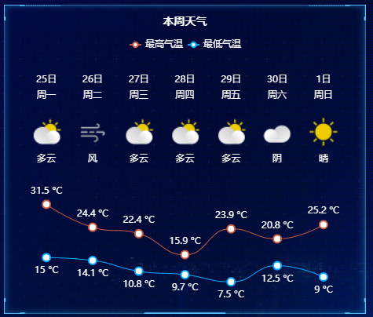

Question List in April, 2022
============================

🌳 Sping is definitely here, everything became green and alive.

.. raw:: html

   <html xmlns="http://www.w3.org/1999/xhtml"><head></head><body>
这世界有太多不如意，但你的生活还是要继续。太阳每天依旧要升起，希望永远种在你心里。

       ——《武林外传》侠客行
   
</body></html>

.. _1框架案例:

1、框架案例
-----------

此处记录一个采用 React+AntDesign
搭建地理信息系统功能模板的东西；在正式施行案例之前，通过界面设计设计出预期达到的系统效果，然后通过逻辑分析设计出预期实现的界面交互功能；而具体的三维/二维功能嵌入效果可以根据后面的需要进行技术整理。

.. _11-概要:

1.1 概要
~~~~~~~~

1. 安装 Node 版本管理工具 nvm 并以管理员运行安装最新版本 Node.js 程序；

2. 使用 npm 工具安装 ``create-react-app`` 工具并执行 ``create-react-app demo`` 创建 React 程序；正式下载完代码并执行界面设计后发现对于本文的框架，可能 Vue+ElementUI 搭建更合适一些；

3. 设计地理信息系统模板，参考 202204/gis-demo.pptx 文件。

.. _12-react:

1.2 React
~~~~~~~~~

With Vue
^^^^^^^^

Vue
最令人印象深刻的是其响应式布局模式及其在此过程中催生的六个生命周期；而
React
所主张的是函数式编程的理念，整体采用函数式的思想，使用单向数据流并推崇结合
``immutable`` 来实现数据不可变，由此催生了生命周期的挂载 Mounting、更新
Updating 以及卸载 Unmounting 等三个状态。

Vue 通过对每一个属性建立 Watcher
来监听，当属性变化的时候响应式的更新对应的虚拟 DOM；相对的，React 则在
``setState()`` 之后重新走渲染的流程，如果 ``shouldComponentUpdate()``
函数返回的是 ``true`` 就继续渲染，若返回 ``false`` 则不会重新渲染。

Why React
^^^^^^^^^

React 很擅长处理组件化的页面，开发者甚至可以使用 React 框架在 JavaScript
中构建移动应用程序。在 React 中所有的组件的渲染功能都依靠 JavaScript
的语法扩展 JSX，这一语法在创建 UI 组件和调试时非常有用。

   优化 React 应用程序必备的 ``PureComponent``
   组件就是重写了\ ``shouldComponentUpdate()``\ ，然后在里面作了
   ``props`` 和 ``state`` 的浅层对比。这里需要注意的是 PureComponent
   是优化 React 应用程序最重要的方法之一，易于实施。使用时只要把继承类从
   Component 换成 PureComponent 即可，使用该组件可以减少不必要的
   ``render`` 操作的次数，从而提高性能；而且可以少写
   ``shouldComponentUpdate()`` 函数。

总之，React 的性能优化需要手动去做，而 Vue 的性能优化是自动的，但是 Vue
的响应式机制也有问题，就是当state 特别多的时候，Watcher
也会很多，会导致卡顿，所以大型应用（状态特别多的）一般用 React
以使界面渲染流程更加可控。

.. _13-构建主体:

1.3 构建主体
~~~~~~~~~~~~

WebGIS 地图框架
^^^^^^^^^^^^^^^

目前行业上流行的有些用户基数的地图 JS 库包括：
``ArcGIS API for JavaScript``\ ；\ ``OpenLayers``\ ；\ ``Leaflet``\ ；\ ``Mapbox``\ ；\ ``maptalks.js``
等等。通过测试，个人觉得 Leaflet 的文档和插件更加便于使用。

SSH 工具
^^^^^^^^

目前除了 XShell 外免费且好用的 SSH 管理工具有：暗黑系
`Electerm <https://electerm.html5beta.com/>`__\ 、国产
`FinalShell <http://www.hostbuf.com/>`__\ 、高性能开源
`WinTerm <https://github.com/kingToolbox/WindTerm/releases>`__\ 、强大的终端管理工具
`Tabby <https://github.com/Eugeny/tabby/releases>`__ 等等。根据界面 UI
和试用尝试，作为安装软件来说 **Tabby** 简洁而丝滑，作为绿色免安装软件
WinTerm 使用更加便利。而综合使用下来，FinalShell 连接很不方便。

   Tabby 终端

经过测试和体验，目前选定 Tabby 终端作为 SSH 连接工具的首选。

.. _参考文献-1:

参考文献
~~~~~~~~

1.  知乎. `React + Ant Design
    快速上手 <https://zhuanlan.zhihu.com/p/26743523>`__\ [EB/OL].

2.  简书. `Windows 下多版本 NodeJS
    安装和管理 <https://www.jianshu.com/p/9ba4cd0706da>`__\ [EB/OL].

3.  React. `React <https://zh-hans.reactjs.org/>`__\ [EB/OL].//React
    官网网站

4.  101GIS. `9 Best GIS Viewers — Open-Source and Commercial
    Tools <https://101gis.com/best-gis-viewers/>`__\ [EB/OL].

5.  简书. `Vue render
    函数 <https://www.jianshu.com/p/7508d2a114d3>`__\ [EB/OL].

6.  博客园. `React 与 Vue
    的对比 <https://www.cnblogs.com/yubin-/p/11537122.html>`__\ [EB/OL].

7.  W3Cschool. `ECMAScript 6
    教程导读 <https://www.w3cschool.cn/escript6/escript6-m42v37eq.html>`__\ [EB/OL].

8.  菜鸟教程. `React
    教程 <https://www.runoob.com/react/react-tutorial.html>`__\ [EB/OL].

9.  CSDN博客.
    `WebGIS常用的前端地图框架 <https://blog.csdn.net/u012685544/article/details/121826803>`__\ [EB/OL].

10. CSDN博客.
    `QGIS打开无响应或每操作一下就卡很久 <https://blog.csdn.net/DI_ID/article/details/119349401>`__\ [EB/OL].

11. CSDN博客.
    `leaflet加载各类图层 <https://blog.csdn.net/qq_36213352/article/details/82976925>`__\ [EB/OL].

12. 博客园.
    `Leaflet入门：添加点线面并导入GeoJSON数据 <https://www.cnblogs.com/kkyyhh96/p/10386655.html>`__\ [EB/OL].

13. 知乎.
    `进阶-Leaflet-自动标注的实现方法 <https://zhuanlan.zhihu.com/p/66350508>`__\ [EB/OL].

14. 沧沧凉凉.
    `Viewer.js图片查看器 <https://www.cclliang.com/2020/06/15/web%E5%BC%80%E5%8F%91/Viewer.js%E5%9B%BE%E7%89%87%E6%9F%A5%E7%9C%8B%E5%99%A8/>`__\ [EB/OL].

.. _2algorithm:

2、Algorithm
------------

算法是门科学，有着系统的理论知识和研究思路，这里需要进一步掌握相关理论内容，服务于后续研究。

.. _21-backtracking:

2.1 Backtracking
~~~~~~~~~~~~~~~~

Backtracking，即 *Backtracking Algorithm* 回溯算法。算法的伪代码为：

回溯算法主要用于解决全排列系列的算法题，在每一次选择后进入迭代，在迭代结束后撤回当前选择以达到遍历所有可能情况的目的，由此即可将所有的可能情况一一列举出来。

需要注意的是，在 C++
中使用该算法时要着重注意使用哪种数据结构，一般我们会使用 ``queue``
队列数据结构以及动态数组 ``vector``
数据结构；在需要进行表达式判定时可以使用 ``stack`` 栈数据结构。

.. _3项目:

3、项目
-------

此处记录项目开发过程中的一些日常积累。

.. _31-住建委按户查询:

3.1 住建委按户查询
~~~~~~~~~~~~~~~~~~

我们用的是 Mars3D 框架 API文档 v2.1
版本，在使用该版本的框架进行房屋单体户数查询时的关键代码为：

.. code:: javascript

   //根据图层名获取当前工作图层
   let layerwork = viewer.mars.getLayer('2-11F', 'name');
   //为该图层指定 ID 的 scenetree.json 节点赋予特殊的着色
   layerwork.model.style = new Cesium.Cesium3DTileStyle({
       color:{
           conditions: [
               //指定 ID 的 actor 节点颜色属性
               ["${id} === 'f5deaeeae1538fb6c45901d524ee2f98'", "rgb(0, 255, 255)"],
               //该图层其他节点的颜色属性
               ["true", "rgba(255,255,255, 0.1)"]
           ]
       }
   });
   //样式还原
   layerwork.model.style = undifined;

通过上面的设置可以达到如下图所示的效果：

点击指定 actor 进行高亮显示的关键在于 3dtiles
图层回调函数的设定。测绘院在 v2.1 版本基础上进行了二次开发工作，其为
3dtiles 图层指定了相应的回调函数：

.. code:: javascript

   set3dPickCesium3dTileFeatureCallback(function callback);

参数 callback 为回调函数，其行如：

.. code:: javascript

   function (pickedFeature, featureName, layerConfig, movement) {}

其中，\ ``pickedFeature`` 为鼠标选中的节点，可以通过如下函数获取到该
actor 的重要属性：

.. code:: javascript

   pickedFeature.getProperty('id');   // 获取 actor 的 ID 信息
   pickedFeature.getProperty('name'); // 获取 actor 的 Name 名称信息

至此完成了 4 月 21 日 CIM 功能开发的可研性报告工作。

.. _32-双城管控大屏及后台:

3.2 双城管控大屏及后台
~~~~~~~~~~~~~~~~~~~~~~

后台主要完成了 4 台 CentOS8 服务器离线软件安装工作、2 台 Windows
服务器的软件安装工作。对于大屏展示系统而言，主要任务有添加搜索按钮、修改图标样式等两个核心功能；以及探索
RTSP 流服务器在本地 HTML 进行更加方便的展示的功能。

node-media-server
^^^^^^^^^^^^^^^^^

几经波折，探索了项目本地应用服务提供商提供的方式之后，可以采用萤石云的标准服务平台进行流媒体转发以及视频显示，当然也可以用
flv.js 以及 node-media-server 服务的方式进行流媒体播放转发及播放。

   node-media-server + ffmpeg + flv.js

具体方案框架如上图所示，关键性的 node-media-server 配置代码 app.js
如下：

.. code:: javascript

   const NodeMediaServer= require('node-media-server');
   const config = {
       rtmp: {
           port: 1935,
           chunk_size: 60000,
           gop_cache: true,
           ping: 60,
           ping_timeout: 30
       },
       http: {
           port: 8979, // 端口号
           mediaroot: './media/',
           allow_origin: '*',
       },
      relay: {
           ffmpeg: './bin/ffmpeg.exe',// FFMPEG 程序
           tasks: [
               {
                   app: 'live',       //分组名称
                   mode: 'static',
                   edge: 'rtsp://xxx',//RTSP 地址
                   name: 'technology',//流媒体名称
                   rtsp_transport : 'tcp', //['udp','tcp','udp_multicast','http']
               }
           ]
       },
   };
   //RTSP://[IP]:[端口号]/[分组名称]/[流媒体名称]
   //HTTP://[IP]:[端口号]/[分组名称]/[流媒体名称].flv
   var nms = new NodeMediaServer(config)
   nms.run();

通过该方式可以形成 flv 以及 RTMP 两种形式的转发地址：

.. code:: bash

   http://127.0.0.1:8979/live/technology     # RTMP流媒体地址
   http://127.0.0.1:8979/live/technology.flv # FLV 格式流媒体地址

支持完成 RTSP 流媒体的播放。

输入法触发 mouseleave 事件
^^^^^^^^^^^^^^^^^^^^^^^^^^

特别是在设计 input 搜索框的时候容易触发这种
BUG；该问题主要是因为中文输入法在进行输入的时候触发了输入框的两个事件：compositionstart
和 compositionstart。所以解决方案如下：

.. code:: javascript

   //侦听输入法事件
   let flag = true;
   $('#openmap-search-input').on('compositionstart', function(){ flag = false; });
   $('#openmap-search-input').on('compositionend', function(){ flag = true; });
   //当输入法处于非输入状态时才触发 mouseleave 的事件。

主要参考参考文献 3，将 mouseleave 改为 mouseout 也可以实现，但由于
mouseout
的子控件事件冒泡阻断，会导致复杂层级的按钮事件陷入混乱状态。所以最好还是使用上文
flag 的方式进行处理。

另外，在添加搜索按钮及其相关事件内容，事件应在页面渲染完成后绑定；否则页面未渲染前容易触发控件事件无法触发的情况，主要的方法有三种：

.. code:: javascript

   //window.onload
   window.onload = function(){ $('[控件标识]').on('click', function(){}); }

   //doucument.ready
   $(document).ready(function(){ $('[控件标识]').on('click', function(){})}; )
   //Ready 方法可以简写为： $(function(){ $('[控件标识]').on('click', function(){})};)

   //document.on
   $(document).on('click', '[控件标识]' , function(){})

实时天气
^^^^^^^^

最终选择 https://www.visualcrossing.com/ 网站作为实时天气显示的 API
接口数据源，该网站具有良好的定制效果且注册方面，易用性较高，免费高效易用。将
echart 制作成天气面板可以参照参考文献 5
提供的方法，经实验证明可以达到如下图所示的预期效果。

至此完成大屏系统修改图标样式以及调整实时检测面板布局的基本功能。

.. _33-日常工具积累:

3.3 日常工具积累
~~~~~~~~~~~~~~~~

MYSQL 输出 JSON
^^^^^^^^^^^^^^^

按需要将每条记录内容输出为 JSON 格式，并添加响应头。

.. code:: sql

   SELECT CONCAT('{"code":200,"data":[', GROUP_CONCAT(JSON_OBJECT(
       'id',id, 'name', name, 'tcsd', tcsd, 'tchd', tchd, 'bs', bs, 'zlmd', zlmd, 'tlh', tlh)),']}') 
   AS result FROM `t3` GROUP BY zk

EXCEL 输出文件
^^^^^^^^^^^^^^

将单元格内容对应输出为响应的文件。

.. code:: vbscript

   Sub bod()
       '输出单元格 B1 的内容到 A1.json 文件夹中
       Dim nm$
       For I = 1 To 57
           n = n + 1
           '组织文件路径
           nm = ThisWorkbook.Path & "\" & Application.Trim(Cells(I, 1)) & ".json"
           '文件编码
           Dim objStream As Object
           Set objStream = CreateObject("ADODB.Stream")
           With objStream
               .Type = 2
               .Charset = "UTF-8"
               .Open
               'Cells(i, 1)为每个txt里面要放的内容，可替换，内容为空则删除
               .WriteText Cells(I, 2)
               .SaveToFile nm, 2
           End With
           Next
   End Sub

.. _参考文献-2:

参考文献
~~~~~~~~

1. CSDN博客. `ArcGIS
   切片缓存紧凑文件格式分析与使用 <https://blog.csdn.net/warrenwyf/article/details/6069711?utm_source=blogxgwz1>`__\ [EB/OL].

2. JavaShuo. `ArcGIS for Server 10.3.X
   新型紧凑型缓存的解读和应用 <http://www.javashuo.com/article/p-rdmnlbus-rc.html>`__\ [EB/OL].

3. 博客园.
   `input输入中文时，拼音在输入框内会触发input事件的问题。 <https://www.cnblogs.com/lonhon/p/7643095.html>`__\ [EB/OL].

4. 米唐.
   `解析WKT字符串以获得点数组 <https://mlog.club/article/3391277>`__\ [EB/OL].

5. CSDN博客.
   `Echarts利用多X轴实现七天天气预报效果 <https://blog.csdn.net/FengChSvip/article/details/120950731>`__\ [EB/OL].
