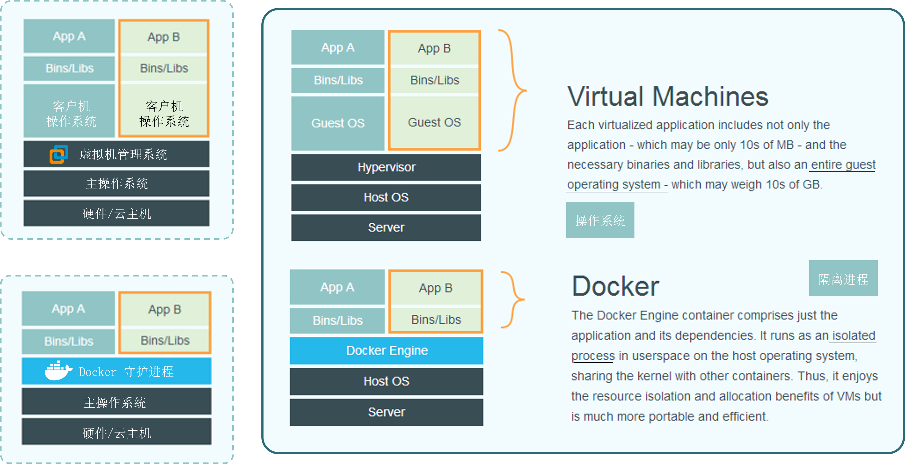
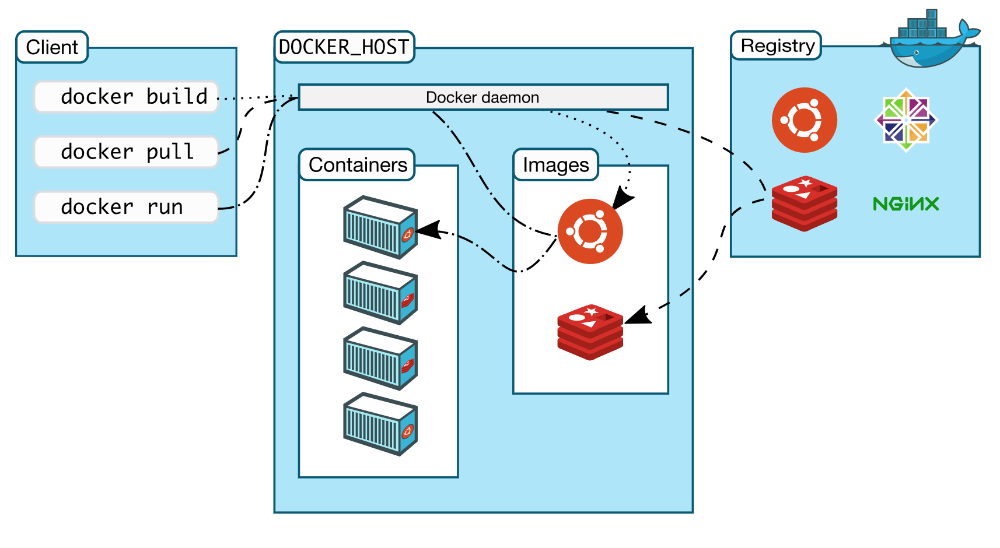
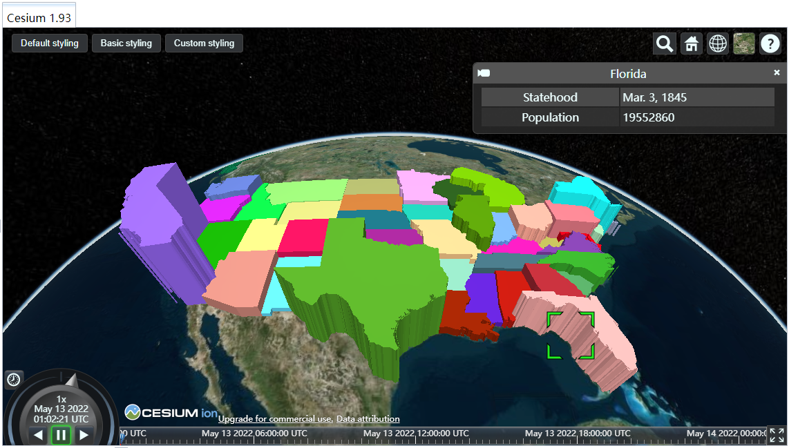
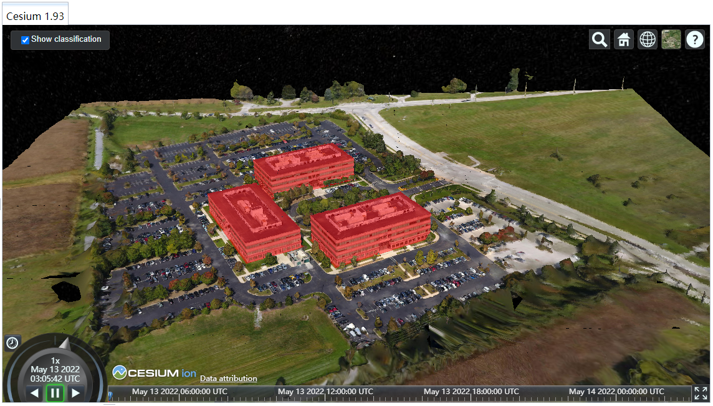
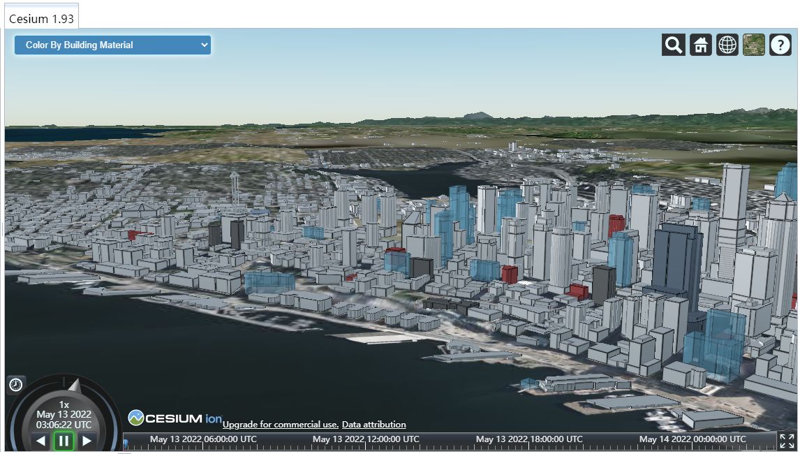
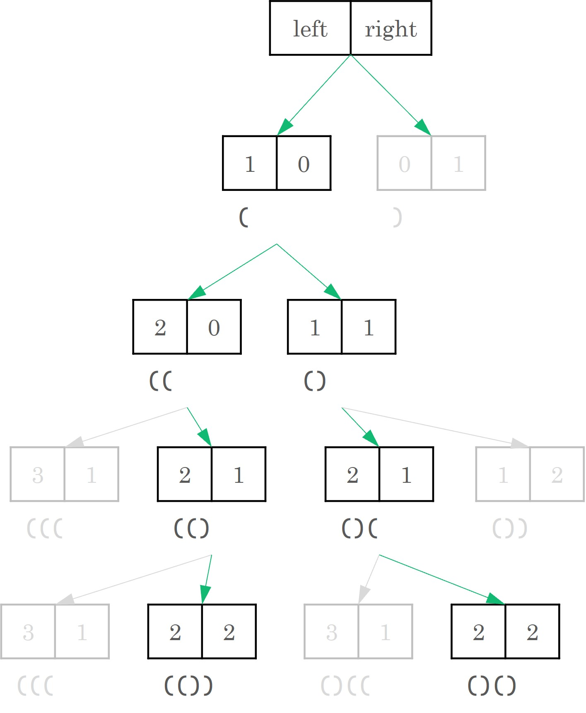
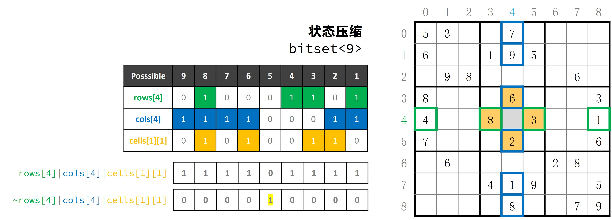
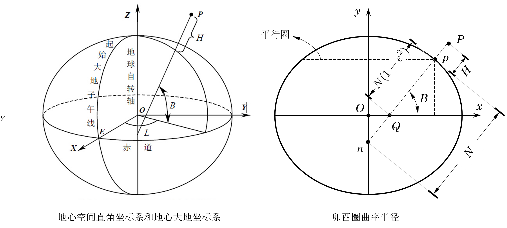
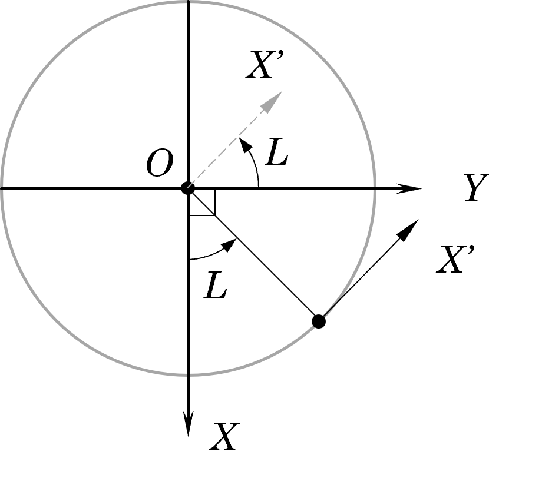

Question List in May, 2022
==========================

💲 Fuck the word if you are rich, otherwise go fuck yourself.

.. raw:: html

   <html xmlns="http://www.w3.org/1999/xhtml"><head></head><body>
王善保家的，是邢夫人从娘家带过来的陪房。···这是一个长期不在位的人，突然看见有空子可以钻一钻的欣喜和膨胀。这场风波，连凤姐在内哪个不小心翼翼、见风使舵？只有她，想着大展拳脚。她的这种状态很多人都有，突然被提到聚光灯下，突然手里多了一个话筒，平日羡慕的权势突然来到自己身上，就会生出一种莫名其妙的亢奋。这股亢奋会催着人做出事后想想不可思议的事情来。

       ——网评《红楼梦》大观园抄检风波
   
</body></html>

.. _1项目相关:

1、项目相关
-----------

项目相关内容记录。

.. _11-双城管控:

1.1 双城管控
~~~~~~~~~~~~

此处记录一些常见的网络相关内容。

端口映射或转发
^^^^^^^^^^^^^^

Windows 端口映射的相关命令如下：

.. code:: bash

   # 安装环境支持
   netsh interface ipv6 install
   # 查看已配置的“端口映射”清单
   netsh interface portproxy show v4tov4
   # 添加“端口映射”：将本机（192.168.222.145）的15001端口映射到192.168.222.63的81端口
   netsh interface portproxy add v4tov4 listenaddress=192.168.222.145 listenport=15001 connectaddress=192.168.222.63 connectport=81
   # 删除“端口映射”
   netsh interface portproxy delete v4tov4 listenaddress=192.168.222.145 listenport=15001

Linux 端口转发的相关命令如下：

.. code:: bash

   ssh -R 81:10.233.40.5:8090 localhost             # 建立转发
   ssh -O cancel -R 81:10.233.40.5:8090 localhost   # 取消转发

前端 GIS 操作库
^^^^^^^^^^^^^^^

目前搜索到的前端操作类库有：\ *JSTS, Turf.js* 以及 *GeometryUtil*
等。其中， JSTS 是一个符合 OGC 规范的简单要素空间位置判定函数 JavaScript
库，也是 Java 类库 JTS 的一个接口，与OpenLayer3具有互操作性。 Turf.js
是由 MapBox
提供的空间分析库，其实现了常用的空间分析操作，例如生成缓冲区、计算等高线，建立
TIN 等等。

等待 AJAX 请求完成
^^^^^^^^^^^^^^^^^^

jQuery 的异步 AJAX
请求在为开发带来便利的同时也造成了一些困扰。比如用下面的代码等待 AJAX
请求完成：

.. code:: javascript

   // 声明一个表示状态的全局变量 status
   var status = false;
   // ajax
   $.ajax({ url:"/checkUsername", type:"post", success:function(){status = true;}});
   // 根据 status 的状态 进行后续操作
   function(){
     if(status) //do something
   }

此时 status 的值在 ajax 请求成功之后进行 if 判断的时候值仍然为
false；因为 ajax 的 async 属性默认为 true 以表示 ajax 异步执行；在进行
if 判断的时候，ajax 的异步执行还没完成，故而 status 的值仍然是
false。一种正确的思路是使用 jQuery 的 ``when().done()`` 函数，即：

.. code:: javascript

   // 声明一个表示状态的全局变量 status
   var status = false;
   // ajax
   let my =  $.ajax({ 
       url:"/checkUsername", 
       type:"post", 
       success:function(){status = true;}
   });
   // 根据 status 的状态 进行后续操作
   function(){
     $.when(my).done(()=>{/*do somethin*/})
   }

由此，即可达成目的。

内网穿透
^^^^^^^^

外网的 ngrok
有的时候不是很好用，最近发现国内的飞鸽（\ https://www.fgnwct.com/index.html\ ）用起来还不错且收费比较便宜，在这里做一个简单记录。

.. _12-cim-二期:

1.2 CIM 二期
~~~~~~~~~~~~

本期拟申请研究关键技术包括：1、自主BIM轻量化预处理引擎技术研发；2、物联网感知监控数据接入研究；3、CIM微服务架构研究；4、基于Docker的容器化部署技术。

Docker
^^^^^^

Docker 是一个基于 Go 语言开源的应用容器引擎，遵从 Apache2.0 协议。Docker
可以让开发者打包他们的应用以及依赖包到一个轻量级、可移植的容器中，然后发布到任何流行的
Linux
机器上，也可以实现虚拟化。容器是完全使用沙箱机制，相互之间不会有任何接口且容器性能开销极低。

Docker VS 虚拟机
''''''''''''''''

Docker 有两句口号：

   | Build, Ship and Run. # 构建、发送和运行。
   | Build once，Run anywhere. # 单次构建、随处可用。

为了实现这两句口号，Docker 与 VM 虚拟机之间做了不同的割舍，如下图所示：

如上图所示，Docker
使用了轻量的虚拟化技术，剥离了庞大的客户机操作系统而仅保留程序运行时所需要的必备组件及其环境依赖；这些必备内容被
Docker 称作：镜像和容器，即 *Images and
Containers*\ ，再加上负责管理镜像资源的仓库 *Repository* 就构成了 Docker
的三大核心概念。

基本架构
''''''''

-  | **Client**
   | 作为 Docker 客户端负责接收命令并与 Docker Host 进行交互；

-  | **Docker Host**
   | 是运行 Docker 服务的主机，其由下面两部分构成：
   | Docker Daemon，守护进程，用于管理所有镜像和容器；
   | Docker Images/Containers，镜像和容器实例；

-  | **Registry(Hub)**
   | 是官方的 Docker Hub 公共镜像仓库，提供了大量的高质量官方镜像。

就在 Docker 容器技术被炒得热火朝天之时，大家发现，如果想要将 Docker
应用于具体的业务实现，是存在困难的——编排、管理和调度等各个方面，都不容易。于是，人们迫切需要一套管理系统，对
Docker 及容器进行更高级更灵活的管理。就在这个时候，K8S
出现了。K8S，就是基于容器的集群管理平台，全称是 *Kubernetes*\ 。

如何使用 Docker
'''''''''''''''

Docker
中有这样几个概念：\ **dockerfile**\ 、\ **image**\ 、\ **container**\ 。为了便于理解，可以把
``image`` 理解为可执行程序，\ ``container``
就是运行起来的进程。写程序需要源代码，那么 ``写 image`` 就需要
dockerfile，dockerfile 就是 ``image`` 的源代码，Docker 就是 ”编译器“。

因此只需要在 dockerfile 中指定需要哪些程序、依赖什么样的配置，之后把
dockerfile 交给 Docker 进行编译，也就是 ``docker build``
命令，生成的可执行程序就是 ``image``\ ，之后就可以运行这个 ``image``
了，这就是 ``docker run`` 命令，\ ``image`` 运行起来后就是
``docker container``\ 。

底层实现
''''''''

Docker 是基于 Linux 内核提供这样几项功能实现的：

-  | **NameSpace**
   | Linux 中的 PID、IPC、网络等资源是全局的，而 NameSpace
     机制是一种资源隔离方案，在该机制下这些资源就不再是全局的了，而是属于某个特定的
     NameSpace，各个 NameSpace 下的资源互不干扰，这就使得每个 NameSpace
     看上去就像一个独立的操作系统一样，但是只有 NameSpace 是不够。

-  | **Control groups**
   | 虽然有了NameSpace技术可以实现资源隔离，但进程还是可以不受控的访问系统资源，比如CPU、内存、磁盘、网络等，为了控制容器中进程对资源的访问，Docker采用control
     groups技术(也就是cgroup)，有了cgroup就可以控制容器中进程对系统资源的消耗了，比如你可以限制某个容器使用内存的上限、可以在哪些CPU上运行等等。

-  **UnionFS**

   UnionFS 全称为 *Union File System*
   联合文件系统，其可以把多个目录内容联合挂载到同一个目录下，而目录的物理位置是分开的。UnionFS
   允许只读和可读写目录并存，就是说可同时删除和增加内容。Docker
   镜像的设计中引入了层的概念，用户制作镜像的每一步操作都会生成一个层，即一个增量
   rootfs（一个目录）。需要注意的是，rootfs只是一个操作系统所包含的文件、配置和目录，并不包括操作系统内核。

   .. figure:: pic/202205/docker-unionfs.png
      :align: center
      :scale: 50

有了前两项技术，容器看起来就真的像是独立的操作系统了。Docker
中的每一个镜像都是由一系列的只读层组成的，dockerfile
中的每一个命令都会在已有的只读层上创建一个新的层。通过 ``docker run``
命令可以在镜像的最上层添加一个可写的层 -
容器层，所有对于运行时容器的修改其实都是对这个容器读写层的修改。
容器和镜像的区别就在于，所有的镜像都是只读的，而每一个容器其实等于镜像加上一个可读写的层，也就是同一个镜像可以对应多个容器。同时已构建的每一层镜像也可以作为其他镜像的基础层进行共用。

PS 九宫格切图
^^^^^^^^^^^^^

如果需要对一个整体的九宫格切分为 3×3 张单独的图片，可以利用 PS
的切分工具。即：

   | 【工具栏】→【切片工具】→画布中点击【右键】→【划分切片】→水平划分为
     3，垂直划分为 3；
   | 点击【导出】→【存储为 Web
     所用格式】→选中所有切片→点击【存储】即可。

由此即可将图片保存为九宫格切图了。

.. _13-隔离点河西住建:

1.3 隔离点、河西住建
~~~~~~~~~~~~~~~~~~~~

此章节分属两个项目，但应用功能大同小异。

建筑分类设色
^^^^^^^^^^^^

.. _1--geojson-实时渲染:

#1 GEOJSON 实时渲染
'''''''''''''''''''

Cesium 官网示例里提供了根据 GeoJSON 进行分类设色的示例，名字叫做
*GeoJSON and
TopoJSON*\ ，具体的图样效果如下图所示，似乎符合建筑白模分类设色的基本需要：

.. _2-矢量面叠加:

#2 矢量面叠加
'''''''''''''

官网示例名称为：。通过 Cesium 的 classificationType
来进行单体化，操作步骤为：添加 3dtiles 模型、绘制矢量面、将矢量面叠加到
3dtiles 模型上，具体效果如下图所示。

.. _3-操作数据文件:

#3 操作数据文件
'''''''''''''''

官网示例名称为：3D Tiles Feature Styling。通过
Cesium.Cesium3DTileStyle(json) 根据 3dtiles
的各项属性来进行模型的特色渲染工作。其核心代码如下：

.. code:: javascript

    let json = {
           color: {
               conditions: [
                   ["${建造年代} === '1960年以前'", "rgb(255, 63, 63)"],
                   ["${建造年代} === '1961-1970'", "rgb(255, 135, 63)"],
                   ["${建造年代} === '1971-1980'", "rgb(255, 207, 63)"],
                   ["${建造年代} === '1981-1990'", "rgb(231, 255, 63)"],
                   ["${建造年代} === '1991-2000'", "rgb(120, 255, 154)"],
                   ["${建造年代} === '2000-2010'", "rgb(255, 255, 255)"],
                   ["true", "color('blue')"] // conditions
               ]
           },
           meta: {
               description: '"Building id ${FID} has height ${层数}."'
           }
       };
   layer.model.style = new Cesium.Cesium3DTileStyle(json);

示意图如下所示：

Conditions
^^^^^^^^^^

Cesium3DTilesStyle 的 conditions 仅支持 ``regExp()``
正则表达式取值，其他的 ``substr(-1,1)``
之类均不可用，这里列举一些常见的正则操作：

.. code:: javascript

   regExp('.$').exec(${name}) === '室' //获取属性 name="12号-7层-703室" 最后一个字符

利用正则表达式，可以在程序中执行很多有趣的操作。

.. code:: javascript

   Number(regExp('(\d+)(?=[F层])').exec(${name})) > 2 //楼层 2 以上的部分建筑

.. _14-疫情防控标绘:

1.4 疫情防控标绘
~~~~~~~~~~~~~~~~

.. _dragmovejs:

dragmove.js
^^^^^^^^^^^

提了个拖拽图片 LOGO 的需求，拟采用 dragmove 库进行配置，但需要应用到 vue
项目中。

.. code:: bash

   # 安装 cnpm
   npm install -g cnpm
   # 安装 vue
   cnpm install vue
   # 安装脚手架
   cnpm install --global vue-cli
   # 初始化 webpack 工程
   vue init webpack my-project

随后安装 dragmove 并在 ts 文件中进行引用：

.. code:: bash

   npm install @knadh/dragmove

.. code:: javascript

   import { dragmove } from '@knadh/dragmove'; // 记得要加单引号

引入后，即可在组件的 ``mounted()`` 生命周期函数中进行使用了。

html2canvas
^^^^^^^^^^^

提了个 H5 截图的需求，拟采用 html2canvas 进行设置，但遇到了 cesium
截图为黑的情况，参照参考文献 13 在进行 viewer 创建时进行简单设置如下：

.. code:: javascript

   let viewer = new Cesium.Viewer('cesium_container', {
   	// 解决html2canvas结果运行无法得到场景截图：
       contextOptions: {
           webgl: {
               alpha: true,
               depth: true,
               stencil: true,
               antialias: true,
               premultipliedAlpha: true,
               // 通过canvas.toDataURL() 实现截图需要将该项设置为 true
               preserveDrawingBuffer: true,
               failIfMajorPerformanceCaveat: true
           }
       }
   })

但这种方式会带来性能上的开销，大概就是 ``preserveDrawingBuffer`` 为
``true`` 的时候，需要从 A 缓冲区复制到 B 缓冲。为 ``false``
的时候是交换双缓冲，会比较快。

   preserveDrawingBuffer：
   是否保存绘图缓冲，若设为true，则可以提取canvas绘图的缓冲。

改进的方式是在截图的时候调用 ``renderer.render()`` 不让 canvas 清空。

vue 发布
^^^^^^^^

以下仅供测试使用，正常 Windows 中推荐使用 Tomcat 或者 nginx 进行发布。

.. code:: bash

   npm run dev          # 打包为 dist 包
   npm install -g serve # 全局安装服务发布包
   serve dist           # 发布 vue 项目服务

.. _参考文献-1:

参考文献
~~~~~~~~

1.  CSDN博客.
    `windows下端口映射（端口转发） <https://blog.csdn.net/i1j2k3/article/details/70228043>`__\ [EB/OL].

2.  CSDN博客. `JavaScript
    空间分析库——JSTS和Turf <https://blog.csdn.net/neimeng0/article/details/80363468>`__\ [EB/OL].

3.  CSDN博客.\ `如何等待ajax完成再执行相应操作 <https://www.cnblogs.com/elementplay/p/10789600.html>`__\ [EB/OL].

4.  小枣君.
    `10分钟看懂Docker和K8S <https://zhuanlan.zhihu.com/p/53260098>`__\ [EB/OL].

5.  简书.
    `（一）容器化技术与Docker <https://www.jianshu.com/p/34efcaa92ae4>`__\ [EB/OL].

6.  知乎.
    `什么是Docker？看这一篇干货文章就够了！ <https://zhuanlan.zhihu.com/p/187505981>`__\ [EB/OL].

7.  CSDN博客.
    `cesiumjs加载geojson+建筑物分层设色 <https://blog.csdn.net/u013594477/article/details/81003233>`__\ [EB/OL].

8.  CSDN博客. `Cesium 案例分析
    --单体化分析（分栋、分层） <https://blog.csdn.net/caozl1132/article/details/90517439>`__\ [EB/OL].

9.  面向信仰编程.\ `Docker
    核心技术与实现原理 <https://draveness.me/docker/>`__\ [EB/OL].

10. Cesium中文网.
    `ConditionsExpression <http://cesium.xin/cesium/cn/Documentation1.62/ConditionsExpression.html>`__\ [EB/OL].

11. uneedcode.
    `10个拖拽放置DOM元素的js库 <https://uneedcode.com/article/205486683332541311>`__\ [EB/OL].

12. 菜鸟教程. `Webpack
    入门教程 <https://www.runoob.com/w3cnote/webpack-tutorial.html>`__\ [EB/OL].

13. CSDN博客.\ `cesium实现截图剪裁后保存--html2canvas和vuecropper <https://blog.csdn.net/flight_diary/article/details/108083128>`__\ [EB/OL].

14. CSDN博客. `Canvas Threejs preserveDrawingBuffer
    获取截图 <https://blog.csdn.net/skillart/article/details/121472419>`__\ [EB/OL].

15. 博客园.\ `Vue_打包并发布项目 <https://www.cnblogs.com/qingmuchuanqi48/p/13173153.html>`__\ [EB/OL].

.. _2algorithm:

2、Algorithm
------------

此处记录一些日常费脑袋瓜的东西。

.. _21-括号:

2.1 括号
~~~~~~~~

.. _思路-1:

思路
^^^^

1. 状态树

   | 1.1 将左括号数 ``left`` 和右括号数 ``right`` 作为状态；
   | 1.2 状态树分未左括号树 + 1 分支和右括号数 +1 分支；
   | 1.3 当 ``left + 1 <= n`` 时触发左括号 +1 分支
   | 1.4 当 ``right + 1 > left`` 时禁用右括号数 + 1 分支；

2. 回溯

   | 2.1 每次回溯需要参数为 ``left``\ 、\ ``right`` 和该次结果；
   | 2.2 当 ``right == n`` 时触发回溯结束条件。

.. _图解-1:

图解
^^^^

.. _22-数独:

2.2 数独
~~~~~~~~

.. _思路-2:

思路
^^^^

1. 状态压缩

   | 1.1 使用 ``bitset<9>`` 来压缩存储每一行、每一列、每一个 3x3 宫格中
     1-9 是否出现；
   | 1.2 每一个格子可以计算出所有不能填的数字，然后得到所有能填的数字
     ``getPossibleStatus()``\ ；
   | 1.3 填入数字和回溯时，只需要更新存储信息；
   | 1.4 每个格子在使用时，会根据存储信息重新计算能填的数字；

2. 回溯

   | 2.1 每次都使用 ``getNext()``
     选择能填的数字最少的格子开始填，这样填错的概率最小，回溯次数也会变少；
   | 2.2 使用 ``fillNum()``\ 在填入和回溯时负责更新存储信息；
   | 2.3 一旦全部填写成功，一路返回 ``true`` ，结束递归；

.. _图解-2:

图解
^^^^

Bitset
^^^^^^

C++ 的 ``bitset`` 是以类似于数组的形式管理 bit 位的操作类库，该类仅支持
0 或 1 作为自己的元素。

.. code:: c++

   #include <bitset>

常用的初始化方法有：

.. code:: c++

   bitset<4> bitset1;     //无参构造，长度为 4，每一位为 0
   bitset<8> bitset2(12); //长度为 8，二进制保存，前面用 0 补齐
   string s ="100101";  biteset<8> bitset3(s);//长度为 8
   string a[] = "10101"; bitset<9> bitset4(a);//长度为9

常用的元素访问方法有：

.. code:: c++

   operator[]; //访问比特元素，下标由 0 开始从右向左
   cout();     //获取容器中 1 的位数
   size();     //获取容器的大小
   test();     //查看下标处的元素是 1 还是 0 并返回布尔值
   any();      //检查容器中是否含有 1
   none();     //检查容器中是否全为 0
   all();      //检查容器中是否全部为 1

常用的比特操作有：

.. code:: c++

   set();   //全部置 1，默认值为 1，set(i, 0) 可设置具体元素值
   reset(); //全部置 0，reset(i) 设置 i 为 0
   flip();  //反转全部，flip(i) 反转某个元素

常用的数据转换操作有：

.. code:: c++

   to_string();  //转换为字符
   to_ulong();   //unsigned long
   to_ullong();  //unsigned long long

此外该容器支持单目按位操作符，如与或非、左移、右移等等。

.. _参考文献-2:

参考文献
~~~~~~~~

1. ikaruga. `【解数独】回溯 + 状态压缩（使用
   bitset） <https://leetcode.cn/problems/sudoku-solver/solution/37-by-ikaruga/>`__\ [EB/OL].

2. CSDN博客. `C++
   中std::bitset的使用总结 <https://blog.csdn.net/lizhichao410/article/details/122942241>`__\ [EB/OL].

3. cplusplus.com.
   `std::bitset <https://cplusplus.com/reference/bitset/bitset/?kw=bitset>`__\ [EB/OL].

.. _3osg2cesium:

3、OSG2CESIUM
-------------

本周主抓 OSG2CESIUM 的坐标转换问题 😳。

.. _31-问题排查:

3.1 问题排查
~~~~~~~~~~~~

首先发现原始 OSGB
模型在构建顶层金字塔模型时发生了坐标偏移，经过代码定位发现位置偏移是因为在进行坐标转换时对
metadata.xml
文件中存储的位置信息进行了精度取舍。注释掉取舍代码之后就没有偏移了。

接下来核验转换 3D Tiles 模型时哪里出现了问题。以 Cesiumlab
的标准版转换程序为例进行测试，发现我们的转换程序在进行转换时模型在 UP
轴上发生了错误的旋转，模型 Y 轴中心线并不是正对 North
方向。所以定位转换程序的代码，找到
``CesiumEllipsoidModel::computeCoordinateFrame``
函数，其旋转矩阵计算如下：

.. math::

   {R}=

   \begin{bmatrix}\underset{\mathbf{X}}{\mathbf{v}_{east}}&\underset{\mathbf{Y}}{\mathbf{v}_{north}}&\underset{\mathbf{Z}}{\mathbf{v}_{up}}\end{bmatrix}

   =\begin{bmatrix}
   -\sin\mu	&\mathbf{Y}_1	&\cos\mu\cdot\cos\nu\\
   \cos\mu		&\mathbf{Y}_2	&\sin\mu\cdot\cos\nu\\
   0			&\mathbf{Y}_3	&\sin\nu
   \end{bmatrix}

其中，经度 :math:`\mu`\ 、纬度 :math:`\nu`\ ； :math:`\mathbf{Y}`
轴可以由 :math:`\mathbf{X}\times\mathbf{Z}` 向量积得到。由此确定了 3D
Tiles 文件中 transform
中的旋转矩阵。这种旋转公式的推导需要借助罗德里格公式，下文将会简单介绍一下罗德里格公式。

核验一下是不是与 Region 的计算有关，

.. _32-旋转矩阵:

3.2 旋转矩阵
~~~~~~~~~~~~

所以现在的问题集中在如何根据大地坐标 :math:`(B,L,H)`
计算出该点的模型相对坐标系在地球椭球的地固空间直角坐标系 EPSG:4979
中的旋转矩阵？首先了解一下罗德里格旋转公式，然后了解一下 Gosselin C.M
论文中的公式，看看能够否处理出本文所需要的结果。

Rotation Matrix
^^^^^^^^^^^^^^^

三维空间的旋转矩阵可以定义为 R，其描述了坐标空间 :math:`O-\{XYZ\}`
旋转到坐标空间 :math:`O-\{X'Y'Z'\}` 的一种线性变换。原坐标空间中的向量基
:math:`\mathbf{x}=(1,0,0),\mathbf{y}=(0,1,0)` 和
:math:`\mathbf{z}=(0,0,1)` 经过矩阵 R
的变换形成了旋转后的线性空间中的向量基 :math:`\mathbf{x',y',z'}`\ ，即：

.. math:: \mathbf{x'}=R\cdot\begin{bmatrix}1\\0\\0\end{bmatrix},\mathbf{y'}=R\cdot\begin{bmatrix}0\\1\\0\end{bmatrix},\mathbf{z'}=R\cdot\begin{bmatrix}0\\0\\1\end{bmatrix}

这样一来，根据计算即可知矩阵 :math:`R` 的第 1、2、3 列分别旋转后的坐标基
:math:`\mathbf{x',y',z'}`\ ，即：

.. math:: R=[\mathbf{x'\quad y'\quad z'}]

这也对应着 ``CesiumEllipsoidModel::computeCoordinateFrame``
函数中的旋转矩阵计算方法。

Rodrigues' Rotation Formula
^^^^^^^^^^^^^^^^^^^^^^^^^^^

罗德里格旋转公式是计算三维空间中，一个向量绕旋转轴旋转给定角度以后得到的新向量的计算公式。这个公式使用原向量，旋转轴及它们叉积作为标架表示出旋转以后的向量。可以改写为矩阵形式，被广泛应用于空间解析几何和计算机图形学领域，成为刚体运动的基本计算公式。

设 :math:`\mathbf{v}` 是一个三维空间向量， :math:`\mathbf{k}`
是旋转轴的单位向量，则 :math:`\mathbf{v}` 在右手螺旋定则意义下绕旋转轴
:math:`\mathbf{k}` 旋转角度 :math:`\theta` 得到的向量
:math:`\mathbf{v}_\theta` 可以由三个不共面的向量
:math:`\mathbf{v},\mathbf{k}` 和 :math:`\mathbf{k\times v}` 构成：

.. math:: \mathbf{v}_\theta=\cos\theta\cdot\mathbf{v}+(1-\cos\theta)\cdot(\mathbf{k\cdot v})\cdot\mathbf{k}+\sin\theta\cdot\mathbf{k\times v}\tag{1}

进一步推导，由于
:math:`\|\mathbf{k}\|=1`\ ，故而可以将上式写成如下形式：

.. math::

   \begin{align}
   \mathbf{v}_\theta&=\mathbf{v}-(1-\cos\theta)\cdot\mathbf{v}+(1-\cos\theta)\cdot(\mathbf{k\cdot v})\cdot\mathbf{k}+\sin\theta\cdot\mathbf{k\times v}\\
   &=\mathbf{v}+(1-\cos\theta)\cdot[(\mathbf{k\cdot v})\cdot\mathbf{k}-(\mathbf{k\cdot k})\cdot\mathbf{v}]+\sin\theta\cdot\mathbf{k\times v}
   \end{align}

有拉格朗日三重向量积展开公式如下，公式展开形如
BAC-CAB（\ *BACK-CAB*\ ，后面的出租车）：

.. math:: \mathbf{a}\times\left(\mathbf{b\times c}\right)=\mathbf{b\left(a\cdot c\right)}-\mathbf{c\left(a\cdot b\right)}

则可将上面的公式进一步处理为如下形式：

.. math:: \mathbf{v}_\theta=\mathbf{v}+(1-\cos\theta)\cdot[\mathbf{k\times\left(k\times v\right)}]+\sin\theta\cdot\mathbf{k\times v}

根据叉乘矩阵可将 :math:`\mathbf{k\times v}` 写为
:math:`R_k\cdot \mathbf{v}` 的形式，就此引入叉乘矩阵 :math:`R_k` 如下：

.. math::

   R_k=\begin{bmatrix}
   0&-k_3&k_2\\k_3&0&-k_1\\-k_2&k_1&0
   \end{bmatrix}

则可将公式 1 变换为 :math:`\mathbf{v}_\theta=R\cdot\mathbf{v}`
的形式，由此得到罗德里格旋转公式的矩阵表现形式：

.. math:: R=I+(1-\cos\theta)R_k^2+\sin\theta\cdot R_k\tag{2}

Development and Experimentation of a Fast 3-DOF Camera-Orienting Device
^^^^^^^^^^^^^^^^^^^^^^^^^^^^^^^^^^^^^^^^^^^^^^^^^^^^^^^^^^^^^^^^^^^^^^^

1997年 Gosselin C.M 关于 3
自由度相机快速定向装置的论文中，给出了通过相机视角的经度
:math:`\mu`\ 、纬度 :math:`\nu`\ 、扭转 :math:`\varphi`
来得到相机相对于固定坐标系的旋转矩阵 :math:`Q_0` 的计算公式：

.. math::

   Q_0=\begin{bmatrix}
   \sin^2\mu(1-\cos\nu)+\cos\nu&-\sin\mu\cos\mu(1-\cos\nu)&\cos\mu\sin\nu\\
   -\sin\mu\cos\mu(1-\cos\nu)&cos^2\mu(1-\cos\nu)+\cos\nu&\sin\mu\sin\nu\\
   -\cos\mu\sin\nu&-\sin\mu\sin\nu&\cos\nu
   \end{bmatrix}\quad (3)

式中，经度定义为 Y 轴绕 Z 轴按右手法则旋转 :math:`\mu` 角，纬度定义为 Z
轴绕旋转后的 Y 轴按右手法则旋转 :math:`\nu`
角。需要注意的是，这个公式计算的\ **只是相机朝向的变换**\ ，其变换的仅仅是相机的
Z 轴而非整个坐标系：

   **The orientation of the camera** with respect to fixed reference
   frame is given by a rotation matrix, :math:`\mathbf{Q}`, written
   as：\ :math:`\mathbf{Q=}\mathbf{Q}_0\mathbf{Q}_1`.

一定要注意！\ **只是朝向的变换！！！！**\ 。反向推导其坐标系简图如下所示：

据此可以将 Gosselin C.M 论文中的旋转变换描述为：将坐标系先绕 Z 轴旋转
:math:`\pi/2+\mu` 角度，然后再绕旋转后的 X‘ 轴旋转 :math:`\nu`
角度。这一变换相当于绕轴 :math:`[\cos(\pi/2+\mu),\sin(\pi/2+\mu),0]`
旋转 :math:`\nu` 角度，即：

.. math:: \mathbf{k}=\begin{bmatrix}-\sin\mu\\\cos\mu\\0\end{bmatrix},\theta=\nu\quad (4)

将公式 4 代入公式 2 中即可得到 Gosselin C.M 论文中所建立的公式 3 了。

.. math:: \left[\begin{matrix}\left(\cos{\left(\nu \right)} - 1\right) \cos^{2}{\left(\mu \right)} + 1 & \left(\cos{\left(\nu \right)} - 1\right) \sin{\left(\mu \right)} \cos{\left(\mu \right)} & \sin{\left(\nu \right)} \cos{\left(\mu \right)}\\\left(\cos{\left(\nu \right)} - 1\right) \sin{\left(\mu \right)} \cos{\left(\mu \right)} & \left(\cos{\left(\nu \right)} - 1\right) \sin^{2}{\left(\mu \right)} + 1 & \sin{\left(\mu \right)} \sin{\left(\nu \right)}\\- \sin{\left(\nu \right)} \cos{\left(\mu \right)} & - \sin{\left(\mu \right)} \sin{\left(\nu \right)} & \cos{\left(\nu \right)}\end{matrix}\right]

上述公式经过简单三角函数变换即可得到公式 3 的形式。

.. _33-blh-旋转公式:

3.3 BLH 旋转公式
~~~~~~~~~~~~~~~~

根据 3.2 节的研究和分析，在对倾斜射影测量模型进行 BLH
旋转时只需确定旋转轴和旋转角度即可；从理论上猜测相关内容，模型的旋转角度应与相机具有旋转一致性；下面进行具体分析。

如上图所示，在地心空间直角坐标系中，经度 :math:`L` 是从 X
轴起算的，向右为东经，向左为西经。过点 P
的子午线与赤道的交点做赤道园的切线可得旋转后的 X'
轴，切线方向指向子午线右侧，则：

由上图即可确定公式 1 中的 :math:`\mathbf{v}_{east}`
轴并无不妥之处，而进一步通过卯酉圈曲率半径的图片又可以确定
:math:`\mathbf{v}_{up}` 轴也没有什么可以值得怀疑的地方。那唯一不妥的就是
Y 轴旋转后的 :math:`\mathbf{v}_{north}`
轴了，在代码中该轴是通过叉乘公式计算出来的，也即：

.. math:: \mathbf{v}_{north}=\mathbf{v}_{up}\times\mathbf{v}_{east}

按理说这种计算方法不应该存在那么大的偏差才是。从数学理论上进行分析，\ :math:`\mathbf{v}_{east}`
轴和 :math:`\mathbf{v}_{up}`
轴在计算上都没有什么漏洞，那就可以合理猜测：可能是因为地心空间直角坐标系的尺度过大，代码中通过叉乘计算的结果在精度上无法满足实际要求，从而诱发了
:math:`\mathbf{v}_{north}` 轴的计算偏差。

如果上面猜想正确的话，就可以通过分析 :math:`\mathbf{v}_{east}` 轴和
:math:`\mathbf{v}_{up}` 轴的方法来分析 :math:`\mathbf{v}_{north}`
轴该如何计算，确保这三个向量在计算上保持相对独立，在精度上保持计算一致性。分析可知：

.. math::

   {R}=

   \begin{bmatrix}\underset{\mathbf{X}}{\mathbf{v}_{east}}&\underset{\mathbf{Y}}{\mathbf{v}_{north}}&\underset{\mathbf{Z}}{\mathbf{v}_{up}}\end{bmatrix}

   =\begin{bmatrix}
   -\sin L		&-\sin B\cdot\cos L	&\cos B\cdot\cos L\\
   \cos L		&-\sin B\cdot\sin L	&\cos B\cdot\sin L\\
   0			&\cos B			&\sin B
   \end{bmatrix}

据此试一试哈，并没有什么卵用。。。那么就得找找别的办法了，看看到底咋回事。先考虑沿用
3.2 节的思路，先将 X 轴旋转到 X’ 处，然后绕 Z 轴依据右手定则旋转
:math:`\pi/2-\nu ` 角度，设定 Rodrigues's 公式的参数为：

.. math:: \mathbf{k}_1=\begin{bmatrix}0\\0\\1\end{bmatrix},\theta_1=\frac{\pi}{2}+\mu;\quad \mathbf{k}=\begin{bmatrix}-\sin\mu\\\cos\mu\\0\end{bmatrix},\theta=\frac{\pi}{2}-\nu

则可得到如下表达式：

.. math:: \left[\begin{matrix}- \sin{\left(\mu \right)} & - \sin{\left(\nu \right)} \cos{\left(\mu \right)} & \cos{\left(\mu \right)} \cos{\left(\nu \right)}\\\cos{\left(\mu \right)} & - \sin{\left(\mu \right)} \sin{\left(\nu \right)} & \sin{\left(\mu \right)} \cos{\left(\nu \right)}\\0 & \cos{\left(\nu \right)} & \sin{\left(\nu \right)}\end{matrix}\right]\quad (5)

绕了一大圈，又他喵的给我绕回去了。。。Holly Shit。目前考虑 Cesium
的坐标系在该公式下需要在旋转后的 Z 轴顺时针旋转
0.165°，旋转后可以达到一个较为理想的效果。即：

.. code:: c++

   osg::Matrixd rotation = osg::Matrix::rotate(osg::DegreesToRadians(-0.165), 0, 0, 1);
   localToWorld = rotation * localToWorld;

.. _参考文献-3:

参考文献
~~~~~~~~

1. Gosselin C.M., Éric St.-Pierre. `Development and Experimentation of a
   Fast 3-DOF Camera-Orienting Device[J]. The International Journal of
   Robotics
   Research <https://sci-hub.yncjkj.com/10.1177/027836499701600503>`__,
   1997, 16(5):619-630.

2. CSDN博客.
   `根据经纬度来计算旋转矩阵 <https://blog.csdn.net/weixin_41855010/article/details/119869422>`__\ [EB/OL].

3. 知乎.
   `罗德里格旋转公式 <https://zhuanlan.zhihu.com/p/451579313>`__\ [EB/OL].

4. CSDN博客.
   `罗德里格斯旋转向量转旋转矩阵 <https://blog.csdn.net/qq_36162042/article/details/115488168>`__\ [EB/OL].
