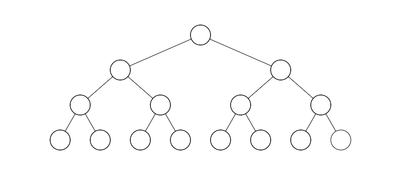

Question List in June, 2022
===========================

🍉 ねえ，今から晴れるよ.

.. raw:: html

   <html xmlns="http://www.w3.org/1999/xhtml"><head></head><body>
求则得之，舍则失之，是求有益于得也，求在我者也；求之有道，得之有命，是求无益于得也，求在外者也。

       ——《孟子·尽心上》
   
</body></html>

夏日，过去与现在同步，故事将未来搓成烟花；若来一点希望，夜空便将成为衪的主场。

.. _1项目相关:

1、项目相关
-----------

.. _11-计算几何:

1.1 计算几何
~~~~~~~~~~~~

二维计算几何包括很多点线面之间的几何关系确认，这里进行一个简单的梳理，依据点的位置关系、线的位置关系以及凸包的组织顺序梳理计算机几何的相关知识点。

点的位置关系
^^^^^^^^^^^^

点与点之间的位置关系。

== ================ ====================================================
ID 描述             用于解决该问题的基本算法或思路
== ================ ====================================================
1  确定两点之间距离 可以利用欧氏距离进行计算，即 :math:`\|P_2-P_1\|`\ ；
== ================ ====================================================

点与线之间的位置关系。

+----+--------------------+------------------------------------------+
| ID | 描述               | 用于解决该问题的基本算法或思路           |
+====+====================+==========================================+
| 2  | 点是否在线段上     | st.1 判断点是否在线段对角矩形内；        |
|    |                    | st.2 用                                  |
|    |                    | :math:`\overrightarrow                   |
|    |                    | {QP_1}\times\overrightarrow{P_1P_2}=0`   |
|    |                    | 判断该点是否落在直线上。                 |
+----+--------------------+------------------------------------------+
| 3  | 点到线段的最短距离 | st.1 判断                                |
|    |                    | :math:`\overrightarrow                   |
|    |                    | {P_1Q}\cdot\overrightarrow{P_1P_2}`      |
|    |                    | 与                                       |
|    |                    | :math:`\overrightarrow                   |
|    |                    | {P_2Q}\cdot\overrightarrow{P_1P_2}`      |
|    |                    | 均大于 0，垂距是否在线段上；             |
|    |                    | st.2 在直线上则用叉乘计算垂距            |
|    |                    | :math:`\|\overrightarrow                 |
|    |                    | {P_1Q}\times\overrightarrow{P_           |
|    |                    | 1P_2}\|/\|\overrightarrow{P_1P_2}\|`\ ； |
|    |                    | st.3                                     |
|    |                    | 不在直线上则取与两个端点间的最小距离；   |
+----+--------------------+------------------------------------------+

点与面之间的位置关系。

+----+--------------------+------------------------------------------+
| ID | 描述               | 用于解决该问题的基本算法或思路           |
+====+====================+==========================================+
| 4  | 点是否在三角形内   | 过点向右引                               |
|    |                    | 一条射线，判断射线与三角形的交点个数，1  |
|    |                    | 内 2 外；                                |
+----+--------------------+------------------------------------------+
| 5  | 点是否在凸多边形内 | 同上，1 内 2 外；忽略水平边，P           |
|    |                    | 在多边形上时，顶点相交只保留一个；       |
+----+--------------------+------------------------------------------+
| 6  | 点是否在凹多边形内 | 同上，奇内偶外；                         |
+----+--------------------+------------------------------------------+

线的位置关系
^^^^^^^^^^^^

线段之间的关系。

+----+--------------+------------------------------------------------+
| ID | 描述         | 用于解决该问题的基本算法或思路                 |
+====+==============+================================================+
| 7  | 两线段交点   | st.1 两线段对角矩形作快速排斥实验；            |
|    |              | st.2                                           |
|    |              | 跨立实验判                                     |
|    |              | 断一条线段端点是否在另一条线段两侧，叉乘异号； |
|    |              | st.3                                           |
|    |              | 利用叉乘计算面积比进而计算交点比得出交点；     |
+----+--------------+------------------------------------------------+
| 8  | 多端线段拐向 | 可                                             |
|    |              | 以利用前一线段与后一线段的叉乘确认左拐或右拐； |
+----+--------------+------------------------------------------------+

线段与面之间的关系。

+----+----------------------+-------------------------------+
| ID | 描述                 | 用                            |
|    |                      | 于解决该问题的基本算法或思路  |
+====+======================+===============================+
| 9  | 线段是否与圆相交     | st.1                          |
|    |                      | 计算线段与圆心的最短距离；    |
|    |                      | st.2                          |
|    |                      | 判断                          |
|    |                      | 最短距离与圆半径之间的关系；  |
+----+----------------------+-------------------------------+
| 10 | 线段是否在凸多边形内 | 判断是                        |
|    |                      | 否所有端点都在多边形内即可；  |
+----+----------------------+-------------------------------+
| 11 | 线段是否在凹多边形内 | st.1                          |
|    |                      | 判                            |
|    |                      | 断是否所有端点都在多边形内；  |
|    |                      | st.2                          |
|    |                      | 判断                          |
|    |                      | 线段是否与多边形所有边都不内  |
|    |                      | 交，即不交于多边形线段端点；  |
+----+----------------------+-------------------------------+
| 12 | 折线是否在多边形内   | 判断折                        |
|    |                      | 线的每条线段是否在多边形内；  |
+----+----------------------+-------------------------------+

面的位置关系
^^^^^^^^^^^^

二维面之间的位置关系。

+----+----------------------+-------------------------------+
| ID | 描述                 | 用                            |
|    |                      | 于解决该问题的基本算法或思路  |
+====+======================+===============================+
| 13 | 多边形是否在多边形内 | 判断多边                      |
|    |                      | 形的每条边是否都在多边形内；  |
+----+----------------------+-------------------------------+
| 14 | 圆是否在多边形内     | 计算圆心到多边形每条边的      |
|    |                      | 最短距离是否都小于半径即可；  |
+----+----------------------+-------------------------------+
| 15 | 圆是否在圆内         | 判断两圆                      |
|    |                      | 心距离差是否小于半径差即可；  |
+----+----------------------+-------------------------------+
| 16 | 平行矩形相交面积     | xmin = max(P1.xmin, P2.xmin); |
|    |                      | xmax = min(P1.max, P2.xmax);  |
|    |                      | width = xmax - xmin;          |
+----+----------------------+-------------------------------+

.. _12-几何造型:

1.2 几何造型
~~~~~~~~~~~~

几何造型有三大模块，线框模型、表面模型和实体模型。这里一个典型的问题是：

   给定一条平滑的样条曲线，以该样条曲线为中心生成一个3D 样条曲管。

该问题的简化问题是，给定一条多段线，生成一个 3D
样条管道。再精简些，就可以退化为二维问题的求解，也即给定一条多段线，生成指定宽度的线条。参考文献
9 中 blackpawn 的文章提供了一个通用思路，即针对环形曲面torus
进行分段绘制。

定宽多段线
^^^^^^^^^^

针对等宽多段线，可将其划分为如下线段。首先确定线段端点的垂直线段，然后确定线段边界轮廓；随后的处理将围绕着求线段垂线、求两线段角分线、线段相交处的平滑或直角处理等相关问题展开。

.. figure:: /pic/202206/w-line.png
   :alt: 

-  相关注意事项

   | **a.**
     某向量的垂向量：\ :math:`\mathbf{v}_{ \perp}=R\cdot{\mathbf{v}}`\ ，带入
     :math:`\theta=90°` 简化为 :math:`\mathbf{v}_\perp=(-y,x)` 和 为
     :math:`\mathbf{v}_\perp=(y,-x)` ；
   | **b.** 两向量角分线：取向量 :math:`\mathbf{v}_1` 的单位向量
     :math:`\mathbf{e}_1` 和向量 :math:`\mathbf{v}_2` 的单位向量
     :math:`\mathbf{e}_2` 可得出角分向量
     :math:`\mathbf{e}_1+\mathbf{e}_2`\ ；
   | **c.**
     线段相交处处理：平曲线，即生成圆曲线或缓和曲线，圆心、半径、交点、直圆点、圆直点均可算出；

.. _3d-圆管:

3D 圆管
^^^^^^^

有了定宽多段线的生成在前，由多段线生成圆管的方案也很相似：无非是确定边界轮廓时，需要在线段端点处确定垂直于直线方向的圆截面；在线段相交处确定交点角分线圆截面；随后考虑圆管衔接处的处理。

-  相关注意事项

   | **a.** 线段端点处的圆截面可以由线段方向
     :math:`\mathbf{v}`\ ，线段向某一轴平面投影后的垂向
     :math:`\mathbf{v}_\perp`\ ，以及二者的叉乘确定；
   | **b.** 角分圆截面可由角分线向量
     :math:`\mathbf{v}_h`\ ，两直线叉乘法向 :math:`\mathbf{v}_n`
     及二者叉乘确定；
   | **c**. 圆管衔接处可由三维球或其他三维曲面进行衔接。

进一步扩展到空间曲线时，就需要借助 Frenet
标架的基本知识来确定曲线的连续垂平面，进而得到我们所需要的一系列二维中间数据。Frenet–Serret
公式用于描述粒子在三维欧氏空间内沿一条连续可微曲线的运动学特征。

空间曲线的描述参数主要有三个，曲率、挠率和弗雷内标架。其中 Frenet
标架的三个参数：单位切向量、主法向量和次法向量。单位切向量可由以弧长作为参数的曲线参数方程
:math:`\mathbf{r}(s)` 的微分得到，即：

.. math:: \mathbf{T} =\frac{d\mathbf{r}}{ds}

主法向量可由曲线的曲率计算，曲线的曲率可以表示为 :math:`\kappa`\ ，即
:math:`\kappa=|d\mathbf{T}/ds|`\ ，则有主法向量：

.. math:: \mathbf{N}=\frac{1}{\kappa}\cdot\frac{d\mathbf{T}}{ds}

由二者叉乘即可得到空间曲线的次法向量，即：

.. math:: \mathbf{B}=\mathbf{T}\times\mathbf{N}

所以综合考虑下来，挤出三位曲面管的通用方法是处理得到弗雷内标架和世界坐标系之间的坐标转换关系，然后将弗雷内标架内的平面圆转换到世界坐标系中，进而构建微分圆柱或微分圆锥面。

.. _13-着色器:

1.3 着色器
~~~~~~~~~~

OpenGL 的 GLSL 着色器语言用到了 OpenGL Mathmatics 即 GLM
矩阵库，作为一个 Header Only 的矩阵库，其在最大程度上还原了 GLSL
的丝滑手感，尤其是对 swizzle 操作符的还原。

   swizzle 操作符：可以将向量成员取出形成一个新的向量。

关于 GLSL 着色器语言
^^^^^^^^^^^^^^^^^^^^

GL Shader Language 简称 GLSL，是用来在 OpenGL
中着色编程的语言，是开发人员编写的在图形卡的 GPU
图形处理单元上执行的短小自定义程序，代替了固定的渲染管线的一部分以使渲染管线具有可编程性。知乎拓幻科技的
GLSL 详解一文介绍了着色器的调试方法，即：

   | **文件创建**\ ：创建后缀为 .glsl 的文件编写着色器代码；
   | **预览调试**\ ：通过 ShaderToy 进行实时预览调试。

**变量修饰符**

+---------------+-----------------------------------------------------+
| 修饰符        | 描述                                                |
+===============+=====================================================+
| ``const``     | 常量值必须在声明时初始化。它是只读的不可修改的。    |
+---------------+-----------------------------------------------------+
| ``attribute`` | 表示只读的顶点数据，                                |
|               | 只用在顶点着色器中。数据来自当前的顶点状态或者顶点  |
|               | 数组。它必须是全局范围声明的，不能在函数内部。一个  |
|               | ``attribute``                                       |
|               | 可以是浮点数类                                      |
|               | 型的标量，向量，或者矩阵。不可以是数组或者结构体。  |
+---------------+-----------------------------------------------------+
| ``uniform``   | 一致变量。在着色器执行期间一致变量的值是不变的。与  |
|               | ``const``                                           |
|               | 常量不同的是，这个值在编译时期是未知                |
|               | 的是由着色器外部初始化的。一致变量在顶点着色器和片  |
|               | 段着色器之间是共享的。它也只能在全局范围进行声明。  |
+---------------+-----------------------------------------------------+
| ``varying``   | 顶点着色器的输出。例如颜                            |
|               | 色或者纹理坐标，（插值后的数据）作为片段着色器的只  |
|               | 读输入数据。必须是全局范围声明的全局变量。可以是浮  |
|               | 点数类型的标量，向量，矩阵。不能是数组或者结构体。  |
+---------------+-----------------------------------------------------+
| ``invariant`` | 不变量，用于表示顶点着色器的输出                    |
|               | 和任何匹配片段着色器的输入，在不同的着色器中计算产  |
|               | 生的值必须是一致的。所有的数据流和控制流，写入一个  |
|               | ``invariant``                                       |
|               | 变量的是一致的。编译器为了保证结果是完全            |
|               | 一致的，需要放弃那些可能会导致不一致值的潜在的优化  |
|               | 。除非必要，不要使用这个修饰符。在多通道渲染中避免  |
|               | z-fighting 可能会使用到。                           |
+---------------+-----------------------------------------------------+
| ``in``        | 用                                                  |
|               | 在函数的参数中，表示这个参数是输入的，在函数中改变  |
|               | 这个值，并不会影响对调用的函数产生副作用。（相当于  |
|               | C 语言的传值），这个是函数参数默认的修饰符          |
+---------------+-----------------------------------------------------+
| ``out``       | 用在                                                |
|               | 函数的参数中，表示该参数是输出参数，值是会改变的。  |
+---------------+-----------------------------------------------------+
| ``inout``     | 用在                                                |
|               | 函数的参数，表示这个参数即是输入参数也是输出参数。  |
+---------------+-----------------------------------------------------+

**顶点着色器内置变量**

+-----------------------------+-------+-----------------------------+
| 名称                        | 类型  | 描述                        |
+=============================+=======+=============================+
| ``gl_Color``                | vec4  | 输入属性-表示顶点的主颜色   |
+-----------------------------+-------+-----------------------------+
| ``gl_SecondaryColor``       | vec4  | 输入属性-表示顶点的辅助颜色 |
+-----------------------------+-------+-----------------------------+
| ``gl_Normal``               | vec3  | 输入属性-表示顶点的法线值   |
+-----------------------------+-------+-----------------------------+
| ``gl_Vertex``               | vec4  | 输入                        |
|                             |       | 属性-表示物体空间的顶点位置 |
+-----------------------------+-------+-----------------------------+
| ``gl_MultiTexCoord``        | vec4  | 输入属性                    |
| :math:`n`                   |       | -表示顶点的第n个纹理的坐标  |
+-----------------------------+-------+-----------------------------+
| ``gl_FogCoord``             | float | 输入属性-表示顶点的雾坐标   |
+-----------------------------+-------+-----------------------------+
| ``gl_Position``             | vec4  | 输出属性                    |
|                             |       | -变换后的顶点的位置。所有的 |
|                             |       | 顶点着色器都必须写这个值。  |
+-----------------------------+-------+-----------------------------+
| ``gl_ClipVertex``           | vec4  | 输出坐                      |
|                             |       | 标，用于用户裁剪平面的裁剪  |
+-----------------------------+-------+-----------------------------+
| ``gl_PointSize``            | float | 点的大小                    |
+-----------------------------+-------+-----------------------------+
| ``gl_FrontColor``           | vec4  | 正面的主颜色的varying输出   |
+-----------------------------+-------+-----------------------------+
| ``gl_BackColor``            | vec4  | 背面主颜色的varying输出     |
+-----------------------------+-------+-----------------------------+
| ``gl_FrontSecondaryColor``  | vec4  | 正面的辅助颜色的varying输出 |
+-----------------------------+-------+-----------------------------+
| ``gl_BackSecondaryColor``   | vec4  | 背面的辅助颜色的varying输出 |
+-----------------------------+-------+-----------------------------+
| ``gl_TexCoord[]``           | vec4  | 纹理坐标的数组varying输出   |
+-----------------------------+-------+-----------------------------+
| ``gl_FogFragCoord``         | float | 雾坐标的varying输出         |
+-----------------------------+-------+-----------------------------+

**片元着色器内置变量**

+-----------------------+-------+-----------------------------+
| 名称                  | 类型  | 描述                        |
+=======================+=======+=============================+
| ``gl_Color``          | vec4  | 包含主颜色的插值只读输入    |
+-----------------------+-------+-----------------------------+
| ``gl_SecondaryColor`` | vec4  | 包含辅助颜色的插值只读输入  |
+-----------------------+-------+-----------------------------+
| ``gl_TexCoord[]``     | vec4  | 包含                        |
|                       |       | 纹理坐标数组的插值只读输入  |
+-----------------------+-------+-----------------------------+
| ``gl_FogFragCoord``   | float | 包含雾坐标的插值只读输入    |
+-----------------------+-------+-----------------------------+
| ``gl_FragCoord``      | vec4  | 只读输入，窗口的            |
|                       |       | :math:`x,y,z` 和            |
|                       |       | :math:`1/w`                 |
+-----------------------+-------+-----------------------------+
| ``gl_FrontFacing``    | bool  | 只读输入，如果是窗口正      |
|                       |       | 面图元的一部分，则这个值为  |
|                       |       | true                        |
+-----------------------+-------+-----------------------------+
| ``gl_PointCoord``     | vec2  | 点精灵的二维空间坐标范围在  |
|                       |       | :math:`(0.0, 0.0)` 到       |
|                       |       | :math:`(1.0, 1.0)` 之间。   |
+-----------------------+-------+-----------------------------+
| ``gl_FragData[]``     | vec4  | 使用 ``glDrawBuffers``      |
|                       |       | 输出的数据数组。不与        |
|                       |       | ``gl_FragColor`` 结合使用。 |
+-----------------------+-------+-----------------------------+
| ``gl_FragColor``      | vec4  | 输                          |
|                       |       | 出的颜色用于随后的像素操作  |
+-----------------------+-------+-----------------------------+
| ``gl_FragDepth``      | float | 输                          |
|                       |       | 出的深度用于随后的像素操作  |
|                       |       | ，如果这个值没有被写，则使  |
|                       |       | 用固定功能管线的深度值代替  |
+-----------------------+-------+-----------------------------+

..

   通常，点精灵 *Point Sprite*
   技术被用于描述大量粒子在屏幕上的运动，自然也可以用于绘制雪花。点精灵可以理解为贴了纹理图片的点——仅用一个
   vertex 就可以把一个 2D 纹理图片绘制到屏幕的任何位置。

如何在着色器中识别物体
^^^^^^^^^^^^^^^^^^^^^^

首先了解一下片段着色器半透明的实现原理。片段着色器用来决定屏幕上像素的最终颜色，为每个片元计算颜色，包括光照计算以及阴影处理等高级效果。如何计算由开发者配置，比如通过三角形重心坐标插值计算颜色值，计算阴影，或者直接用纹理覆盖。

-  片元与片段着色器

   片元经过深度测试、透明度测试等一系列的测试才有可能被选上而转变为像素，故称之为预备像素。若一个片元被选定作为一个像素，则经过一系列的变换后则会将该片元转变为包含
   RGBA
   值的屏幕像素。片段着色器仅处理单个片元，也就是即便时相邻也不能互相影响，这与GPU的多线程、少控制结构的架构高度吻合。故而其运行速度特别快。

通过文献查找，指定某一物体不被遮挡，可以拿深度测试、透明度测试以及颜色混合说事儿，目前一个不成熟的想法是关闭路网的深度测试获取一张纹理图片获取该模型的实际颜色，然后进行二次渲染时开启深度测试并在着色器中将该模型的实际颜色与纹理图片所获得的模型颜色进行一个混合以实现半透明的效果。通过各种博客的了，这里记录几个可以进行着色器编程实验的引擎或开源库：

   GLSLCanvas、ShaderToy、Processing、Unity、openFrameworks

Cesium3DTileStyle 实现原理
^^^^^^^^^^^^^^^^^^^^^^^^^^

关于 Cesium3DTileSyle 的 UML
类图如下图所示。可以看到，该类的核心渲染机制位于 Viewer 中，所以需要深入
Viewer 的源码，查看在 ConditonsExpression
中定制的着色器条件语法是如何被绑定到场景 Scene 以及场景内的几何基元
Primitives 中的。

.. figure:: pic/202206/Cesium3DTileStyle.png
   :align: center

概略而言，Cesium 创建一个场景的代码：

.. code:: javascript

   let viewer = new Cesium.Viewer('cesium-container');

主要经历了初始化 ``Viewer`` 对象、初始化 ``CesiumWidget`` 对象，触发
``requestAnimationFrame`` 函数，周而复始的触发 ``scene.render()`` 和
``clock.tick()`` 函数这样几个过程。其流程图如下所示：

如此，可以确定核心渲染内容在 ``scene.render()`` 函数里面。

根据代码进行溯源，可以得知上面代码中的几个关键性的函数是在
PrimitiveCollection 以及 Primitive 的衍生类中进行实质上的调用的；比如
``updetePreloadPass()`` 函数在 Cesium3DTile
类中进行了调用，深入到该函数中可以进一步发现其调用了 ``update()``
函数，找到响应位置后又定位到了 ``updateTiles()``
函数，其中对于指定着色器样式的这一功能有如下实现代码：

.. code:: javascript

   tileset._styleEngine.applyStyle(tileset, passOptions);

找到
Cesium3DTileStyleEngine.prototype.applyStyle，查看其具体的函数调用堆栈及实现后发现，Cesium
本质上并没有在着色器中添加对物体属性的判断，而只是将模型拆分成可控的
BatchTable 单元，进而通过对每一单元所对应的具体的抽象 Feature
类来统一控制颜色。

.. _参考文献-1:

参考文献
~~~~~~~~

1.  知乎. `GL Shader Language (GLSL)
    详解-基础语法 <https://zhuanlan.zhihu.com/p/349296191>`__\ [EB/OL].

2.  知乎. `GL Shader Language (GLSL)
    详解-高级进阶 <https://zhuanlan.zhihu.com/p/352910464>`__\ [EB/OL].

3.  知乎.
    `30分钟学会UML类图 <https://zhuanlan.zhihu.com/p/109655171>`__\ [EB/OL].

4.  知乎.
    `C++黑魔法：GLM中Swizzle语法的实现 <https://zhuanlan.zhihu.com/p/340119757>`__\ [EB/OL].

5.  CSDN 博客.
    `cesium源代码解析一三维场景是如何渲染的 <https://blog.csdn.net/qq_27532167/article/details/120528901>`__\ [EB/OL].

6.  Patricio. `The Book of
    Shader <https://thebookofshaders.com/?lan=ch>`__\ [EB/OL].

7.  知乎. `Unity
    Shader——被遮挡的部分半透高亮显示 <https://zhuanlan.zhihu.com/p/74547895>`__\ [EB/OL].

8.  CSDN 博客. `unity
    角色被指定物体遮挡的Shader <https://blog.csdn.net/chaolingzhuo/article/details/119720326>`__\ [EB/OL].

9.  blackpawn. `Fun with the PQ-Torus
    Knot <https://blackpawn.com/texts/pqtorus/default.html>`__\ [EB/OL].

10. CSDN 博客. `自动驾驶轨迹规划之 Frenet
    坐标系 <https://blog.csdn.net/weixin_65089713/article/details/124245049>`__\ [EB/OL].

11. 百度文库. `空间曲线曲率挠率和 Frenet
    公式 <https://wenku.baidu.com/view/571967c30a75f46527d3240c844769eae009a3ed.html>`__\ [EB/OL].

12. 知乎. `Frenet
    标架 <https://zhuanlan.zhihu.com/p/144787656>`__\ [EB/OL].

.. _2三维相关:

2、三维相关
-----------

开源 3D 游戏引擎主要有：Orge 鬼怪 ，Irrlicht 鬼火 ，Nebula 星云，KlayGE
等等；目前，开源 3D
游戏引擎已经趋近于商业化引擎标准，许多引擎在图形渲染，内存分配，网络通讯方面甚超越了许多商业引擎。

这些开源引擎在图形处理方面多采取三个经典模块：\ **场景管理器**\ ，\ **资源管理器**\ ，\ **渲染器**\ 。这种划分模式以
Orge 鬼怪引擎和 Irrlicht
鬼火引擎最为典型。先进的引擎还配有一套专门从事对于图形编程的脚本语言，比如
Orge
内置一套脚本，可以控制场景管理器、资源管理器的图形参数及图形算法的编辑，这样可以跳过
C++
繁冗的程序编写过程和漫长的项目编译时间而直接运行察看修改后程序的效果。当然，这种脚本语言模式有些效仿目前最著名的商业游戏引擎
Unreal 虚幻引擎。关于场景的图形算法大多数采用 8 叉树与
BSP（二叉空间分割）的方法，支持大游戏场景的局部渲染功能。

.. _21-光照模型:

2.1 光照模型
~~~~~~~~~~~~

当光照射到物体表面时，物体对光会发生反射、透射、吸收、衍射、折射和干涉现象，其中被物体吸收的部分转化为热，反射、透射的光进入人的视觉系统，使我们能看见物体。\ **为模拟这一现象，我们建立一些数学模型来替代复杂的物理模型，这些模型就称为明暗效应模型或者光照明模型**\ 。其发展历程如下：

   | 1967 年，Wylie,
     etc.，物体表面上一点的光强与该点到光源的距离成反比；
   | 1970 年，Boukninght，提出 Lambert
     漫反射模型，表面朝向是确定物体表面光强的主要因素；
   | 1971
     年，Gourand，漫反射模型与插值，计算顶点光亮然后插值计算其他部分；
   | 1975 年，Phong，冯氏光照模型；
   | 1980 年，Whitted，光透射模型，第一次给出光线跟踪算法的范例；
   | 1982 年，Cook and
     Torrance，基于物理光学的表面反射模型，克服冯氏光照的缺点；
   | 1983 年，Hall and Greenbert，改进 Whitted
     算法，考虑漫反射和规则透射、加入距离衰减因子；
   | 1986
     年，Kajiya，统一以前所有光照模型，提出蒙特卡洛法求解绘制方程的光线追踪算法；

在知乎 papalqi
看来，光照模型可以分为以冯氏光照为代表的\ **局部光照模型**\ ，和以光线追踪为代表的\ **全局光照模型**\ 两大类别。这里，仅处理光源直接照射物体表面的光照明模型被称为局部光照明模型；而全局光照模型是基于光学物理原理的，光照强度的计算依赖于光能在现实世界中的传播情况，考虑光线与整个场景中各物体表面及物体表面间的相互影响，包括多次反射
、透射 、散射等。

冯氏光照模型
^^^^^^^^^^^^

光照模型主要由 3 个分量组成：Ambient 环境光、Diffuse 漫反射、Specular
镜面反射。其中，环境光通常是一个常量；漫反射光用于模拟光源对物理的方向性影响，即物体正对光源方向的部分更亮；镜面反射用于模拟有光泽物体的亮点，其颜色更倾向于光的颜色。定义如下基本参量：

-  Materials 材质因子：

   | Ambient：\ :math:`M_a=(R_a,G_a,B_a)`\ ，
     描述物体对环境光照的反射能力；
   | Diffuse：\ :math:`M_d=(R_d,G_d,B_d)`\ ，
     描述物体对漫反射光照的反射能力；
   | Specular：\ :math:`M_s=(R_s,G_s,B_s)`\ ，
     描述物体对镜面反射的反射能力；
   | Shininess：\ :math:`s`\ ，描述物体的反光度，反光度越高，高光点越小越亮；

-  Lightning 光照因子：

   | Ambient：\ :math:`L_a=(R_a,G_a,B_a)`\ ， 描述光照的环境光照分量；
   | Diffuse：\ :math:`L_d=(R_d,G_d,B_d)`\ ， 描述光照的漫反射光照分量；
   | Specular：\ :math:`L_s=(R_s,G_s,B_s)`\ ，
     描述光照的镜面反射光照分量；

同时，令光照点为 :math:`P_{light}`\ ，照射点为
:math:`P_{frag}`\ ，观察点为 :math:`P_{view}`\ ；同时，令照射点法向量为
:math:`\mathbf{n}`\ ，观察照射点的反向视线向量为
:math:`\mathbf{v}`\ ，光照入射方向的反向向量为
:math:`\mathbf{l}`\ ，反射方向向量为 :math:`\mathbf{r}`
；则可以定义如下冯氏光照计算公式：

**a**. 环境光计算公式

.. math:: \mathrm{ambient}=M_a\cdot L_a

**b**. 漫反射计算公式

.. math:: \mathrm{diffuse}=\max\left(\mathbf{l\cdot n},0\right)\cdot M_d\cdot L_d

**c**. 镜面反射计算公式

.. math:: \mathrm{specular}=\max(\mathbf{r}\cdot\mathbf{v},0)^s\cdot M_s\cdot L_s

需要注意的是，在计算反射向量时用到的 reflect 函数计算量很大，所以
Belinn-Phone
光照模型转而使用半角向量来替代计算，即照射点指向光源的向量与照射点指向视角的向量的角平分向量与法向量的夹角计算漫反射系数。以此提高了
Phong
算法的计算速度。根据上面所述的三个计算公式，可以得出冯氏光照的最终生成颜色为：

.. math:: \mathrm{result=ambient+diffuse+specular}

在此基本公式的基础上，根据平行光源、点光源、聚光、多光源等四种情况需要对公式进行相应的拓展和演算从而实现对应的需求。点光源需要施加光线衰减因子，聚光需要根据聚光半径及其圆锥计算光源的平滑值，而多光源的效果可以视作这几个光源的叠加。

微表面光照模型
^^^^^^^^^^^^^^

冯氏光照模型 Phong 和 Blinn-Phong
光照模型都是理想情况下的简单光照模拟，没有考虑不同材质的特性，效果会显得艺术化、不真实。为了进一步提高光照的真实性，出现了
PBR 和 微表面理论。

-  PBR 基于物理的渲染

   PBR
   基于物理的渲染理论加入了\ *能量守恒、菲涅耳反射定律、光的吸收现象*\ 等物理规律的考虑，更好的表现物体表面的细节和粗糙度，各向异性，区分金属和非金属材质，半透明材质等各种复杂的材质特性。

-  微表面理论

   微表面理论则认为物体表面由于粗糙程度不同，会不同程度上分布有朝向不一的微小平面。传统基础光照模型是在理想情况下，认为物体表面是光滑的。而微表面理论下，实际上任何物体表面都不会是完全光滑的。

**BDRF**\ 。双向反射分布函数，描述的是对于特定粗糙表面，从方向
:math:`\mathbf{w}_i`\ 入射的光在 :math:`\mathbf{w}_o`
方向上的反射光比例；BDRF
实际上描述了不同的方向上反射光占总反射光的比例，因此是一个不大于 1.0
的比例系数。理想情况下的冯氏光照模型中的漫反射和镜面反射的 BRDF
是一种理想情况，BRDF 在反射方向为 R 时等于 1.0，其他方向均为 0。

**渲染方程**\ 。渲染方程是由 Kajia
在1986年提出的通用情况下描述光照的数学模型，在不考虑物体自发光条件时，其具有如下数学形式：

.. math:: L_o(x,\mathbf{w}_o)=\int_\Omega f_r(x,\mathbf{w}_i,\mathbf{w}_o)L_i(x,\mathbf{w}_i)(\mathbf{n}\cdot \mathbf{w}_i)dw_i

式中，\ :math:`x` 表示入射点；\ :math:`L_o(x,\mathbf{w}_o)`
表示光线从物体表面沿方向 :math:`\mathbf{w}_o`
反射的光强；\ :math:`f_r(x,\mathbf{w}_i,\mathbf{w}_o)`
表示入射光沿入射方向 :math:`\mathbf{w}_i` 照射到点 :math:`x` ，然后在
:math:`\mathbf{w}_o` 方向上进行反时的 BDRF
因子；\ :math:`L_i(x,\mathbf{w}_i)` 是沿 :math:`\mathbf{w}_i`
方向入射到点 :math:`x` 的光线的光照强度；\ :math:`\mathbf{n}` 表示点
:math:`x` 处的法线。最后在不同的反射方向 :math:`\mathbf{w}_i`
上进行积分就是所有反射光强的总和 :math:`L_o`\ 。

Cook-Torrence 模型
^^^^^^^^^^^^^^^^^^

在计算镜面反射过程中，冯氏光照采用的系数形式是
:math:`(\mathbf{r\cdot v})^s`\ ，Blinn-Phong 采用的系数形式是
:math:`(\mathbf{n\cdot h})^s`\ ，这里的 :math:`\mathbf{h}`
为视线与光照方向的半角向量；Cook-Torrence 模型基于渲染方程做了如下改进：

.. math:: f_{\mathrm{specular}}=\frac{F\cdot D\cdot G}{(\mathbf{n\cdot v})\cdot(\mathbf{n\cdot l})}

:math:`F` 是菲涅耳反射系数，表示反射光强占入射光强的比例；令入射角度为
:math:`f_0`\ ，则其近似公式为：

.. math:: F=f_0+(1-f_0)(1-\mathbf{v\cdot h})^5

:math:`D` 是微表面分布函数，一般计算在半角向量 :math:`\mathbf{h}`
上的微平面分布分数值；常用的微平面分布函数是 Backmann 分布函数，令
:math:`\alpha` 为顶点法向量 :math:`\mathbf{n}` 和半角向量
:math:`\mathbf{h}` 的夹角，\ :math:`m` 为物体表面粗糙度，则有：

.. math:: D=\frac{1}{m^2\cdot(\mathbf{n\cdot h})^4}\exp\frac{\mathbf{(n\cdot h)^2}-1}{m^2\cdot\mathbf{(n\cdot h)^2}}

:math:`G`
是几何衰减系数，用来衡量由于表面凹凸不平导致相邻微平面互相遮挡对光强的影响；其中当未被遮挡时光强为
1，另外两种情况分别是入射光部分被遮挡和反射光部分被遮挡，G
项定义为这三种情况中光强最小的那个。由此可得到其计算公式为：

.. math:: G=\min\left(1,\frac{2\mathbf{(n\cdot h)(n\cdot l)}}{\mathbf{v\cdot h}},\frac{2\mathbf{(n\cdot h)(n\cdot v)}}{\mathbf{v\cdot h}}\right)

游戏引擎的光照
^^^^^^^^^^^^^^

在目前市面上常见的游戏引擎中，主要采用以下三种灯光实现方式：

-  三种灯光实现方式

   | 顶点照明渲染路径细节 *Vertex Lit Rendering Path Details*
   | 正向渲染路径细节 *Forward Rendering Path Details*
   | 延迟光照渲染路径细节 *Deferred Lighting Rendering Path Details*

**顶点照明渲染路径细节**\ 。顶点照明渲染路径通常在一个通道中渲染物体，所有光源的照明都是在物体的顶点上进行计算的；其拥有最快的渲染路径以及最广泛的硬件支持；但由于所有的光照都是在顶点层级上计算，此渲染路径不支持大部分的逐像素渲染效果如：阴影、法线贴图、灯光遮罩、高精度的高光等等。

**正向渲染路径细节**\ 。在正向渲染中，影响物体的最亮的几个光源使用逐像素光照模式。接下来，最多有
4 个点光源会以逐顶点渲染的方式被计算。其他光源将以球面调和（Spherical
Harmonics）的方式进行计算，球面调和技术计算很快但只能得到近似值。

**延迟光照渲染路径细节**\ 。延迟光照是一种当前最高级的能实现光线和阴影保真的渲染路径。其在
Unity
中的渲染过程包括基本渲染、光照渲染和组后渲染三个方面。基本渲染：被渲染的对象产生带有深度，法线，和反射量的屏幕空间缓冲；光照渲染：使用上一步的缓冲计算出光照。结果放入另一个屏幕空间缓存；最后渲染：物体再次渲染。取来已经计算好的光线和颜色纹理混合在一起，然后再加上环境光以及散射光照。

.. _22-阴影算法:

2.2 阴影算法
~~~~~~~~~~~~

基于 Shadow Map 算法绘制图形阴影的算法大多是以 SSM
为基础，通过一些优化算法解决其锯齿问题、条纹问题等影响显示效果的因素。

SSM, standard shadow map
^^^^^^^^^^^^^^^^^^^^^^^^

利用 Shadow Map 制作阴影的算法被称为 SSM，最基本的 Shadow
Map；即从光源处渲染场景深度到 Shadow Map 中，计算 Shadow 时将 pixel
深度值 z 与 light projection space 下的深度值 d 作比较。具体的做法是：

-  SSM

   (1)
   生成深度纹理图：所谓深度纹理图，就是每个位置的最小深度。我们站在光源的位置，按照光线传播的视角，观察场景，计算场景中的物体距离光源的距离，也就是该视角下的深度，并记录各个位置上的最小值，从而获得一张深度纹理。

   (2) 使用深度纹理图：对于世界中的某个点
   P，我们要先得到它在光源视角下的深度，再和深度纹理图中对应的深度进行比较，就可以判定它是否在阴影中了。

SSM 存在三个问题，shadow acne 失真、peter panning 悬浮以及 shadow
aliasing 锯齿。所谓的 shadow acne
是指完全受光的平面上会出现条纹状的自阴影；peter panning
取名自同名童话，主要是指阴影分离，即物体脚底的阴影出现缺失；shadow
aliasing 是指阴影边缘轮廓出现的锯齿现象。

-  Shadow Acne

   阴影失真产生的原因根本原因就是 shadow map
   的分辨率不够，一个像素块儿可能对应着多个顶点，这也就造成了下图所示的阶梯状阴影，在执行二次渲染的深度判断时就会出现自遮挡的条纹阴影。

   .. figure:: pic/202206/bias.png
      :align: center
      :scale: 20

   而解决这一问题的策略之一就是在进行深度判断时为 shadow map
   采样点添加一个恰当的 bias
   偏差，使其落于物体表面下方，但这样一来就会诱发下一个阴影问题：阴影悬浮。

-  Peter Panning

   小飞侠彼得潘弄丢了影子，在添加了 bias
   偏差之后的影子也离家出走了；这个现象是因为 bias
   设置过大致使阴影的计算位置和物体之间不太贴合而产生缝隙，就像影子脱离了物体。解决这一问题的思路主要有：不使用过大的
   bias，避免使用单薄几何体，以及在生成深度纹理时设置仅渲染背面以提高门限（即正面剔除）等。

-  Shadow Aliasing

   由于 shadow map 是深度值的离散化表达，因此 SSM
   不可避免的会在阴影轮廓边缘的判断过程中因为精度问题而产生一些锯齿现象，且这种精度损失无法通过对
   shadow map 进行 linear
   采样来缓解。其解决方法就是后文将介绍的各种反走样策略以及级联阴影贴图。

PCF, Percentage Closer Filtering
^^^^^^^^^^^^^^^^^^^^^^^^^^^^^^^^

百分比渐近滤波软阴影，即一种从阴影贴图中检索多个样本并混合结果的做法。常见的操作策略是采用滤波核的形式令采样点周围像素参与计算并得到一个介于
:math:`[0,1]`
区间的值，用该值去混合阴影与非阴影像素，从而实现一个基于百分比渐进滤波的软阴影策略。

CSM, Cascaded Shadow Maps
^^^^^^^^^^^^^^^^^^^^^^^^^

级联阴影贴图，即根据对象到观察者的距离提供不同分辨率的深度纹理的做法。通过将相机的视锥体分割成若干部分，然后为分割的每一部分生成独立的深度贴图。

上图所示的是 Unity 中 CSM 的一种直观体现，不同的颜色代表不同的 CSM
区域，通过这种级联 SM
的方法在不引入额外数学计算的前提下实现阴影像素的认为去锯齿化。

.. _23-qslim-顶点简化:

2.3 QSlim 顶点简化
~~~~~~~~~~~~~~~~~~

顶点简化算法
^^^^^^^^^^^^

用于 LOD
细节层次模型的三维网格简化算法目前可以大致划分为两类：\ **其一、静态简化**\ ，预设一系列不同简化率的模型；\ **其二、动态简化**\ ，生成连续分布的不同分辨率模型。其中静态简化主要以顶点聚类、重新布点以及几何元素删除等算法为代表；动态简化则多以静态简化算法为基准，在计算简化率时采用渐进网格、二次误差度量等方法来生成连续的顶点简化模型。在静态简化方法中具有代表性的几何元素删除算法包括顶点删除算法
*Vertex Culling* 以及边折叠算法 *Edge Collapse* 等。

-  **顶点聚类算法**

   Vertex Clustering 方法于 1993 年被 Rossignac
   提出，主要的思路是顶点合并。具体是用一个包围盒（一般可以用 AABB
   包围盒即可，\ *Axis Aligned Bounding
   Box*\ ）包住整个模型，随后把包围盒分成很多的小立方体区域，将落在同一个区域的顶点合并为小立方体的中心点，并维护新生顶点其与周围顶点的连接关系。

   .. figure:: /pic/202206/vertex-clustering.png
      :align: center

   顶点聚类的路线是：生成聚类，计算表现因子，生成网格，最后改变模型的拓扑结构。其思路很清晰，速度也很快，但是容易造成三角形退化成线段/顶点，网格的拓扑也不能很好地保持。

-  **顶点删除算法**

   顶点删除每次删除一个顶点和它的相邻面，产生的空洞通过局部三角化填补，操作反复进行，直到网格不能再简化或达到用户的简化要求为止。该类算法特点是：最擅长删除冗余几何信息；生成模型的质量比较好；多数不允许改变拓扑结构，因此大幅度简化能力有限；不同算法的实现难度和处理速度相差很多。

   .. figure:: /pic/202206/vertex-remove.jpg
      :align: center

-  **边折叠算法**

   该算法由 Hoppe 等人在 1993
   年的网格优化算法中首次提出，是实现增量式简化 Increment Decimation
   的一种思路。便折叠算法使用三角边坍缩的方法来进行网格简化，将两个顶点合并成一个顶点；对于要坍缩的边
   uv，删除这条边两侧的面 A 和面 B，用 v 来替换 u，连接 v 和 u
   的其他邻居点并删除 u。其中 v 称为 u 的\ **坍缩目标**\ 。

   .. figure:: /pic/202206/edge-collapse.jpg
      :align: center

   过反复的迭代，最终就会使模型简化到预期的面数。但是为了尽可能小的影响模型的外观呢就需要计算点到点的坍缩代价：首先，边长短的顶点可以考虑优先移除；其次，点周围曲率变化小的顶点应优先被移除；另外，从
   u 折叠到 v 和从 v 折叠到 u 的待解可能不一致，所以要分别计算。

渐进网格法 Progressive Mesh 是 Hugues Hoppe 在 1996
年提出的网格动态化简方法。这个方法以\ **边坍缩** Edget Collapse
与\ **点分裂** Vertex Splitting
为基本操作，记录模型在连续的简化过程中的拓补变动信息，力求做到基于视点的、无损的、可复原的连续简化，由此确保了摄像机靠近模型的过程中不会出现切换
LOD 模型产生的视觉突变的状况，保证模型顺滑切换。

而二次误差度量 QEM
算法是一种\ **连续、局部方法**\ ，可以有效的减少复杂网格的顶点数同时保留原网格的拓扑特征，可以自定义减少后的顶点数。本质是在局部贪心地寻找点对进行收缩。基于一种基本的局部操作：边收缩。在流形三角网格表面上收缩一条边，会使得顶点数减一，三角面数减少一或二。

QEM 算法
^^^^^^^^

QEM
算法本质上是基于一种基本的局部操作，即边折叠进行的。其算法问题的关键是，寻找一组最优的点对
:math:`v_1,v_2` 将其收缩成一个点 :math:`\overline{v}`
。这里涉及两个问题：

|  1.\ **误差度量**\ ：如何定义点对的最优性，如何定义最优点对？
|  2.\ **收缩**\ ：如何计算收缩后点 :math:`\overline{v}` 的坐标？

QEM
将其建模为一个二次问题进行求解。考虑一个简化后网格上的某一个点，直观上，它不能偏差原始局部表面太大。换句话说，我们希望被简化的点与原模型距离较近。于是，我们可以用【\ **简化后的点与原表面相应局部的距离的平方**\ 】作为误差度量。定义
:math:`\mathbb{P}(\mathbf{v}_i)` 为 :math:`\mathbf{v}_i`
顶点的邻接三角面集合，则二次问题描述为：

.. math:: \overline{\mathbf{v}}=\arg\min_\mathbf{v}\sum_{p\in \mathbb{P}(\mathbf{v}_1)\cup \mathbb{P}(\mathbf{v}_2)}\mathrm{distance}(\mathbf{v},p)^2

令平面 :math:`p` 的表达式为 :math:`ax+by+cz+d=0`\ ，其中
:math:`a^2+b^2+c^2=1`\ ，记
:math:`\mathbf{v}=[x\ y\ z\ 1]^T`\ ，\ :math:`\mathbf{p}=[a\ b\ c\ d]^T`
则可得到下面的表达式：

.. math:: \mathrm{distance}(\mathbf{v},p)^2=(\mathbf{v}^T\mathbf{p})^2=\mathbf{v}^T\mathbf{pp}^T\mathbf{v}=\mathbf{v}^TK_p\mathbf{v}

其中，\ :math:`K_p=\mathbf{pp}^T`\ ，则原式可化简为：

.. math:: \overline{\mathbf{v}}=\arg\min_\mathbf{v}\mathbf{v}^T\left(\sum_{p\in \mathbb{P}(\mathbf{v}_1)\cup \mathbb{P}(\mathbf{v}_2)}K_p\right)\mathbf{v}

若两个平面集合没有公共区域，则
:math:`\mathbb{P}(\mathbf{v}_1)+\mathbb{P}(\mathbf{v}_2)=\mathbb{P}(\mathbf{v}_1)\cup\mathbb{P}(\mathbf{v}_1)`\ ；由于一个三角形面至多重复三次，带来三个顶点，所以可以将上式近似为：

.. math:: \overline{\mathbf{v}}=\arg\min_\mathbf{v}\mathbf{v}^T\left(\sum_{p\in \mathbb{P}(\mathbf{v}_1)}K_p+\sum_{p\in  \mathbb{P}(\mathbf{v}_2)}K_p\right)\mathbf{v}

令 :math:`Q_i=\sum_{p\in \mathbb{P}(\mathbf{v}_i)}K_p`
，则有如下二次曲面误差表现形式：

.. math:: \Delta(\mathbf{v})=\mathbf{v}^T\left(Q_1+Q_2\right)\mathbf{v}

所以折叠后收缩成的顶点 :math:`\overline{\mathbf{v}}`
就是使得上式取得最小值的 :math:`\mathbf{v}` 值，即求解二次函数的极值点。

.. _参考文献-2:

参考文献
~~~~~~~~

1.  博客园.
    `四大开源3d游戏引擎探究 <https://www.cnblogs.com/lifalin0802/p/3386518.html>`__\ [EB/OL].

2.  三维网格.
    `Cesium和Three.js结合的5个方案 <https://zhuanlan.zhihu.com/p/441682100>`__\ [EB/OL].

3.  知乎.
    `什么是光照模型 <https://zhuanlan.zhihu.com/p/49474631>`__\ [EB/OL].

4.  知乎.
    `学习OpenGL：冯氏光照模型 <https://zhuanlan.zhihu.com/p/427477685>`__\ [EB/OL].

5.  知乎.\ `Blinn-Phong光照模型从定义到实现,一文就够了(1.5w字) <https://zhuanlan.zhihu.com/p/442023993>`__\ [EB/OL].

6.  CSDN博客.\ `【一步步学Metal图形引擎10】-《BRDF：Cook-Torrance光照模型》 <https://blog.csdn.net/cordova/article/details/105314892>`__\ [EB/OL].

7.  知乎.\ `Blinn-Phong Reflection Model&Texture
    Mapping <https://zhuanlan.zhihu.com/p/452687345>`__\ [EB/OL].

8.  稀土掘金.
    `3D世界中的阴影—ShadowMap原理解析 <https://juejin.cn/post/6940078211967483911>`__\ [EB/OL].

9.  Bilibili. `实时阴影(一) shadow
    map,PCF,PCSS <https://www.bilibili.com/read/cv14905331/>`__\ [EB/OL].

10. 稀土掘金.\ `图形学渲染基础（6）实时阴影（Real-Time
    Shadows） <https://juejin.cn/post/7021462579859947527>`__\ [EB/OL].

11. LearnOpenGL.\ `Shadow
    Mapping <https://learnopengl.com/Advanced-Lighting/Shadows/Shadow-Mapping>`__\ [EB/OL].

12. 灰信网.
    `CSM阴影技术讲解 <https://www.freesion.com/article/98521086341/>`__\ [EB/OL].

13. Bilibili.\ `Variance Soft Shadow Mapping
    (实时软阴影) <https://www.bilibili.com/read/cv15724613>`__\ [EB/OL].

14. CSDN博客.
    `计算机图形学----阴影2---VSSM <https://blog.csdn.net/vipccj/article/details/120211672>`__\ [EB/OL].

15. CSDN博客.\ `《Real-Time Rendering 4th Edition》全文翻译 - 第7章
    阴影（中）7.4 ~ 7.6 <>`__\ [EB/OL].

16. 知乎.
    `阴影的PCF采样优化算法 <https://zhuanlan.zhihu.com/p/369761748>`__\ [EB/OL].

17. 知乎.
    `游戏中的动态阴影 <https://zhuanlan.zhihu.com/p/104687855>`__\ [EB/OL].

18. NVIDIA. `Chapter 10. Parallel-Split Shadow Maps on Programmable
    GPUs <https://developer.nvidia.com/gpugems/gpugems3/part-ii-light-and-shadows/chapter-10-parallel-split-shadow-maps-programmable-gpus>`__\ [EB/OL].

19. Garland, Michael & Heckbert, Paul. (1997). Surface Simplification
    Using Quadric Error Metrics. Proceedings of the ACM SIGGRAPH
    Conference on Computer Graphics. 1997. 10.1145/258734.258849.

20. 知乎. `网格简化方法与LOD(Level of
    Detail) <https://zhuanlan.zhihu.com/p/444798331>`__\ [EB/OL].

21. 知乎. `网格简化 QEM
    方法详解 <https://zhuanlan.zhihu.com/p/411865616>`__\ [EB/OL].

.. _3空间索引调度:

3、空间索引调度
---------------

这里梳理一下常见的各种树，并对树结构的相关知识点进行一个系统的梳理，免得各种抓瞎。首先将二叉树的各种分支拓展掌握了，然后了解
KD 树、四叉树、八叉树、BSP 等空间索引调度树结构。

.. _31-二叉树:

3.1 二叉树
~~~~~~~~~~

这里主要介绍满二叉树、完全二叉树、二叉搜索树、平衡二叉树、红黑树等。首先通过形象图来记录一下这几种二叉树之间的图形关系，随后再谈谈这些树的注意事项。

满二叉树
^^^^^^^^

满二叉树是一个每层的结点数都达到最大值的二叉树，其定义和树型结构如下：

   如果一个二叉树的层数为 :math:`k`\ ，且结点总数是 :math:`2^k -1`
   ，则它就是满二叉树。

完全二叉树
^^^^^^^^^^

完全二叉树由满二叉树转化而来，也就是将满二叉树从最后一个节点开始删除，一个一个从后往前删除，剩下的就是完全二叉树。如下图所示：

二叉搜索树
^^^^^^^^^^

二叉搜索树是一颗左子树都比其根节点小，右子树都比根节点大的树。如下图所示：

二叉搜索树具有如下性质：

   | **a.** 若左子树不空，则左子树上所有节点的值均小于其根节点的值；
   | **b.**
     若右子树不空，则右子树上所有节点的值均大于或等于其根节点的值；
   | **c.** 左、右子树也分别为二叉搜索树。

平衡二叉树
^^^^^^^^^^

平衡二叉树由前苏联的数学家 Adelse-Velskil 和 Landis 在 1962
年提出，根据科学家的英文名也称为 AVL
树。它的提出主要是为了保证树不至于出现二叉查找树的极端一条腿长现象，尽量保证两条腿平衡。因此其定义如下：

   平衡二叉树要么是一棵空树，要么保证左右子树的高度之差不大于
   1，并且子树也必须是一棵平衡二叉树。

.. figure:: pic/202206/bt-avl.png
   :align: center

平衡二叉树不一定是完全二叉树，如上图所示。需要注意的是，平衡二叉树的全称是平衡二叉搜索树，所以其本质上还是个二叉搜索树，搜索效率很高，但是其在添加和删除时需要进行复杂的旋转以保持整个树的平衡。

红黑树
^^^^^^

红黑树起源于 *Rudolf Bayer* 1972 年发明的平衡二叉 B 树（Symmetric Binary
B-trees），并于 1978 年由 *Leo J. Guibas* 和 *Robert Sedgewick*
修改为如今的红黑树。红黑树的本质其实是对概念模型 **2-3-4 树**
的一种实现， 2-3-4 树是一颗阶数为 4 的 B 树，有关这一概念我们在后文的 B
系列树中进行展开，这里先简单了解一下这个概念。

红黑树的性质及定义如下：

   | **a.** 每个节点要么是黑色，要么是红色；
   | **b.** 根节点是黑的；
   | **c.** 每个叶节点（NIL）是黑的；
   | **d.** 每个红色节点的两个子节点一定都是黑的；
   | **e**. 任意一节点到每个叶子节点的路径都包含数量相同的黑节点。

.. figure:: pic/202206/bt-rb.png
   :align: center

从性质和操作上来看，红黑树是平衡二叉树的升级版，具有更高的性能：

| **a.** AVL 的左右子树高度差不能超过
  1，每次进行插入/删除操作时，几乎都需要通过旋转操作保持平衡；
| **b.** 在频繁进行插入/删除的场景中，频繁的旋转操作使得 AVL
  的性能大打折扣；
| **c.**
  红黑树通过牺牲严格的平衡，换取插入/删除时少量的旋转操作，整体性能优于
  AVL；
|  红黑树插入时的不平衡，不超过两次旋转就可以解决；
|  删除时的不平衡，不超过三次旋转就能解决；
| **d.** 红黑树的红黑规则，保证最坏的情况下，也能在 :math:`O(\log_2n)`
  时间内完成查找操作。

.. _参考文献-3:

参考文献
~~~~~~~~

1. 博客园. `空间索引 -
   四叉树 <https://www.cnblogs.com/zhenbianshu/p/7061550.html>`__\ [EB/OL].

2. 知乎.
   `满二叉树、完全二叉树、二叉搜索树、平衡二叉树 <https://zhuanlan.zhihu.com/p/106828968>`__\ [EB/OL].

3. CSDN博客.
   `红黑树详解 <https://blog.csdn.net/u014454538/article/details/120120216>`__\ [EB/OL].

4. 简书.
   `30张图带你彻底理解红黑树 <https://www.jianshu.com/p/e136ec79235c>`__\ [EB/OL].

5. 知乎.
   `图解：什么是红黑树？ <https://zhuanlan.zhihu.com/p/273829162>`__\ [EB/OL].

6. Algorithm Visualizations. `Red/Black
   Tree <https://www.cs.usfca.edu/~galles/visualization/RedBlack.html>`__\ [EB/OL].
