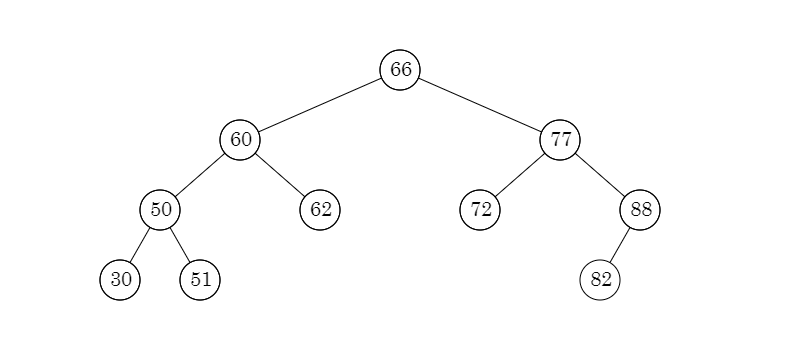
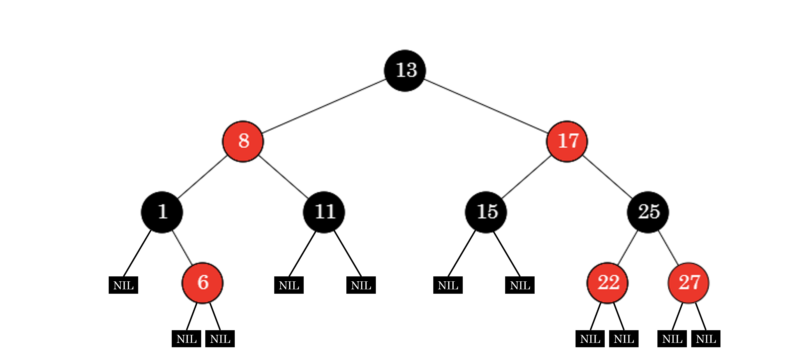
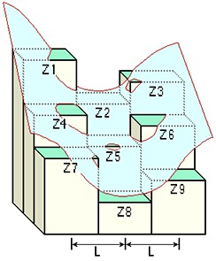

Question List in July, 2022
===========================

🏳️‍🌈 Life is like a rainbow after rain. If you gaze at it, it will be
eternal.

.. raw:: html

   <html xmlns="http://www.w3.org/1999/xhtml"><head></head><body>
某种情况下，命运这东西类似不断改变前进方向的局部沙尘暴。你变换脚步力图避开它，不料沙尘暴就像配合你似的同样变换脚步。你再次变换脚步，沙尘暴也变换脚步——如此无数次周而复始，恰如黎明前同死神一起跳的不吉利的舞。这是因为，沙尘暴不是来自远处什么地方的两不相关的什么。就是说，那家伙是你本身，是你本身中的什么。所以你能做的，不外乎乖乖地径直跨入那片沙尘暴之中，紧紧捂住眼睛耳朵以免沙尘进入，一步一步从中穿过。那里面大概没有太阳，没有月亮，没有方向，有时甚至没有时间，唯有碎骨一样细细白白的沙尘在高空盘旋——就想象那样的沙尘暴。······ 而沙尘暴偃旗息鼓之时，你恐怕还不能完全明白自己是如何从中穿过而得以逃生的，甚至它是否已经远去你大概都无从判断。不过有一点是清楚的：从沙尘暴中逃出的你已不再是跨入沙尘暴时的你。是的，这就是所谓沙尘暴的含义。

       ——村上春树《海边的卡夫卡》
   
</body></html>

.. _1空间索引调度:

1、空间索引调度
---------------

接续上月未完成的树结构记忆。

.. _11-平衡二叉树:

1.1 平衡二叉树
~~~~~~~~~~~~~~

从平衡二叉树开始谈起。

平衡二叉树 
^^^^^^^^^^

计算机科学中，AVL 树是最早被发明的自平衡二叉查找树。AVL
树任一节点对应子树的最大高度差为
1，因此它也被称为高度平衡树。查找、插入和删除在平均和最坏情况下的时间复杂度都是
:math:`O(\log {n})`\ 。

-  平衡二叉树的定义

   | **性质 1.** 可以是空树；
   | **性质 2.**
     假如不是空树，任何一个节点的左子树和右子树都是平衡二叉树，并且高度之差的绝对值不超过
     1。

平衡二叉树实现的关键变量是树的深度
depth，即在树的每个节点中添加深度信息，并据此计算平衡因子：

   Balance
   Factor：某节点的左子树与右子树的高度差即为该节点的平衡因子，值域
   :math:`\{-1,0,1\}`\ 。

一颗 C++ 平衡二叉树的定义代码如下所示：

.. code:: c++

   typedef struct AVLNode* Tree;
   struct AVLNode{
       int   depth;  // 当前节点的高度
       Tree  parent; // 父节点
       int   value;  // 节点值
       Tree  lchild; // 左节点
       Tree  rchild; // 右节点
       
       AVLNode(int val = 0){
           parent = NULL;
           depth = 0;
           lchild = rchild = NULL;
           this->val = val;
       }
       void rotation(); // 旋转操作
   }

左旋和右旋
''''''''''

当节点平衡因子小于 0 时，需要执行树的左旋操作。其操作流程为：1st
右节点变成该节点；2nd 右节点的左子树变成该节点右子树；3rd
该节点变成右节点的左子树。

同理，可将右旋操作的流程描述为：1st 左节点变成该节点；2nd
左节点的右子树变成该节点左子树；3rd 该节点变成左节点的右子树。

插入失衡
''''''''

假设一颗 AVL 树的某个节点为 A，有四种操作会使 A 的左右子树高度差大于
1而破坏原有平衡性，即：

+----------+-------------------------------------+-------------------+
| 插入方式 | 描述                                | 旋转方式          |
+==========+=====================================+===================+
| LL       | 在 A                                | 右旋转            |
|          | 的\ **左子树**\ 根节点的            |                   |
|          | \ **左子树**\ 上插入节点而破坏平衡  |                   |
+----------+-------------------------------------+-------------------+
| RR       | 在 A                                | 左旋转            |
|          | 的\ **右子树**\ 根节点的            |                   |
|          | \ **右子树**\ 上插入节点而破坏平衡  |                   |
+----------+-------------------------------------+-------------------+
| LR       | 在 A                                | 左子左旋后 A 右旋 |
|          | 的\ **左子树**\ 根节点的            |                   |
|          | \ **右子树**\ 上插入节点而破坏平衡  |                   |
+----------+-------------------------------------+-------------------+
| RL       | 在 A                                | 右子右旋后 A 左旋 |
|          | 的\ **右子树**\ 根节点的            |                   |
|          | \ **左子树**\ 上插入节点而破坏平衡  |                   |
+----------+-------------------------------------+-------------------+

删除失衡
''''''''

二叉搜索树的删除分为四种情况：① 删除叶子节点 、② 删除的节点只有左子树、③
删除的节点只有右子树以及 ④
删除的节点既有左子树又有右子树。二叉搜索树的删除中 ①②③
操作较为便捷，只需将父节点链接到不为空的节点上即可；操作 ④
思路上需要一点数学思想，即：

   *情况 ④ 的删除*
   可以记录待删除结点左子树当中值最大的结点或是待删除结点右子树当中值最小的结点的值
   :math:`V` 并将该节点删除，随后将待删除结点的值改为 :math:`V`
   即可维护二叉搜索树的结构。

AVL 树和二叉搜索树的删除操作情况一致，都分为四种情况；不过 AVL
树在删除节点后需要重新检查平衡性并修正树结构。需要注意的是，插入操作只需对插入栈中的弹出的第一个非平衡节点进行修正，而删除操作需要修正栈中所有的非平衡节点。

-  删除操作步骤

   | 1st 以 ①②③ 为基础尝试删除节点，并将访问节点入栈；
   | 2nd
     删除成功则依次检查栈顶节点的平衡状态，遇到非平衡节点即进行旋转平衡，直到栈空；
   | 3rd 删除失败则为
     ④，找到被删除节点的右子树最小节点并删除它，将访问节点继续入栈；
   | 4th 依次检查栈顶节点的平衡状态和修正直到栈空。

对于删除操作造成的非平衡状态的修正，可以这样理解：左子树上删除节点其实就相当于在右子树上插入节点，反之右子树上删除节点其实就相当于在左子树上插入节点。也就是说，失衡时，更高的子树相当于在原有平衡状态下插入了一个节点，所以需要做相应的旋转操作。

红黑树
^^^^^^

红黑树并不是一个完美平衡二叉查找树，其维持的是一种黑色完美自平衡，它可以在
:math:`O(\log {n})`\ 时间内做查找、插入和删除。红黑树的定义如下：

-  红黑树的定义

   | **性质 1.** 每个节点要么是黑色，要么是红色；
   | **性质 2.** 根节点是黑的；
   | **性质 3.** 每个叶节点（NIL）是黑的；
   | **性质 4.** 每个红色节点的两个子节点一定都是黑的；
   | **性质 5.** 任意一节点到每个叶子节点的路径都包含数量相同的黑节点。

一颗 C++ 红黑树的定义代码如下所示：

.. code:: c++

   typedef RBNode* Tree;
   enum Colour { RED, BLACK };
   struct RBNode{
       Tree parent;
       Tree left;
       Tree right;
       int color;
       int value;
       
       void recolor(); // 重新着色
       void rotation();// 旋转操作
   }

算法公式
''''''''

插入节点时会先尝试 ``recolor``\ ，如果 ``recolor``
不能达到红黑树的要求则尝试 ``rotation``\ ；实红黑树的关键玩法就是弄清楚
``recolor`` 和 ``rotation`` 的规则，具体的算法公式如下：

.. code:: bash

   1. 将新插入的节点 X 标记为红色；
   2. 如果 X 是根节点 `root` 则标记为黑色；
   3. 如果 X 的 `parent` 是黑色，则直接插入即可；
   4. 如果 X 的 `parent` 不是黑色，且 X 也不是 `root`，则分两种情况：
      4.1. 如果 X 的叔父节点 `uncle` 是红色：
           4.1.1 将 `parent` 和 `uncle` 标记为黑色；
           4.1.2 将 `grand parent` 祖父节点标记为红色；
           4.1.3 让 X 节点的颜色与 X 的祖父的颜色相同，然后重复 2、3 步骤；
      4.2. 如果 X 的叔父节点是黑色，则分四种情况：
           4.2.1 左左，即 `P` 是 `G` 的左孩子，`X` 是 `P` 的左孩子；
           4.2.2 左右，即 `P` 是 `G` 的左孩子，`X` 是 `P` 的右孩子；
           4.2.3 右左，为 3.2.2 的镜像；
           4.2.4 右右，为 3.2.1 的镜像；

如上所示，4.2
的四种情况对应平衡二叉树插入失衡的四种树的旋转操作；执行完树的旋转操作之后，树就自然而然的实现平衡了。

.. _12--b-系列树:

1.2 B 系列树
~~~~~~~~~~~~

B 树全名 Balance Tree，译作平衡多路查找树，由 *R.Bayer* 和 *E.mccreight*
于 1970 年提出，这种树型结构主要用来做查找。前文提到的 AVL 树
和红黑树，都假设所有的数据放在主存当中，但当数据量达到了亿级别，主存当中根本存储不下时，就需要考虑以块的形式从磁盘读取数据；与主存的访问时间相比，磁盘的
I/O 操作相当耗时，针对这一问题所提出的 B 树其主要目的就是减少磁盘的 I/O
操作。最直观反应磁盘数据读取操作次数的就是树的高度，在平衡系列树中，一般树的高度为
:math:`\log n`\ ，而 B
树基于其本身节点所包含的键的定义可以对树的高度进行定制化处理，其节点键的个数与磁盘块的个数一样。

   | **度**\ ：一个结点含有的子结点的个数称为该结点的度；
   | **阶**\ ：一棵树的最大孩子数。

.. _b-树-1:

B 树
^^^^

B 树中所有结点中孩子结点个数的最大值称为 B 树的阶，通常用 :math:`m`
表示，从查找效率考虑，一般要求 :math:`m\geqslant3`\ 。一棵 :math:`m` 阶
B 树或者是一棵空树，或者是满足以下条件的 :math:`m` 叉树：

-  B 树的定义

   | **性质 1.** 根节点至少有 2 个子节点；
   | **性质 2.** 每个非根节点的关键字个数 :math:`j` 满足
     :math:`\lceil m/2 \rceil\leqslant j\leqslant m-1`\ ；
   | **性质 3.**
     每个结点中的关键字都按照从小到大的顺序排列，左子树小于它，右子树大于它；
   | **性质 4.** 所有叶节点都位于同一层。

同时，B 树也可以通过最小度，即当前节点最小孩子个数 :math:`t`
来定义。若采用这种方式定义 B 树，则上述定义中的性质 2 需要修改为：

**性质 2.** 每个非根节点的关键字个数 :math:`j` 满足
:math:`t-1\leqslant j\leqslant 2t-1`\ ；

一颗 C++ B 树的定义代码如下所示：

.. code:: c++

   typedef BTreeNode* Tree;
   struct BTreeNode{
       int* keys;           // 关键字数组
       Tree** children;     // 孩子节点指针数组
       int t;               // 最小度，用于定义节点关键字个数的阈值
       int n;               // 当前节点关键字个数
       
       void traverse();     // 中序遍历
       Tree* search(int k); // 从树中查找关键字 k 
   }

B
树的关键点在于节点的查找、插入和删除，在进行插入时，若待插节点的关键字个数超出其容纳阈值，就需要以插入关键字后的关键字列表中间
key 为中心分裂为左右两部分，然后将该 key
插入到父节点中，将分裂后的左部分作为该 key
的左节点，分裂后的右部分作为该 key 的右节点。

插入算法
''''''''

.. code:: bash

   1. 初始化插入节点 $x$ 为根节点；
   2. 当 $x$ 不是叶子节点时执行如下操作：
      2.1. 找到 $x$ 的下一个要被访问的孩子节点 $y$；
      2.2. 若 $y$ 没有满，则将该节点 $y$ 作为新的 $x$；
      2.3. 若 $x$ 已满，则拆分 $y$，节点 $x$ 的指针指向节点 $y$ 的两部分：
           若 key 比 $y$ 中间的关键字小，则将 $y$ 的第一部分作为新的 $x$;
           否则，将 $y$ 的第二部分作为新的 $x$；
           拆分后，将 $y$ 中的一个关键字移动到它的父节点 $x$ 中。

删除算法
''''''''

1. **待删除的关键字 :math:`k` 在结点 :math:`x` 中，且 :math:`x`
   是叶子结点，删除关键字 :math:`k`\ ；**

2. **待删除的关键字 :math:`k` 在结点 :math:`x` 中，且 :math:`x`
   是内部结点，分以下三种情况**\ ：

   *2.1.* 如果位于结点 :math:`x` 中的关键字 :math:`k`
   之前的第一个孩子结点 :math:`y` 至少有 :math:`t`
   个关键字，则在孩子结点 :math:`y` 中找到 :math:`k` 的前驱结点
   :math:`k_0` ，递归地删除关键字 :math:`k_0`\ ，并将结点 :math:`x`
   中的关键字 :math:`k` 替换为 :math:`k_0`.

   *2.2.* 如果 :math:`y` 所包含的关键字少于 :math:`t`
   个关键字，则检查结点 :math:`x` 中关键字 :math:`k` 的后一个孩子结点
   :math:`z` 包含的关键字的个数，如果 :math:`z` 包含的关键字的个数至少为
   :math:`t` 个，则在 :math:`z` 中找到关键字 :math:`k` 的直接后继
   :math:`k_1` 然后删除 :math:`k_1` ，并将关键 :math:`k` 替换为
   :math:`k_1` .

   *2.3.* 如果 :math:`y` 和 :math:`z` 都只包含 :math:`t-1`
   个关键字，合并关键字 :math:`k` 和所有 :math:`z` 中的关键字到结点
   :math:`y` 中，结点 :math:`x` 将失去关键字 :math:`k` 和孩子结点
   :math:`z,y` 此时包含 :math:`2t-1` 个关键字，释放结点 :math:`z`
   的空间并递归地从结点 :math:`y` 中删除关键字 :math:`k` .

3. **如果关键字 :math:`k` 不在当前在内部结点 :math:`x` 中，则确定必包含
   :math:`k` 的子树的根结点 :math:`x.c(i)` ，这里需要确认 :math:`k`
   确实在 B 树中。如果 :math:`x.c(i)` 只有 :math:`t-1`
   个关键字，必须执行下面两种情况进行处理**\ ：

   *3.1.* 如果 :math:`x.c(i)` 及 :math:`x.c(i)` 的所有相邻兄弟都只包含
   :math:`t-1` 个关键字，则将 :math:`x.c(i)` 与 一个兄弟合并，即将
   :math:`x`
   的一个关键字移动至新合并的结点，使之成为该结点的中间关键字，将合并后的结点作为新的
   :math:`x` 结点 .

   *3.2.* :math:`x.c(i)` 仅包含 :math:`t-1` 个关键字且 :math:`x.c(i)`
   的一个兄弟结点包含至少 :math:`t` 个关键字，则将 :math:`x`
   的某一个关键字下移到 :math:`x.c(i)` 中，将 :math:`x.c(i)`
   的相邻的左兄弟或右兄弟结点中的一个关键字上移到 :math:`x`
   当中，将该兄弟结点中相应的孩子指针移到 :math:`x.c(i)` 中，使得
   :math:`x.c(i)` 增加一个额外的关键字。

.. _b-树-2:

B+ 树
^^^^^

B+ 树是应文件系统所需而出的一种 B
树的变型树，其也是一种多路搜索树。为叶子结点增加链表指针，所有关键字都在叶子结点中出现，非叶子结点作为叶子结点的索引，B+
树总是到叶子结点才命中。B+ 树的优点：

   | **1.** 方便扫库，B 树必须用中序遍历的方法按序扫库，而 B+
     树直接从叶子结点挨个扫一遍就完了。
   | **2.** B+ 树支持 range-query
     区间查询，非常方便，而B树不支持；这是数据库选用 B+ 树的最主要原因。

-  B+ 树与 B 树定义的区别是：

   | **区别 1.** 有 :math:`n` 棵子树的结点中有 :math:`n`
     个关键字，关键字不存数据只用来索引，所有数据均保存在叶子节点；
   | **区别 2.**
     叶子结点包含全部关键字及指向记录的指针，叶子节点本身依关键字大小顺序链接；
   | **区别 3.** 非终结点为索引部分，仅包含其子树的最大或最小关键字；

通常在 B+
树上有两个头指针，一个指向根结点，一个指向关键字最小的叶子结点。

.. _b-树-3:

B\* 树
^^^^^^

B\* 树是 B+ 树的变体，在 B+
树的非根和非叶子结点再增加指向兄弟的指针。将结点的最低利用率从1/2
提高到2/3；B\* 树的优点：

   B\* 树分配新结点的概率比 B+ 树要低，空间使用率更高。

| **B+ 树的分裂**\ ：当一个结点满时，分配一个新的结点，并将原结点中 1/2
  的数据复制到新结点，最后在父结点中增加新结点的指针；B+
  树的分裂只影响原结点和父结点，而不会影响兄弟结点，所以它不需要指向兄弟的指针；
| **B\*
  树的分裂**\ ：当一个结点满时，如果它的下一个兄弟结点未满，那么将一部分数据移到兄弟结点中，再在原结点插入关键字，最后修改父结点中兄弟结点的关键字（因为兄弟结点的关键字范围改变了）；如果兄弟也满了，则在原结点与兄弟结点之间增加新结点，并各复制
  1/3 的数据到新结点，最后在父结点增加新结点的指针。

.. _13-空间索引调度:

1.3 空间索引调度 
~~~~~~~~~~~~~~~~

这里主要记录在空间索引调度中常见的一些树结构。

KD 树
^^^^^

KD, *K-Dimension-Tree*\ ，即多维二叉树，是空间二叉树的一种特殊情况；KD
树中储存着 K 维的点的信息，是对 K
维空间进行划分的一种数据结构；一般用来解决二维空间和三维空间的信息检索。

四叉树
^^^^^^

四叉树，又称四元树，是一种每一个节点上有四个子区块的树状数据结构，常用于二维空间数据的分析分类；四叉树由
*Raphael Finkel* 与 *J. L. Bentley* 于 1974
年提出，其四个子区块范围可以是方形或矩形或其他任意形状。

八叉树
^^^^^^

Octree，八叉树，是一种用于描述三维空间的树状数据结构，其每个节点表示一个正方体的体积元素，每个节点有八个子节点，这八个子节点所表示的体积元素加在一起就等于父节点的体积。一般中心点作为节点的分叉中心。

.. _参考文献-1:

参考文献
~~~~~~~~

1.  知乎.
    `什么是平衡二叉树 <https://zhuanlan.zhihu.com/p/56066942>`__\ [EB/OL].

2.  CSDN 博客.
    `二叉搜索树 <https://blog.csdn.net/chenlong_cxy/article/details/121089149>`__\ [EB/OL].

3.  CSDN 博客.
    `AVL树的删除 <https://blog.csdn.net/qq_39208237/article/details/118484241>`__\ [EB/OL].

4.  简书.
    `平衡二叉树之节点删除 <https://www.jianshu.com/p/2a8f2b3511fd>`__\ [EB/OL].

5.  简书.
    `30张图带你彻底理解红黑树 <https://www.jianshu.com/p/e136ec79235c>`__\ [EB/OL].

6.  Algorithm Visualizations. `Red/Black
    Tree <https://www.cs.usfca.edu/~galles/visualization/RedBlack.html>`__\ [EB/OL].

7.  Segmentfault.
    `红黑树，超强动静图详解，简单易懂 <https://segmentfault.com/a/1190000020118044>`__\ [EB/OL].

8.  知乎.
    `图解：什么是B树 <https://zhuanlan.zhihu.com/p/146252512>`__\ [EB/OL].

9.  CSDN博客.
    `图解B树的原理及操作 <https://blog.csdn.net/jinking01/article/details/115130286>`__\ [EB/OL].

10. 知乎. `一文详解
    B-树，B+树，B*树 <https://zhuanlan.zhihu.com/p/98021010>`__\ [EB/OL].

11. JoinQuant. `kd
    树算法之思路篇 <https://www.joinquant.com/view/community/detail/dd60bd4e89761b916fe36dc4d14bb272>`__\ [EB/OL].

.. _2项目相关内容:

2、项目相关内容
---------------

此处记录项目相关内容。

.. _21-cim-基础平台:

2.1 CIM 基础平台
~~~~~~~~~~~~~~~~

待完成事项列表：

-  1.飞行漫游不能飞行；

-  | 2.街景模式没有密钥；X
   | 百度街景目前限制使用，需要自行申请全景地图服务使用权限 Key 替换；

-  | 3.道路查询服务问题；X
   | 重新发布道路服务，地址写死在代码里；
   | 存在问题：一条道路有多个结果时，只能定位其中一个，例如解放南路；

-  | 4.空间查询配置问题；
   | 图层已加，但画框查询时报错；暂未理解哪里有问题；

-  | 5.条件查询配置问题；
   | 图层已加，但无法选择查询字段；查询字段已选择，无法定位到指定图块；

-  | 6.单体查询更新服务；
   | 重新发布了河西建筑服务，实景美化图层河西范围内可查；

-  7.开挖分析图层问题；X

-  8.拆迁统计无法打开；

-  | 9.天际线无法关闭；
   | 修改为再次点击关闭天际线；

-  10.坡度坡向无法打开；

-  11.模型剖切无法打开；

-  12.模型裁剪无法打开；

-  13.添加天津市中心城区三维蓝模底图；

.. _22-相关知识:

2.2 相关知识
~~~~~~~~~~~~

记录开发过程中经常忘记的点。

JS 遍历 map 对象
^^^^^^^^^^^^^^^^

js 遍历 map 类型主要有三种方式：

.. code:: javascript

   for(let item of map){}
   for(let item of map.values()){}
   for(let item of map.keys()){}

当 map 对象为 Object 而无法直接遍历时，则需要使用：

.. code:: javascript

   for(let item of Object.keys(map)){}

ES6 模块化编程
^^^^^^^^^^^^^^

在 ES6 前，实现模块化使用的是 require.js 或者 sea.js；此二者分别是基于
AMD 规范的模块化库和基于 CMD 规范的模块化库。ES6
引入了模块化，其设计思想是在编译时就能确定模块的依赖关系以及输入和输出的变量。ES6
的模块化分为导出 ``export`` 与导入 ``import`` 两个模块。

Vuex 全局状态
^^^^^^^^^^^^^

.. code:: javascript

   this.$store.commit('setMapConfig', this.mapConfig);

.. _参考文献-2:

参考文献
~~~~~~~~

1. 博客园.
   `js如何遍历map类型 <https://www.cnblogs.com/wuqilang/p/11204656.html>`__\ [EB/OL].

2. CSDN 博客. `Error：‘xxx‘ is not iterable
   是不可迭代的 <https://blog.csdn.net/qq_53931766/article/details/123802103>`__\ [EB/OL].

3. 知乎.
   `一张图，带你了解测绘类的核心期刊 <https://zhuanlan.zhihu.com/p/472091715>`__\ [EB/OL].

.. _3高精地图相关内容:

3、高精地图相关内容
-------------------

高精地图又被称高清地图 *High definition
map*\ ，目前讲的高精地图通常指用于自动驾驶辅助的地图。其分类目前还没有明确的定义，有两个层面的分类定义，一是基于数据获取形式，另一种是依据地图作用。

-  从\ **数据获取形式**\ 上可以分为：矢量地图、特征地图和点云地图等；

   | 矢量地图：车道模型、道路部件（Object）、道路属性；
   | 特征地图：可支持车辆视觉定位提取的特征矢量图层；
   | 点云地图：雷达扫描点云图层；

-  从\ **地图作用**\ 方面可以分为：车道级路网图层、定位图层和动态图层等；

   | 车道级路网：对路网精确的厘米级三维表征进行描述及存储，如道路结构以及道路周边设施等；
   | 定位图层：对车辆本身进行定位，依托于视觉传感器或激光雷达传感器；
   | 动态图层：用于感知和考虑当前道路和交通状况的路线规划；

高精地图主流的通用格式规范有 *Navigation Data Standard Association*, NDS
和 OpenDRIVE 两种；

.. _31-格式标准:

3.1 格式标准
~~~~~~~~~~~~

NDS
^^^

NDS
是面向汽车生态系统的地图数据全球标准，由宝马、大众、戴姆勒等知名国际汽车厂商、系统商以及数据商为主导成立，旨在通过多方的共同努力，制定出新的适合汽车制造商、系统供应商以及地图供应商未来发展的标准导航电子地图数据格式。

   NDS
   采用车道组模型将车道边界线、车道中心线、车道拓扑关系等纳入数据结构中，用车道中心线前后链接的拓扑关系表达车道拓扑关系；道路（\ *road*\ ）、车道（\ *lane*\ ）、地标（\ *landmark*\ ）、障碍物（\ *obstacle*\ ）等模块都需要关联道路实体才能够进行表达。

其突出特点是：在兼顾性能和功能的基础上，采用了细分数据库技术存储地图数据，能够比较好地解决地图增量更新、扩展和数据安全的问题。这种规格的价值在于\ *全球规格、地图切换、增量更新、云混合、高精度地图标准*\ 等。在自动驾驶领域，NDS
格式可以算是高精度地图行业的默认专业标准。

OpenDRIVE
^^^^^^^^^

OpenX 系列标准是自动化及测量系统标准协会（\ *Association for
Standardization of Automation andMeasuring Systems*\ ，
ASAM）为完整描述一个仿真测试场景而制定，包括 OpenDRIVE、OpenCRG 和
OpenSCENARIO 三个标准。其中 OpenDRIVE
主要用于描述仿真测试场景的静态部分（道路几何形状、道路拓扑结构、交通标识等）；OpenCRG
主要用于描述仿真测试场景的表面细节（道路坑洼等）；OpenSCENARIO
主要用于描述仿真测试场景的动态部分（人、车等移动障碍物的行为等）。

   OpenDRIVE
   以道路为核心数据管理单元，车道、道路设施物（\ *object*\ ）、标志（\ *signal*\ ）等都挂载在道路实体下，作为道路的附属属性；在几何表达上，车道等附属要素都以道路参考线为基准进行表达，而不是独立表达。

OpenDRIVE 是德国制定的国际通用的高精地图规范，使用 XML
格式文件来描述路结构，自动驾驶系统可通过读取 XML
文件构造路网，座舱域可通过进一步渲染后通过显示屏展示给用户。OpenDRIVE
目前最新版本为 2021 年 8 月发布的
V1.7，除了完善仿真场景的需求，还丰富了自动驾驶对高精地图的额外需求。国内玩
OpenDRIVE 最溜的非百度 Apollo
莫属，不仅消化吸收，还基于自己的需求做了部分改动和扩展，已经在国内有了专属代号
Apollo OpenDRIVE。

.. _32-地图匹配:

3.2 地图匹配
~~~~~~~~~~~~

地图匹配、与导航地图交叉匹配、轨迹匹配。地图匹配是指将 GPS
轨迹点匹配到路网中道路上的过程，是轨迹预处理的一部分。由于 GPS
误差，实际采集的 GPS
坐标点往往是在道路附近，通常车辆只能在路网内行驶，此时就需要通过\ **地图匹配**\ 判断各个轨迹点实际在哪条路上，既将轨迹序列转化为路段序列，也起到修正误差的作用。匹配准确率会受到
GPS 误差和轨迹低采样率影响，因此需要开发更优的匹配算法。

-  匹配算法分类

   | **几何匹配**\ ：考虑几何特征，如距离、角度、形状，不考虑路段间的联通；对密集
     GPS 点效果较好，对噪声、稀疏的数据不适用；
   | **拓扑匹配**\ ：考虑路网联通和车速数据等，代表算法是弗雷歇距离
     Frechet distance ；准确率有所提高，但是仍对噪声和稀疏敏感；
   | **概率信息**\ ：需要理论推导，实现困难，计算开销大；
   | **高级算法**\ ：Kalman 滤波、HMM 等，准确率高，受低采样率影响大；

几何特征匹配
^^^^^^^^^^^^

利用几何特征，比如：点到点的欧氏距离、曼哈顿距离；线到线的双向
*Hausedorff*
（豪斯多夫）距离、方向匹配等，其中豪斯多夫距离定义如下，衡量的是 A 到 B
的距离不超过 :math:`h(A,B)`\ ，计算时先从集合 B 中选出距离集合 A
的最近点 :math:`b`\ ，然后计算集合 A 每个点 :math:`a_i` 到 :math:`b`
的距离，选择其中最大值作为 :math:`h(A,B)`\ 。

.. math:: h(A,B)=\underset{a\in A}{\max}\left\{\underset{b\in B}{\min}\left\{\|a-b\|\right\}\right\}

上述过程可通过两层循环实现。一般会取双向豪斯多夫距离度量了两个点集间的不相似程度，需要注意的是这种匹配方式对噪声点很不友好，在存在噪声的情况下可能会存在一些误匹配的现象：

.. math:: H(A,B)=\max\{h(A,B),h(B,A)\}

同时会引申出来一个算法题：\ **平面内有 :math:`N`
个点，如何快速求出距离最近的点对**\ 。其解题思路是采用改进的暴力解法或者使用分治法，但这个分治策略还比较复杂，可能需要花费一点时间。

时空特征匹配
^^^^^^^^^^^^

代表算法是 *Frechet*
弗雷歇距离，该距离可以用来衡量路径空间相似性。是计算两个序列之间的最大差值，因此它是一个值，且是距离的最大值，不考虑曲线走势相似性等指标。数学定义如下：

-  **Frechet Distance**

   | **定义 1** 区间 :math:`[0,1]` 上的映射
     :math:`\gamma:[0,1]\rightarrow\mathbb{S}` 是连续映射，则称
     :math:`\gamma` 为 :math:`\mathbb{S}` 上的连续曲线；
   | **定义 2** 单位区间到其自身的映射
     :math:`\zeta:[0,1]\rightarrow[0,1]`
     满足如下三个条件：（1）\ :math:`\zeta`
     是连续的；（2）\ :math:`\zeta` 是非降的，即对于任意
     :math:`x,y\in[0,1]`\ ，且 :math:`x\leqslant y` 都有
     :math:`\zeta(x)\leqslant\zeta(y)` 成立；（3）\ :math:`\zeta`
     是满射，则称函数 :math:`\zeta` 为单位区间 :math:`[0,1]`
     的重参数化函数，则此时有 :math:`\zeta(0)=0,\zeta(1)=1`\ ；
   | **定义 3** 设 :math:`A` 和 :math:`B` 是 :math:`\mathbb{S}`
     上的两条连续曲线，即
     :math:`A:[0,1]\rightarrow\mathbb{S},B:[0,1]\rightarrow\mathbb{S}`\ ，又设
     :math:`\alpha` 和 :math:`\beta` 是单位区间的两个重参数化函数，即
     :math:`\alpha:[0,1]\rightarrow\mathbb{S},\beta:[0,1]\rightarrow\mathbb{S}`\ ，则曲线
     A 与曲线 B 的弗雷歇距离定义为：

   .. math:: F(A,B)=\underset{\alpha,\beta}{\inf}\underset{t\in[0,1]}{\max}\left\{d\left(A(\alpha(t))\right),d\left(B(\beta(t))\right)\right\}

   其中，\ :math:`d` 是 :math:`\mathbb{S}` 上的度量函数。

隐马尔可夫模型
^^^^^^^^^^^^^^

隐马尔可夫模型 *Hidden Markov Model*, HMM 是经典的机器学习模型。

.. _33-算法产品:

3.3 算法产品
~~~~~~~~~~~~

高精地图的平滑性、曲率和坡度等。

DEM 坡度坡向及曲率
^^^^^^^^^^^^^^^^^^

坡度
''''

坡度有角度和高程增量百分比两种计算单位，二者均以高程增量与水平增量的比值为基本计算单元。ArcGIS
针对坡度提供了\ **平面**\ 或\ **测地线**\ 两种算法，二者都可以使用
:math:`3\times3`
的滑动窗口执行计算。其中平面算法通过计算一个像元到其相邻像元的坡度最大变化率测量坡度；测地线则通过测量地形面与椭球参考基准面之间的角度来计算坡度。

-  **平面算法公式**

   对于每个像元，平面算法计算从该像元到与其相邻的像元方向上值的最大变化率。实际上，高程随着像元与其相邻的八个像元之间距离的变化而产生的最大变化率可用来识别自该像元开始的最陡坡降。

   .. math:: s=\arctan\sqrt{\left(\frac{\mathrm{d}z}{\mathrm{d}x}\right)^2+\left(\frac{\mathrm{d}z}{\mathrm{d}y}\right)^2}

   式中，\ :math:`x` 方向变化率 :math:`\mathrm{d}z/\mathrm{d}x` 通过
   :math:`x` 方向左右侧三像素按 1、2、1
   加权后的差值除以单元格大小计算；同理也可以计算出 :math:`y`
   方向的变化率 :math:`\mathrm{d}z/\mathrm{d}y` 。

-  **测地线算法公式**

   .. figure:: pic/202207/arcgis-slope-cdx.png
      :align: center

   可以通过椭球体法线与地形面法线之间的角度（此处表示为
   :math:`\beta`\ ）来计算坡度。在上图中，角度 :math:`\alpha`
   为测地线坡度，根据相等几何原理，该角度与角度 :math:`\beta`
   相等。由此可得：

   .. math:: S_{\mathrm{degrees}}=\arctan\beta

   可以使用最小二乘法 在每个处理像元周围拟合 :math:`3\times3`
   的邻域平面，并由此计算地形面的法线；椭球体的法线则可以通过大地经度和大地纬度直接计算出来，参考
   202205 的 BLH 旋转公式。

坡向
''''

ArcGIS
的坡向与坡度计算类似，同样采取了平面计算和测地线计算两种方式。在平面计算模式下，其坡向计算方式采用如下形式：

.. math:: S_{\mathrm{aspect}}=\mathrm{atan2}\left(\frac{\mathrm{d}z}{\mathrm{d}y},-\frac{\mathrm{d}x}{\mathrm{d}y}\right)

式中，\ :math:`\mathrm{atan2}`
为四象限反正切函数。计算结果将依据相关转换调整为罗盘值，随后根据罗盘值以及颜色图例绘制坡向图。而测地线算法也与坡度算法的因子保持高度一致，计算时将采用如下策略：

..

   由于将椭球体表面的切平面视为参考平面，因此表面法线将垂直投影到平面上。最后，通过按顺时针方向测量北向与平面法线的垂直投影之间的角度
   :math:`\alpha` 来计算测地线坡向。

曲率
''''

ArcGIS 的曲率工具会逐个像元地计算输入表面的二阶导数值。ArcGIS 定义了一个
:math:`3\times3`
窗口所定义的表面中，每个像元的四阶多项式如下，由此即可定义这个窗口的二次曲面。

.. math:: Z = Ax^2y^2 + Bx^2y + Cxy^2 + Dx^2 + Ey^2 + Fxy + Gx + Hy + I

式中，各个系数与九个高程值以及像素大小之间的关系为：

.. math::

   \begin{align}
   A &= [(Z_1 + Z_3 + Z_7 + Z_9) / 4  - (Z_2 + Z_4 + Z_6 + Z_8) / 2 + Z_5] / L^4 \\
   B &= [(Z_1 + Z_3 - Z_7 - Z_9) /4 - (Z_2 - Z_8) /2] / L^3 \\
   C &= [(-Z_1 + Z_3 - Z_7 + Z_9) /4 + (Z_4 - Z_6)] /2] / L^3 \\
   D &= [(Z_4 + Z_6) /2 - Z_5] / L^2 \\
   E &= [(Z_2 + Z_8) /2 - Z_5] / L^2 \\
   F &= (-Z_1 + Z_3 + Z_7 - Z_9) / 4L^2 \\
   G &= (-Z_4 + Z_6) / 2L \\
   H &= (Z_2 - Z_8) / 2L \\
   I &= Z_5
   \end{align}

曲率工具的输出是该表面的二阶导数，ArcGIS
采用坡度的坡度的形式进行表示，类似于如下形式：

.. math:: C_{\mathrm{curvature}}=-2\cdot(D+E)\cdot100

曲线、曲面平滑度
^^^^^^^^^^^^^^^^

空间曲线的描述参数主要有三个，曲率、挠率和弗雷内标架。其中 Frenet
标架的三个参数：单位切向量、主法向量和次法向量。单位切向量可由以弧长作为参数的曲线参数方程
:math:`\mathbf{r}(s)` 的微分得到，即：

.. math:: \mathbf{T} =\frac{d\mathbf{r}}{ds}

主法向量可由曲线的曲率计算，曲线的曲率可以表示为 :math:`\kappa`\ ，即
:math:`\kappa=|d\mathbf{T}/ds|`\ ，则有主法向量：

.. math:: \mathbf{N}=\frac{1}{\kappa}\cdot\frac{d\mathbf{T}}{ds}

由二者叉乘即可得到空间曲线的次法向量，即：

.. math:: \mathbf{B}=\mathbf{T}\times\mathbf{N}

.. _参考文献-3:

参考文献
~~~~~~~~

1.  知乎. `自动驾驶系统入门（十） -
    高精地图 <https://zhuanlan.zhihu.com/p/99886859>`__\ [EB/OL].

2.  知乎.
    `高精地图入门总结 <https://zhuanlan.zhihu.com/p/165955239>`__\ [EB/OL].

3.  知乎.
    `自动驾驶高精地图-概述与分析 <https://zhuanlan.zhihu.com/p/83465955>`__\ [EB/OL].

4.  华夏 EV.
    `高精地图的详细解读：定义、组成、作用、采集、数据、制作 <http://www.evinchina.com/newsshow-1663.html>`__\ [EB/OL].

5.  知乎. `【ST】地图匹配方法概述 <>`__\ [EB/OL].

6.  知乎.
    `曲率的意义和推导 <https://zhuanlan.zhihu.com/p/41795324>`__\ [EB/OL].

7.  张攀, 刘经南. 通用化高精地图数据模型[J]. 测绘学报, 2021, 50(11):
    1432-1446. DOI: 10.11947/j. AGCS. 2021. 20210254.

8.  知乎.
    `OpenDRIVE格式地图数据——极简概述（一） <https://zhuanlan.zhihu.com/p/360377363>`__\ [EB/OL].

9.  知乎.
    `OpenDRIVE格式地图数据——极简概述（四） <https://zhuanlan.zhihu.com/p/388825359>`__\ [EB/OL].

10. ASAM. `OpenDRIVE
    1.6 <https://www.asam.net/index.php?eID=dumpFile&t=f&f=3768&token=66f6524fbfcdb16cfb89aae7b6ad6c82cfc2c7f2>`__\ [EB/OL].

11. 博客园. `Hausdorff
    Distance(豪斯多夫距离) <https://www.cnblogs.com/icmzn/p/8531719.html>`__\ [EB/OL].

12. CSDN 博客.
    `寻找最近点（快速算法)） <https://blog.csdn.net/z444_579/article/details/52214145>`__\ [EB/OL].

13. 知乎.
    `HMM隐马尔可夫模型的例子、原理、计算和应用 <https://zhuanlan.zhihu.com/p/111899116>`__\ [EB/OL].

14. 知乎.
    `坡度坡向、曲率、等高线、地表皱褶、地形分类 <https://zhuanlan.zhihu.com/p/373191649>`__\ [EB/OL].

15. ArcGIS Pro.
    `坡度的工作原理 <https://pro.arcgis.com/zh-cn/pro-app/2.6/tool-reference/spatial-analyst/how-slope-works.htm>`__\ [EB/OL].

16. ArcGIS Pro.
    `坡向的工作原理 <https://pro.arcgis.com/zh-cn/pro-app/2.6/tool-reference/spatial-analyst/how-aspect-works.htm>`__\ [EB/OL].

17. ArcGIS Pro.
    `曲率的工作原理 <https://pro.arcgis.com/zh-cn/pro-app/2.6/tool-reference/spatial-analyst/how-curvature-works.htm>`__\ [EB/OL].

18. CSDN博客.
    `道路规划：多段直线平移一定距离算法（python源码） <https://pro.arcgis.com/zh-cn/pro-app/2.6/tool-reference/spatial-analyst/how-aspect-works.htm>`__\ [EB/OL].

19. CSDN博客. `曲线相似度衡量——曲线距离计算Fréchet
    distance详解与python计算 <https://blog.csdn.net/weixin_35757704/article/details/122924944>`__\ [EB/OL].

20. 知乎. `路径相似性描述：Fréchet
    distance <https://zhuanlan.zhihu.com/p/20159963>`__\ [EB/OL].
