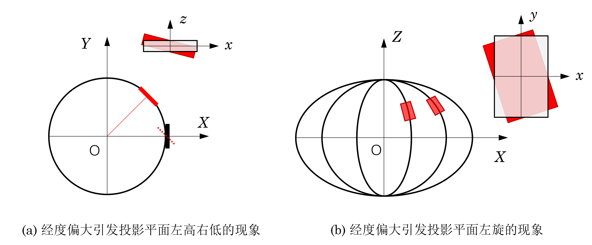

# OSGB2CESIUM DEBUG 日志

解决转换后模型出现旋转误差的问题。

## 调试记录

调试顺序从最新一轮的猜测开始。

### 猜测 1   Box 位置中心偏移

猜测是否 Box 的 Center 参数诱发原点偏移，将 Box.Center 参数添加到 metadata.xml 的位置上去，得到下面的结果图片。


好的，并不是 BoundingBox 的位置偏移诱发的误差。同时也可以得出，虽然本文生成的代码在包围盒计算过程中与 Cesiumlab 有较大差距，但这一差距看起来并非是旋转误差产生的原因。

### 猜测 2 Box 整体误差

经过测试发现，拿 CesiumLab 生成的旋转参数直接覆盖本文生成的旋转参数，绘制结果与猜测 1 的行为模式完全一致，这说明包围盒是与 transform 的参数具有一定的关联性的；又或者另一种可能，transform 的旋转和平移具有自相关性。

首先，拿 CesiumLab 的 transform 替换本文的 transform，模型甚至在位置上都产生了偏移，由此就可以证明 transform 参数与 boundingVolumn 的 box 参数之间存在着关联关系。即  **box$\rightarrow$transform**。

再者，将CesiumLab 的 boundingVolumn 替换本文的 boundingVolumn，模型在上述修改 transform 的基础上所产生的偏移依然没有解决，还是悬在半空。

> 插播一则紧急消息：目前发现程序中只有最外层的是 Box 其他部分的 boundingVolumn 还是 region，这里待会儿紧急修复一下。

### 猜测 3 CGCS2000 转 WGS84

是否有可能是计算经纬度的时候，得到的是 CGCS2000 的经纬度，而非 WGS84 的；现在用 GDAL 对坐标系进行一个整体的变换，看看能不能得到更加精确的结果。

> CGCS2000 经纬度坐标系 4490，WGS84 经纬度坐标系 4326。

经过测试，CGCS2000 经纬度坐标与 WGS84 经纬度坐标基本没有什么差别，佛了。

### 猜测 4 是否有可能是旋转矩阵计算的问题

前端时间梳理了旋转矩阵的计算公式为：
$$
{R}=

\begin{bmatrix}\underset{\mathbf{X}}{\mathbf{v}_{east}}&\underset{\mathbf{Y}}{\mathbf{v}_{north}}&\underset{\mathbf{Z}}{\mathbf{v}_{up}}\end{bmatrix}

=\begin{bmatrix}
-\sin L		&-\sin B\cdot\cos L	&\cos B\cdot\cos L\\
\cos L		&-\sin B\cdot\sin L	&\cos B\cdot\sin L\\
0			&\cos B			&\sin B
\end{bmatrix}
$$
式中，$\mu$ 为经度、 $\nu$ 为纬度；$L$ 为大地经度，$B$ 为大地纬度。分析一下经纬度对旋转矩阵的影响，然后可以大概看到下面的一个变化情况。



但是，经过测试后发现，模型旋转角度偏差 0.1 度左右投影平面的左高右低现象才有所修复，在当前纬度 39° 上估计的经圈弧长间距约为 8626 米，这显然不是该块模型所应进行的调整。预估一下整个模型包围盒的长宽倒是与这个偏移近似在同一个量级。但是调整这个包围盒并没有解决问题。

### 猜测 5 重定义转换矩阵

其实目前的核心问题在于，如何在指定位置建立局部坐标系，从而建立模型和世界坐标之间的转换矩阵。Cesium 中提供了这样一个方法，即：

```js
const mtx = Cesium.Transforms.eastNorthUpToFixedFrame(position);
// 获取某一位置垂直于当前地表的局部坐标系 x-东,y-北,z-曲面法向
```

定义坐标：

```js
const position = Cesium.Cartesian3.fromDegrees(
    117.26260439334247,
    39.063947414701268,
    0
); // 模型中心点的 WGS84 经纬度坐标
const euler = [Cesium.Math.toRadians(0), 0, 0];   //定义 heading, pitch, roll
const hpr = new Cesium.HeadingPitchRoll(...euler); //欧拉角 Euler
```


计算结果如下，与本项目计算所用的旋转矩阵几乎完全一致，所以这个足以证明，原始模型的旋转矩阵既无需重新定义也没有计算误差。

```
-0.8889163931326993,
-0.4580694772847807,
0,
0,
0.28866959734695496,
-0.5601838804055357,
0.7764430975295893,
0,
-0.355664883826755,
0.6901929977287833,
0.630187366025896,
0,
-2271500.848135201,
4408008.917972271,
3997831.6368518816,
1
```

所以进行下一猜测，转换后模型本身自带了一个旋转参数。

### 猜测 6 转换后模型携带了不该有的旋转参数

测试一下，将模型的旋转矩阵置放原点，观察模型是否有偏差。经过简单排查与调整，原始模型与 CesiumLab 转换模型在位置偏移上具有很高的一致性，所以有可能并非是因为原始模型携带了偏差信息。所以似乎原有模型也尚未有什么奇奇怪怪的模型旋转参数，那这个旋转究竟是怎么回事呢。

### 猜测 7 包围盒中心偏差

模型包围盒有如下几个参数，center 向量表示中心位置，x-axis, y-axis, z-axis 的模分别表示 AABB 包围盒长宽高的一半，方向各自指向包围盒的 x,y,z 方向。

```js
"boundingVolumn": {
    "box": [
        0,  0,  10,  // center
        20, 0,  0,   // x-axis
        0,  30, 0,   // y-axis
        0,  0,  10,  // z-axis
    ]
}
```

目前猜测，是否有可能是包围盒的中心偏移参数过大，从而导致在执行 transform 的过程中诱发了一些不必要的计算误差，从而导致模型在投放到地球椭球上时出现了半随机性的旋转误差。

经过测试，并不是这个问题，纠正之后仍然还是存在偏差。所以考虑并不是因为包围盒中心偏差而导致的模型整体偏移量，Holly Shift。


## 参考文献

1. 简书. [Cesium 3DTiles转换工具](https://www.jianshu.com/p/e5aab3e1fcab)[EB/OL].
1. CSDN 博客. [cesium 计算旋转变换矩阵的底层解析](https://blog.csdn.net/xinleicol/article/details/114799886)[EB/OL].
1. 百度文库. [Cesium关于模型位置、大小、方向等调整](https://wenku.baidu.com/view/f58aa62d7a563c1ec5da50e2524de518964bd309.html)[EB/OL].
1. CSDN 博客. [GIS数据处理-cesium中模型位置设置](https://blog.csdn.net/qq_36213352/article/details/124330263)[EB/OL].

